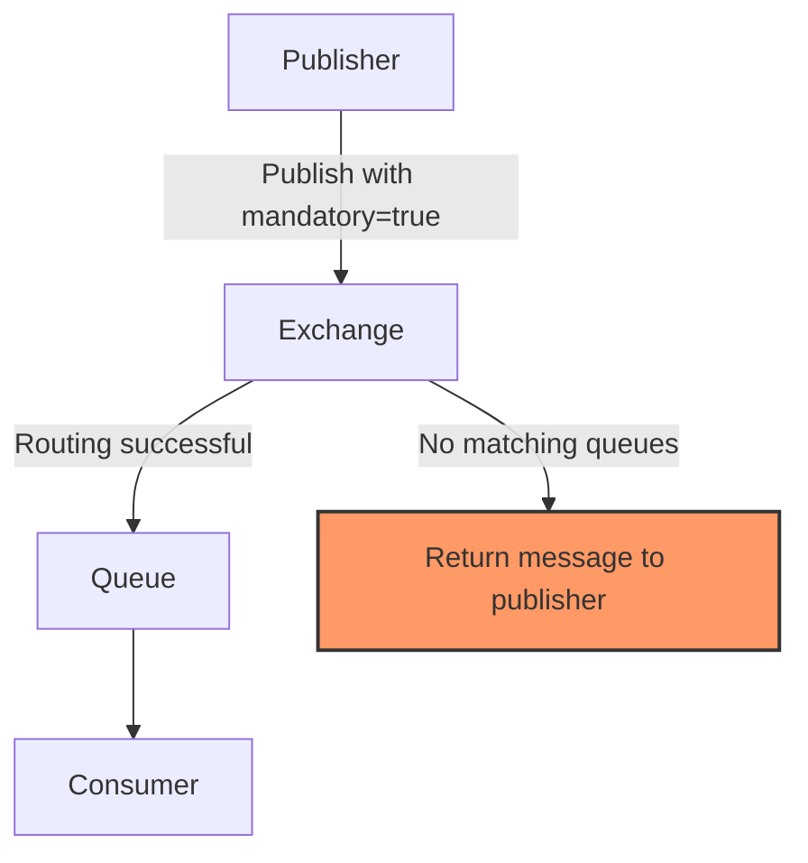

# RabbitMQ Mandatory Messages

## Introduction

When sending messages through RabbitMQ, one of the key concerns is ensuring reliable delivery. By default, if RabbitMQ can't route a message to any queue (because no bindings match the routing key), it silently drops the message. This behavior might be acceptable in some scenarios, but in many cases, you want to know if your message couldn't be delivered.

This is where **mandatory messages** come in. The mandatory flag is a powerful feature in RabbitMQ that allows publishers to receive notifications when messages cannot be routed to any queue, enabling you to implement more robust error handling and reliability strategies.

## What Are Mandatory Messages?

When you publish a message with the mandatory flag set to `true`, you're telling RabbitMQ:

> "If this message cannot be routed to at least one queue, don't discard it. Instead, return it to me."

This creates a feedback mechanism that helps ensure your messages are properly delivered, or at least you're notified when they are not.

## How Mandatory Messages Work

Let's visualize the flow of a mandatory message:



1. The publisher sends a message to an exchange with the mandatory flag set
2. The exchange tries to route the message based on its type and the message's routing key
3. If the message can be routed to at least one queue, normal delivery proceeds
4. If the message cannot be routed to any queue, it is returned to the publisher

## Implementing Mandatory Messages

Let's explore how to implement mandatory messages in different programming languages:

### Java Example

Here's how to publish a message with the mandatory flag in Java:

```java
// Setup connection and channel first
ConnectionFactory factory = new ConnectionFactory();
factory.setHost("localhost");
try (Connection connection = factory.newConnection();
     Channel channel = connection.createChannel()) {
     
    // Set up return listener to handle unroutable messages
    channel.addReturnListener((replyCode, replyText, exchange, routingKey, properties, body) -> {
        System.out.println("Message returned: " + new String(body));
        System.out.println("Reply code: " + replyCode);
        System.out.println("Reply text: " + replyText);
        // Implement your recovery strategy here
    });
    
    // Publish with mandatory flag set to true
    channel.basicPublish(
        "my-exchange",     // exchange name
        "my-routing-key",  // routing key
        true,              // mandatory flag
        MessageProperties.PERSISTENT_TEXT_PLAIN,
        "Hello World".getBytes()
    );
    
    System.out.println("Message published with mandatory flag");
    
    // Keep the channel open for a while to receive potential returns
    Thread.sleep(1000);
}
```

### Python Example

Here's a Python implementation using the `pika` library:

```python
import pika

# Setup connection and channel
connection = pika.BlockingConnection(pika.ConnectionParameters('localhost'))
channel = connection.channel()

# Define callback for returned messages
def on_message_returned(channel, method, properties, body):
    print(f"Message was returned: {body}")
    print(f"Reply code: {method.reply_code}")
    print(f"Reply text: {method.reply_text}")
    # Implement your recovery strategy here

# Set up the return callback
channel.add_on_return_callback(on_message_returned)

# Publish with mandatory flag
channel.basic_publish(
    exchange='my-exchange',
    routing_key='my-routing-key',
    body='Hello World',
    properties=pika.BasicProperties(
        delivery_mode=2,  # make message persistent
    ),
    mandatory=True  # Set the mandatory flag
)

print("Message published with mandatory flag")

# Keep the connection open to receive potential returns
connection.process_data_events(time_block=True, timeout=1)
connection.close()
```

### Node.js Example

Using the `amqplib` package for Node.js:

```javascript
const amqp = require('amqplib');

async function publishWithMandatory() {
  try {
    // Connect to RabbitMQ
    const connection = await amqp.connect('amqp://localhost');
    const channel = await connection.createChannel();
    
    // Enable publisher confirms
    await channel.confirmChannel();
    
    // Set up returned message event handler
    channel.on('return', (msg) => {
      console.log('Message returned:');
      console.log(`Content: ${msg.content.toString()}`);
      console.log(`Reply code: ${msg.fields.replyCode}`);
      console.log(`Reply text: ${msg.fields.replyText}`);
      // Implement your recovery strategy here
    });
    
    // Publish message with mandatory flag
    channel.publish(
      'my-exchange',
      'my-routing-key',
      Buffer.from('Hello World'),
      { 
        mandatory: true,
        persistent: true 
      }
    );
    
    console.log('Message published with mandatory flag');
    
    // Wait for confirms and potential returns
    await channel.waitForConfirms();
    
    // Keep the connection open briefly to receive potential returns
    setTimeout(() => {
      connection.close();
    }, 1000);
    
  } catch (error) {
    console.error('Error:', error);
  }
}

publishWithMandatory();
```

## Common Use Cases

### 1. Critical Data Transmission

When sending critical data that must not be lost, such as:
- Financial transactions
- User registrations
- Order processing

### 2. Monitoring and Alerting

Using mandatory messages to monitor the health of your messaging system:
- Detecting misconfigured exchanges or queues
- Alerting when bindings are broken
- Identifying routing problems

### 3. Retry Mechanisms

Implementing sophisticated retry strategies:
- Storing returned messages in a dead letter queue
- Attempting redelivery with different routing keys
- Escalating to administrators after multiple failures

## Real-World Application Example

Let's consider a practical e-commerce scenario where mandatory messages are crucial:

```javascript
// Order processing system
async function submitOrder(order) {
  try {
    const connection = await amqp.connect('amqp://localhost');
    const channel = await connection.createChannel();
    
    // Enable publisher confirms
    await channel.confirmChannel();
    
    // Set up returned message handler
    channel.on('return', (msg) => {
      const orderData = JSON.parse(msg.content.toString());
      console.error(`Order ${orderData.orderId} could not be routed!`);
      
      // Log the failed order
      logFailedOrder(orderData, msg.fields.replyText);
      
      // Notify customer service
      notifyCustomerService(orderData);
      
      // Store in a recovery queue for later processing
      storeForRecovery(orderData);
    });
    
    // Publish the order with mandatory flag
    const success = channel.publish(
      'orders',
      `order.${order.type}`,
      Buffer.from(JSON.stringify(order)),
      { mandatory: true, persistent: true }
    );
    
    if (success) {
      console.log(`Order ${order.orderId} submitted successfully`);
    }
    
    // Wait for confirms
    await channel.waitForConfirms();
    
    // Close connection after a delay to receive potential returns
    setTimeout(() => connection.close(), 2000);
    
    return success;
  } catch (error) {
    console.error('Error submitting order:', error);
    throw error;
  }
}

// Additional helper functions
function logFailedOrder(order, reason) {
  // Implementation details
}

function notifyCustomerService(order) {
  // Implementation details
}

function storeForRecovery(order) {
  // Implementation details
}
```

## Potential Challenges and Solutions

### Challenge 1: Handling the Returned Messages

**Problem**: You need to properly process returned messages in your application.

**Solution**: Implement a robust return listener/callback that can:
- Log details about the returned message
- Store the message for retry
- Alert administrators
- Update your application state

### Challenge 2: Race Conditions

**Problem**: There can be a timing issue where queues might be created after a message is published but before it's returned.

**Solution**: 
- Use the "alternate exchange" pattern alongside mandatory messages
- Implement a pre-flight check to verify routes exist
- Consider using publisher confirms in addition to mandatory messages

### Challenge 3: Performance Considerations

**Problem**: Using mandatory messages adds overhead to your messaging system.

**Solution**:
- Only use mandatory flags for critical messages
- Implement batching for non-critical messages
- Consider using a dedicated channel for mandatory messages

## Best Practices

1. **Combine with Publisher Confirms**: Use mandatory messages together with publisher confirms for maximum reliability.

2. **Handle Returns Asynchronously**: Process returned messages in a separate thread or task to avoid blocking your main publishing logic.

3. **Implement Idempotent Consumers**: Ensure that your message handlers can safely process the same message multiple times.

4. **Log Returned Messages**: Always log details about returned messages for troubleshooting.

5. **Consider Alternatives**: For some use cases, alternate exchanges might be more appropriate than mandatory messages.

## Comparison with Other Reliability Features

| Feature | Purpose | When to Use |
|---------|---------|-------------|
| **Mandatory Messages** | Detect unroutable messages | When you need to know if a message cannot be routed |
| **Publisher Confirms** | Ensure message reached the broker | For all reliability-sensitive applications |
| **Alternate Exchanges** | Automatically route unroutable messages | When you want automatic handling of unroutable messages |
| **Transactions** | Group operations in atomic units | For complex operations that must succeed or fail together |
| **Delivery Acknowledgements** | Ensure consumer processed message | For reliable consumption of messages |

## Summary

RabbitMQ's mandatory message flag provides a powerful mechanism to ensure that your messages are properly routed or, at the very least, that you're notified when they cannot be delivered. By implementing proper handling of returned messages, you can create more resilient messaging systems that can recover from routing failures and network issues.

Key takeaways:

1. The mandatory flag prevents messages from being silently dropped when they cannot be routed.
2. Returned messages must be handled by implementing a return listener or callback.
3. Combining mandatory messages with other reliability features like publisher confirms provides the highest level of reliability.
4. Mandatory messages are particularly useful for critical data that must not be lost.
5. Proper error handling and recovery strategies should be implemented to deal with returned messages.

## Exercises

1. Implement a publisher with the mandatory flag and deliberately use a non-existent routing key to trigger a message return.
2. Create a recovery system that stores returned messages in a separate queue for later processing.
3. Implement a monitoring dashboard that tracks the number of returned messages over time.
4. Combine mandatory messages with publisher confirms and compare the reliability with using each feature separately.
5. Design a system that automatically creates missing queues or bindings when messages are returned.

## Additional Resources

- [RabbitMQ Documentation on Publisher Confirms](https://www.rabbitmq.com/confirms.html)
- [RabbitMQ Documentation on Reliability](https://www.rabbitmq.com/reliability.html)
- [RabbitMQ Documentation on Alternate Exchanges](https://www.rabbitmq.com/ae.html)