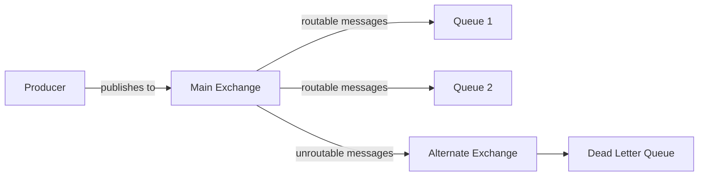

# RabbitMQ Alternate Exchanges

## Introduction

When working with RabbitMQ, one challenge you might encounter is dealing with messages that cannot be routed to any queue. By default, when a message cannot be delivered to any queue (known as an "unroutable message"), RabbitMQ silently drops it. This behavior can lead to lost messages and can be problematic in production systems.

This is where **Alternate Exchanges** come in - they provide a safety net for your messages, ensuring that even unroutable messages have a destination rather than being discarded.

## What Are Alternate Exchanges?

An Alternate Exchange (AE) is a special exchange that receives messages that cannot be routed to any queue from another exchange. Think of it as a "fallback" or "catch-all" mechanism for messages that would otherwise be discarded.



## Why Use Alternate Exchanges?

There are several important reasons to implement Alternate Exchanges in your RabbitMQ setup:

1. **Prevent message loss**: Capture messages that would otherwise be dropped
2. **Debug routing issues**: Examine messages that aren't routing correctly
3. **Implement retry mechanisms**: Process unroutable messages and potentially republish them
4. **Monitoring and alerting**: Track the volume of unroutable messages to detect issues

## How Alternate Exchanges Work

When a message cannot be routed to any queue bound to an exchange:

1. The exchange checks if it has an associated alternate exchange
2. If yes, the message is sent to that alternate exchange
3. The alternate exchange then attempts to route the message according to its own bindings
4. If the message still can't be routed after reaching the alternate exchange, it will be dropped (unless the alternate exchange itself has an alternate exchange)

It's important to note that an alternate exchange can be of any type: direct, fanout, topic, or headers.

## Setting Up Alternate Exchanges

There are two ways to set up alternate exchanges in RabbitMQ:

### Method 1: When Declaring an Exchange

```javascript
// Using amqplib in Node.js
channel.assertExchange('main-exchange', 'direct', {
  alternateExchange: 'unroutable-exchange'
});

// First declare the alternate exchange
channel.assertExchange('unroutable-exchange', 'fanout');
channel.assertQueue('unroutable-queue');
channel.bindQueue('unroutable-queue', 'unroutable-exchange', '');
```

### Method 2: Using Policies (via Management UI or HTTP API)

You can also set alternate exchanges using policies, which can be applied to existing exchanges:

```json
{
  "alternate-exchange": "unroutable-exchange"
}
```

## Practical Example: Implementing Alternate Exchanges

Let's implement a complete example showing how to use alternate exchanges in a real application. We'll create a message routing system with a direct exchange for order processing, and set up an alternate exchange to catch messages with invalid routing keys.

### Step 1: Set Up the Exchanges and Queues

```javascript
const amqp = require('amqplib');

async function setup() {
  // Connect to RabbitMQ
  const connection = await amqp.connect('amqp://localhost');
  const channel = await connection.createChannel();
  
  // Declare the alternate exchange (a fanout exchange to catch all unroutable messages)
  await channel.assertExchange('order-unroutable', 'fanout', { durable: true });
  
  // Declare a queue for the alternate exchange
  await channel.assertQueue('unroutable-orders', { durable: true });
  
  // Bind the queue to the alternate exchange
  await channel.bindQueue('unroutable-orders', 'order-unroutable', '');
  
  // Declare the main exchange with an alternate exchange
  await channel.assertExchange('order-processing', 'direct', { 
    durable: true,
    alternateExchange: 'order-unroutable'
  });
  
  // Create queues for different order types
  await channel.assertQueue('new-orders', { durable: true });
  await channel.assertQueue('update-orders', { durable: true });
  await channel.assertQueue('cancel-orders', { durable: true });
  
  // Bind queues to the main exchange with specific routing keys
  await channel.bindQueue('new-orders', 'order-processing', 'new');
  await channel.bindQueue('update-orders', 'order-processing', 'update');
  await channel.bindQueue('cancel-orders', 'order-processing', 'cancel');
  
  console.log('RabbitMQ setup completed');
  return { connection, channel };
}
```

### Step 2: Create a Publisher to Send Messages

```javascript
async function publishMessages(channel) {
  // Valid routing keys
  await channel.publish('order-processing', 'new', Buffer.from(JSON.stringify({
    id: 1001,
    customer: 'Alice',
    items: ['Book', 'Pen']
  })));
  
  // Invalid routing key - will go to the alternate exchange
  await channel.publish('order-processing', 'invalid-key', Buffer.from(JSON.stringify({
    id: 1002,
    customer: 'Bob',
    status: 'unknown'
  })));
  
  console.log('Published messages');
}
```

### Step 3: Create Consumers to Process Messages

```javascript
async function consumeMessages(channel) {
  // Consume from regular queues
  await channel.consume('new-orders', (msg) => {
    if (msg) {
      console.log('New order received:', JSON.parse(msg.content.toString()));
      channel.ack(msg);
    }
  });
  
  // Consume from the unroutable queue
  await channel.consume('unroutable-orders', (msg) => {
    if (msg) {
      console.log('Unroutable message received:', JSON.parse(msg.content.toString()));
      console.log('Original routing key was:', msg.properties.headers['x-first-death-exchange']);
      channel.ack(msg);
    }
  });
}
```

### Step 4: Run the Application

```javascript
async function run() {
  const { connection, channel } = await setup();
  
  await consumeMessages(channel);
  await publishMessages(channel);
  
  // Close after 5 seconds
  setTimeout(() => {
    connection.close();
    console.log('Connection closed');
  }, 5000);
}

run().catch(error => console.error(error));
```

### Example Output

When you run this application, you should see something like:

```
RabbitMQ setup completed
Published messages
New order received: { id: 1001, customer: 'Alice', items: ['Book', 'Pen'] }
Unroutable message received: { id: 1002, customer: 'Bob', status: 'unknown' }
Connection closed
```

## Common Patterns and Best Practices

Here are some recommended patterns for using alternate exchanges effectively:

### 1. Dead Letter Queue Pattern

Use a fanout alternate exchange that routes to a single Dead Letter Queue (DLQ):

```javascript
// Setup a DLQ system
await channel.assertExchange('dlx', 'fanout', { durable: true });
await channel.assertQueue('dead-letter-queue', { 
  durable: true,
  arguments: {
    'x-message-ttl': 1000 * 60 * 60 * 24 // 24 hours
  }
});
await channel.bindQueue('dead-letter-queue', 'dlx', '');

// Use the DLX as an alternate exchange
await channel.assertExchange('main-exchange', 'direct', {
  alternateExchange: 'dlx'
});
```

### 2. Monitoring Pattern

Create a specific queue for monitoring purposes:

```javascript
await channel.assertExchange('monitoring-exchange', 'fanout');
await channel.assertQueue('unroutable-monitoring', {
  arguments: {
    'x-message-ttl': 1000 * 60 * 60 // 1 hour TTL
  }
});
await channel.bindQueue('unroutable-monitoring', 'monitoring-exchange', '');

// Set as alternate exchange
await channel.assertExchange('business-exchange', 'topic', {
  alternateExchange: 'monitoring-exchange'
});
```

### 3. Retry Pattern

Combine alternate exchanges with message TTL and dead-letter exchanges for retries:

```javascript
// First retry exchange/queue setup
await channel.assertExchange('retry-exchange', 'direct');
await channel.assertQueue('retry-queue', {
  arguments: {
    'x-dead-letter-exchange': 'main-exchange',
    'x-message-ttl': 5000 // 5 second delay
  }
});
await channel.bindQueue('retry-queue', 'retry-exchange', '');

// Main exchange with alternate exchange for unroutables
await channel.assertExchange('main-exchange', 'direct', {
  alternateExchange: 'retry-exchange'
});
```

## Common Pitfalls and Limitations

When working with alternate exchanges, be aware of these potential issues:

1. **Loops**: Be careful not to create loops between exchanges. For example, if exchange A has an alternate exchange B, and exchange B has an alternate exchange A, you'll create an infinite loop.

2. **Performance**: Every unroutable message incurs the overhead of additional routing through the alternate exchange. In a high-volume system with many unroutable messages, this could impact performance.

3. **Message Properties**: The original routing key is preserved when a message is sent to an alternate exchange, which can sometimes lead to confusion when debugging.

4. **Mandatory Flag**: The mandatory flag on `channel.publish` and the alternate exchange feature solve similar problems but behave differently. When both are used, the alternate exchange takes precedence.

## Summary

Alternate Exchanges in RabbitMQ provide a powerful mechanism for handling messages that would otherwise be lost when they cannot be routed to any queue. By setting up appropriate alternate exchanges, you can:

- Prevent message loss by capturing unroutable messages
- Debug routing issues in your messaging system
- Implement sophisticated retry mechanisms
- Monitor the health of your routing configuration

When designing a reliable messaging system with RabbitMQ, alternate exchanges should be a key part of your reliability strategy, working alongside other features like publisher confirms, consumer acknowledgments, and dead letter exchanges.

## Additional Resources

- [RabbitMQ Official Documentation on Alternate Exchanges](https://www.rabbitmq.com/ae.html)
- [RabbitMQ Exchange Types Guide](https://www.rabbitmq.com/tutorials/amqp-concepts.html#exchanges)
- [Dead Letter Exchanges in RabbitMQ](https://www.rabbitmq.com/dlx.html)

## Exercises

1. Set up a RabbitMQ system with a direct exchange for processing different types of notifications (email, SMS, push) and an alternate exchange to catch unroutable notifications.

2. Implement a monitoring system that alerts when the number of unroutable messages exceeds a certain threshold.

3. Create a retry system using alternate exchanges that attempts to redeliver messages with exponential backoff before finally moving them to a dead letter queue.