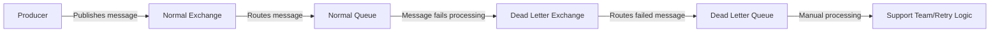

# RabbitMQ Dead Letter Queues

## Introduction

When building reliable systems with RabbitMQ, one crucial question arises: what happens to messages that can't be processed successfully? Messages might fail for various reasons—temporary server issues, bugs in code, or invalid message formats. Without proper handling, these failed messages could be lost forever, potentially causing data loss or system inconsistencies.

This is where **Dead Letter Queues (DLQs)** come in. They provide a safety net for messages that can't reach their intended destination or be processed correctly. In this guide, we'll explore what Dead Letter Queues are, how they work, and how to implement them effectively in your RabbitMQ applications.

## What is a Dead Letter Queue?

A Dead Letter Queue is a special queue that receives messages that cannot be delivered to their original destination or processed successfully. Think of it as a "failure inbox" where problematic messages are redirected for later inspection, retry, or logging.

In RabbitMQ, messages can be "dead-lettered" (sent to a DLQ) for three main reasons:

1. The message is **rejected** (basic.reject or basic.nack) with `requeue=false`
2. The message **TTL (Time-To-Live)** expires
3. The queue reaches its **maximum length** (length limit)

## How Dead Letter Exchanges Work

When configuring Dead Letter Queues in RabbitMQ, we actually set up a **Dead Letter Exchange (DLX)**. Here's the flow:

1. A message fails to be processed in the original queue
2. The message is sent to the configured Dead Letter Exchange
3. The DLX routes the message to one or more Dead Letter Queues based on routing rules



## Setting Up Dead Letter Queues

Let's walk through the process of setting up Dead Letter Queues in RabbitMQ.

### Step 1: Create a Dead Letter Exchange

First, we need to create an exchange that will receive the dead-lettered messages:

```javascript
// Using amqplib for Node.js
const channel = await connection.createChannel();

// Create the dead letter exchange
await channel.assertExchange('my.deadletter', 'direct', {
  durable: true
});

// Create and bind the dead letter queue
await channel.assertQueue('my.deadletter.queue', {
  durable: true
});

await channel.bindQueue('my.deadletter.queue', 'my.deadletter', 'my-routing-key');
```

### Step 2: Configure the Original Queue with DLX

When creating your regular queue, you need to specify the dead letter exchange:

```javascript
// Create the original queue with DLX configuration
await channel.assertQueue('my.regular.queue', {
  durable: true,
  arguments: {
    'x-dead-letter-exchange': 'my.deadletter',
    'x-dead-letter-routing-key': 'my-routing-key'
  }
});
```

The `x-dead-letter-exchange` argument specifies which exchange should receive dead-lettered messages, and `x-dead-letter-routing-key` (optional) determines the routing key to use when the message is dead-lettered.

### Step 3: Publish and Consume Messages

Publishing messages works the same way as with any other queue:

```javascript
// Publish a message to the normal exchange
channel.publish('my.normal.exchange', 'some-routing-key', Buffer.from('Hello World!'), {
  persistent: true
});
```

When consuming messages, you can trigger dead-lettering by rejecting messages:

```javascript
channel.consume('my.regular.queue', async (msg) => {
  try {
    // Try to process the message
    const content = msg.content.toString();
    await processMessage(content);
    
    // If successful, acknowledge the message
    channel.ack(msg);
  } catch (error) {
    console.error('Failed to process message:', error);
    
    // Reject the message without requeuing, which sends it to DLX
    channel.reject(msg, false);
  }
});
```

## Practical Use Cases for Dead Letter Queues

### 1. Error Handling and Troubleshooting

Dead Letter Queues provide visibility into failed messages, making it easier to diagnose and fix issues:

```javascript
// Consuming from the dead letter queue for troubleshooting
channel.consume('my.deadletter.queue', (msg) => {
  console.log('Dead-lettered message:', {
    content: msg.content.toString(),
    headers: msg.properties.headers,
    originalExchange: msg.properties.headers['x-first-death-exchange'],
    reason: msg.properties.headers['x-first-death-reason']
  });
  
  // Acknowledge the message after inspection
  channel.ack(msg);
});
```

When a message is dead-lettered, RabbitMQ adds headers with information about why and where the message was dead-lettered, providing valuable debugging context.

### 2. Implementing Retry Logic

A common pattern is to implement retry logic using Dead Letter Queues with a delay:

```javascript
// Set up the original queue with DLX and TTL
await channel.assertQueue('my.work.queue', {
  durable: true,
  arguments: {
    'x-dead-letter-exchange': 'my.retry.exchange',
    'x-message-ttl': 5000 // 5 seconds delay before retry
  }
});

// Set up the retry exchange and queue
await channel.assertExchange('my.retry.exchange', 'direct', { durable: true });
await channel.assertQueue('my.retry.queue', {
  durable: true,
  arguments: {
    'x-dead-letter-exchange': 'my.work.exchange', // send back to original exchange
    'x-message-ttl': 30000 // 30 seconds delay before retry
  }
});

await channel.bindQueue('my.retry.queue', 'my.retry.exchange', 'retry-key');
```

In this example, failed messages are sent to a retry queue with a TTL of 30 seconds, after which they're automatically sent back to the original work exchange for another attempt.

### 3. Handling Message Expiration

Messages with a TTL will be dead-lettered when they expire:

```javascript
// Publishing a message with TTL
channel.publish('my.exchange', 'routing-key', Buffer.from('Time-sensitive data'), {
  expiration: '60000', // 60 seconds TTL
  persistent: true
});
```

If the message isn't consumed within 60 seconds, it will be sent to the configured DLX.

## Advanced Dead Letter Queue Patterns

### 1. Multiple Retry Queues with Increasing Delays

For more sophisticated retry logic, you can implement multiple retry queues with increasing delays:

```javascript
// First retry queue (5 second delay)
await channel.assertQueue('my.retry.queue.1', {
  durable: true,
  arguments: {
    'x-dead-letter-exchange': 'my.work.exchange',
    'x-message-ttl': 5000 // 5 seconds
  }
});

// Second retry queue (30 second delay)
await channel.assertQueue('my.retry.queue.2', {
  durable: true,
  arguments: {
    'x-dead-letter-exchange': 'my.work.exchange',
    'x-message-ttl': 30000 // 30 seconds
  }
});

// Third retry queue (2 minute delay)
await channel.assertQueue('my.retry.queue.3', {
  durable: true,
  arguments: {
    'x-dead-letter-exchange': 'my.final.dlx', // After third retry, send to final DLQ
    'x-message-ttl': 120000 // 2 minutes
  }
});
```

You can track the retry count in message headers and route to the appropriate queue based on that count.

### 2. Parking Lot Pattern

The "parking lot" pattern involves moving problematic messages to a separate queue for manual inspection:

```javascript
// Consumer with retry logic and parking lot
channel.consume('my.work.queue', async (msg) => {
  try {
    await processMessage(msg.content);
    channel.ack(msg);
  } catch (error) {
    const retryCount = (msg.properties.headers['x-retry-count'] || 0) + 1;
    
    if (retryCount <= 3) {
      // Retry up to 3 times
      channel.publish('my.retry.exchange', 'retry', msg.content, {
        headers: {
          'x-retry-count': retryCount,
          ...msg.properties.headers
        }
      });
      channel.ack(msg); // Ack the original message
    } else {
      // Move to parking lot after 3 retries
      channel.publish('my.parkinglot.exchange', 'failed', msg.content, {
        headers: {
          'x-error': error.message,
          'x-retry-count': retryCount,
          ...msg.properties.headers
        }
      });
      channel.ack(msg); // Ack the original message
    }
  }
});
```

This pattern gives you more control over how failed messages are handled.

## Monitoring and Managing Dead Letter Queues

It's important to monitor your Dead Letter Queues to ensure that failures are being addressed. RabbitMQ provides several ways to monitor DLQs:

### 1. RabbitMQ Management UI

The RabbitMQ Management plugin provides a web UI where you can view queue metrics, including message counts. High message counts in DLQs indicate potential issues that need attention.

### 2. Programmatic Queue Inspection

You can programmatically check the status of your DLQs:

```javascript
// Get queue information
const queueInfo = await channel.assertQueue('my.deadletter.queue', { durable: true });
console.log(`DLQ message count: ${queueInfo.messageCount}`);

// Set up alerts if message count exceeds threshold
if (queueInfo.messageCount > 100) {
  sendAlert('Too many messages in DLQ!');
}
```

### 3. Dead Letter Queue Consumers

Consider implementing a dedicated consumer for your DLQs that logs failing messages and alerts your team:

```javascript
channel.consume('my.deadletter.queue', (msg) => {
  // Log the failed message
  logger.error('Dead-lettered message:', {
    content: msg.content.toString(),
    headers: msg.properties.headers,
    reason: msg.properties.headers['x-first-death-reason']
  });
  
  // Send alert to operations team
  sendAlert('Message processing failure', {
    messageId: msg.properties.messageId,
    reason: msg.properties.headers['x-first-death-reason']
  });
  
  // Acknowledge the message after logging
  channel.ack(msg);
});
```

## Best Practices for Dead Letter Queues

1. **Always configure DLQs** for critical message queues
2. **Include original message metadata** when publishing to help with debugging
3. **Set up monitoring and alerting** for your DLQs
4. **Process dead-lettered messages** regularly—don't let them accumulate indefinitely
5. **Track retry attempts** in message headers to prevent infinite loops
6. **Document your DLQ strategy** so that team members know how to handle failed messages

## Summary

Dead Letter Queues are an essential component of reliable messaging systems built with RabbitMQ. They provide a safety net for handling failed messages, giving you visibility into what's going wrong and opportunities to recover from failures.

Key concepts we've covered:
- What Dead Letter Queues are and when messages get dead-lettered
- How to configure Dead Letter Exchanges and queues
- Common patterns for implementing retry logic with DLQs
- Monitoring and managing your DLQs effectively

By properly implementing Dead Letter Queues, you can build more resilient applications that handle failures gracefully and minimize data loss.

## Additional Resources

- [RabbitMQ Dead Letter Exchanges Documentation](https://www.rabbitmq.com/dlx.html)
- [RabbitMQ Message TTL](https://www.rabbitmq.com/ttl.html)
- [RabbitMQ Queue Length Limit](https://www.rabbitmq.com/maxlength.html)

## Exercises

1. Set up a basic RabbitMQ application with a Dead Letter Queue and test what happens when you reject messages.
2. Implement a retry mechanism with exponential backoff using DLQs.
3. Create a monitoring script that alerts you when your DLQ exceeds a certain threshold.
4. Extend the parking lot pattern to include a way to "replay" failed messages back to the original queue after fixing the underlying issue.