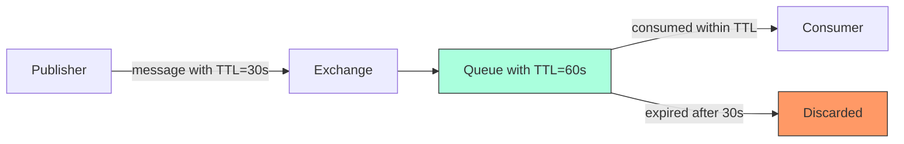

# RabbitMQ Message TTL

## Introduction

Time-to-Live (TTL) is a crucial concept in messaging systems that defines how long a message should be considered valid. In RabbitMQ, TTL provides a mechanism to automatically remove messages from queues after a specified period, helping prevent queue overflow and manage resources efficiently.

Think of TTL like an expiration date on food products—it indicates when the message is no longer needed and can be discarded. This functionality is especially important in distributed systems where messages might become irrelevant after a certain time period, or when implementing timeout patterns in asynchronous workflows.

## Understanding Message TTL

### What is Message TTL?

Message TTL (Time-to-Live) defines the maximum time a message can remain in a queue before being automatically deleted. If a message sits in a queue longer than its TTL value, RabbitMQ will remove it, regardless of whether it has been consumed.

TTL can be defined in two ways:
1. **Per-message TTL**: Set individually for each message
2. **Per-queue TTL**: Applied to all messages entering a specific queue

### Why Use Message TTL?

- **Resource management**: Prevents accumulation of stale messages
- **Implementing timeouts**: Automatically handle cases where consumers don't process messages in time
- **Data freshness**: Ensure only recent messages are processed
- **Cleanup**: Automatically remove outdated information

## Setting Message TTL

### Per-Message TTL

To set TTL for individual messages, you'll need to include the `expiration` property when publishing:

```javascript
// JavaScript example using amqplib
channel.publish('exchange_name', 'routing_key', Buffer.from('Hello World!'), {
  expiration: '10000' // TTL in milliseconds (10 seconds)
});
```

```python
# Python example using pika
properties = pika.BasicProperties(
    expiration='10000'  # TTL in milliseconds (10 seconds)
)
channel.basic_publish(
    exchange='exchange_name',
    routing_key='routing_key',
    body='Hello World!',
    properties=properties
)
```

**Important note**: The `expiration` field must be a string representing TTL in milliseconds, not a number.

### Per-Queue TTL

You can also set a default TTL for all messages entering a queue by specifying the `x-message-ttl` argument when declaring a queue:

```javascript
// JavaScript example
channel.assertQueue('my_queue', {
  arguments: {
    'x-message-ttl': 10000 // TTL in milliseconds (10 seconds)
  }
});
```

```python
# Python example
channel.queue_declare(
    queue='my_queue',
    arguments={
        'x-message-ttl': 10000  # TTL in milliseconds (10 seconds)
    }
)
```

### Interaction Between Per-Message and Per-Queue TTL

When both per-message and per-queue TTL are defined, the **lower value takes precedence**. This allows for flexible policy implementation:

- Set a default TTL on the queue for general cases
- Override with specific TTL values for individual messages when needed

## Visualizing Message TTL

The following diagram illustrates how Message TTL works:



In this example, the message has a TTL of 30 seconds, while the queue has a TTL of 60 seconds. Since the message TTL is lower, the message will be discarded after 30 seconds if not consumed.

## Dead Letter Exchanges and TTL

When messages expire due to TTL, they are normally discarded. However, you can capture these expired messages by configuring a Dead Letter Exchange (DLX).

```javascript
// JavaScript example
channel.assertQueue('my_queue', {
  arguments: {
    'x-message-ttl': 10000, // TTL in milliseconds (10 seconds)
    'x-dead-letter-exchange': 'dlx_exchange',
    'x-dead-letter-routing-key': 'expired_messages'
  }
});
```

```python
# Python example
channel.queue_declare(
    queue='my_queue',
    arguments={
        'x-message-ttl': 10000,  # TTL in milliseconds (10 seconds)
        'x-dead-letter-exchange': 'dlx_exchange',
        'x-dead-letter-routing-key': 'expired_messages'
    }
)
```

This configuration routes expired messages to a dead letter exchange, allowing you to:
- Track expired messages
- Implement retry mechanisms
- Analyze patterns in message expiration
- Handle cleanup operations

## Practical Applications

### Implementing Request Timeout

In a microservices architecture, TTL can implement request timeouts elegantly:

```javascript
// Request service
function makeRequest(requestId, data) {
  // Create a unique reply queue for this request
  const replyQueue = `reply_queue_${requestId}`;
  
  channel.assertQueue(replyQueue, {
    exclusive: true,
    arguments: {
      'x-message-ttl': 5000, // 5 second timeout
      'x-expires': 10000 // Queue will be deleted after 10 seconds
    }
  });
  
  // Listen for response
  channel.consume(replyQueue, (msg) => {
    // Process response
    console.log(`Received response: ${msg.content.toString()}`);
  }, { noAck: true });
  
  // Send request with reply-to property
  channel.publish('requests_exchange', 'service.operation', Buffer.from(JSON.stringify(data)), {
    correlationId: requestId,
    replyTo: replyQueue
  });
}
```

### Temporary Data Caching

Use TTL for implementing a simple distributed cache:

```javascript
// Store item in cache
function cacheItem(key, value, ttl = 60000) {
  const cacheQueue = `cache_${key}`;
  
  // Create or purge the queue
  channel.assertQueue(cacheQueue, {
    arguments: {
      'x-message-ttl': ttl // Cache TTL in milliseconds
    }
  });
  
  // Clear existing items
  channel.purgeQueue(cacheQueue);
  
  // Store the value
  channel.sendToQueue(cacheQueue, Buffer.from(JSON.stringify(value)));
  
  console.log(`Cached ${key} for ${ttl}ms`);
}

// Get item from cache
async function getCachedItem(key) {
  const cacheQueue = `cache_${key}`;
  
  // Try to get the message without consuming it
  const { messageCount } = await channel.checkQueue(cacheQueue);
  
  if (messageCount === 0) {
    console.log(`Cache miss for ${key}`);
    return null;
  }
  
  // Get the message
  const message = await new Promise((resolve) => {
    channel.get(cacheQueue, { noAck: true }, (err, msg) => {
      if (!msg) resolve(null);
      else resolve(JSON.parse(msg.content.toString()));
    });
  });
  
  console.log(`Cache hit for ${key}`);
  return message;
}
```

### Scheduled Message Delivery

Creating delayed messages using TTL and dead letter exchanges:

```javascript
// Set up the delay mechanism
async function setupDelayedMessaging() {
  // Create the "waiting" queue with TTL
  await channel.assertQueue('delay_queue', {
    arguments: {
      'x-dead-letter-exchange': 'delayed_exchange',
      'x-dead-letter-routing-key': 'delayed'
    }
  });
  
  // Create the target exchange and queue
  await channel.assertExchange('delayed_exchange', 'direct');
  await channel.assertQueue('delayed_messages');
  await channel.bindQueue('delayed_messages', 'delayed_exchange', 'delayed');
  
  console.log('Delayed messaging system set up');
}

// Send a message with a delay
function sendDelayedMessage(message, delayMs) {
  channel.sendToQueue('delay_queue', Buffer.from(JSON.stringify(message)), {
    expiration: delayMs.toString()
  });
  
  console.log(`Message scheduled for delivery in ${delayMs}ms`);
}

// Set up consumer for delayed messages
function consumeDelayedMessages() {
  channel.consume('delayed_messages', (msg) => {
    const content = JSON.parse(msg.content.toString());
    console.log(`Received delayed message: ${JSON.stringify(content)}`);
    
    channel.ack(msg);
  });
}
```

## Best Practices for Using Message TTL

### Performance Considerations

- **Queue scanning**: When using per-message TTL, RabbitMQ must scan the queue to find expired messages, which can impact performance for very large queues
- **Batch expiration**: Messages with the same TTL values tend to expire in batches, which is more efficient
- **TTL combination**: Using per-queue TTL for the common case and per-message TTL as exceptions offers the best performance

### Reliability Tips

1. **Don't set very short TTLs** (under 1 second) as network delays might cause messages to expire before consumers can process them
2. **Always handle DLX messages** if you route expired messages to a dead letter exchange
3. **Monitor TTL-related metrics** to detect unusual patterns of message expiration
4. **Consider TTL alongside message priority** to ensure important messages don't expire
5. **Document your TTL policies** to help developers understand expected message lifetimes

### Common Mistakes

- **Numeric vs. string expiration**: Remember that per-message TTL (`expiration` property) must be a string, not a number
- **TTL inheritance**: Message TTL does not transfer when a message is moved to a DLX
- **Queue-level TTL**: Not all clients expose all TTL-related arguments - verify your client library documentation
- **TTL precision**: RabbitMQ does not guarantee millisecond-precision for TTL expiration

## Summary

Message TTL in RabbitMQ provides a powerful mechanism for managing message lifecycles, implementing timeouts, and preventing resource exhaustion. Whether applied per-message or per-queue, TTL ensures that messages don't linger indefinitely in the system.

Key takeaways:
- Message TTL defines how long a message can remain in a queue before being deleted
- TTL can be set per-message or per-queue
- Combine TTL with Dead Letter Exchanges to handle expired messages
- TTL enables patterns like request timeouts, caching, and delayed message delivery
- Always consider performance implications when designing TTL policies

## Exercises

1. Implement a simple message queue with a 30-second TTL and observe what happens to messages that aren't consumed within that timeframe.
2. Create a "delayed message" system using TTL and dead letter exchanges that delivers messages after a specified delay.
3. Experiment with different TTL values for different message priorities to implement a basic quality-of-service system.
4. Build a distributed cache using RabbitMQ queues with TTL as the expiration mechanism.
5. Implement a request-response pattern with timeout handling using TTL on the reply queue.

## Additional Resources

- [RabbitMQ TTL Documentation](https://www.rabbitmq.com/ttl.html)
- [Dead Letter Exchanges](https://www.rabbitmq.com/dlx.html)
- [RabbitMQ Queue Arguments](https://www.rabbitmq.com/queues.html#optional-arguments)