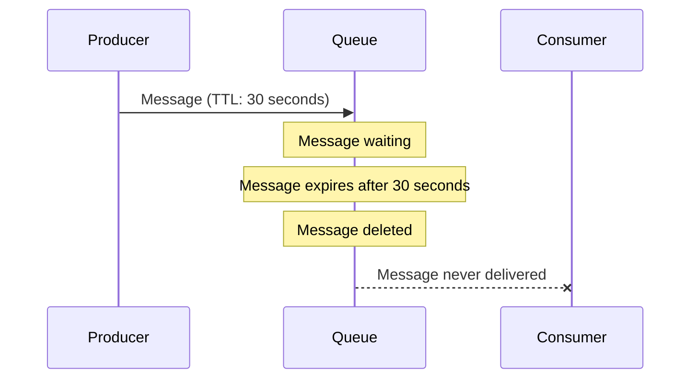

# RabbitMQ Queue TTL

Time-to-Live (TTL) is an essential feature in RabbitMQ that helps manage message and queue lifetimes. This concept is crucial for building reliable messaging systems that can handle temporary failures and prevent resource exhaustion.

## What is TTL in RabbitMQ?

TTL (Time-to-Live) defines how long a message or an entire queue can exist before it's automatically removed by RabbitMQ. Think of TTL as an expiration date for your messages or queues.

In RabbitMQ, you can set TTL at two levels:
1. **Message TTL** - Controls the lifespan of individual messages
2. **Queue TTL** - Controls the lifespan of an entire queue

## Why Use TTL?

TTL serves several important purposes in reliable messaging systems:

- **Preventing queue overflow** - Automatically removing old messages when they're no longer relevant
- **Implementing timeout patterns** - Handling scenarios where messages should expire if not processed within a specific timeframe
- **Resource management** - Ensuring temporary queues don't consume resources indefinitely
- **Implementing retry mechanisms** - Creating expiring messages for retry logic in error handling

## Message TTL

Message TTL defines how long a message can remain in a queue before being automatically deleted by RabbitMQ.

### Setting Message TTL

You can set message TTL in two ways:

#### 1. Per-Queue Message TTL

This sets the same TTL for all messages entering a queue.

```javascript
// Setting TTL to 60,000 milliseconds (1 minute) when declaring a queue
channel.assertQueue('my-queue', {
  arguments: {
    'x-message-ttl': 60000
  }
});
```

#### 2. Per-Message TTL

This allows setting different TTL values for individual messages.

```javascript
// Setting TTL to 30,000 milliseconds (30 seconds) for a specific message
channel.sendToQueue('my-queue', Buffer.from('Hello World!'), {
  expiration: '30000'
});
```

:::note
When both per-queue and per-message TTL are defined, RabbitMQ uses the **lower** of the two values.
:::

### Message TTL Behavior

When a message reaches its TTL:

1. The message is automatically removed from the queue
2. The message is not delivered to any consumer
3. No events or notifications are generated when a message expires



## Queue TTL

Queue TTL defines how long an unused queue can exist before being automatically deleted by RabbitMQ. An unused queue means one that has no consumers and hasn't been accessed via basic.get operations.

### Setting Queue TTL

You can set queue TTL when declaring a queue:

```javascript
// Setting queue TTL to 5 minutes (300,000 milliseconds)
channel.assertQueue('temporary-queue', {
  arguments: {
    'x-expires': 300000
  }
});
```

### Queue TTL Behavior

When a queue reaches its TTL (after being unused for the specified period):

1. The queue is automatically deleted
2. All messages in the queue are removed
3. Consumers will need to re-declare the queue if needed

Queue TTL is particularly useful for temporary queues that should clean themselves up when no longer needed.

## Practical Examples

Let's look at some real-world applications of TTL in RabbitMQ.

### Example 1: Implementing a Notification System

In this example, notifications expire after 24 hours if not consumed:

```javascript
// Producer code
const amqp = require('amqplib');

async function sendNotification() {
  const connection = await amqp.connect('amqp://localhost');
  const channel = await connection.createChannel();
  
  // Create a queue where all messages expire after 24 hours
  await channel.assertQueue('notifications', {
    durable: true,
    arguments: {
      'x-message-ttl': 86400000 // 24 hours in milliseconds
    }
  });
  
  // Send a notification
  channel.sendToQueue('notifications', Buffer.from(JSON.stringify({
    userId: '123',
    message: 'Your order has shipped!'
  })));
  
  console.log('Notification sent');
  
  setTimeout(() => {
    connection.close();
  }, 500);
}

sendNotification();
```

```javascript
// Consumer code
const amqp = require('amqplib');

async function consumeNotifications() {
  const connection = await amqp.connect('amqp://localhost');
  const channel = await connection.createChannel();
  
  // Refer to the same queue
  await channel.assertQueue('notifications', {
    durable: true,
    arguments: {
      'x-message-ttl': 86400000
    }
  });
  
  console.log('Waiting for notifications...');
  
  channel.consume('notifications', (message) => {
    if (message) {
      const notification = JSON.parse(message.content.toString());
      console.log(`Received notification for user ${notification.userId}: ${notification.message}`);
      channel.ack(message);
    }
  });
}

consumeNotifications();
```

### Example 2: Implementing a Dead Letter Exchange with TTL

This pattern is useful for implementing retry logic with exponential backoff:

```javascript
// Setup code
const amqp = require('amqplib');

async function setupRetryMechanism() {
  const connection = await amqp.connect('amqp://localhost');
  const channel = await connection.createChannel();
  
  // Declare our main queue
  await channel.assertQueue('orders', { durable: true });
  
  // Declare our dead letter exchange
  await channel.assertExchange('dead-letter', 'direct', { durable: true });
  
  // Declare retry queues with increasing TTLs
  await channel.assertQueue('retry-1min', {
    durable: true,
    arguments: {
      'x-message-ttl': 60000, // 1 minute
      'x-dead-letter-exchange': 'dead-letter',
      'x-dead-letter-routing-key': 'orders'
    }
  });
  
  await channel.assertQueue('retry-5min', {
    durable: true,
    arguments: {
      'x-message-ttl': 300000, // 5 minutes
      'x-dead-letter-exchange': 'dead-letter',
      'x-dead-letter-routing-key': 'orders'
    }
  });
  
  await channel.assertQueue('retry-30min', {
    durable: true,
    arguments: {
      'x-message-ttl': 1800000, // 30 minutes
      'x-dead-letter-exchange': 'dead-letter',
      'x-dead-letter-routing-key': 'orders'
    }
  });
  
  // Bind our dead letter exchange to the main queue
  await channel.bindQueue('orders', 'dead-letter', 'orders');
  
  console.log('Retry mechanism set up');
  connection.close();
}

setupRetryMechanism();
```

When processing messages, if an error occurs, we can send the message to the appropriate retry queue:

```javascript
// Consumer with retry logic
channel.consume('orders', async (message) => {
  try {
    // Process the order
    const order = JSON.parse(message.content.toString());
    await processOrder(order);
    channel.ack(message);
  } catch (error) {
    // Get retry count from message headers or default to 0
    const retryCount = (message.properties.headers && message.properties.headers['x-retry-count']) || 0;
    
    if (retryCount < 3) {
      // Determine which retry queue to use
      let retryQueue;
      if (retryCount === 0) retryQueue = 'retry-1min';
      else if (retryCount === 1) retryQueue = 'retry-5min';
      else retryQueue = 'retry-30min';
      
      // Publish to retry queue with incremented retry count
      channel.sendToQueue(retryQueue, message.content, {
        headers: {
          'x-retry-count': retryCount + 1
        }
      });
      
      console.log(`Order processing failed, retrying in queue: ${retryQueue}`);
      channel.ack(message);
    } else {
      // Max retries reached, move to failure queue
      channel.sendToQueue('failed-orders', message.content);
      console.log('Max retries reached, moving to failed-orders queue');
      channel.ack(message);
    }
  }
});
```

This creates a retry mechanism where:
1. Failed messages go to a retry queue with a specific TTL
2. After the TTL expires, messages return to the main queue for reprocessing
3. The system keeps track of retry attempts and uses increasing delays

## Queue TTL vs Message TTL

Here's a comparison to help you decide which TTL type to use:

| Feature | Message TTL | Queue TTL |
|---------|-------------|-----------|
| Purpose | Expires individual messages | Expires entire queues when unused |
| Use Case | Time-sensitive data | Temporary queues |
| Behavior | Removes specific messages | Removes entire queue and all messages |
| Setting | `x-message-ttl` | `x-expires` |
| Granularity | Can be set per message or per queue | Set only per queue |

## Best Practices

When working with TTL in RabbitMQ:

1. **Choose appropriate TTL values** - Too short might cause premature deletion, too long might waste resources
2. **Use message TTL for content expiry** - When the actual content has a limited relevance time
3. **Use queue TTL for temporary structures** - For queues that should self-clean when no longer needed
4. **Combine with Dead Letter Exchanges** - For sophisticated retry and error-handling patterns
5. **Monitor expired messages** - Track message expiration rates to adjust TTL values if needed

## Summary

RabbitMQ's TTL feature provides powerful tools for managing message and queue lifetimes. By setting appropriate expiration times, you can:

- Prevent resource exhaustion
- Implement timeout patterns
- Build sophisticated retry mechanisms
- Handle temporary failures gracefully

TTL is a fundamental building block for creating reliable messaging systems that can handle real-world conditions and failure scenarios.

## Additional Resources

- [RabbitMQ TTL Official Documentation](https://www.rabbitmq.com/ttl.html)
- [Dead Letter Exchanges](https://www.rabbitmq.com/dlx.html)
- [RabbitMQ Reliability Patterns](https://www.rabbitmq.com/reliability.html)

## Exercises

1. Create a message queue with a 5-minute message TTL and observe what happens to unconsumed messages.
2. Implement a simple retry mechanism using message TTL and a dead letter exchange.
3. Create a temporary queue with a queue TTL and observe when it gets deleted.
4. Experiment with combining per-queue and per-message TTL values to understand which one takes precedence.