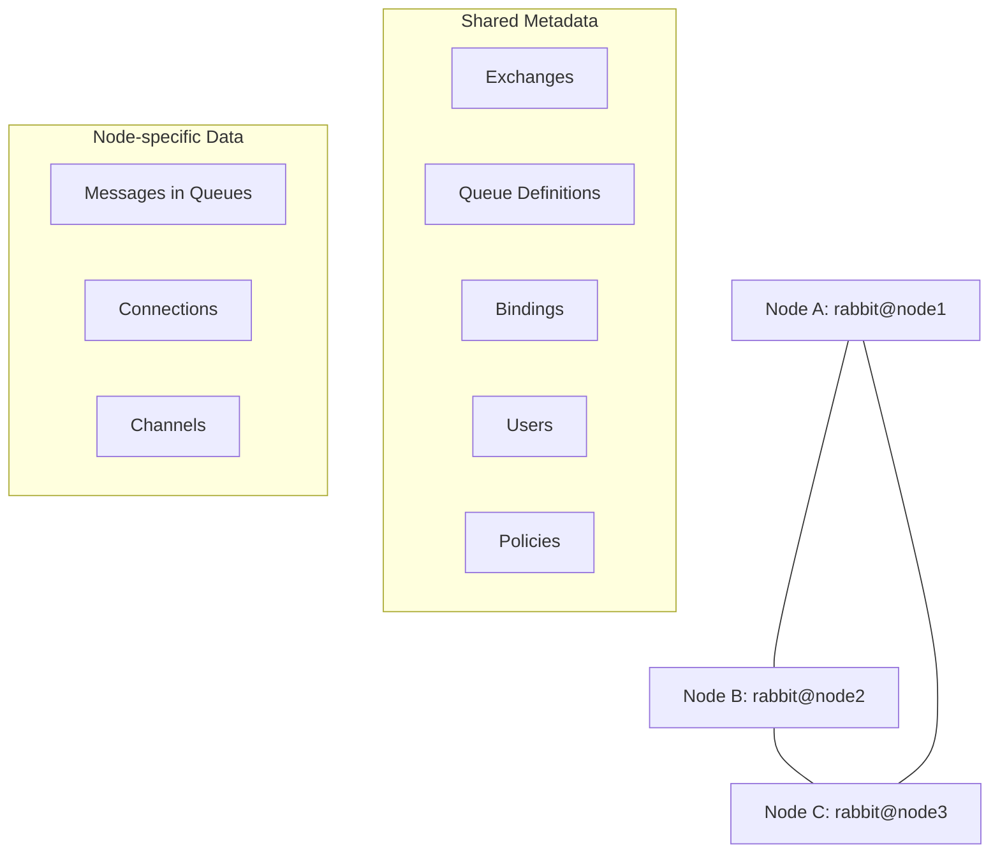

# RabbitMQ Cluster Basics

## Introduction

RabbitMQ is a powerful open-source message broker that implements the Advanced Message Queuing Protocol (AMQP). While a single RabbitMQ node can handle many connections and queues, there are several reasons why you might want to run RabbitMQ as a cluster:

- **High Availability**: Ensure your messaging system continues to function even if individual nodes fail
- **Scalability**: Distribute the load across multiple nodes to handle more connections and messages
- **Geographical Distribution**: Deploy nodes in different locations to reduce latency

In this guide, we'll explore the basics of RabbitMQ clustering, understand its core concepts, and learn how to set up a simple cluster.

## Understanding RabbitMQ Clusters

A RabbitMQ cluster is a logical grouping of multiple RabbitMQ broker nodes that share users, virtual hosts, queues, exchanges, bindings, and runtime parameters. However, each node maintains its own message store.

### Key Cluster Concepts

#### 1. Nodes

A node in a RabbitMQ cluster is a single RabbitMQ broker instance. Each node has:
- A unique name (typically `rabbit@hostname`)
- Its own Erlang process
- Its own local database for metadata

#### 2. Types of Queues in Clusters

RabbitMQ supports different types of queues in a cluster:

- **Classic Queues**: Can be either:
  - **Mirrored**: Replicated across multiple nodes for redundancy
  - **Non-mirrored**: Exist on only one node
  
- **Quorum Queues**: Distributed queues with strong consistency guarantees (recommended for clusters)

- **Streams**: Append-only data structures optimized for high throughput

#### 3. Data Sharing

In a RabbitMQ cluster:
- All nodes share metadata (exchanges, queues, bindings, users, etc.)
- Queue contents (messages) are not replicated by default
- Each queue is "owned" by a single node (unless mirrored or quorum queues are used)

Let's visualize a basic RabbitMQ cluster:



## Setting Up a Basic RabbitMQ Cluster

Let's walk through setting up a basic 3-node RabbitMQ cluster. We'll assume you have RabbitMQ installed on three separate machines (or VMs).

### Prerequisites

- RabbitMQ installed on three servers (let's call them `node1`, `node2`, and `node3`)
- Erlang cookies are identical on all nodes (located at `/var/lib/rabbitmq/.erlang.cookie` on Linux or `%HOMEDRIVE%%HOMEPATH%\.erlang.cookie` on Windows)
- All nodes can communicate with each other over ports 5672 (AMQP), 25672 (distribution), and 4369 (epmd)

### Step 1: Start the First Node

On `node1`:

```bash
rabbitmq-server -detached
```

### Step 2: Join the Second Node to the Cluster

On `node2`:

```bash
# Stop the RabbitMQ application
rabbitmqctl stop_app

# Reset the node to a clean state
rabbitmqctl reset

# Join the cluster
rabbitmqctl join_cluster rabbit@node1

# Start the RabbitMQ application again
rabbitmqctl start_app
```

### Step 3: Join the Third Node to the Cluster

On `node3`:

```bash
# Stop the RabbitMQ application
rabbitmqctl stop_app

# Reset the node to a clean state
rabbitmqctl reset

# Join the cluster
rabbitmqctl join_cluster rabbit@node1

# Start the RabbitMQ application again
rabbitmqctl start_app
```

### Step 4: Verify the Cluster Status

On any node:

```bash
rabbitmqctl cluster_status
```

The output should show all three nodes as part of the cluster:

```
Cluster status of node rabbit@node1 ...
[{nodes,[{disc,[rabbit@node1,rabbit@node2,rabbit@node3]}]},
 {running_nodes,[rabbit@node3,rabbit@node2,rabbit@node1]},
 {cluster_name,<<"rabbit@node1">>},
 {partitions,[]},
 {alarms,[{rabbit@node3,[]},
          {rabbit@node2,[]},
          {rabbit@node1,[]}]}]
```

## Node Types in a Cluster

RabbitMQ cluster nodes can be either disc (disk) nodes or RAM nodes:

### Disc Nodes

- Persist cluster configuration to disk
- Can restart after a failure and rejoin the cluster
- At least one disc node is required in a cluster

### RAM Nodes

- Store configuration in memory only
- Faster for some operations
- Must be able to sync with a disc node when restarting

To specify a node type when joining a cluster:

```bash
# Join as a disc node (default)
rabbitmqctl join_cluster rabbit@node1

# Join as a RAM node
rabbitmqctl join_cluster --ram rabbit@node1
```

## Managing RabbitMQ Clusters

### Removing a Node from the Cluster

To remove a node from the cluster, you can run:

```bash
# If the node is still running
rabbitmqctl stop_app
rabbitmqctl reset

# From another node, to remove a node that's down
rabbitmqctl forget_cluster_node rabbit@node3
```

### Restarting Nodes

When restarting a node that was previously part of a cluster:

```bash
# The node will automatically rejoin the cluster
rabbitmq-server -detached
```

If a node has been offline for too long, it might need to be reset and rejoin:

```bash
rabbitmqctl stop_app
rabbitmqctl reset
rabbitmqctl join_cluster rabbit@node1
rabbitmqctl start_app
```

## Practical Example: Publishing and Consuming in a Cluster

Let's create a simple Node.js example that connects to our RabbitMQ cluster and publishes/consumes messages.

First, install the `amqplib` package:

```bash
npm install amqplib
```

### Publisher Code (publisher.js)

```javascript
const amqp = require('amqplib');

async function publishMessages() {
  // Connect to any node in the cluster (they will load balance)
  const connection = await amqp.connect('amqp://localhost:5672');
  const channel = await connection.createChannel();
  
  const exchange = 'cluster_example';
  const queue = 'cluster_queue';
  const routingKey = 'example';
  
  await channel.assertExchange(exchange, 'direct', { durable: true });
  await channel.assertQueue(queue, { durable: true });
  await channel.bindQueue(queue, exchange, routingKey);
  
  // Send a few messages
  for (let i = 1; i <= 5; i++) {
    const message = `Message ${i} from cluster example`;
    channel.publish(exchange, routingKey, Buffer.from(message));
    console.log(`Sent: ${message}`);
  }
  
  setTimeout(() => {
    connection.close();
    process.exit(0);
  }, 500);
}

publishMessages().catch(console.error);
```

### Consumer Code (consumer.js)

```javascript
const amqp = require('amqplib');

async function consumeMessages() {
  // Connect to any node in the cluster
  const connection = await amqp.connect('amqp://localhost:5672');
  const channel = await connection.createChannel();
  
  const queue = 'cluster_queue';
  
  await channel.assertQueue(queue, { durable: true });
  
  console.log('Waiting for messages...');
  
  channel.consume(queue, (msg) => {
    if (msg) {
      console.log(`Received: ${msg.content.toString()}`);
      channel.ack(msg);
    }
  });
}

consumeMessages().catch(console.error);
```

### Demo Implementation

To test the cluster:

1. Run the consumer on a terminal:
   ```bash
   node consumer.js
   ```

2. Run the publisher on another terminal:
   ```bash
   node publisher.js
   ```

The output from the publisher should look like:

```
Sent: Message 1 from cluster example
Sent: Message 2 from cluster example
Sent: Message 3 from cluster example
Sent: Message 4 from cluster example
Sent: Message 5 from cluster example
```

And the output from the consumer:

```
Waiting for messages...
Received: Message 1 from cluster example
Received: Message 2 from cluster example
Received: Message 3 from cluster example
Received: Message 4 from cluster example
Received: Message 5 from cluster example
```

## High Availability with Mirrored Queues

To make your queues available across nodes, you can use policy-based mirroring:

```bash
# Create a policy to mirror all queues starting with "ha."
rabbitmqctl set_policy ha-all "^ha\." '{"ha-mode":"all"}' --apply-to queues
```

A more modern approach is to use quorum queues instead:

```javascript
// In your JavaScript code
await channel.assertQueue(queue, { 
  durable: true,
  arguments: {
    'x-queue-type': 'quorum'
  }
});
```

## Network Partitions (Split Brain)

One challenge in distributed systems is network partitions, where nodes can't communicate but are still running. RabbitMQ provides several partition handling strategies:

- `ignore`: Continue operating (default)
- `pause_minority`: Pause nodes in the minority partition
- `autoheal`: Automatically recover by stopping and restarting nodes

To set a partition handling strategy:

```
# In rabbitmq.conf
cluster_partition_handling = pause_minority
```

## Summary

In this guide, we've covered:

- The basics of RabbitMQ clustering
- How to set up a simple 3-node cluster
- Node types (RAM vs. disc)
- Cluster management operations
- A practical example of publishing and consuming messages in a cluster
- Introduction to high availability concepts

RabbitMQ clustering provides a robust foundation for building scalable, highly available messaging systems. As you grow more comfortable with basic clustering, you can explore advanced topics like federation, shovel, and cross-cluster message routing.

## Exercises

1. Set up a 2-node RabbitMQ cluster on your local machine using Docker
2. Create a policy to mirror all queues in your cluster
3. Create a producer and consumer connecting to different nodes in your cluster
4. Simulate a node failure and observe how the system behaves
5. Try implementing a quorum queue and test its behavior during node failures

## Additional Resources

- [Official RabbitMQ Clustering Guide](https://www.rabbitmq.com/clustering.html)
- [Clustering and Network Partitions](https://www.rabbitmq.com/partitions.html)
- [Quorum Queues Documentation](https://www.rabbitmq.com/quorum-queues.html)
- [RabbitMQ Management HTTP API](https://www.rabbitmq.com/management.html) - Useful for cluster management