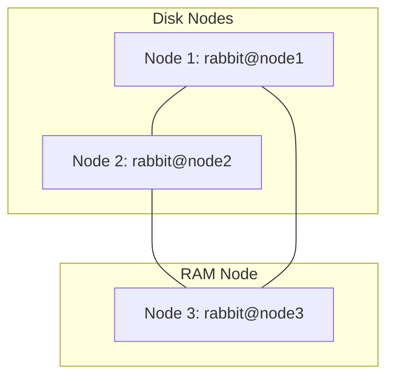
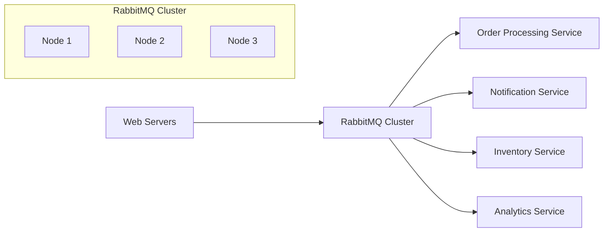

# RabbitMQ Cluster Setup

## Introduction

RabbitMQ clustering is a powerful way to ensure your messaging infrastructure remains reliable, scalable, and highly available. In a clustered environment, multiple RabbitMQ servers work together as a single logical broker, sharing user definitions, virtual hosts, queues, exchanges, and bindings. This tutorial will guide you through the process of setting up a RabbitMQ cluster from scratch.

A properly configured RabbitMQ cluster provides:

- **High Availability**: If one node fails, others can take over
- **Scalability**: Distribute the workload across multiple servers
- **Reliability**: Prevent message loss and system downtime

## Prerequisites

Before we begin, ensure you have:

- At least two servers with RabbitMQ installed (we'll use three in this tutorial)
- Root or sudo access on each server
- Basic understanding of message brokers and RabbitMQ concepts
- Proper network connectivity between all nodes
- Identical Erlang cookies across all nodes

## Understanding Clustering Concepts

Before diving into the setup, let's understand some key concepts:

### Types of Nodes

- **Disk Nodes**: Store cluster state on disk, recommended for stability
- **RAM Nodes**: Store state only in memory, faster but less reliable

### Cluster State

The cluster state includes:

- Exchange definitions
- Queue definitions
- Vhost definitions
- User information
- Permissions

However, queue contents (messages) are not replicated by default across nodes. For that, you'll need to configure mirrored queues or quorum queues (covered later).

## Basic Cluster Architecture

Let's visualize our target setup:



## Step-by-Step Cluster Setup

### 1. Preparing the Environment

First, ensure all nodes can communicate with each other. Edit `/etc/hosts` on each server:

```bash
sudo nano /etc/hosts
```

Add entries for all nodes:

```
192.168.1.101 node1
192.168.1.102 node2
192.168.1.103 node3
```

### 2. Configuring the Erlang Cookie

RabbitMQ nodes authenticate to each other using a shared Erlang cookie. This cookie must be identical across all nodes.

On your first node, locate the Erlang cookie:

```bash
sudo cat /var/lib/rabbitmq/.erlang.cookie
```

Copy this value and ensure it's the same on all other nodes:

```bash
# On each other node
sudo service rabbitmq-server stop
sudo echo "ERLANG_COOKIE_VALUE" > /var/lib/rabbitmq/.erlang.cookie
sudo chown rabbitmq:rabbitmq /var/lib/rabbitmq/.erlang.cookie
sudo chmod 400 /var/lib/rabbitmq/.erlang.cookie
sudo service rabbitmq-server start
```

### 3. Starting the First Node

On the first node (node1), start RabbitMQ:

```bash
sudo service rabbitmq-server start
```

Check its status to ensure it's running properly:

```bash
sudo rabbitmqctl status
```

### 4. Joining Nodes to the Cluster

Now, we'll join the second and third nodes to the cluster. On node2:

```bash
# Stop the RabbitMQ application but keep the Erlang node running
sudo rabbitmqctl stop_app

# Reset the node to clean state
sudo rabbitmqctl reset

# Join the cluster with node1
sudo rabbitmqctl join_cluster rabbit@node1

# Start the RabbitMQ application again
sudo rabbitmqctl start_app
```

Similarly, on node3, but we'll make it a RAM node:

```bash
sudo rabbitmqctl stop_app
sudo rabbitmqctl reset
sudo rabbitmqctl join_cluster --ram rabbit@node1
sudo rabbitmqctl start_app
```

### 5. Verifying the Cluster Status

From any node, check the cluster status:

```bash
sudo rabbitmqctl cluster_status
```

You should see output similar to:

```
Cluster status of node rabbit@node1 ...
[{nodes,[{disc,['rabbit@node1','rabbit@node2']},{ram,['rabbit@node3']}]},
 {running_nodes,['rabbit@node3','rabbit@node2','rabbit@node1']},
 {cluster_name,<<"rabbit@node1">>},
 {partitions,[]},
 {alarms,[{'rabbit@node3',[]},{'rabbit@node2',[]},{'rabbit@node1',[]}]}]
```

### 6. Enabling the Management Plugin

To easily monitor your cluster, enable the management plugin on all nodes:

```bash
sudo rabbitmq-plugins enable rabbitmq_management
```

Access the management interface at `http://node1:15672` (default credentials: guest/guest).

## High Availability Configuration

### Setting Up Mirrored Queues

Classic mirrored queues replicate messages across multiple nodes for high availability:

```bash
# Create a policy that mirrors all queues starting with "ha." to all nodes
sudo rabbitmqctl set_policy ha-all "^ha\." '{"ha-mode":"all"}' --apply-to queues
```

### Using Quorum Queues (Recommended for RabbitMQ 3.8+)

Quorum queues provide better reliability and are the recommended approach for newer RabbitMQ versions:

```bash
# Declare a quorum queue using the RabbitMQ Management API or via code
```

Here's how to create a quorum queue in your application code:

```javascript
// Node.js example with amqplib
channel.assertQueue('critical-tasks', {
  durable: true,
  arguments: {
    'x-queue-type': 'quorum'
  }
});
```

## Testing Your Cluster

### 1. Testing Node Failure

To test how your cluster handles node failure, try stopping RabbitMQ on one node:

```bash
sudo rabbitmqctl stop_app
```

Verify that clients can still connect and use the remaining nodes.

### 2. Load Testing

Use a tool like [PerfTest](https://github.com/rabbitmq/rabbitmq-perf-test) to simulate load and test performance:

```bash
./runjava com.rabbitmq.perf.PerfTest -h node1 -x 1 -y 2 -u "throughput-test" -a --id "test 1"
```

## Common Configuration Tasks

### Adding a New Node to an Existing Cluster

Follow these steps to add a new node:

```bash
# On the new node (node4)
sudo rabbitmqctl stop_app
sudo rabbitmqctl reset
sudo rabbitmqctl join_cluster rabbit@node1
sudo rabbitmqctl start_app
```

### Removing a Node from the Cluster

To remove a node:

```bash
# If the node is still running
sudo rabbitmqctl stop_app

# From another node
sudo rabbitmqctl forget_cluster_node rabbit@node3
```

### Changing Node Type (RAM to Disk or vice versa)

To change a node type:

```bash
sudo rabbitmqctl stop_app
sudo rabbitmqctl change_cluster_node_type disc  # or 'ram'
sudo rabbitmqctl start_app
```

## Monitoring Your Cluster

### Key Metrics to Watch

- **Queue Length**: Monitor for buildup of messages
- **Memory Usage**: Watch for memory exhaustion
- **Disk Space**: Ensure sufficient free space
- **CPU Usage**: Monitor processing load
- **Network I/O**: Track bandwidth usage

### Monitoring Tools

- **RabbitMQ Management Plugin**: Built-in web interface
- **Prometheus + Grafana**: Advanced monitoring setup
- **CloudWatch/DataDog**: Commercial monitoring solutions

## Troubleshooting Common Issues

### Split Brain Syndrome

If network issues cause cluster partitioning:

```bash
# Check for partitions
sudo rabbitmqctl cluster_status

# Resolve by restarting the minority partition nodes
sudo rabbitmqctl stop_app
sudo rabbitmqctl reset
sudo rabbitmqctl join_cluster rabbit@node1
sudo rabbitmqctl start_app
```

### Erlang Cookie Mismatch

If you see authentication errors:

```
Error: unable to connect to node 'rabbit@node2': nodedown
```

Verify that all Erlang cookies match.

### Queue Synchronization Issues

For mirrored queues that show as unsynchronized:

```bash
# Force synchronization
sudo rabbitmqctl sync_queue name_of_queue
```

## Best Practices

1. **Always have at least 3 nodes**: This provides better resilience
2. **Use odd number of nodes**: For better partition handling
3. **Distribute nodes across availability zones**: Avoid single points of failure
4. **Regularly back up definitions**: Export your definitions from the management UI
5. **Monitor resource usage**: Especially memory and disk space
6. **Plan for disaster recovery**: Document recovery procedures
7. **Test failover scenarios**: Regular testing ensures your setup works when needed

## Advanced Configuration

### Configuring Federation

For connecting clusters across data centers:

```bash
# Enable federation plugin
sudo rabbitmq-plugins enable rabbitmq_federation
sudo rabbitmq-plugins enable rabbitmq_federation_management

# Set up upstream
sudo rabbitmqctl set_parameter federation-upstream my-upstream '{"uri":"amqp://remote-cluster-node"}'

# Create federation policy
sudo rabbitmqctl set_policy --apply-to exchanges federation "^federated\." '{"federation-upstream":"my-upstream"}'
```

### Using Shovel Plugin

For more controlled message transfers:

```bash
# Enable shovel plugin
sudo rabbitmq-plugins enable rabbitmq_shovel
sudo rabbitmq-plugins enable rabbitmq_shovel_management

# Configure a shovel
sudo rabbitmqctl set_parameter shovel my-shovel \
'{"src-uri": "amqp://", "src-queue": "source", "dest-uri": "amqp://remote-server", "dest-queue": "destination"}'
```

## Real-World Example: E-commerce Order Processing

Let's imagine an e-commerce application using a RabbitMQ cluster for order processing:



In this setup:

1. **Order queues** use quorum queues for reliability
2. **Notification queues** use regular mirrored queues
3. **Analytics queues** use regular queues (some data loss is acceptable)

Example configuration for the order service:

```javascript
// Node.js with amqplib
const amqp = require('amqplib');

async function setupOrderProcessing() {
  // Connect to the cluster with multiple endpoints for failover
  const connection = await amqp.connect([
    'amqp://node1:5672',
    'amqp://node2:5672',
    'amqp://node3:5672'
  ]);
  
  const channel = await connection.createChannel();
  
  // Create a quorum queue for orders
  await channel.assertQueue('orders', {
    durable: true,
    arguments: {
      'x-queue-type': 'quorum',
      'x-quorum-initial-group-size': 3
    }
  });
  
  // Consume messages with acknowledgement
  channel.consume('orders', async (msg) => {
    try {
      const order = JSON.parse(msg.content.toString());
      // Process order...
      console.log(`Processed order ${order.id}`);
      channel.ack(msg);
    } catch (error) {
      console.error('Error processing order', error);
      channel.nack(msg, false, true); // Requeue for retry
    }
  });
}

setupOrderProcessing().catch(console.error);
```

## Summary

In this tutorial, we've covered:

1. **Basic RabbitMQ cluster setup** with both disk and RAM nodes
2. **High availability configuration** with mirrored and quorum queues
3. **Testing and monitoring** your cluster
4. **Troubleshooting common issues** and best practices
5. **Advanced configurations** like federation and shovel
6. A **real-world e-commerce example** showing practical application

Setting up a RabbitMQ cluster requires careful planning but provides significant benefits in terms of reliability and scalability. Start with a simple three-node cluster and expand as your needs grow.

## Additional Resources

- [RabbitMQ Official Clustering Guide](https://www.rabbitmq.com/clustering.html)
- [RabbitMQ Quorum Queues Documentation](https://www.rabbitmq.com/quorum-queues.html)
- [RabbitMQ High Availability Guide](https://www.rabbitmq.com/ha.html)

## Exercises

1. Set up a three-node RabbitMQ cluster in a test environment
2. Configure a policy for quorum queues and test message persistence
3. Simulate a node failure and observe the behavior
4. Create a simple producer and consumer that works with the cluster
5. Implement a basic monitoring solution using Prometheus and Grafana