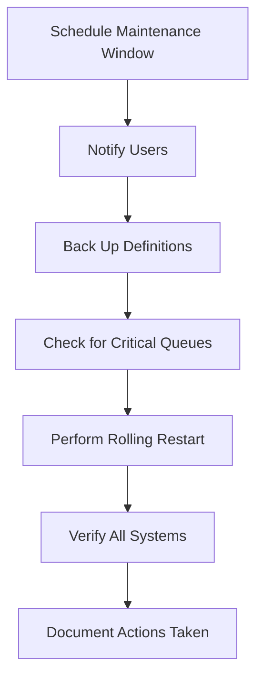

# RabbitMQ Cluster Maintenance

## Introduction

RabbitMQ clusters provide high availability and scalability for your messaging infrastructure. However, like any distributed system, they require regular maintenance to ensure optimal performance and reliability. This guide covers essential maintenance tasks for RabbitMQ clusters, from routine health checks to handling upgrades and unexpected failures.

Properly maintaining your RabbitMQ cluster helps prevent downtime, ensures message integrity, and provides a stable backbone for your applications. Whether you're running a small development cluster or a large production environment, these maintenance practices will help you keep your messaging infrastructure running smoothly.

## Monitoring Cluster Health

### Checking Cluster Status

Before performing any maintenance, you should check the health of your cluster:

```bash
# View cluster status
rabbitmqctl cluster_status

# Sample output:
# Cluster status of node rabbit@node1 ...
# [{nodes,[{disc,['rabbit@node1','rabbit@node2','rabbit@node3']}]},
#  {running_nodes,['rabbit@node1','rabbit@node2','rabbit@node3']},
#  {cluster_name,<<"rabbit@node1">>},
#  {partitions,[]},
#  {alarms,[{'rabbit@node1',[]},{'rabbit@node2',[]},{'rabbit@node3',[]}]}]
```

The output provides key information:
- `nodes`: Lists all nodes in the cluster
- `running_nodes`: Shows which nodes are currently running
- `partitions`: Indicates any network partitions (should be empty in normal operation)
- `alarms`: Shows any active alarms on the nodes

### Monitoring Key Metrics

Regular monitoring helps identify potential issues before they become critical:

```bash
# Check memory usage
rabbitmqctl status | grep memory

# Check disk space
rabbitmqctl status | grep disk_free

# List queues with message counts and other stats
rabbitmqctl list_queues name messages consumers memory
```

### Setting Up Monitoring Tools

For more comprehensive monitoring, consider setting up:

1. The RabbitMQ Management Plugin
2. Prometheus and Grafana dashboards
3. Log aggregation tools

```bash
# Enable the management plugin if not already enabled
rabbitmq-plugins enable rabbitmq_management
```

After enabling the management plugin, access the web UI at `http://your-server:15672` with default credentials (guest/guest).

## Performing Rolling Upgrades

### Preparing for an Upgrade

Before upgrading:

1. Back up your RabbitMQ configuration
2. Review the release notes for breaking changes
3. Test the upgrade in a staging environment
4. Plan for potential downtime

```bash
# Back up RabbitMQ configuration files
cp -r /etc/rabbitmq /etc/rabbitmq.backup

# Export definitions (via management plugin)
curl -u guest:guest http://localhost:15672/api/definitions > rabbitmq_definitions.json
```

### Rolling Upgrade Procedure

A rolling upgrade minimizes downtime by upgrading nodes one at a time:

```bash
# For each node in the cluster:

# 1. Stop RabbitMQ on the node
rabbitmqctl stop_app

# 2. Install new version (depends on your OS package manager)
# For Debian/Ubuntu:
apt-get update
apt-get install rabbitmq-server

# For RHEL/CentOS:
yum update rabbitmq-server

# 3. Start RabbitMQ on the node
rabbitmqctl start_app

# 4. Verify node rejoined the cluster
rabbitmqctl cluster_status

# 5. Wait for node to synchronize before moving to next node
```

:::caution
Always upgrade to compatible versions. Check the RabbitMQ documentation for version compatibility matrices.
:::

## Adding and Removing Nodes

### Adding a New Node

Expanding your cluster requires careful preparation:

```bash
# On the new node:

# 1. Install RabbitMQ
# (OS-specific installation steps)

# 2. Copy the Erlang cookie from an existing node
# The cookie is typically located at /var/lib/rabbitmq/.erlang.cookie or $HOME/.erlang.cookie

# 3. Restart RabbitMQ service to use the new cookie
systemctl restart rabbitmq-server

# 4. Stop the RabbitMQ application
rabbitmqctl stop_app

# 5. Join the cluster
rabbitmqctl join_cluster rabbit@existing_node_name

# 6. Start the RabbitMQ application
rabbitmqctl start_app

# 7. Verify cluster status
rabbitmqctl cluster_status
```

### Removing a Node

When reducing cluster size or replacing a problematic node:

```bash
# Graceful removal (when the node is still running)

# 1. On the node to be removed:
rabbitmqctl stop_app

# 2. On any other node in the cluster:
rabbitmqctl forget_cluster_node rabbit@node_to_remove

# 3. Verify the node is removed
rabbitmqctl cluster_status
```

For a node that has crashed and cannot be recovered:

```bash
# On any running node:
rabbitmqctl forget_cluster_node --offline rabbit@crashed_node
```

## Managing Queue Synchronization

### Queue Mirroring Policies

In a cluster, queues can be mirrored across multiple nodes for high availability:

```bash
# Set a policy to mirror all queues to all nodes
rabbitmqctl set_policy ha-all ".*" '{"ha-mode":"all"}' --apply-to queues

# Mirror specific queues with a pattern match
rabbitmqctl set_policy ha-important "^important\." '{"ha-mode":"exactly","ha-params":2,"ha-sync-mode":"automatic"}' --apply-to queues
```

### Forcing Queue Synchronization

Sometimes you need to explicitly synchronize a mirrored queue:

```bash
# List unsynchronized queues
rabbitmqctl list_queues name slave_pids synchronised_slave_pids

# Synchronize a specific queue
rabbitmqctl sync_queue name_of_queue

# Synchronize all queues
rabbitmqctl sync_queue_all
```

## Handling Network Partitions

### Detecting Network Partitions

Network partitions (split-brain scenarios) can occur when nodes lose connectivity:

```bash
# Check for partitions
rabbitmqctl cluster_status

# If partitions exist, you'll see something like:
# {partitions,[{'rabbit@node1',['rabbit@node2']}]}
```

### Resolving Partitions

Depending on your partition handling strategy:

```bash
# For automatic healing (restart the entire cluster):
rabbitmqctl stop_app
# Wait for all nodes to stop, then:
rabbitmqctl start_app

# For manual healing:
# 1. Decide which partition to keep
# 2. Stop the app on nodes in the other partition
rabbitmqctl stop_app
# 3. Reset those nodes
rabbitmqctl reset
# 4. Join them back to the main partition
rabbitmqctl join_cluster rabbit@main_node
# 5. Start the app
rabbitmqctl start_app
```

## Backing Up and Restoring

### Backing Up Configurations

Regular backups of configuration and definitions are essential:

```bash
# Backup configuration directories
cp -r /etc/rabbitmq /path/to/backup/rabbitmq_config_$(date +%Y%m%d)

# Export definitions via HTTP API
curl -u admin:password http://localhost:15672/api/definitions > /path/to/backup/rabbitmq_definitions_$(date +%Y%m%d).json
```

### Restoring from Backup

When you need to restore from a backup:

```bash
# Restore configuration files
cp -r /path/to/backup/rabbitmq_config_20230615/ /etc/rabbitmq/

# Import definitions via HTTP API
curl -u admin:password -X POST -H "Content-Type: application/json" \
  --data @/path/to/backup/rabbitmq_definitions_20230615.json \
  http://localhost:15672/api/definitions
```

## Troubleshooting Common Issues

### High Memory Usage

If memory usage is too high:

```bash
# Check which queues are using the most memory
rabbitmqctl list_queues name memory

# Purge a queue if necessary (be careful!)
rabbitmqctl purge_queue queue_name

# Adjust memory threshold
rabbitmqctl set_vm_memory_high_watermark 0.6
```

### Disk Space Alerts

When disk space is running low:

```bash
# Check current disk free limit
rabbitmqctl status | grep disk_free

# Adjust disk limit
rabbitmqctl set_disk_free_limit "5GB"
```

### Handling Crashed Nodes

If a node crashes and won't restart:

```bash
# Check logs for errors
tail -f /var/log/rabbitmq/rabbit@hostname.log

# Reset the node (will lose local data!)
rabbitmqctl reset

# Rejoin the cluster
rabbitmqctl join_cluster rabbit@existing_node
rabbitmqctl start_app
```

## Practical Maintenance Scenarios

### Scenario 1: Regular Maintenance Window

Let's walk through a typical maintenance procedure:



Implementation:

```bash
# 1. Back up before maintenance
curl -u admin:password http://localhost:15672/api/definitions > maintenance_backup.json

# 2. Check for critical queues
rabbitmqctl list_queues name messages consumers policy

# 3. Perform a rolling restart of each node
for node in node1 node2 node3; do
  echo "Restarting $node..."
  ssh $node "rabbitmqctl stop_app && rabbitmqctl start_app"
  sleep 60  # Allow time for synchronization
  # Verify node is healthy before proceeding
  ssh $node "rabbitmqctl status | grep -q running" || echo "WARNING: Node $node may not be running properly"
done

# 4. Verify cluster health after maintenance
rabbitmqctl cluster_status
```

### Scenario 2: Upgrading a Production Cluster

A real-world upgrade scenario for a critical production cluster:

```bash
# Preparation steps
# 1. Announce maintenance window to stakeholders
# 2. Ensure backups are current
curl -u admin:password http://localhost:15672/api/definitions > pre_upgrade_backup.json

# 3. Spin up a temporary node to handle traffic during maintenance (optional)
# Configure your load balancer to direct traffic to the temp node

# For each production node:
# 1. Gracefully stop the node
ssh node1 "rabbitmqctl stop_app"

# 2. Upgrade RabbitMQ (Debian/Ubuntu example)
ssh node1 "apt-get update && apt-get install -y rabbitmq-server=3.9.13-1"

# 3. Start the node
ssh node1 "rabbitmqctl start_app"

# 4. Verify the node is healthy
ssh node1 "rabbitmqctl status"
ssh node1 "rabbitmqctl list_queues name messages"

# 5. Move to the next node only when current one is fully operational
```

## Best Practices Summary

1. **Regular Monitoring**: Set up automated monitoring to catch issues early
2. **Backup Frequently**: Take regular backups of definitions and configurations
3. **Document Everything**: Keep records of all maintenance activities
4. **Test Before Production**: Always test upgrades in a staging environment
5. **Plan for Failures**: Have a disaster recovery plan ready
6. **Use Version Control**: Keep configuration files in version control
7. **Rolling Changes**: Make changes one node at a time to maintain availability
8. **Load Balancing**: Use a load balancer to redirect traffic during maintenance

## Additional Resources

- [Official RabbitMQ Documentation](https://www.rabbitmq.com/documentation.html)
- [RabbitMQ Clustering Guide](https://www.rabbitmq.com/clustering.html)
- [RabbitMQ Management HTTP API](https://www.rabbitmq.com/management.html#http-api)

## Practice Exercises

1. **Basic Maintenance**: Set up a three-node RabbitMQ cluster in a test environment and perform a rolling restart.

2. **Disaster Recovery**: Simulate a node failure and practice recovering the node.

3. **Upgrade Simulation**: Create a plan for upgrading your RabbitMQ cluster from version 3.8 to 3.9, including all necessary checks and precautions.

4. **Policy Management**: Configure different mirroring policies for different types of queues and test their effectiveness during node failures.

5. **Monitoring Challenge**: Set up Prometheus and Grafana to monitor your RabbitMQ cluster, creating alerts for critical conditions.

By following these maintenance practices, you'll ensure your RabbitMQ clusters remain stable, performant, and reliable even as your messaging needs grow and evolve.