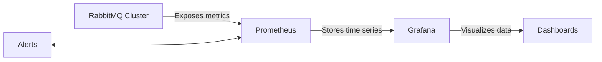

# RabbitMQ Cluster Monitoring

## Introduction

Monitoring your RabbitMQ cluster is crucial for maintaining a healthy messaging infrastructure. As your application scales and more messages flow through your cluster, proper monitoring becomes essential to identify bottlenecks, prevent outages, and optimize performance. This guide will walk you through the fundamentals of RabbitMQ cluster monitoring, from built-in tools to third-party integrations, helping you establish a robust monitoring strategy.

## Why Monitor Your RabbitMQ Cluster?

Before diving into specific monitoring approaches, let's understand why monitoring is critical:

- **Proactive issue detection**: Identify potential problems before they affect your users
- **Performance optimization**: Spot bottlenecks and improve messaging throughput
- **Capacity planning**: Make informed decisions about scaling your cluster
- **Resource utilization**: Ensure optimal use of memory, disk, and network resources
- **SLA compliance**: Meet service level agreements with reliable metrics

## Key Metrics to Monitor

An effective RabbitMQ monitoring strategy focuses on these essential metrics:

### 1. Node Health Metrics

- **Memory usage**: RabbitMQ has configurable memory thresholds - exceeding them can trigger flow control
- **Disk space**: Free disk space below thresholds can prevent message persistence
- **CPU utilization**: High CPU usage can indicate inefficient configurations or overload
- **File descriptors**: RabbitMQ needs sufficient file handles for connections
- **Socket descriptors**: Important for tracking network connections

### 2. Queue Metrics

- **Queue depth**: Number of messages waiting in queues
- **Queue growth rate**: How quickly queues are growing over time
- **Consumer utilization**: Percentage of time consumers are actively processing messages
- **Message rates**: Publishing and delivery rates per queue

### 3. Exchange and Binding Metrics

- **Exchange publish rates**: Messages published to each exchange
- **Binding count**: Number of bindings per exchange

### 4. Connection and Channel Metrics

- **Connection count**: Total active connections
- **Channel count**: Number of channels per connection
- **Connection churn**: Rate of new connections being created and closed

### 5. Cluster-wide Metrics

- **Queue replication status**: For mirrored queues, status of replicas
- **Quorum queue status**: For quorum queues, status of consensus
- **Partition detection**: Status of network partition detection
- **Synchronization status**: For replicated queues, synchronization progress

## Built-in Monitoring Tools

RabbitMQ provides several built-in tools for monitoring:

### Management UI

The RabbitMQ Management plugin provides a web-based UI for monitoring and managing your cluster:

```bash
# Enable the management plugin if not already enabled
rabbitmq-plugins enable rabbitmq_management
```

Access the Management UI at `http://your-server:15672` with default credentials `guest/guest` (change these in production!).

The Management UI provides visualizations for:
- Queue depths and message rates
- Node resource usage
- Connection and channel statistics
- Exchange binding topologies

### Management API

For programmatic access to monitoring data, use the HTTP API exposed by the management plugin:

```bash
# Example: Get overview information
curl -u guest:guest http://localhost:15672/api/overview

# Example: Get queue information
curl -u guest:guest http://localhost:15672/api/queues
```

### Command Line Tools

RabbitMQ provides CLI tools for monitoring:

```bash
# Check cluster status
rabbitmqctl cluster_status

# List queues with message counts and consumer counts
rabbitmqctl list_queues name messages consumers

# Check memory usage per node
rabbitmqctl status
```

## Integrating with Monitoring Systems

For production environments, integrate RabbitMQ with dedicated monitoring systems:

### Prometheus and Grafana

The Prometheus RabbitMQ exporter allows you to collect metrics and visualize them in Grafana:

1. Install the RabbitMQ Prometheus plugin:

```bash
rabbitmq-plugins enable rabbitmq_prometheus
```

2. Configure Prometheus to scrape the RabbitMQ metrics endpoint (default: `http://localhost:15692/metrics`)

3. Import a RabbitMQ dashboard into Grafana for visualization



### Enabling Prometheus Metrics

Add to your `rabbitmq.conf`:

```
prometheus.return_per_object_metrics = true
```

### Example Prometheus Configuration

```yaml
scrape_configs:
  - job_name: 'rabbitmq'
    static_configs:
      - targets: ['rabbitmq:15692']
```

## Alerting Strategies

Establish alerts for critical conditions:

### Memory Alerts

Alert when memory usage exceeds 80% of the configured high watermark:

```yaml
# Example Prometheus alert rule
alert: RabbitMQHighMemoryUsage
expr: rabbitmq_resident_memory_bytes / rabbitmq_resident_memory_limit_bytes > 0.8
for: 5m
labels:
  severity: warning
annotations:
  summary: "RabbitMQ high memory usage on {{ $labels.instance }}"
  description: "Memory usage is above 80% of the limit for 5 minutes"
```

### Queue Depth Alerts

Alert on abnormally deep queues that might indicate consumer issues:

```yaml
# Example Prometheus alert rule
alert: RabbitMQQueueDepthHigh
expr: rabbitmq_queue_messages > 10000
for: 10m
labels:
  severity: warning
annotations:
  summary: "Queue {{ $labels.queue }} has high message count"
  description: "Queue has more than 10,000 messages for 10 minutes"
```

## Health Checks for Clustering

In a clustered environment, monitor specific cluster health indicators:

### 1. Cluster Partition Detection

Check for network partitions regularly:

```bash
# Check for partitions via CLI
rabbitmqctl cluster_status | grep partitions
```

### 2. Queue Synchronization Status

For mirrored queues, monitor synchronization status:

```bash
# Check synchronization status
rabbitmqctl list_queues name slave_pids synchronised_slave_pids
```

### 3. Quorum Queue Consensus

For quorum queues, monitor consensus status:

```bash
# List quorum queues with their status
rabbitmqctl list_queues name type leader members state
```

## Advanced Monitoring Script

Here's a comprehensive script to gather key cluster metrics:

```python
#!/usr/bin/env python3
import requests
import json
import time
from datetime import datetime

# Configuration
rabbitmq_api_url = "http://localhost:15672/api"
username = "monitoring_user"
password = "monitoring_password"
auth = (username, password)

def get_cluster_overview():
    response = requests.get(f"{rabbitmq_api_url}/overview", auth=auth)
    return response.json()

def get_node_metrics():
    response = requests.get(f"{rabbitmq_api_url}/nodes", auth=auth)
    return response.json()

def get_queue_metrics():
    response = requests.get(f"{rabbitmq_api_url}/queues", auth=auth)
    return response.json()

def check_cluster_health():
    timestamp = datetime.now().strftime("%Y-%m-%d %H:%M:%S")
    print(f"=== RabbitMQ Cluster Health Check - {timestamp} ===")
    
    # Get cluster overview
    overview = get_cluster_overview()
    print(f"Cluster name: {overview.get('cluster_name')}")
    print(f"RabbitMQ version: {overview.get('rabbitmq_version')}")
    print(f"Erlang version: {overview.get('erlang_version')}")
    
    # Message rates
    msg_stats = overview.get('message_stats', {})
    publish_rate = msg_stats.get('publish_details', {}).get('rate', 0)
    deliver_rate = msg_stats.get('deliver_details', {}).get('rate', 0)
    print(f"Publish rate: {publish_rate:.2f} msgs/sec")
    print(f"Delivery rate: {deliver_rate:.2f} msgs/sec")
    
    # Node metrics
    nodes = get_node_metrics()
    print("
=== Node Status ===")
    for node in nodes:
        name = node.get('name')
        mem_used = node.get('mem_used') / (1024 * 1024)  # Convert to MB
        mem_limit = node.get('mem_limit') / (1024 * 1024)  # Convert to MB
        disk_free = node.get('disk_free') / (1024 * 1024 * 1024)  # Convert to GB
        fd_used = node.get('fd_used')
        fd_total = node.get('fd_total')
        
        print(f"Node: {name}")
        print(f"  Memory used: {mem_used:.2f} MB / {mem_limit:.2f} MB ({mem_used/mem_limit*100:.2f}%)")
        print(f"  Disk free: {disk_free:.2f} GB")
        print(f"  File descriptors: {fd_used} / {fd_total}")
        print(f"  Running: {node.get('running', False)}")
    
    # Queue metrics
    queues = get_queue_metrics()
    print("
=== Queue Status ===")
    print(f"Total queues: {len(queues)}")
    
    total_messages = 0
    total_consumers = 0
    queues_without_consumers = 0
    
    for queue in queues:
        total_messages += queue.get('messages', 0)
        total_consumers += queue.get('consumers', 0)
        if queue.get('consumers', 0) == 0 and queue.get('messages', 0) > 0:
            queues_without_consumers += 1
    
    print(f"Total messages: {total_messages}")
    print(f"Total consumers: {total_consumers}")
    print(f"Queues with messages but no consumers: {queues_without_consumers}")
    
    # List top 5 queues by message count
    top_queues = sorted(queues, key=lambda q: q.get('messages', 0), reverse=True)[:5]
    print("
=== Top 5 Queues by Message Count ===")
    for queue in top_queues:
        name = queue.get('name')
        vhost = queue.get('vhost')
        messages = queue.get('messages', 0)
        consumers = queue.get('consumers', 0)
        print(f"Queue: {name} (vhost: {vhost})")
        print(f"  Messages: {messages}")
        print(f"  Consumers: {consumers}")
        
    print("
=== Health Check Complete ===
")

if __name__ == "__main__":
    check_cluster_health()
```

## Setting Up a Comprehensive Monitoring Dashboard

For a complete monitoring solution, set up a Grafana dashboard that combines:

1. **System-level metrics**: CPU, memory, disk, and network for each node
2. **RabbitMQ-specific metrics**: Queue depths, message rates, and consumer utilization
3. **Application metrics**: How your applications interact with RabbitMQ

### Dashboard Organization

Structure your dashboard with these panels:

1. **Cluster Overview**:
   - Cluster status and node health
   - Overall message rates
   - Connection and channel counts

2. **Node Details**:
   - Memory usage per node
   - CPU utilization per node
   - Disk space and IO statistics

3. **Queue Metrics**:
   - Top queues by message count
   - Message ingress/egress rates
   - Consumer utilization

4. **Alerting Status**:
   - Current alerts and their status
   - Historical alert frequency

## Best Practices for RabbitMQ Monitoring

Follow these guidelines to establish effective monitoring:

1. **Establish baselines**: Monitor normal operating conditions to identify anomalies

2. **Set appropriate thresholds**: Configure alerts based on your application's specific needs

3. **Monitor both RabbitMQ and the underlying system**: Track OS-level metrics alongside RabbitMQ-specific metrics

4. **Implement trend analysis**: Look for patterns in message rates and queue depths over time

5. **Create runbooks**: Develop specific procedures for handling common alerts

6. **Test failure scenarios**: Regularly validate your monitoring and alerting in controlled failure tests

7. **Monitor from the application perspective**: Track end-to-end message delivery times

8. **Keep historical data**: Retain metrics for capacity planning and post-incident analysis

## Troubleshooting Common Issues

### High Memory Usage

If you observe high memory usage:

1. Check for large queues accumulating messages
2. Review your memory high watermark setting
3. Analyze message patterns and consumer performance
4. Consider enabling lazy queues for large queues with infrequent access

```bash
# Convert a queue to lazy mode
rabbitmqctl set_policy lazy-queue "^my-large-queue$" '{"queue-mode":"lazy"}' --apply-to queues
```

### Network Partitions

If you detect network partitions:

1. Check network infrastructure between nodes
2. Review your partition handling strategy
3. Consider implementing the `pause_minority` partition handling mode

```
# In rabbitmq.conf
cluster_partition_handling = pause_minority
```

### Consumer Throughput Issues

For slow message processing:

1. Increase consumer count
2. Analyze consumer application performance
3. Consider prefetch count adjustments

```bash
# Check current prefetch settings
rabbitmqctl list_consumers

# Set prefetch via your client application
channel.basic_qos(prefetch_count=10)
```

## Summary

Effective RabbitMQ cluster monitoring is essential for maintaining a reliable messaging infrastructure. By tracking key metrics, setting up proper alerting, and integrating with comprehensive monitoring systems, you can ensure your RabbitMQ cluster operates efficiently under varying loads.

Remember to:

- Monitor both system-level and RabbitMQ-specific metrics
- Establish baselines and appropriate alerting thresholds
- Implement trend analysis for capacity planning
- Create runbooks for common issues
- Regularly test your monitoring setup

With these practices in place, you'll be well-equipped to maintain a healthy RabbitMQ cluster that supports your application's messaging needs.

## Additional Resources

- [Official RabbitMQ Monitoring Documentation](https://www.rabbitmq.com/monitoring.html)
- [Prometheus RabbitMQ Exporter](https://github.com/rabbitmq/rabbitmq-prometheus)
- [Grafana Dashboard Templates for RabbitMQ](https://grafana.com/grafana/dashboards/?search=rabbitmq)

## Exercises

1. Set up the RabbitMQ management plugin and explore the metrics available in the UI.
2. Install Prometheus and Grafana, then configure them to monitor a RabbitMQ node.
3. Write a simple script that publishes messages faster than they can be consumed, then observe the monitoring metrics.
4. Configure alerts for high memory usage and queue depth.
5. Simulate a node failure in a cluster and observe how monitoring helps detect and resolve the issue.