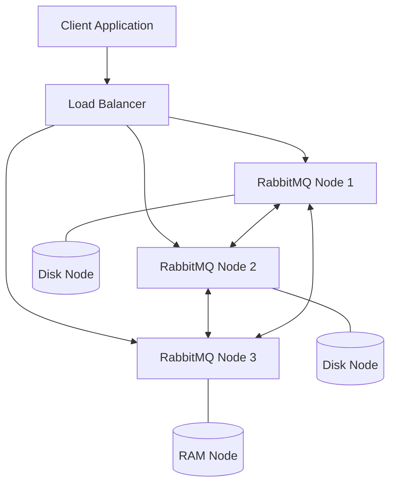

# RabbitMQ Cluster Management

## Introduction

RabbitMQ clustering allows you to connect multiple RabbitMQ servers together to form a single logical broker. This provides several benefits including high availability, increased message throughput, and improved fault tolerance. However, managing these clusters efficiently requires specific knowledge and tools.

In this guide, we'll explore how to set up, configure, monitor, and troubleshoot RabbitMQ clusters. Whether you're running RabbitMQ in a development environment or a production system, understanding these cluster management concepts is essential for maintaining a healthy messaging infrastructure.

## Cluster Architecture Overview

Before diving into management details, let's understand the basic architecture of a RabbitMQ cluster:



In a RabbitMQ cluster:
- All nodes share user, vhost, queue, exchange, binding, and runtime parameters
- Nodes can be disk nodes (storing data on disk) or RAM nodes (keeping most data in memory)
- Clients can connect to any node in the cluster

## Setting Up a RabbitMQ Cluster

### Prerequisites

Before setting up a cluster, ensure you have:
- RabbitMQ installed on all nodes (same version recommended)
- Consistent Erlang cookies across all nodes
- Network connectivity between all nodes
- Sufficient system resources (CPU, RAM, disk space)

### Basic Cluster Setup

Here's how to create a basic three-node RabbitMQ cluster:

1. **Start the first node (rabbit1)**

```bash
# On the first server (rabbit1)
rabbitmq-server -detached
```

2. **Join the second node (rabbit2) to the cluster**

```bash
# On the second server (rabbit2)
rabbitmqctl stop_app
rabbitmqctl reset
rabbitmqctl join_cluster rabbit@rabbit1
rabbitmqctl start_app
```

3. **Join the third node (rabbit3) to the cluster**

```bash
# On the third server (rabbit3)
rabbitmqctl stop_app
rabbitmqctl reset
rabbitmqctl join_cluster rabbit@rabbit1
rabbitmqctl start_app
```

4. **Verify the cluster status**

```bash
# Run on any node
rabbitmqctl cluster_status
```

Example output:

```
Cluster status of node rabbit@rabbit1 ...
[{nodes,[{disc,['rabbit@rabbit1','rabbit@rabbit2','rabbit@rabbit3']}]},
 {running_nodes,['rabbit@rabbit3','rabbit@rabbit2','rabbit@rabbit1']},
 {cluster_name,<<"rabbit@rabbit1">>},
 {partitions,[]},
 {alarms,[{'rabbit@rabbit3',[]},
          {'rabbit@rabbit2',[]},
          {'rabbit@rabbit1',[]}]}]
```

## Cluster Management Operations

### Viewing Cluster Status

To check the current state of your cluster:

```bash
rabbitmqctl cluster_status
```

### Adding a Node to an Existing Cluster

To add a new node to an existing cluster:

```bash
# On the new node
rabbitmqctl stop_app
rabbitmqctl reset
rabbitmqctl join_cluster rabbit@existing_node_name
rabbitmqctl start_app
```

### Removing a Node from a Cluster

To remove a node from a cluster:

```bash
# Method 1: From the node being removed
rabbitmqctl stop_app
rabbitmqctl reset
rabbitmqctl start_app

# Method 2: From another cluster node (if the node to remove is offline)
rabbitmqctl forget_cluster_node rabbit@node_to_remove
```

### Changing Node Types (Disk/RAM)

To change a disk node to a RAM node:

```bash
rabbitmqctl stop_app
rabbitmqctl change_cluster_node_type ram
rabbitmqctl start_app
```

To change a RAM node to a disk node:

```bash
rabbitmqctl stop_app
rabbitmqctl change_cluster_node_type disc
rabbitmqctl start_app
```

## Queue Management in a Cluster

### Understanding Queue Mirroring

By default, queues in RabbitMQ are located on a single node. To achieve high availability, you can use mirrored queues.

To set a policy for queue mirroring:

```bash
rabbitmqctl set_policy ha-all ".*" '{"ha-mode":"all"}' --apply-to queues
```

This policy mirrors all queues across all nodes in the cluster.

### Alternative Mirroring Strategies

For more targeted mirroring:

```bash
# Mirror only queues whose names start with "important"
rabbitmqctl set_policy ha-important "^important\." '{"ha-mode":"exactly","ha-params":2,"ha-sync-mode":"automatic"}' --apply-to queues

# Mirror queues to specific nodes
rabbitmqctl set_policy ha-nodes "^critical\." '{"ha-mode":"nodes","ha-params":["rabbit@node1", "rabbit@node2"]}' --apply-to queues
```

## Monitoring RabbitMQ Clusters

### Command-Line Monitoring

Use these commands to monitor your cluster:

```bash
# Check node status
rabbitmqctl status

# List queues with message counts and other details
rabbitmqctl list_queues name messages consumers memory

# List exchanges
rabbitmqctl list_exchanges name type

# List connections
rabbitmqctl list_connections user peer_host state
```

### Management UI

The RabbitMQ Management Plugin provides a web UI for monitoring and managing your cluster.

To enable it:

```bash
rabbitmq-plugins enable rabbitmq_management
```

Then access the UI at: http://server-name:15672/ (default credentials: guest/guest)

### Monitoring with Prometheus and Grafana

For advanced monitoring, you can use Prometheus and Grafana:

1. Enable the Prometheus plugin:

```bash
rabbitmq-plugins enable rabbitmq_prometheus
```

2. Configure Prometheus to scrape metrics from the endpoint: http://rabbit-node:15692/metrics

3. Set up Grafana dashboards to visualize the metrics

## Troubleshooting RabbitMQ Clusters

### Common Cluster Issues and Solutions

#### Network Partitions

Network partitions occur when nodes cannot communicate with each other.

To detect partitions:

```bash
rabbitmqctl cluster_status
```

Look for the `partitions` section in the output.

To heal a partition:

```bash
# Stop all nodes
rabbitmqctl stop_app   # On each node

# Start the first node
rabbitmqctl start_app  # On the first node

# Reset and rejoin other nodes
rabbitmqctl reset      # On other nodes
rabbitmqctl join_cluster rabbit@first_node  # On other nodes
rabbitmqctl start_app  # On other nodes
```

#### Erlang Cookie Issues

Erlang cookies must match across all nodes. If they don't, nodes can't communicate.

To check the cookie:

```bash
cat $HOME/.erlang.cookie   # For default location
```

To fix mismatched cookies:
1. Stop the RabbitMQ service on all nodes
2. Ensure all nodes have the same cookie file content
3. Restart the RabbitMQ service on all nodes

#### Disk Space Alerts

When disk space gets low, RabbitMQ will block producers:

```bash
# Check for disk alarms
rabbitmqctl status | grep alarm

# Clear disk alarms after fixing the issue
rabbitmqctl eval 'rabbit_alarm:clear_alarm({{resource_limit, disk, node()}, []}).'
```

### Log Analysis

RabbitMQ logs contain valuable information for troubleshooting:

```bash
# View log location
rabbitmqctl status | grep log_file

# Tail logs
tail -f /var/log/rabbitmq/rabbit@hostname.log
```

Key log patterns to look for:
- Connection failures
- Memory high watermark warnings
- Disk space warnings
- Cluster communication issues

## Backup and Recovery

### Backing Up RabbitMQ Cluster Configuration

To back up definitions (users, vhosts, queues, exchanges, bindings, etc.):

```bash
rabbitmqctl export_definitions /path/to/definitions.json
```

For a full backup:
1. Stop the RabbitMQ service
2. Back up the following directories:
   - `/var/lib/rabbitmq/mnesia/` (or equivalent on your system)
   - `/etc/rabbitmq/` for configuration files

### Restoring from Backup

To restore definitions:

```bash
rabbitmqctl import_definitions /path/to/definitions.json
```

For a full restore:
1. Stop the RabbitMQ service
2. Replace the backed-up directories
3. Start the RabbitMQ service

## Best Practices for Cluster Management

### Performance Optimization

1. **Use the right number of nodes**: More nodes aren't always better. Each added node increases inter-node communication overhead.

2. **Configure the right memory high watermark**:

```bash
# Set memory high watermark to 0.7 (70% of system RAM)
rabbitmqctl set_vm_memory_high_watermark 0.7
```

3. **Balance between disk and RAM nodes**: Use mostly disk nodes for durability. Use RAM nodes sparingly for performance-critical workloads.

4. **Use separate disks for the OS and RabbitMQ data**:

```bash
# Edit rabbitmq.conf to set a different data directory
# RABBITMQ_MNESIA_BASE=/path/to/data/directory
```

### Security Recommendations

1. **Change default credentials**:

```bash
rabbitmqctl add_user admin strong_password
rabbitmqctl set_user_tags admin administrator
rabbitmqctl set_permissions -p / admin ".*" ".*" ".*"
rabbitmqctl delete_user guest
```

2. **Enable TLS for node communication**:

```
# In rabbitmq.conf
listeners.ssl.default = 5671
ssl_options.cacertfile = /path/to/ca_certificate.pem
ssl_options.certfile = /path/to/server_certificate.pem
ssl_options.keyfile = /path/to/server_key.pem
ssl_options.verify = verify_peer
ssl_options.fail_if_no_peer_cert = true
```

3. **Set up inter-node TLS communication**:

```
# In rabbitmq.conf
management.ssl.port = 15671
management.ssl.cacertfile = /path/to/ca_certificate.pem
management.ssl.certfile = /path/to/server_certificate.pem
management.ssl.keyfile = /path/to/server_key.pem
```

### Scalability Planning

1. **Implement federation or shovel plugins** for connecting multiple clusters:

```bash
# Enable federation plugin
rabbitmq-plugins enable rabbitmq_federation

# Set up a federation upstream
rabbitmqctl set_parameter federation-upstream my-upstream '{"uri":"amqp://server-name","expires":3600000}'
```

2. **Create logical partitions using vhosts** to isolate workloads:

```bash
# Create a vhost
rabbitmqctl add_vhost production

# Set permissions
rabbitmqctl set_permissions -p production user ".*" ".*" ".*"
```

## Automating Cluster Management

### Using the RabbitMQ HTTP API

The HTTP API allows for programmatic management of your cluster:

```python
import requests
import json

# Define the API endpoint
base_url = "http://localhost:15672/api"
auth = ("admin", "password")

# Get cluster overview
response = requests.get(f"{base_url}/overview", auth=auth)
cluster_info = json.loads(response.content)
print(f"Cluster name: {cluster_info['cluster_name']}")
print(f"RabbitMQ version: {cluster_info['rabbitmq_version']}")
print(f"Erlang version: {cluster_info['erlang_version']}")

# List nodes
response = requests.get(f"{base_url}/nodes", auth=auth)
nodes = json.loads(response.content)
for node in nodes:
    print(f"Node: {node['name']}, Type: {'RAM' if node['type'] == 'ram' else 'Disk'}")
```

### Using Configuration Management Tools

For larger deployments, consider using:

- **Ansible**:

```yaml
# Example Ansible playbook snippet
- name: Install RabbitMQ
  ansible.builtin.package:
    name: rabbitmq-server
    state: present

- name: Enable management plugin
  ansible.builtin.command:
    cmd: rabbitmq-plugins enable rabbitmq_management
  notify: restart rabbitmq

- name: Join cluster
  ansible.builtin.command:
    cmd: "rabbitmqctl join_cluster rabbit@{{ master_node }}"
  when: inventory_hostname != master_node
```

- **Docker and Docker Compose**:

```yaml
# Example docker-compose.yml
version: '3'
services:
  rabbitmq-1:
    image: rabbitmq:3-management
    hostname: rabbitmq-1
    environment:
      - RABBITMQ_ERLANG_COOKIE=SHARED_SECRET
    ports:
      - "5672:5672"
      - "15672:15672"

  rabbitmq-2:
    image: rabbitmq:3-management
    hostname: rabbitmq-2
    environment:
      - RABBITMQ_ERLANG_COOKIE=SHARED_SECRET
    depends_on:
      - rabbitmq-1
    command: >
      bash -c "
        sleep 10;
        rabbitmqctl stop_app;
        rabbitmqctl reset;
        rabbitmqctl join_cluster rabbit@rabbitmq-1;
        rabbitmqctl start_app;
        tail -f /dev/null
      "
```

- **Kubernetes with RabbitMQ Operator**:

```yaml
# Example RabbitMQ Cluster in Kubernetes
apiVersion: rabbitmq.com/v1beta1
kind: RabbitmqCluster
metadata:
  name: production-rabbitmq
spec:
  replicas: 3
  resources:
    requests:
      cpu: 500m
      memory: 1Gi
    limits:
      cpu: 1
      memory: 2Gi
  persistence:
    storageClassName: standard
    storage: 10Gi
```

## Summary

RabbitMQ cluster management involves several key areas:

1. **Cluster Setup**: Creating and configuring a multi-node cluster
2. **Operational Management**: Adding/removing nodes, changing node types
3. **Queue Management**: Setting up mirroring for high availability
4. **Monitoring**: Using command-line tools, the Management UI, or external tools
5. **Troubleshooting**: Handling common issues like network partitions
6. **Backup and Recovery**: Ensuring data safety through regular backups
7. **Best Practices**: Optimizing for performance, security, and scalability
8. **Automation**: Using APIs and infrastructure-as-code tools

By following these guidelines, you can maintain a robust, scalable, and reliable RabbitMQ messaging infrastructure that meets your application's needs.

## Additional Resources

- [Official RabbitMQ Clustering Documentation](https://www.rabbitmq.com/clustering.html)
- [RabbitMQ Management HTTP API](https://www.rabbitmq.com/management.html#http-api)
- [RabbitMQ Monitoring](https://www.rabbitmq.com/monitoring.html)

## Exercises

1. Set up a three-node RabbitMQ cluster on your local machine using Docker.
2. Configure a policy to mirror all queues with names starting with "important" across all nodes.
3. Write a script using the HTTP API to monitor queue depths and node status.
4. Simulate a network partition by blocking network traffic between nodes, then heal the partition.
5. Create a backup of your cluster configuration and restore it on a fresh cluster.