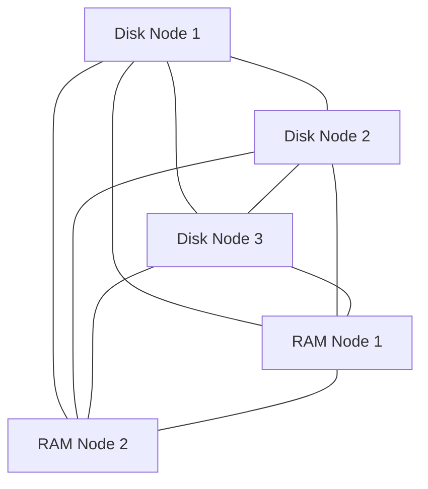
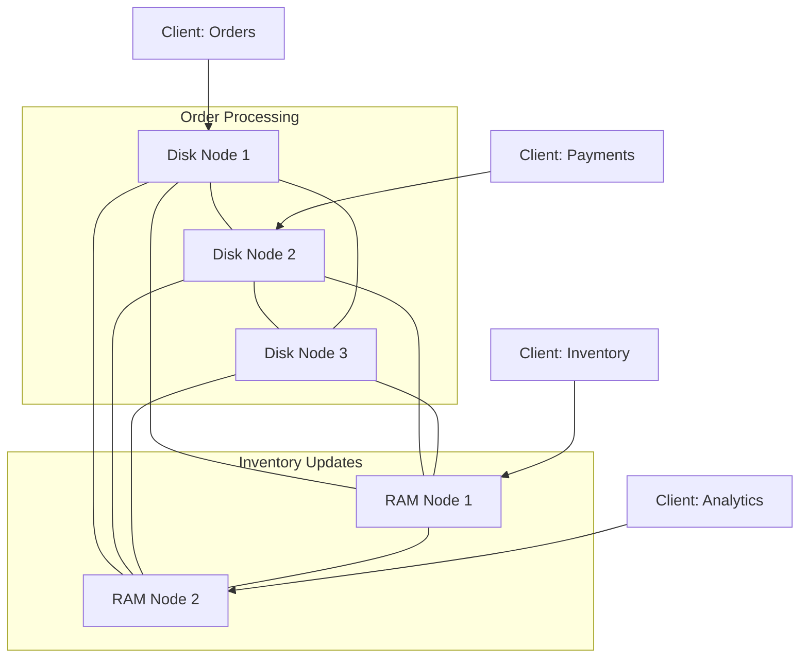

# RabbitMQ Node Types

## Introduction

When setting up a RabbitMQ cluster, one of the most important design decisions is understanding and configuring the appropriate node types. RabbitMQ offers different node types that serve specific purposes in a clustered environment, affecting how data is stored, replicated, and managed across the cluster. This guide will help you understand the various node types in RabbitMQ, their characteristics, and when to use each one.

## RabbitMQ Node Type Basics

In a RabbitMQ cluster, nodes can be categorized into two primary types:

1. **Disk Nodes** (also called disk-based nodes)
2. **RAM Nodes** (also called memory-based nodes)

Each type has distinct roles, advantages, and trade-offs that impact your messaging infrastructure's performance, reliability, and resource usage.

## Disk Nodes

Disk nodes store the metadata about exchanges, queues, bindings, users, permissions, and vhost on disk. This means they persist this information even when the node is restarted.

### Characteristics of Disk Nodes

- Store metadata persistently on disk
- Provide durability during cluster restarts
- Consume more I/O resources
- Slightly slower than RAM nodes during some operations
- Act as the source of truth for the cluster

### Configuration Example

To configure a node as a disk node (which is the default), you can specify it in the configuration file or command line:

```bash
# In rabbitmq.conf
node_type = disc

# Or when starting RabbitMQ
RABBITMQ_NODE_TYPE=disc rabbitmq-server
```

### When to Use Disk Nodes

- For nodes that need to maintain state across restarts
- In production environments that require fault tolerance
- When you need guaranteed message persistence
- For nodes that will serve as the backbone of your cluster

## RAM Nodes

RAM nodes store the cluster state in memory only. They obtain a copy of the metadata from disk nodes when they start up, but they don't persist this metadata to disk themselves.

### Characteristics of RAM Nodes

- Store metadata only in memory
- Faster for certain operations (particularly those involving metadata)
- Less I/O overhead
- Must sync with disk nodes during startup
- Cannot recover independently after a restart

### Configuration Example

To configure a node as a RAM node:

```bash
# In rabbitmq.conf
node_type = ram

# Or when starting RabbitMQ
RABBITMQ_NODE_TYPE=ram rabbitmq-server
```

### When to Use RAM Nodes

- For high-throughput scenarios where performance is critical
- When you have many exchanges and bindings but fewer queues
- In scenarios where rapid metadata operations are important
- As additional nodes in a cluster that already has sufficient disk nodes

## Disk vs. RAM Nodes: Important Considerations

Let's compare disk and RAM nodes to help you make an informed decision:

| Feature | Disk Nodes | RAM Nodes |
|---------|-----------|-----------|
| Metadata Storage | On disk and in memory | In memory only |
| Durability | High | Low |
| Performance | Good | Better for metadata operations |
| Restart Recovery | Independent | Requires disk nodes |
| Resource Usage | Higher disk I/O | Higher memory usage |
| Recommended for | Critical data, cluster stability | Performance, scaling metadata operations |

## Cluster Composition Guidelines

For a robust RabbitMQ cluster, follow these guidelines:

1. **Always have at least one disk node** in your cluster — preferably more for redundancy
2. A cluster with only RAM nodes will lose all metadata when all nodes are stopped
3. It's recommended to have at least three disk nodes in production clusters
4. RAM nodes should be added to complement disk nodes, not replace them

Here's a visual representation of a recommended cluster setup:



## Practical Example: Setting Up a Mixed Node Cluster

Let's walk through setting up a basic RabbitMQ cluster with both disk and RAM nodes:

### Step 1: Set up the first disk node

```bash
# On Node 1
rabbitmq-server -detached
```

### Step 2: Set up a second disk node and join it to the cluster

```bash
# On Node 2
rabbitmq-server -detached
rabbitmqctl stop_app
rabbitmqctl join_cluster rabbit@node1
rabbitmqctl start_app
```

### Step 3: Add a RAM node to the cluster

```bash
# On Node 3
RABBITMQ_NODE_TYPE=ram rabbitmq-server -detached
rabbitmqctl stop_app
rabbitmqctl join_cluster --ram rabbit@node1
rabbitmqctl start_app
```

### Step 4: Verify your cluster setup

```bash
# On any node
rabbitmqctl cluster_status
```

Example output:

```
Cluster status of node rabbit@node3 ...
[{nodes,[{disc,['rabbit@node1','rabbit@node2']},{ram,['rabbit@node3']}]},
 {running_nodes,['rabbit@node1','rabbit@node2','rabbit@node3']}]
```

## Converting Between Node Types

You can dynamically change a node's type without rebuilding your cluster:

### Converting a RAM node to a disk node:

```bash
rabbitmqctl stop_app
rabbitmqctl change_cluster_node_type disc
rabbitmqctl start_app
```

### Converting a disk node to a RAM node:

```bash
rabbitmqctl stop_app
rabbitmqctl change_cluster_node_type ram
rabbitmqctl start_app
```

**Note:** Ensure that you always maintain at least one disk node in your cluster!

## Monitoring Node Types

To check the current node types in your cluster:

```bash
rabbitmqctl cluster_status
```

This command will show you which nodes are disk-based and which are RAM-based.

## Real-World Application: E-commerce Platform

Let's consider an e-commerce application that processes orders, inventory updates, and user notifications:

### Scenario:
- High volume of transactions during peak hours
- Need for reliable message persistence for order processing
- Fast metadata operations for real-time inventory updates

### Solution:
- Use 3 disk nodes to ensure reliable persistence of order data
- Add 2 RAM nodes to handle high-throughput inventory updates
- Distribute connections across all nodes for load balancing

### Implementation:



In this setup:
- Critical order and payment data flows through disk nodes
- Fast-changing inventory data is primarily processed by RAM nodes
- All nodes form a single cluster for unified message routing

## Performance Considerations

When designing your RabbitMQ cluster with different node types, consider these performance factors:

1. **Memory usage**: RAM nodes require more memory as they store all metadata in RAM
2. **I/O operations**: Disk nodes perform more disk I/O operations
3. **Startup time**: RAM nodes typically start faster but need to sync with disk nodes
4. **Cluster recovery**: Recovery time depends on the number of disk nodes and queue data volume

## Common Mistakes to Avoid

1. **Creating a cluster with only RAM nodes** - this will lose all metadata when all nodes restart
2. **Converting all disk nodes to RAM nodes** - at least one disk node must remain
3. **Ignoring resource requirements** - RAM nodes need sufficient memory allocation
4. **Not planning for failure** - ensure you have enough disk nodes for redundancy

## Summary

RabbitMQ node types give you flexibility in designing your messaging architecture:

- **Disk nodes** provide durability and persistence, serving as the backbone of your cluster
- **RAM nodes** offer performance advantages for metadata operations
- A balanced approach using both node types creates an optimal cluster setup

When designing your RabbitMQ cluster, consider your specific requirements for durability, performance, and resource utilization. For most production deployments, a combination of both disk and RAM nodes will provide the best balance between reliability and performance.

## Further Learning Resources

To deepen your understanding of RabbitMQ clustering and node types:

1. Explore the official RabbitMQ clustering documentation
2. Practice creating and managing clusters in a development environment
3. Benchmark different node type configurations for your specific workloads
4. Learn about quorum queues and how they relate to node types in modern RabbitMQ deployments

## Exercises

1. Set up a local three-node RabbitMQ cluster with two disk nodes and one RAM node
2. Write a script to monitor the performance difference between operations on disk vs. RAM nodes
3. Experiment with converting node types in your test cluster and observe the effects
4. Create a failover scenario by stopping different node types and documenting the recovery process