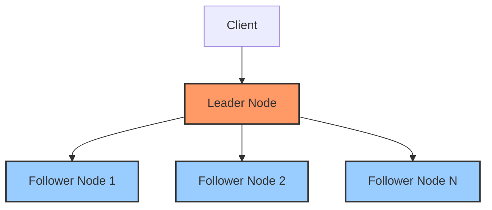

# RabbitMQ Quorum Queues

## Introduction

When building robust distributed systems with RabbitMQ, data safety and high availability are critical concerns. RabbitMQ Quorum Queues provide a solution that ensures your messages remain safe even when nodes in your cluster fail.

In this tutorial, we'll explore RabbitMQ Quorum Queues, understanding what they are, how they work, and when to use them. We'll also walk through practical examples showing how to set up and work with quorum queues in your applications.

## What Are Quorum Queues?

Quorum Queues are a queue type in RabbitMQ designed for high availability and data safety. Unlike classic mirrored queues, quorum queues use a consensus algorithm (Raft) to ensure data consistency across multiple nodes in a cluster.

The name "quorum" refers to the requirement that a majority (quorum) of nodes must agree on the state of the queue for operations to proceed, which ensures consistency in the face of network partitions or node failures.

## Why Quorum Queues?

Before diving into how quorum queues work, let's understand why they were introduced:

1. **Data Safety**: They provide stronger data safety guarantees compared to classic mirrored queues
2. **Consistency**: They maintain consistency even during network partitions
3. **Predictable Failover**: They handle node failures more predictably
4. **Performance**: They offer better performance characteristics for many workloads
5. **Simpler Implementation**: They're easier to reason about and maintain than the classic mirrored queue implementation

## How Quorum Queues Work

Quorum queues rely on the Raft consensus algorithm, which ensures that a distributed system can agree on a sequence of operations even when some nodes fail.



In a quorum queue:

1. One node is elected as the **leader**
2. All other nodes are **followers**
3. The leader processes all queue operations (enqueues, dequeues)
4. Operations are replicated to followers
5. Operations are considered successful only after a majority of nodes (a quorum) have confirmed the operation

If the leader node fails, a new leader is automatically elected from among the followers, ensuring the queue remains available.

## Creating Quorum Queues

Let's look at how to create and use quorum queues in practice.

### Using the Management UI

You can create a quorum queue using the RabbitMQ Management UI by:

1. Navigating to the "Queues" tab
2. Clicking "Add a new queue"
3. Entering your queue name
4. Selecting "Quorum queue" as the queue type
5. Setting additional parameters as needed
6. Clicking "Add queue"

### Using the Command Line

You can create a quorum queue using `rabbitmqctl`:

```bash
rabbitmqctl quorum_queue_create my_queue --node rabbit@node1 --node rabbit@node2 --node rabbit@node3
```

### Using the API

Here's how to create a quorum queue programmatically in various languages:

#### JavaScript (Node.js with amqplib)

```javascript
const amqp = require('amqplib');

async function createQuorumQueue() {
  try {
    const connection = await amqp.connect('amqp://localhost');
    const channel = await connection.createChannel();
    
    // Create a quorum queue
    await channel.assertQueue('my_quorum_queue', {
      arguments: {
        'x-queue-type': 'quorum',
        'x-quorum-initial-group-size': 3 // Number of nodes for replication
      }
    });
    
    console.log('Quorum queue created successfully');
    
    // Close the connection
    await channel.close();
    await connection.close();
  } catch (error) {
    console.error('Error:', error);
  }
}

createQuorumQueue();
```

#### Python (with pika)

```python
import pika

connection = pika.BlockingConnection(pika.ConnectionParameters('localhost'))
channel = connection.channel()

# Create a quorum queue
channel.queue_declare(
    queue='my_quorum_queue',
    arguments={
        'x-queue-type': 'quorum',
        'x-quorum-initial-group-size': 3
    }
)

print("Quorum queue created successfully")

connection.close()
```

#### Java (with RabbitMQ Java Client)

```java
import com.rabbitmq.client.Channel;
import com.rabbitmq.client.Connection;
import com.rabbitmq.client.ConnectionFactory;

import java.io.IOException;
import java.util.HashMap;
import java.util.Map;
import java.util.concurrent.TimeoutException;

public class QuorumQueueExample {
    public static void main(String[] args) throws IOException, TimeoutException {
        ConnectionFactory factory = new ConnectionFactory();
        factory.setHost("localhost");
        
        try (Connection connection = factory.newConnection();
             Channel channel = connection.createChannel()) {
            
            // Create a quorum queue
            Map<String, Object> arguments = new HashMap<>();
            arguments.put("x-queue-type", "quorum");
            arguments.put("x-quorum-initial-group-size", 3);
            
            channel.queueDeclare("my_quorum_queue", true, false, false, arguments);
            
            System.out.println("Quorum queue created successfully");
        }
    }
}
```

## Key Configuration Options

When creating a quorum queue, you can specify several important configuration options:

### 1. Initial Group Size

The `x-quorum-initial-group-size` parameter determines how many nodes will participate in the quorum:

```javascript
await channel.assertQueue('my_quorum_queue', {
  arguments: {
    'x-queue-type': 'quorum',
    'x-quorum-initial-group-size': 5  // Create with 5 members
  }
});
```

### 2. Delivery Limit

You can set a delivery limit to control how many times a message can be requeued:

```javascript
await channel.assertQueue('my_quorum_queue', {
  arguments: {
    'x-queue-type': 'quorum',
    'x-delivery-limit': 3  // Message will be dead-lettered after 3 delivery attempts
  }
});
```

### 3. Dead Letter Exchange

Configure a dead letter exchange for messages that exceed the delivery limit:

```javascript
await channel.assertQueue('my_quorum_queue', {
  arguments: {
    'x-queue-type': 'quorum',
    'x-dead-letter-exchange': 'my-dlx'
  }
});
```

## Publishing and Consuming Messages

Publishing to and consuming from a quorum queue works the same way as with classic queues:

### Publishing Example (Node.js)

```javascript
const amqp = require('amqplib');

async function publishMessages() {
  try {
    const connection = await amqp.connect('amqp://localhost');
    const channel = await connection.createChannel();
    
    const queue = 'my_quorum_queue';
    const message = 'Hello Quorum Queue!';
    
    await channel.assertQueue(queue, {
      arguments: {
        'x-queue-type': 'quorum'
      }
    });
    
    channel.sendToQueue(queue, Buffer.from(message), {
      persistent: true  // Make messages persistent
    });
    
    console.log(`Message sent: ${message}`);
    
    setTimeout(() => {
      connection.close();
      process.exit(0);
    }, 500);
  } catch (error) {
    console.error('Error:', error);
  }
}

publishMessages();
```

### Consuming Example (Node.js)

```javascript
const amqp = require('amqplib');

async function consumeMessages() {
  try {
    const connection = await amqp.connect('amqp://localhost');
    const channel = await connection.createChannel();
    
    const queue = 'my_quorum_queue';
    
    await channel.assertQueue(queue, {
      arguments: {
        'x-queue-type': 'quorum'
      }
    });
    
    console.log(`Waiting for messages from ${queue}`);
    
    channel.consume(queue, (msg) => {
      console.log(`Received: ${msg.content.toString()}`);
      channel.ack(msg);  // Acknowledge the message
    });
  } catch (error) {
    console.error('Error:', error);
  }
}

consumeMessages();
```

## Quorum Queues vs. Classic Mirrored Queues

Understanding the differences between quorum queues and classic mirrored queues helps you choose the right solution for your needs:

| Feature | Quorum Queues | Classic Mirrored Queues |
|---------|--------------|------------------------|
| Consistency Protocol | Raft | Custom |
| Data Safety | Stronger | Weaker |
| Performance | Better for most workloads | Can be faster for some specific scenarios |
| Memory Usage | Higher | Lower |
| Max Length | Unbounded | Configurable |
| Replication Factor | Fixed at creation | Adjustable |
| Leader Election | Automatic | Manual intervention may be needed |
| Feature Set | More focused | More features |

## Best Practices for Quorum Queues

To get the most out of quorum queues, follow these best practices:

1. **Use an Odd Number of Nodes**: Always configure an odd number of nodes in your cluster to avoid split-brain situations.

2. **Set Appropriate Initial Size**: Choose an initial group size based on your cluster size. A 3-node or 5-node configuration works well for most setups.

3. **Enable Message TTL When Needed**: For queues that might accumulate messages, set a TTL:

   ```javascript
   await channel.assertQueue('my_quorum_queue', {
     arguments: {
       'x-queue-type': 'quorum',
       'x-message-ttl': 86400000  // 24 hours in milliseconds
     }
   });
   ```

4. **Use Delivery Limits**: Avoid poison messages causing endless requeues by setting delivery limits.

5. **Batch Acknowledgments**: When consuming, acknowledge messages in batches to improve performance.

6. **Monitor Queue Memory**: Quorum queues can use more memory than classic queues, so monitor memory usage.

## Real-World Examples

Let's look at some real-world scenarios where quorum queues shine:

### Example 1: Payment Processing System

In a payment processing system, you need to ensure that payment messages are never lost, even if nodes fail:

```javascript
// Payment processing service
async function setupPaymentQueue() {
  const connection = await amqp.connect(config.rabbitmq.url);
  const channel = await connection.createChannel();
  
  // Create a quorum queue for payment messages
  await channel.assertQueue('payment_processing_queue', {
    arguments: {
      'x-queue-type': 'quorum',
      'x-quorum-initial-group-size': 3,
      'x-delivery-limit': 5,
      'x-dead-letter-exchange': 'payment-dlx'
    }
  });
  
  // Create a dead-letter queue for failed payments
  await channel.assertExchange('payment-dlx', 'direct');
  await channel.assertQueue('failed_payments', { durable: true });
  await channel.bindQueue('failed_payments', 'payment-dlx', '');
  
  // Process payments
  channel.consume('payment_processing_queue', async (msg) => {
    try {
      const payment = JSON.parse(msg.content.toString());
      await processPayment(payment);
      channel.ack(msg);
    } catch (error) {
      // Handle errors and potentially nack
      console.error('Payment processing error:', error);
      channel.nack(msg);
    }
  });
}
```

### Example 2: Event Sourcing System

In an event sourcing system, you need to ensure that events are reliably stored and processed in order:

```javascript
// Event store service
async function setupEventQueue() {
  const connection = await amqp.connect(config.rabbitmq.url);
  const channel = await connection.createChannel();
  
  // Create a quorum queue for events
  await channel.assertQueue('domain_events', {
    arguments: {
      'x-queue-type': 'quorum',
      'x-quorum-initial-group-size': 5  // Higher replication for critical events
    }
  });
  
  // Set up consumers that update the read models
  channel.consume('domain_events', async (msg) => {
    try {
      const event = JSON.parse(msg.content.toString());
      await updateReadModels(event);
      channel.ack(msg);
    } catch (error) {
      console.error('Event processing error:', error);
      // Critical events should be retried
      channel.nack(msg, false, true);
    }
  });
}
```

## Monitoring Quorum Queues

Monitoring is essential for maintaining healthy quorum queues. You can use:

1. **RabbitMQ Management UI**: View quorum queue metrics directly in the UI
2. **HTTP API**: Fetch queue metrics programmatically:

```javascript
const http = require('http');

// Fetch quorum queue metrics
function getQuorumQueueMetrics() {
  return new Promise((resolve, reject) => {
    const options = {
      hostname: 'localhost',
      port: 15672,
      path: '/api/queues/%2F/my_quorum_queue',
      method: 'GET',
      headers: {
        'Authorization': 'Basic ' + Buffer.from('guest:guest').toString('base64')
      }
    };

    const req = http.request(options, (res) => {
      let data = '';
      res.on('data', (chunk) => {
        data += chunk;
      });
      res.on('end', () => {
        resolve(JSON.parse(data));
      });
    });

    req.on('error', (e) => {
      reject(e);
    });
    
    req.end();
  });
}
```

3. **Prometheus and Grafana**: For more sophisticated monitoring setups

## Troubleshooting Quorum Queues

Here are some common issues with quorum queues and how to resolve them:

### 1. Queue Won't Form a Quorum

If a quorum queue won't form a quorum (majority of nodes):

```bash
# Check the cluster status
rabbitmqctl cluster_status

# Check the quorum queue status
rabbitmqctl list_quorum_queue_members name=my_quorum_queue vhost=/

# Force a specific node to be part of the queue
rabbitmqctl add_member_to_quorum_queue name=my_quorum_queue node=rabbit@node3 vhost=/
```

### 2. High Memory Usage

If quorum queues are using too much memory:

```bash
# Check memory usage per queue
rabbitmqctl list_queues name memory

# Set a message TTL or max-length if not already set
rabbitmqctl set_policy TTL "^my_quorum_queue$" \
  '{"message-ttl":86400000}' \
  --apply-to queues
```

### 3. Slow Performance

For performance issues:

```bash
# Check queue metrics
rabbitmqctl list_queues name messages_ready messages_unacknowledged message_stats.publish_details.rate

# Increase consumer prefetch count for better throughput
# In your consumer code:
channel.prefetch(100);
```

## Summary

RabbitMQ Quorum Queues provide a robust solution for ensuring message safety and availability in distributed systems. They use the Raft consensus algorithm to maintain consistency across multiple nodes, making them ideal for critical messaging workloads.

Key takeaways:

1. Quorum queues offer stronger data safety guarantees than classic mirrored queues
2. They use a consensus algorithm to ensure consistency across nodes
3. They handle node failures and leader elections automatically
4. They're easy to set up and configure for different scenarios
5. They work well for critical messaging workloads where data safety is paramount

## Additional Resources

To continue learning about RabbitMQ Quorum Queues:

- [RabbitMQ Official Documentation on Quorum Queues](https://www.rabbitmq.com/quorum-queues.html)
- [Raft Consensus Algorithm](https://raft.github.io/)
- [RabbitMQ Clustering Guide](https://www.rabbitmq.com/clustering.html)

## Exercises

1. Set up a 3-node RabbitMQ cluster and create a quorum queue that spans all nodes.
2. Write a producer and consumer application that uses a quorum queue.
3. Simulate a node failure and observe how the quorum queue handles it.
4. Implement a payment processing system using quorum queues for guaranteed delivery.
5. Compare the performance of quorum queues versus classic queues for your specific workload.