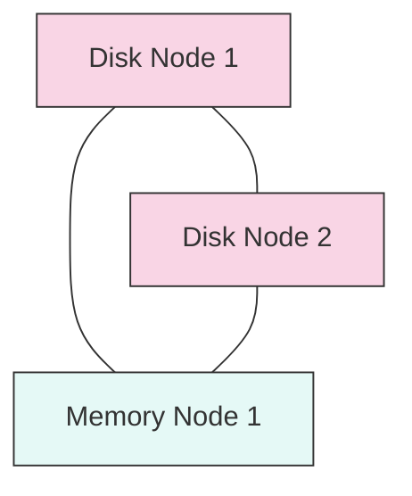

# RabbitMQ Disk Nodes

## Introduction

In a RabbitMQ cluster, nodes can be configured as either **disk nodes** or **memory (RAM) nodes**. This distinction plays a critical role in how RabbitMQ stores and manages its data across the cluster. In this guide, we'll focus specifically on disk nodes - understanding what they are, how they work, and when to use them in your messaging infrastructure.

Disk nodes are essential components of a robust RabbitMQ cluster, as they provide data persistence and ensure that your messaging system can recover from failures.

## What are Disk Nodes?

Disk nodes are RabbitMQ nodes that store all their metadata to disk. This metadata includes:

- Queue definitions
- Exchange definitions
- Binding information
- User information
- Permissions
- Virtual hosts
- Policies

The key characteristic of disk nodes is **persistence** - they write critical cluster metadata to disk, which enables the node to recover its state after a restart or failure.

## Disk Nodes vs. Memory Nodes

To better understand disk nodes, let's compare them with memory nodes:

| Feature | Disk Nodes | Memory Nodes |
|---------|-----------|--------------|
| Metadata storage | Stored on disk | Stored in memory only |
| Durability | High | Low |
| Performance | Slower (disk I/O involved) | Faster (no disk I/O) |
| Recovery | Can recover state after restart | Must sync from disk nodes after restart |
| Cluster role | Required (at least one) | Optional |

## Configuring a Disk Node

By default, all RabbitMQ nodes start as disk nodes. Here's how to explicitly configure a node as a disk node:

```bash
# In rabbitmq.conf
cluster_formation.node_type = disc

# OR using environment variable
export RABBITMQ_NODE_TYPE=disc
```

When starting a RabbitMQ node using the `rabbitmq-server` command:

```bash
rabbitmq-server -detached
```

This will start the node as a disk node by default.

## Verifying Node Types in a Cluster

To check which nodes in your cluster are disk nodes and which are memory nodes:

```bash
rabbitmqctl cluster_status
```

Example output:

```
Cluster status of node rabbit@node1 ...
Disk Nodes
 * rabbit@node1
 * rabbit@node2
RAM Nodes
 * rabbit@node3
```

This shows that `node1` and `node2` are disk nodes, while `node3` is a memory node.

## Best Practices for Disk Nodes

### 1. Maintain Multiple Disk Nodes

It's recommended to have at least two disk nodes in a production cluster for redundancy. This ensures that if one disk node fails, you still have another with the full cluster metadata.



### 2. Monitor Disk Space

Disk nodes require adequate disk space. Monitor the disk usage to prevent performance issues:

```bash
# Check disk usage
df -h /path/to/rabbitmq/data

# Configure disk space monitoring in rabbitmq.conf
disk_free_limit.absolute = 5GB
```

### 3. Proper Storage Configuration

For production environments, use:
- Fast SSDs for better performance
- RAID configurations for data redundancy
- Separate volumes for RabbitMQ data and logs

## Practical Example: Creating a RabbitMQ Cluster with Disk Nodes

Let's walk through setting up a three-node RabbitMQ cluster with two disk nodes and one memory node:

### Step 1: Initialize the first disk node

```bash
# On node1
rabbitmq-server -detached
```

### Step 2: Configure the second disk node and join the cluster

```bash
# On node2
rabbitmq-server -detached
rabbitmqctl stop_app
rabbitmqctl join_cluster rabbit@node1
rabbitmqctl start_app
```

### Step 3: Configure the memory node and join the cluster

```bash
# On node3
rabbitmq-server -detached
rabbitmqctl stop_app
rabbitmqctl join_cluster --ram rabbit@node1
rabbitmqctl start_app
```

### Step 4: Verify the cluster

```bash
# On any node
rabbitmqctl cluster_status
```

## Handling Disk Node Failures

If a disk node fails, the following steps can help recover the cluster:

### Temporary Failure (node will return)

```bash
# After restarting the failed disk node
rabbitmqctl start_app
```

The node will automatically sync with other disk nodes in the cluster.

### Permanent Failure (node won't return)

```bash
# On a remaining node
rabbitmqctl forget_cluster_node rabbit@failed_node
```

This removes the failed node from the cluster. Ensure you have at least one disk node remaining.

## When to Use Disk Nodes vs. Memory Nodes

| Scenario | Recommendation |
|----------|---------------|
| Production clusters | At least 2-3 disk nodes for redundancy |
| High throughput needs | Mix of disk and memory nodes |
| Small/test deployments | One disk node is sufficient |
| Limited resources | Prioritize disk nodes over memory nodes |

## Node Type Impact on Message Persistence

It's important to understand that the node type (disk vs. memory) primarily affects the **metadata storage**, not message persistence. Message persistence is controlled by:

1. Queue durability settings
2. Message persistence properties
3. Publisher confirms

Example of creating a durable queue with persistent messages:

```javascript
// Node.js example using amqplib
const amqp = require('amqplib');

async function setup() {
  const connection = await amqp.connect('amqp://localhost');
  const channel = await connection.createChannel();
  
  // Create a durable queue
  await channel.assertQueue('important_task_queue', {
    durable: true  // Queue will survive broker restart
  });
  
  // Send a persistent message
  channel.sendToQueue('important_task_queue', 
    Buffer.from('Critical message'),
    { persistent: true }  // Message will be saved to disk
  );
  
  console.log("Sent persistent message to durable queue");
}

setup();
```

Output:
```
Sent persistent message to durable queue
```

## Common Issues with Disk Nodes

### Slow Performance

**Symptom:** High message processing latency  
**Solution:** 
```bash
# Increase the memory_high_watermark setting
rabbitmqctl set_vm_memory_high_watermark 0.6
```

### Disk Space Alerts

**Symptom:** `disk_free_limit` alarms in logs  
**Solution:**
```bash
# Free up disk space or adjust the limit temporarily
rabbitmqctl set_disk_free_limit "2GB"
```

### Split-Brain Syndrome

**Symptom:** Cluster partition  
**Solution:**
```bash
# Set partition handling strategy in rabbitmq.conf
cluster_partition_handling = autoheal
```

## Summary

Disk nodes are a fundamental component of RabbitMQ clusters, providing persistence for critical metadata that enables recovery after failures. Key points to remember:

- Every RabbitMQ cluster must have at least one disk node
- For production, use multiple disk nodes for redundancy
- Disk nodes are slower than memory nodes but provide data safety
- Node type (disk/memory) mainly affects metadata storage, not message persistence
- By default, all RabbitMQ nodes start as disk nodes

## Additional Resources

- Official RabbitMQ Clustering Guide
- RabbitMQ Clustering and High Availability Documentation
- Distributed Systems Design Patterns

## Exercises

1. Set up a local three-node RabbitMQ cluster with two disk nodes and one memory node.
2. Simulate a disk node failure and practice recovery procedures.
3. Benchmark the performance difference between sending messages to queues on disk nodes vs. memory nodes.
4. Implement a monitoring system to track disk space usage on your RabbitMQ disk nodes.
5. Design a cluster architecture for a high-throughput messaging system that requires message persistence.