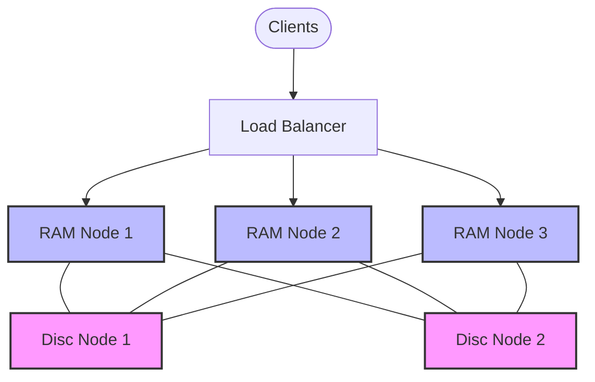

# RabbitMQ RAM Nodes

## Introduction

When building clustered RabbitMQ environments, you'll encounter two types of nodes: **disc nodes** and **RAM nodes**. While disc nodes are the default and store all metadata to disk, RAM nodes keep their metadata exclusively in memory. This distinction might seem subtle, but it can significantly impact your RabbitMQ cluster's performance and reliability characteristics.

In this guide, we'll explore RAM nodes in depth, understand when to use them, and learn how to configure them properly as part of your RabbitMQ clustering strategy.

## What Are RAM Nodes?

RAM nodes are specialized RabbitMQ nodes that store their metadata exclusively in memory rather than persisting it to disk. This metadata includes:

- Queue definitions
- Exchange definitions
- Binding information
- Virtual host configurations
- User and permission information

It's important to note that **message data** is handled the same way in both RAM and disc nodes. The distinction only applies to how metadata is stored.

## RAM Nodes vs. Disc Nodes

To understand RAM nodes better, let's compare them with the default disc nodes:

| Characteristic | Disc Nodes | RAM Nodes |
|----------------|------------|-----------|
| Metadata storage | In memory and on disk | In memory only |
| Restart behavior | Can restart independently | Need metadata from disc nodes |
| Cluster recovery | Can recover cluster after full shutdown | Cannot recover cluster alone |
| Performance | Slightly slower operations | Faster operations |
| Durability | Higher | Lower |
| Default type | Yes | No |

## When Should You Use RAM Nodes?

RAM nodes offer performance advantages in specific scenarios:

1. **High-throughput environments**: When you need maximum throughput for routing operations
2. **Large metadata configurations**: When you have thousands of queues, exchanges, and bindings
3. **Scaling read operations**: When you want to scale out the processing capacity of your cluster

However, they come with important limitations you must consider:

- RAM nodes cannot recover the cluster on their own after a full cluster shutdown
- At least one disc node must be present in any cluster with RAM nodes
- RAM nodes still require disc nodes to recover after individual restarts

## Configuring a RAM Node

Let's look at how to configure a RAM node in your RabbitMQ cluster.

### Step 1: Install RabbitMQ on the node

First, ensure RabbitMQ is installed on all machines that will form your cluster. The installation process is the same for both RAM and disc nodes.

### Step 2: Configure the node as a RAM node

You can specify a node as a RAM node when joining a cluster using the `--ram` flag:

```bash
rabbitmqctl stop_app
rabbitmqctl join_cluster --ram rabbit@disc-node-hostname
rabbitmqctl start_app
```

Alternatively, you can convert an existing disc node to a RAM node:

```bash
rabbitmqctl stop_app
rabbitmqctl change_cluster_node_type ram
rabbitmqctl start_app
```

### Step 3: Verify the node type

To verify that your node is configured as a RAM node:

```bash
rabbitmqctl cluster_status
```

The output will show something like:

```
Cluster status of node rabbit@current-node ...
[{nodes,[{disc,['rabbit@disc-node-hostname']},
         {ram,['rabbit@ram-node-hostname']}]},
 {running_nodes,['rabbit@disc-node-hostname','rabbit@ram-node-hostname']}]
...
```

## RAM Node Considerations

When working with RAM nodes, keep these important considerations in mind:

### Cluster Structure Requirements

- Every RabbitMQ cluster **must** have at least one disc node
- A cluster consisting of only RAM nodes cannot recover from a full shutdown
- For high availability, it's recommended to have at least two disc nodes

### Memory Management

RAM nodes consume more memory since all metadata is kept in RAM. Make sure to:

- Properly size your RAM node servers with sufficient memory
- Configure appropriate [memory high watermark](https://www.rabbitmq.com/memory.html) settings
- Monitor memory usage closely

Here's an example of setting a memory high watermark in your `rabbitmq.conf` file:

```
vm_memory_high_watermark.relative = 0.7
```

### Performance Benefits

The following operations tend to be faster on RAM nodes:

- Queue creation and deletion
- Exchange creation and deletion
- Binding operations
- Policy changes

## Practical Examples

Let's explore some practical examples of using RAM nodes in different scenarios.

### Example 1: Mixed Cluster for a High-Volume Trading Platform

A financial trading platform needs to handle millions of messages per minute. The architecture might use:

- 2 disc nodes for durability and cluster recovery
- 3-5 RAM nodes for high-throughput message routing



In this setup, the RAM nodes handle most client connections and message routing, while the disc nodes ensure the cluster can recover if needed.

### Example 2: Monitoring RAM Nodes

Let's write a simple script that checks the status of RAM nodes in your cluster:

```python
#!/usr/bin/env python
import subprocess
import json

def get_cluster_status():
    result = subprocess.run(
        ["rabbitmqctl", "cluster_status", "--formatter", "json"],
        capture_output=True, text=True
    )
    return json.loads(result.stdout)

status = get_cluster_status()
disc_nodes = status["disc_nodes"]
ram_nodes = status["ram_nodes"]

print(f"Cluster consists of {len(disc_nodes)} disc node(s) and {len(ram_nodes)} RAM node(s)")
print("
RAM nodes:")
for node in ram_nodes:
    print(f"- {node}")

# Check if we have at least one disc node
if len(disc_nodes) == 0:
    print("
WARNING: No disc nodes found! Cluster cannot recover from a full shutdown.")
```

## Recommended Practices

When working with RAM nodes in production environments:

1. **Always have multiple disc nodes** for redundancy
2. **Keep critical queues on disc nodes** if you need message persistence
3. **Monitor memory usage** closely on RAM nodes
4. **Document your topology** clearly, marking which nodes are RAM vs. disc
5. **Test recovery scenarios** to ensure your cluster can recover as expected

## Summary

RAM nodes are a powerful feature in RabbitMQ clustering that can significantly boost performance by keeping metadata exclusively in memory. While they offer performance advantages, they must be used alongside disc nodes to ensure cluster recoverability.

Key takeaways:

- RAM nodes store metadata only in memory, improving performance for management operations
- At least one disc node is required in any cluster with RAM nodes
- RAM nodes are ideal for scaling out high-throughput scenarios
- Proper planning of your cluster topology is essential when incorporating RAM nodes

By understanding the trade-offs between RAM and disc nodes, you can design an optimal RabbitMQ cluster that balances performance and durability according to your application's needs.

## Additional Resources

To learn more about RabbitMQ RAM nodes and clustering, consider these resources:

- [RabbitMQ Clustering Guide](https://www.rabbitmq.com/clustering.html)
- [RabbitMQ Reliability Guide](https://www.rabbitmq.com/reliability.html)
- [RabbitMQ Management CLI Tools](https://www.rabbitmq.com/management-cli.html)

## Exercises

1. Set up a local RabbitMQ cluster with one disc node and one RAM node.
2. Write a script that monitors the memory usage of both node types under load.
3. Simulate a full cluster shutdown and document the recovery process.
4. Create a high-availability architecture diagram for a RabbitMQ cluster that includes both RAM and disc nodes.
5. Benchmark the performance difference between RAM and disc nodes when creating and deleting many queues and exchanges.