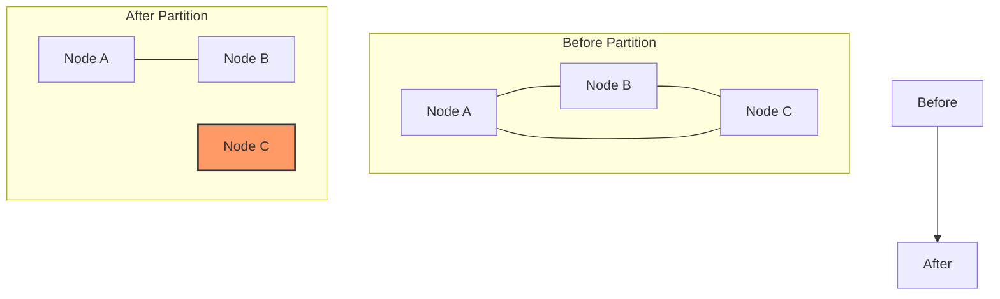

# RabbitMQ Network Partitions

## Introduction

When running RabbitMQ in a cluster configuration, one of the most challenging issues you may encounter is a **network partition** (sometimes called a "split-brain" scenario). This occurs when nodes in a cluster lose connectivity with each other but continue operating independently, potentially leading to data inconsistency and message loss.

In this tutorial, we'll explore what network partitions are, why they're problematic, how to detect them, and strategies for handling them effectively in your RabbitMQ clusters.

## What is a Network Partition?

A network partition happens when nodes in a cluster can't communicate with each other due to network failures, but each set of nodes continues to operate independently. This results in what appears to be two (or more) separate clusters, each believing they are the only active part of the original cluster.

<div className="info-box">
  <strong>Key Point:</strong> Network partitions are different from simple node failures. In a node failure, a single node becomes unavailable. In a network partition, multiple nodes remain available but can't see each other.
</div>

Let's visualize this:



## Why Network Partitions are Dangerous

Network partitions can lead to several serious problems:

1. **Inconsistent state**: Both sides of the partition may accept and process messages independently, leading to different queue states.
2. **Data loss**: When the partition heals, some messages might be discarded depending on the recovery policy.
3. **Duplicate message processing**: The same message might be delivered and processed in both partitions.
4. **Resource overuse**: Each partition believes it needs to handle the full workload, potentially overloading servers.

## Detecting Network Partitions

RabbitMQ has built-in mechanisms to detect network partitions. When a node reconnects to another node after a communication failure, RabbitMQ will automatically determine if a network partition has occurred.

You can check if your cluster is experiencing a partition using the RabbitMQ management UI or the command line:

```bash
rabbitmqctl cluster_status
```

If a partition is detected, you'll see output similar to this:

```
Cluster status of node rabbit@node1
[{nodes,[{disc,[rabbit@node1,rabbit@node2,rabbit@node3]}]},
 {running_nodes,[rabbit@node1,rabbit@node2]},
 {partitions,[{rabbit@node1,[rabbit@node3]},
              {rabbit@node2,[rabbit@node3]}]}]
```

The `partitions` section shows which nodes believe they are partitioned from other nodes.

## Partition Handling Strategies

RabbitMQ offers three main strategies for handling network partitions:

### 1. Ignore Mode

In this mode, RabbitMQ detects the partition but takes no action, leaving it to the operator to resolve manually.

```bash
rabbitmqctl set_policy ha-all ".*" '{"ha-mode":"all"}' --apply-to queues
rabbitmqctl set_cluster_partition_handling ignore
```

- **Pros**: No automatic actions that might disrupt service.
- **Cons**: Requires manual intervention and can lead to split-brain scenarios.
- **Best for**: Development environments or situations where availability is more important than data consistency.

### 2. Pause Minority Mode

When a partition occurs, nodes in the minority partition will automatically pause, refusing to process new messages until the partition is resolved.

```bash
rabbitmqctl set_cluster_partition_handling pause_minority
```

- **Pros**: Automatically prevents split-brain scenarios by pausing the smaller side.
- **Cons**: If exactly half the nodes are on each side, the entire cluster will pause.
- **Best for**: Production environments where data consistency is critical.

### 3. Autoheal Mode

In this mode, when the cluster communication is restored, the cluster will automatically "heal" itself by picking a winning partition (typically the one with the most nodes) and restarting nodes from other partitions.

```bash
rabbitmqctl set_cluster_partition_handling autoheal
```

- **Pros**: Automatic recovery without manual intervention.
- **Cons**: Can lead to data loss as the "losing" partition's changes are discarded.
- **Best for**: Environments where some data loss is acceptable but manual intervention should be minimized.

## Practical Example: Setting Up a Resilient Cluster

Let's walk through setting up a three-node RabbitMQ cluster with partition handling:

### Step 1: Configure each node

On each node, edit the `rabbitmq.conf` file:

```properties
# On node1
cluster_partition_handling = pause_minority
cluster_formation.peer_discovery_backend = rabbit_peer_discovery_classic_config
cluster_formation.classic_config.nodes.1 = rabbit@node1
cluster_formation.classic_config.nodes.2 = rabbit@node2
cluster_formation.classic_config.nodes.3 = rabbit@node3
```

### Step 2: Start the cluster

Start RabbitMQ on each node:

```bash
# On node1
rabbitmq-server -detached

# On node2 and node3, join the cluster
rabbitmqctl stop_app
rabbitmqctl join_cluster rabbit@node1
rabbitmqctl start_app
```

### Step 3: Verify the configuration

```bash
rabbitmqctl cluster_status
```

### Step 4: Set up high availability policies

```bash
rabbitmqctl set_policy ha-all ".*" '{"ha-mode":"all"}' --apply-to queues
```

### Step 5: Simulate and observe a network partition

You can simulate a network partition using firewall rules:

```bash
# On node1, block communication with node3
sudo iptables -A INPUT -p tcp -s node3_ip -j DROP
sudo iptables -A OUTPUT -p tcp -d node3_ip -j DROP
```

After a minute, check the cluster status:

```bash
rabbitmqctl cluster_status
```

You should see node3 in the partitions list. Since we're using `pause_minority`, node3 should pause itself.

### Step 6: Heal the partition

Remove the firewall rules:

```bash
sudo iptables -D INPUT -p tcp -s node3_ip -j DROP
sudo iptables -D OUTPUT -p tcp -d node3_ip -j DROP
```

Check the status again to see the cluster heal:

```bash
rabbitmqctl cluster_status
```

## Monitoring for Network Partitions

To effectively manage a RabbitMQ cluster, set up monitoring for partition events:

1. **RabbitMQ Management Plugin**: The built-in management UI shows partitions in the "Nodes" section.

2. **Logging**: Configure RabbitMQ to log partition events:

   ```properties
   log.file.level = info
   ```

3. **Prometheus and Grafana**: Use the RabbitMQ Prometheus plugin and set up alerts for partition events:

   ```bash
   rabbitmq-plugins enable rabbitmq_prometheus
   ```

4. **Health checks** in your application code:

   ```javascript
   // Node.js example with amqplib
   async function checkClusterHealth() {
     try {
       const conn = await amqp.connect('amqp://localhost');
       const channel = await conn.createChannel();
       
       // Get cluster health information via management API
       const response = await fetch('http://localhost:15672/api/nodes', {
         headers: { 'Authorization': 'Basic ' + Buffer.from('guest:guest').toString('base64') }
       });
       
       const nodes = await response.json();
       const partitions = nodes.filter(node => node.partitions && node.partitions.length > 0);
       
       if (partitions.length > 0) {
         console.error('Network partition detected!', partitions);
         // Alert operations team
       }
       
       await channel.close();
       await conn.close();
     } catch (err) {
       console.error('Failed to check cluster health', err);
     }
   }
   ```

## Best Practices for Avoiding Network Partitions

While handling partitions is important, preventing them is even better:

1. **Use reliable network infrastructure** with redundant connections.
2. **Implement proper timeouts** in client applications to handle connection issues gracefully.
3. **Configure proper TCP keepalive settings** to detect connection failures faster:

   ```properties
   # In rabbitmq.conf
   tcp_listen_options.keepalive = true
   tcp_listen_options.backlog = 128
   tcp_listen_options.nodelay = true
   ```

4. **Use an odd number of nodes** in the cluster to avoid split-brain scenarios with equal partitions.
5. **Consider using federated queues** instead of clusters for geographically distributed setups.

## Recovery Procedures

If you encounter a network partition in production, follow these steps:

1. **Identify the partition** using `rabbitmqctl cluster_status`
2. **Determine the cause** (network issues, firewall, etc.) and fix it
3. **Choose the "winning" side** of the partition (usually the one with most nodes or most recent data)
4. **Restart the "losing" nodes**:

   ```bash
   # On each "losing" node
   rabbitmqctl stop_app
   rabbitmqctl reset
   rabbitmqctl join_cluster rabbit@winning_node
   rabbitmqctl start_app
   ```

5. **Verify the cluster is healthy** with `rabbitmqctl cluster_status`
6. **Check for data consistency** in your application

## Summary

Network partitions are one of the most challenging aspects of running RabbitMQ in a clustered environment. Understanding how they occur, detecting them promptly, and implementing the right handling strategy can help you maintain reliability and data consistency in your messaging systems.

Remember these key points:

- Network partitions occur when nodes can't communicate but continue operating independently
- RabbitMQ offers three partition handling strategies: ignore, pause_minority, and autoheal
- Your choice of strategy depends on whether you prioritize availability or data consistency
- Proper monitoring and network infrastructure can help prevent partitions in the first place

## Additional Resources

To deepen your understanding of RabbitMQ network partitions, explore these resources:

- [RabbitMQ Clustering Guide](https://www.rabbitmq.com/clustering.html)
- [RabbitMQ Partition Handling Documentation](https://www.rabbitmq.com/partitions.html)
- [Designing for Network Failures](https://www.rabbitmq.com/reliability.html)

## Exercises

1. Set up a three-node RabbitMQ cluster in a test environment and experiment with different partition handling strategies.
2. Write a monitoring script that alerts you when a network partition is detected.
3. Implement a client application that can handle RabbitMQ network partitions gracefully.
4. Create a disaster recovery plan for your RabbitMQ cluster that includes procedures for handling network partitions.