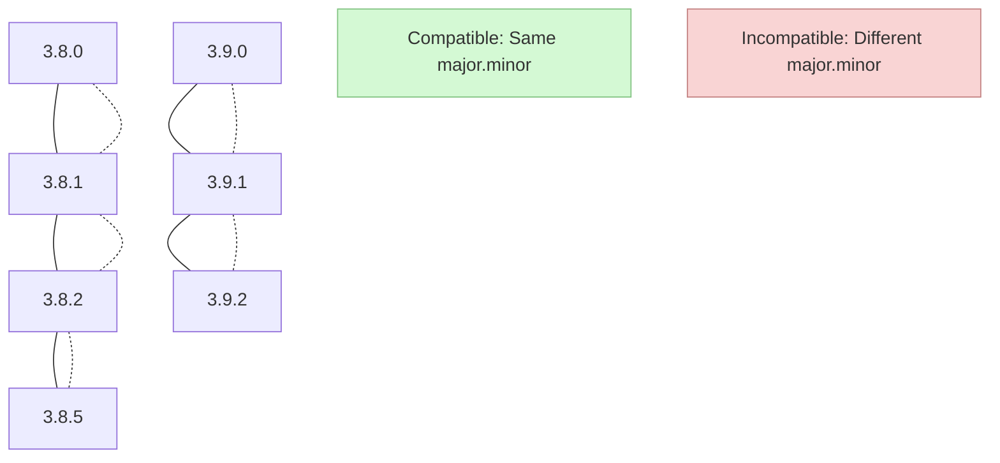
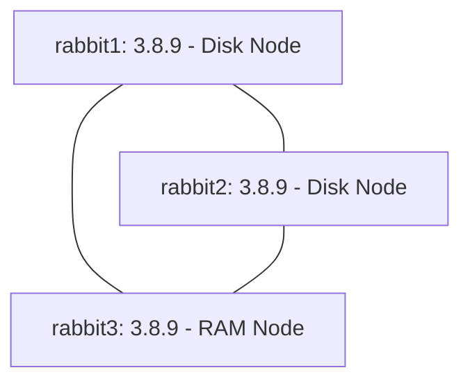

# RabbitMQ Cluster Upgrades

## Introduction

Upgrading a RabbitMQ cluster is a critical operational task that requires careful planning and execution. As messaging systems often sit at the heart of application infrastructure, ensuring a smooth upgrade process with minimal downtime is essential for maintaining reliable service. This guide will walk you through the process of upgrading a RabbitMQ cluster, covering best practices, potential challenges, and step-by-step procedures.

## Understanding RabbitMQ Versioning

Before diving into the upgrade process, it's important to understand RabbitMQ's versioning scheme:

- **Major releases** (e.g., 3.x.x): May introduce significant changes and potentially breaking changes
- **Minor releases** (e.g., x.8.x): Add new features while maintaining backward compatibility
- **Patch releases** (e.g., x.x.5): Bug fixes and security patches

Each release comes with release notes that document changes, new features, and potential breaking changes. Always review these notes before planning an upgrade.

## Pre-Upgrade Considerations

### Version Compatibility

RabbitMQ cluster nodes must run the same major and minor version to work together. Mixing different versions in a cluster is not supported except during the upgrade process.



### Backup Strategy

Always create a backup before upgrading:

```bash
rabbitmqctl export_definitions /path/to/definitions.json
```

### Plugin Compatibility

Ensure that any plugins you use are compatible with the target RabbitMQ version:

```bash
rabbitmq-plugins list
```

## Upgrade Strategies

### Rolling Upgrade

Rolling upgrades allow you to upgrade one node at a time, keeping the cluster operational throughout the process.

#### Step-by-Step Rolling Upgrade Process

1. **Select a node to upgrade first**:
   Choose a node that isn't the only disk node in your cluster. Typically, start with a mirror (non-disk) node.

2. **Stop the RabbitMQ application on the selected node**:

```bash
rabbitmqctl stop_app
```

3. **Upgrade RabbitMQ packages on the node**:

For Debian/Ubuntu:
```bash
sudo apt-get update
sudo apt-get install rabbitmq-server
```

For RPM-based distributions:
```bash
sudo yum update rabbitmq-server
```

4. **Start the RabbitMQ application**:

```bash
rabbitmqctl start_app
```

5. **Verify node rejoins the cluster**:

```bash
rabbitmqctl cluster_status
```

6. **Wait for synchronization**:
   Allow time for queues to synchronize before moving to the next node.

7. **Repeat for remaining nodes**:
   Follow the same process for each node in the cluster.

### Blue-Green Deployment

For critical environments where even minimal disruption is unacceptable, a blue-green deployment strategy provides a safer approach:

1. **Set up a new cluster** with the target version
2. **Configure the new cluster** with identical settings
3. **Redirect clients** to the new cluster
4. **Decommission the old cluster** after successful migration

## Handling Special Cases

### Upgrading Across Multiple Major Versions

When upgrading across multiple major versions (e.g., from 3.7.x to 3.10.x), perform incremental upgrades:

1. Upgrade from 3.7.x to 3.8.x
2. Ensure stability
3. Upgrade from 3.8.x to 3.9.x
4. Ensure stability
5. Upgrade from 3.9.x to 3.10.x

### Handling Quorum Queues

Quorum queues have specific considerations during upgrades:

- Ensure all nodes in the quorum are available
- Monitor quorum health before and after upgrading each node:

```bash
rabbitmq-diagnostics check_if_node_is_quorum_critical
```

## Troubleshooting Common Issues

### Node Fails to Rejoin Cluster

If a node fails to rejoin the cluster after an upgrade:

1. Check logs for errors:

```bash
tail -f /var/log/rabbitmq/rabbit@hostname.log
```

2. Reset the node if necessary:

```bash
rabbitmqctl reset
rabbitmqctl join_cluster rabbit@primary_node_name
```

### Message Loss or Corruption

If you suspect message loss or corruption:

1. Check the message rates and queue depths:

```bash
rabbitmqctl list_queues name messages message_bytes
```

2. Verify consumer counts:

```bash
rabbitmqctl list_queues name consumers
```

## Real-World Example: Upgrading a Production Cluster

Let's walk through a real-world example of upgrading a three-node RabbitMQ cluster from version 3.8.9 to 3.8.16.

### Initial Environment

Three nodes: `rabbit1`, `rabbit2`, and `rabbit3`, with `rabbit1` as the primary disk node.



### Upgrade Process

#### 1. Prepare the Environment

Check cluster status before beginning:

```bash
# On rabbit1
rabbitmqctl cluster_status
```

Output:
```
Cluster status of node rabbit@rabbit1 ...
[{nodes,[{disc,[rabbit@rabbit1,rabbit@rabbit2]},{ram,[rabbit@rabbit3]}]},
 {running_nodes,[rabbit@rabbit3,rabbit@rabbit2,rabbit@rabbit1]}]
```

#### 2. Upgrade the RAM Node First (rabbit3)

```bash
# On rabbit3
rabbitmqctl stop_app
# Upgrade the package
sudo apt-get update
sudo apt-get install rabbitmq-server=3.8.16-1
rabbitmqctl start_app
```

#### 3. Verify rabbit3 Upgraded Successfully

```bash
# On rabbit3
rabbitmqctl status | grep rabbit
```

Output:
```
{rabbit,"RabbitMQ","3.8.16"},
```

#### 4. Upgrade Secondary Disk Node (rabbit2)

```bash
# On rabbit2
rabbitmqctl stop_app
# Upgrade the package
sudo apt-get update
sudo apt-get install rabbitmq-server=3.8.16-1
rabbitmqctl start_app
```

#### 5. Verify rabbit2 Upgraded Successfully

```bash
# On rabbit2
rabbitmqctl status | grep rabbit
```

Output:
```
{rabbit,"RabbitMQ","3.8.16"},
```

#### 6. Finally, Upgrade Primary Disk Node (rabbit1)

```bash
# On rabbit1
rabbitmqctl stop_app
# Upgrade the package
sudo apt-get update
sudo apt-get install rabbitmq-server=3.8.16-1
rabbitmqctl start_app
```

#### 7. Verify Entire Cluster Upgrade

```bash
# On any node
rabbitmqctl cluster_status
```

Output (all nodes should now be on the same version):
```
Cluster status of node rabbit@rabbit1 ...
[{nodes,[{disc,[rabbit@rabbit1,rabbit@rabbit2]},{ram,[rabbit@rabbit3]}]},
 {running_nodes,[rabbit@rabbit3,rabbit@rabbit2,rabbit@rabbit1]},
 {versions,[{rabbit@rabbit1,"3.8.16"},
            {rabbit@rabbit2,"3.8.16"},
            {rabbit@rabbit3,"3.8.16"}]}]
```

#### 8. Test Functionality

Send and receive test messages to ensure the upgraded cluster works as expected:

```bash
# Using the rabbitmqadmin tool
rabbitmqadmin publish exchange=amq.default routing_key=test payload="Test message after upgrade"
rabbitmqadmin get queue=test count=1
```

## Post-Upgrade Actions

After successfully upgrading your RabbitMQ cluster:

1. **Verify Features**: Ensure all features and plugins work as expected
2. **Update Monitoring**: Update monitoring systems to track new metrics if available
3. **Review Performance**: Check for any performance changes
4. **Document**: Document the upgrade process and outcomes

## Best Practices for Future Upgrades

1. **Maintain Environment Parity**: Keep development and staging environments in sync with production
2. **Regular Testing**: Regularly test upgrades in non-production environments
3. **Automation**: Script the upgrade process to reduce manual errors
4. **Monitoring**: Implement comprehensive monitoring to detect issues early

Here's a simple upgrade testing script you might use:

```bash
#!/bin/bash
# RabbitMQ upgrade test script

# Record starting version
echo "Starting version:"
rabbitmqctl status | grep rabbit

# Stop RabbitMQ app
rabbitmqctl stop_app

# Upgrade packages (adjust for your OS)
sudo apt-get update
sudo apt-get install -y rabbitmq-server

# Start RabbitMQ app
rabbitmqctl start_app

# Verify upgraded version
echo "Upgraded version:"
rabbitmqctl status | grep rabbit

# Test message publishing and consumption
echo "Testing message flow..."
rabbitmqadmin publish exchange=amq.default routing_key=test payload="Test message after upgrade"
rabbitmqadmin get queue=test count=1
```

## Summary

Upgrading a RabbitMQ cluster requires careful planning and execution but is essential for maintaining a secure and feature-rich messaging system. By following the rolling upgrade strategy, you can minimize downtime and ensure a smooth transition between versions.

Key takeaways from this guide:
- Always back up your cluster configuration before upgrading
- Upgrade one node at a time in a rolling fashion
- Start with RAM nodes, then move to disk nodes
- Verify each node after upgrading before moving to the next
- Test functionality after completing the upgrade

## Additional Resources

- [Official RabbitMQ Upgrade Documentation](https://www.rabbitmq.com/upgrade.html)
- [RabbitMQ Release Notes](https://www.rabbitmq.com/changelog.html)
- [RabbitMQ Clustering Guide](https://www.rabbitmq.com/clustering.html)

## Practice Exercises

1. Set up a three-node RabbitMQ cluster in a test environment and practice performing a rolling upgrade.
2. Write a shell script to automate the upgrade process for your specific environment.
3. Create a disaster recovery plan that outlines steps to roll back an upgrade if issues are encountered.
4. Implement monitoring that can detect version mismatches in a cluster.