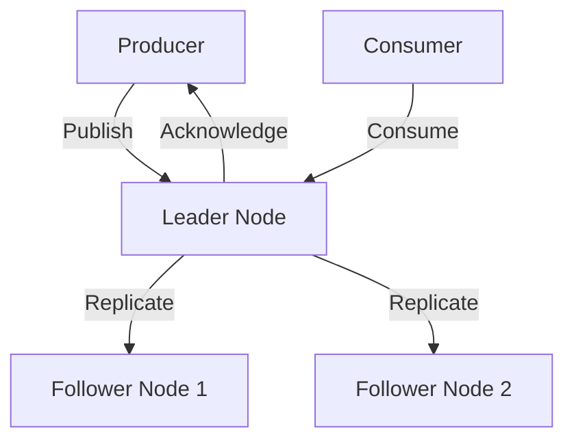

# RabbitMQ Quorum Queues

## Introduction

When building robust messaging systems, ensuring your messages aren't lost during node failures is critical. RabbitMQ Quorum Queues provide a modern solution for high availability in distributed messaging systems, designed to replace the older mirrored queue technology.

In this guide, we'll explore what Quorum Queues are, how they work, and how to implement them in your applications. By the end, you'll understand why they're a crucial component for building reliable message-based systems.

## What Are Quorum Queues?

Quorum Queues are a queue type in RabbitMQ designed specifically for high availability. Unlike standard queues that exist on a single node, Quorum Queues are replicated across multiple nodes in a RabbitMQ cluster.

The term "quorum" refers to the consensus algorithm used (Raft) which requires a majority (quorum) of nodes to agree on the state of the queue. This ensures consistency and fault tolerance even when some nodes in the cluster fail.

### Key Characteristics

- **Replicated**: Data is copied across multiple nodes in the cluster
- **Consensus-based**: Uses the Raft algorithm to maintain consistency
- **Durable**: Designed for data safety; messages persist across restarts
- **Eventually consistent**: All nodes eventually reach the same state
- **Majority-based decision making**: Operations succeed when a majority of nodes agree

## How Quorum Queues Work

Let's visualize how Quorum Queues maintain data consistency across a distributed system:



### The Raft Consensus Algorithm

Quorum Queues implement the Raft consensus algorithm, which works as follows:

1. **Leader Election**: One node is elected as the leader
2. **Log Replication**: The leader replicates all operations to followers
3. **Safety**: A majority of nodes must confirm each operation
4. **Leader Failure**: If the leader fails, a new one is automatically elected

This approach ensures that as long as a majority of nodes are functional, the queue remains available and consistent.

## Creating and Using Quorum Queues

### Declaring a Quorum Queue

You can create a Quorum Queue through the RabbitMQ management UI, using the `rabbitmqctl` command-line tool, or programmatically through client libraries.

Here's how to declare a Quorum Queue using the Java client:

```java
// Import necessary classes
import com.rabbitmq.client.Channel;
import com.rabbitmq.client.Connection;
import com.rabbitmq.client.ConnectionFactory;

import java.util.HashMap;
import java.util.Map;

public class QuorumQueueExample {
    public static void main(String[] args) throws Exception {
        // Create a connection factory
        ConnectionFactory factory = new ConnectionFactory();
        factory.setHost("localhost");
        
        // Create a connection and channel
        try (Connection connection = factory.newConnection();
             Channel channel = connection.createChannel()) {
            
            // Set Quorum Queue arguments
            Map<String, Object> arguments = new HashMap<>();
            arguments.put("x-queue-type", "quorum");
            
            // Declare the queue
            String queueName = "my-quorum-queue";
            channel.queueDeclare(queueName, true, false, false, arguments);
            
            System.out.println("Quorum queue '" + queueName + "' has been declared");
        }
    }
}
```

**Output:**
```
Quorum queue 'my-quorum-queue' has been declared
```

The critical part is setting the `x-queue-type` argument to `"quorum"` when declaring the queue.

### Publishing Messages

Publishing to a Quorum Queue is identical to publishing to a standard queue:

```java
// Continuing from previous example...
String message = "Hello Quorum Queue!";
channel.basicPublish("", queueName, null, message.getBytes());
System.out.println("Sent message: " + message);
```

**Output:**
```
Sent message: Hello Quorum Queue!
```

### Consuming Messages

Consuming from a Quorum Queue also follows the same pattern as standard queues:

```java
// Continuing from previous example...
channel.basicConsume(queueName, true, (consumerTag, delivery) -> {
    String receivedMessage = new String(delivery.getBody(), "UTF-8");
    System.out.println("Received message: " + receivedMessage);
}, consumerTag -> {});
```

**Output:**
```
Received message: Hello Quorum Queue!
```

## Configuring Quorum Queues

### Setting Replication Factor

By default, Quorum Queues replicate across all nodes in the cluster. You can specify a custom replication factor:

```java
Map<String, Object> arguments = new HashMap<>();
arguments.put("x-queue-type", "quorum");
arguments.put("x-quorum-initial-group-size", 3); // Replicate across 3 nodes
```

### Memory and Disk Limits

You can configure memory and disk limits to prevent Quorum Queues from consuming excessive resources:

```java
// Maximum number of messages in memory
arguments.put("x-max-in-memory-length", 10000);
// Or maximum bytes in memory
arguments.put("x-max-in-memory-bytes", 10485760); // 10MB
```

## Real-World Example: Payment Processing System

Let's look at a practical example of using Quorum Queues in a payment processing system:

```java
public class PaymentProcessor {
    private final String PAYMENT_QUEUE = "payment-processing";
    private Channel channel;
    
    public PaymentProcessor() throws Exception {
        // Setup connection
        ConnectionFactory factory = new ConnectionFactory();
        factory.setHost("localhost");
        Connection connection = factory.newConnection();
        channel = connection.createChannel();
        
        // Setup Quorum Queue
        Map<String, Object> arguments = new HashMap<>();
        arguments.put("x-queue-type", "quorum");
        arguments.put("x-quorum-initial-group-size", 3);
        arguments.put("x-max-in-memory-length", 100000);
        
        channel.queueDeclare(PAYMENT_QUEUE, true, false, false, arguments);
    }
    
    public void submitPayment(Payment payment) throws Exception {
        // Convert payment to JSON
        String paymentJson = convertToJson(payment);
        
        // Publish with persistent delivery mode
        channel.basicPublish("", PAYMENT_QUEUE,
                new AMQP.BasicProperties.Builder().deliveryMode(2).build(),
                paymentJson.getBytes());
        
        System.out.println("Payment submitted: " + payment.getId());
    }
    
    public void processPayments() throws Exception {
        // Set prefetch count
        channel.basicQos(10);
        
        // Consume payments
        channel.basicConsume(PAYMENT_QUEUE, false, (consumerTag, delivery) -> {
            try {
                String paymentJson = new String(delivery.getBody(), "UTF-8");
                Payment payment = parseFromJson(paymentJson);
                
                // Process payment (connect to payment gateway, etc.)
                boolean success = processPaymentWithGateway(payment);
                
                if (success) {
                    // Acknowledge successful processing
                    channel.basicAck(delivery.getEnvelope().getDeliveryTag(), false);
                    System.out.println("Payment processed: " + payment.getId());
                } else {
                    // Reject and requeue if processing failed
                    channel.basicNack(delivery.getEnvelope().getDeliveryTag(), false, true);
                    System.out.println("Payment processing failed, requeuing: " + payment.getId());
                }
            } catch (Exception e) {
                // Log error and requeue message
                System.err.println("Error processing payment: " + e.getMessage());
                try {
                    channel.basicNack(delivery.getEnvelope().getDeliveryTag(), false, true);
                } catch (IOException ioException) {
                    ioException.printStackTrace();
                }
            }
        }, consumerTag -> {});
    }
    
    // Helper methods (implementations omitted)
    private String convertToJson(Payment payment) { /* ... */ return ""; }
    private Payment parseFromJson(String json) { /* ... */ return null; }
    private boolean processPaymentWithGateway(Payment payment) { /* ... */ return true; }
    
    public static class Payment {
        private String id;
        private double amount;
        // other fields, getters, setters
        
        public String getId() { return id; }
    }
}
```

This example demonstrates:

1. Creating a dedicated payment processing Quorum Queue
2. Setting appropriate durability and memory options
3. Publishing payments with persistence
4. Consuming and acknowledging payments only after successful processing
5. Handling failures gracefully with requeuing

## Best Practices for Quorum Queues

### When to Use Quorum Queues

- **Use Quorum Queues when**:
  - Message durability is critical
  - You need high availability across node failures
  - You can tolerate slightly higher latency for safety

- **Consider alternatives when**:
  - You need maximum throughput for non-critical messages
  - Memory usage is a primary concern
  - Your messages are very short-lived

### Performance Considerations

1. **Node Count**: Use an odd number of nodes (3, 5, 7) to facilitate quorum decisions
2. **Message Size**: Large messages have higher replication costs
3. **Acknowledgments**: Always use publisher confirms for critical messages
4. **Prefetch Settings**: Use lower prefetch values than with classic queues

## Comparing Quorum Queues and Mirrored Queues

Quorum Queues were designed to address limitations in RabbitMQ's older mirrored queue technology:

| Feature | Quorum Queues | Mirrored Queues |
|---------|---------------|-----------------|
| Consistency Model | Consensus-based (Raft) | Primary-backup replication |
| Data Safety | Higher (prevents split-brain) | Lower (can lose messages during network partitions) |
| Performance | Predictable performance | Unpredictable during failover |
| Resource Usage | Higher memory usage | Lower memory usage |
| Replication | All operations are replicated | Only publishes are replicated |
| Queue Length Limits | Supports message TTL and length limits | More options for limiting |
| Publisher Confirms | More reliable | Less reliable during node failures |

## Monitoring Quorum Queues

RabbitMQ provides several metrics for monitoring Quorum Queue health:

1. **Raft State**: Leader/follower status for each queue
2. **Replication Lag**: How far behind followers are
3. **Memory Usage**: In-memory message counts
4. **Disk Usage**: WAL (Write-Ahead Log) size

You can access these metrics through the management UI, HTTP API, or monitoring tools like Prometheus.

## Troubleshooting Common Issues

### Queue Leader Election Failures

If a quorum cannot be established:

1. Check network connectivity between nodes
2. Ensure a majority of nodes are online
3. Verify cluster formation is correct

### High Memory or Disk Usage

If your Quorum Queues consume excessive resources:

1. Configure appropriate `x-max-in-memory-length` values
2. Implement a "dead letter exchange" for problematic messages
3. Increase consumer count to process messages faster

### Split-Brain Scenarios

While Quorum Queues prevent split-brain issues, you might observe:

1. Temporary unavailability during network partitions
2. Reduced throughput during leader elections
3. Consumer reconnection events

## Summary

RabbitMQ Quorum Queues provide a robust solution for ensuring message durability and high availability in distributed systems. By leveraging the Raft consensus algorithm, they offer stronger consistency guarantees than traditional mirrored queues, making them ideal for mission-critical applications where data loss is unacceptable.

Key takeaways:

1. Quorum Queues replicate messages across multiple nodes in a RabbitMQ cluster
2. They use the Raft consensus algorithm to ensure consistency
3. A majority of nodes must be available for the queue to operate
4. They're easy to create by setting the `x-queue-type` argument to `"quorum"`
5. They're perfect for scenarios where message durability is critical

## Further Learning

To deepen your understanding of RabbitMQ Quorum Queues, try these exercises:

1. Set up a 3-node RabbitMQ cluster and create a Quorum Queue
2. Experiment with different replication factors and observe behavior
3. Implement a simple producer/consumer application using Quorum Queues
4. Simulate node failures and observe how the system recovers
5. Monitor queue metrics during high-load scenarios

### Additional Resources

- [RabbitMQ Official Documentation on Quorum Queues](https://www.rabbitmq.com/quorum-queues.html)
- [Raft Consensus Algorithm Explained](https://raft.github.io/)
- [RabbitMQ Clustering Guide](https://www.rabbitmq.com/clustering.html)