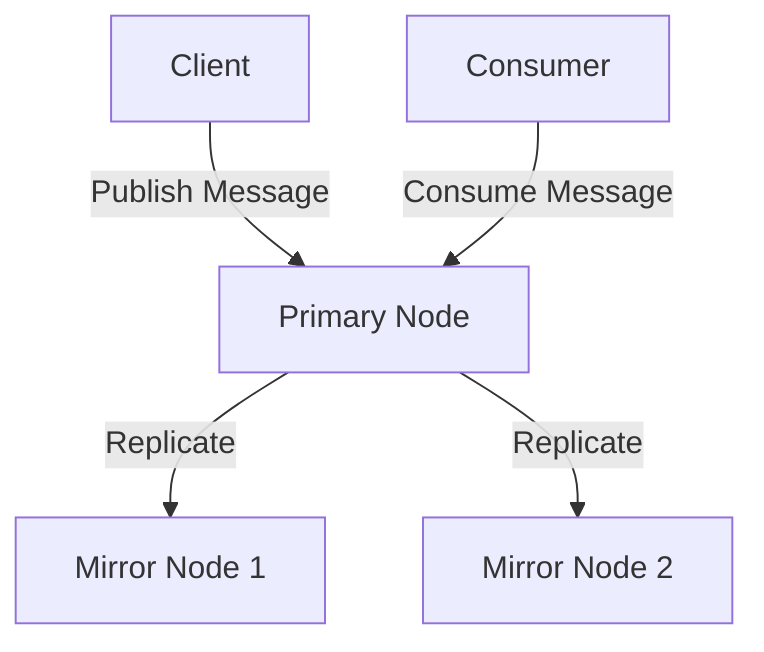
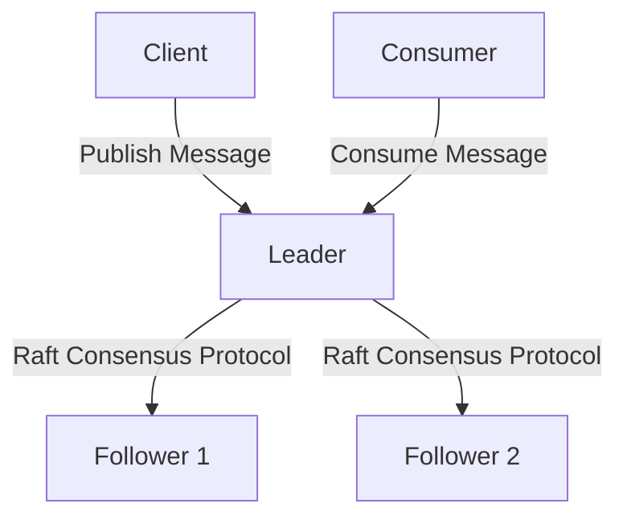

# RabbitMQ Synchronization

## Introduction

When building robust messaging systems, ensuring your messages remain available even when individual servers fail is crucial. RabbitMQ offers high availability through clustering, but simply setting up a cluster isn't enough - you need to understand how data synchronizes between nodes to prevent message loss.

In this guide, we'll explore RabbitMQ synchronization - the process by which queue contents are replicated across multiple nodes in a RabbitMQ cluster. You'll learn how synchronization works, different synchronization strategies, and best practices for configuring synchronization in production environments.

## Understanding Queue Mirroring and Synchronization

Before diving into synchronization, let's clarify how RabbitMQ handles high availability through **queue mirroring**.

### Queue Mirroring Basics

In a RabbitMQ cluster, queues can be mirrored across multiple nodes:

- The **primary** (or master) node hosts the "main" queue
- **Mirror** (or slave) nodes host replicas of the queue
- Only the primary processes commands for the queue
- Mirrors replicate actions performed on the primary



### What is Synchronization?

**Synchronization** is the process of copying existing messages from a primary queue to its mirrors. This ensures that if the primary node fails, a mirror can take over without message loss.

There are two key moments when synchronization happens:

1. **When a new mirror is added to a queue**
2. **When an out-of-sync mirror needs to catch up**

## Synchronization Types

RabbitMQ offers two main types of synchronization:

### 1. Automatic Synchronization

With automatic synchronization, RabbitMQ will attempt to synchronize mirrors whenever:
- A new mirror is added to a mirrored queue
- A previously disconnected mirror rejoins the cluster

While convenient, automatic synchronization can cause performance problems with large queues.

### 2. Manual Synchronization

Manual synchronization gives you control over when synchronization occurs, which is often preferred in production environments.

To manually synchronize a queue using the RabbitMQ management UI:
1. Navigate to the "Queues" tab
2. Find your mirrored queue
3. Click on the queue name to view details
4. Under "Replication" section, click "Synchronise"

Or using the RabbitMQ command line:

```bash
rabbitmqctl sync_queue queue_name
```

## Synchronization Policies and Configuration

### Setting Up Synchronization Policies

Synchronization is configured through RabbitMQ policies. Here's how to set up a policy using the command line:

```bash
rabbitmqctl set_policy ha-sync \
    "^ha\." \
    '{"ha-mode":"exactly", "ha-params":2, "ha-sync-mode":"automatic"}' \
    --priority 1 \
    --apply-to queues
```

Let's break down this policy:

- `ha-sync` is the policy name
- `"^ha\\."` is a regular expression that matches all queues starting with "ha."
- `ha-mode` set to "exactly" with `ha-params` of 2 means the queue will be mirrored on exactly 2 nodes
- `ha-sync-mode` set to "automatic" enables automatic synchronization

### Using the Management UI

You can also set policies through the management UI:

1. Go to "Admin" > "Policies"
2. Click "Add / update a policy"
3. Fill in the form with your policy details
4. Set the "ha-sync-mode" to either "automatic" or "manual"

## Synchronization in Practice

Let's walk through a practical example of setting up a RabbitMQ cluster with proper synchronization.

### Example: Setting Up a Three-Node Cluster with Synchronization

First, let's create a three-node RabbitMQ cluster. Assuming you have three servers already running RabbitMQ:

```bash
# On node2
rabbitmqctl stop_app
rabbitmqctl join_cluster rabbit@node1
rabbitmqctl start_app

# On node3
rabbitmqctl stop_app
rabbitmqctl join_cluster rabbit@node1
rabbitmqctl start_app
```

Now, let's create a policy for high availability with manual synchronization:

```bash
rabbitmqctl set_policy ha-all \
    ".*" \
    '{"ha-mode":"all", "ha-sync-mode":"manual"}' \
    --priority 1 \
    --apply-to queues
```

This policy:
- Applies to all queues (`.*`)
- Mirrors queues across all nodes (`ha-mode: all`)
- Uses manual synchronization (`ha-sync-mode: manual`)

### Testing Synchronization

Let's test our synchronization by:

1. Publishing some messages to a queue
2. Manually synchronizing the mirrors
3. Simulating a node failure

First, publish some test messages (using Node.js and amqplib):

```javascript
const amqp = require('amqplib');

async function publishMessages() {
  const connection = await amqp.connect('amqp://localhost');
  const channel = await connection.createChannel();
  
  const queue = 'ha-test-queue';
  await channel.assertQueue(queue, { durable: true });
  
  // Publish 10,000 messages
  for (let i = 0; i < 10000; i++) {
    channel.sendToQueue(queue, Buffer.from(`Message ${i}`));
    if (i % 1000 === 0) {
      console.log(`Published ${i} messages`);
    }
  }
  
  console.log('All messages published');
  await channel.close();
  await connection.close();
}

publishMessages();
```

Now, manually synchronize the queue:

```bash
rabbitmqctl sync_queue ha-test-queue
```

You can monitor the synchronization progress in the management UI or using:

```bash
rabbitmqctl list_queues name slave_pids synchronised_slave_pids
```

Once synchronization is complete, let's simulate a failure by stopping the primary node:

```bash
# If node1 is primary
rabbitmqctl -n rabbit@node1 stop_app
```

If synchronization was successful, a mirror will become the new primary and messages will remain available.

## Monitoring Synchronization

Monitoring synchronization is crucial for maintaining a healthy RabbitMQ cluster.

### Command Line Monitoring

Check synchronization status using:

```bash
rabbitmqctl list_queues name slave_pids synchronised_slave_pids
```

The output will show which mirrors are synchronized and which are not.

### Management UI Monitoring

In the management UI:
1. Go to the "Queues" tab
2. Look for the "Features" and "Replication" columns
3. Check if mirrors are shown as "synchronized" or "not synchronized"

## Common Synchronization Issues and Solutions

### Issue: Synchronization Takes Too Long

**Solution**:
- Use manual synchronization during off-peak hours
- Break large queues into smaller ones
- Consider using lazy queues for large message volumes

### Issue: High CPU/Memory Usage During Synchronization

**Solution**:
- Implement rate limiting for publishers during synchronization
- Synchronize one queue at a time
- Increase node resources temporarily during synchronization

### Issue: Synchronization Fails Repeatedly

**Solution**:
- Check network connectivity between nodes
- Ensure sufficient disk space on all nodes
- Check RabbitMQ logs for specific error messages
- Consider deleting and recreating the queue if possible

## Best Practices for RabbitMQ Synchronization

1. **Use manual synchronization for large queues**
   Automatic synchronization can overwhelm your system when queues are large.

2. **Synchronize during low-traffic periods**
   Synchronization consumes network bandwidth and CPU resources.

3. **Monitor synchronization status regularly**
   Unsynchronized mirrors can lead to message loss if the primary fails.

4. **Use `ha-promote-on-shutdown: when-synced`**
   This prevents unsynced mirrors from being promoted when a node shuts down cleanly.

5. **Use `ha-promote-on-failure: when-synced`**
   Similar to above, but for unexpected node failures.

6. **Consider message TTL for queues that don't need perfect synchronization**
   Setting a Time-To-Live for messages can help manage queue size.

7. **Use quorum queues for newer RabbitMQ versions**
   For RabbitMQ 3.8+, quorum queues provide better reliability and are the recommended approach.

## Quorum Queues vs. Classic Mirrored Queues

In RabbitMQ 3.8+, quorum queues were introduced as an alternative to classic mirrored queues. They use a different replication mechanism:



Quorum queues:
- Use the Raft consensus protocol
- Don't need explicit synchronization
- Provide better failure handling
- Are recommended for most high-availability use cases

Example of declaring a quorum queue in Node.js:

```javascript
channel.assertQueue('important-queue', {
  arguments: {
    'x-queue-type': 'quorum'
  }
});
```

## Summary

RabbitMQ synchronization is a critical aspect of maintaining high availability in messaging systems. In this guide, we've covered:

- How queue mirroring and synchronization work in RabbitMQ
- Automatic vs. manual synchronization approaches
- Configuring synchronization through policies
- Practical examples of setting up and testing synchronization
- Common issues and best practices
- Modern alternatives like quorum queues

With a proper understanding of synchronization, you can build robust, highly available messaging systems that maintain data integrity even when nodes fail.

## Additional Resources

- [RabbitMQ Official Documentation on Mirroring](https://www.rabbitmq.com/ha.html)
- [RabbitMQ Quorum Queues Documentation](https://www.rabbitmq.com/quorum-queues.html)
- [RabbitMQ Management HTTP API](https://www.rabbitmq.com/management.html)

## Exercises

1. Set up a two-node RabbitMQ cluster and experiment with both automatic and manual synchronization.
2. Write a script that publishes messages to a mirrored queue, then simulate a node failure to observe failover behavior.
3. Compare the performance of synchronized mirrored queues vs. quorum queues under high load.
4. Create a monitoring script that alerts you when queues become unsynchronized.
5. Implement a policy that uses different synchronization settings for different types of queues based on their names or other attributes.