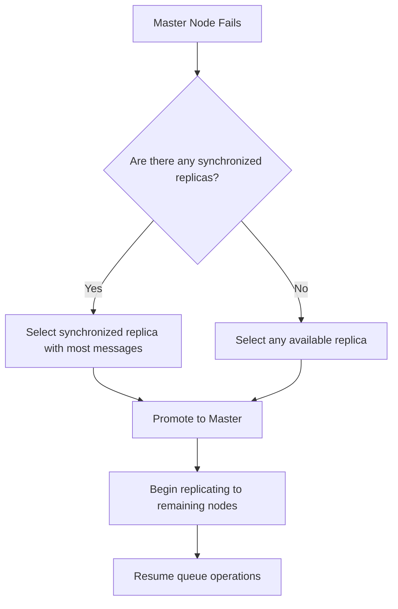
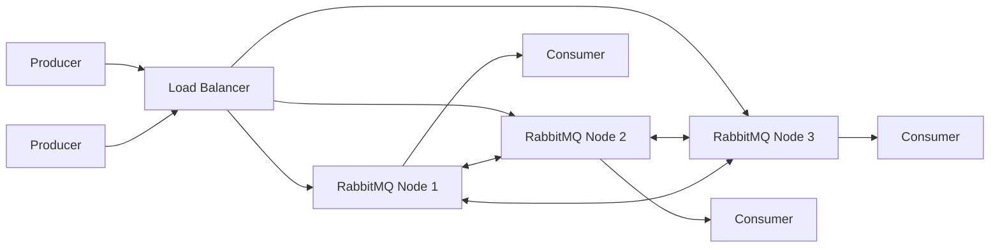

# RabbitMQ Master Election

## Introduction

In distributed systems like RabbitMQ, maintaining high availability is crucial for production environments. One of the core concepts that enables this high availability is the process of **master election**. When you run RabbitMQ in a clustered environment, the system needs to determine which node should be responsible for primary operations related to specific queues and resources. This selection process is known as "master election."

In this guide, we'll explore how RabbitMQ handles master election, why it's important, and how you can configure and optimize it for your applications.

## Understanding Master-Replica Architecture

Before diving into master election, let's understand RabbitMQ's approach to distributing responsibilities.

### What is a Master Node?

In RabbitMQ clusters, a **master node** (sometimes called a "primary" or "leader" node) is responsible for handling all operations for a specific queue. This includes:

- Processing message publications (producers send messages to the master)
- Managing message delivery to consumers
- Handling queue operations like declaration, binding, and deletion
- Maintaining the queue's message ordering

### What are Replica Nodes?

**Replica nodes** (also called "mirrors" or "followers") maintain copies of the queue's state. They:
- Synchronize with the master to maintain an up-to-date copy of messages
- Can take over as the new master if the current master fails
- Help distribute the read load in certain configurations

## Master Election Process

When a queue is created with high availability enabled, or when the current master node fails, RabbitMQ must elect a new master. Let's examine this process step by step.

### Initial Master Selection

When you first create a high-availability queue, RabbitMQ selects the initial master node based on the following criteria:

1. The node where the queue declaration command was received
2. If policy dictates otherwise, it may select a different node based on the policy

Here's a simple code example of creating a queue with high availability enabled:

```javascript
// JavaScript example using amqplib
const amqp = require('amqplib');

async function setupHAQueue() {
  const connection = await amqp.connect('amqp://localhost');
  const channel = await connection.createChannel();
  
  // Create a queue with HA policy applied
  await channel.assertQueue('important-queue', {
    durable: true,
    arguments: {
      'x-ha-policy': 'all' // Replicate to all nodes
    }
  });
  
  console.log("HA queue created");
}

setupHAQueue();
```

### Master Election During Failover

When a master node fails, RabbitMQ automatically triggers an election process to select a new master from among the replica nodes. The election follows these principles:

1. **Synchronization Status**: RabbitMQ prefers fully synchronized replicas that have all the messages the master had
2. **Queue Length**: If multiple candidates are available, the one with the most messages may be preferred
3. **Node Health**: Only available, functioning nodes are considered

Let's visualize this process:



## Configuring Master Election

RabbitMQ offers several configuration options to control how master election works. These can be set through policies, which are the recommended approach.

### Using Policies to Define Election Strategy

The `ha-mode` and `ha-params` parameters define which nodes should participate in the HA group:

```bash
# Create a policy that mirrors queues across all nodes
rabbitmqctl set_policy ha-all "^ha\." '{"ha-mode":"all"}' --apply-to queues
```

### Controlling Master Election through Queue Leader Locator

RabbitMQ introduced the concept of a "queue leader locator" to give you more control over master election. You can set this in your policy using the `queue-master-locator` parameter:

```bash
# Set "min-masters" as the queue leader locator strategy
rabbitmqctl set_policy --priority 10 \
    queue-master-locator-policy "^" \
    '{"queue-master-locator":"min-masters"}'
```

Available strategies include:

- `min-masters`: Choose the node hosting the fewest masters
- `client-local`: Choose the node where the declaration happened (default)
- `random`: Choose a random node

Let's see a practical example with Python:

```python
# Python example using pika
import pika

connection = pika.BlockingConnection(
    pika.ConnectionParameters('localhost'))
channel = connection.channel()

# Declare a queue (policy will apply based on pattern matching)
channel.queue_declare(
    queue='ha.important_tasks',
    durable=True
)

# Publish a message
channel.basic_publish(
    exchange='',
    routing_key='ha.important_tasks',
    body='Important task data',
    properties=pika.BasicProperties(
        delivery_mode=2,  # make message persistent
    ))

print("Message sent to HA queue")
connection.close()
```

## Monitoring Master Election

To effectively manage a RabbitMQ cluster, you need to monitor master elections and understand the current state of your system.

### Command Line Tools

RabbitMQ provides CLI tools to check the status of queues and their masters:

```bash
# List queues with their masters and replicas
rabbitmqctl list_queues name slave_pids synchronised_slave_pids

# Output example:
# Listing queues for vhost / ...
# name             slave_pids              synchronised_slave_pids
# ha.important     [<rabbit@node2.1>, <rabbit@node3.1>]   [<rabbit@node2.1>]
```

### Management UI

The RabbitMQ Management UI provides a visual representation of queue masters and replicas. You can access it at `http://[server-name]:15672/` and navigate to the "Queues" tab.

### Programmatic Monitoring

You can also monitor master election events using the RabbitMQ event exchange:

```javascript
// JavaScript example to monitor queue master events
const amqp = require('amqplib');

async function monitorMasterEvents() {
  const connection = await amqp.connect('amqp://localhost');
  const channel = await connection.createChannel();
  
  await channel.assertExchange('amq.rabbitmq.event', 'topic', {durable: true});
  const {queue} = await channel.assertQueue('', {exclusive: true});
  
  // Bind to queue master events
  await channel.bindQueue(queue, 'amq.rabbitmq.event', 'queue.#');
  
  console.log("Monitoring queue master events. Waiting...");
  
  channel.consume(queue, (msg) => {
    console.log("Event:", 
      msg.fields.routingKey, 
      JSON.parse(msg.content.toString())
    );
  }, {noAck: true});
}

monitorMasterEvents();
```

## Best Practices for Master Election

To ensure smooth operations in your RabbitMQ cluster, follow these best practices:

### 1. Ensure Proper Synchronization

Always ensure that replicas are synchronized with the master. You can check synchronization status with:

```bash
rabbitmqctl list_queues name slave_pids synchronised_slave_pids
```

### 2. Balance Queue Masters Across Nodes

Distribute queue masters across different nodes to prevent any single node from becoming a bottleneck:

```bash
# Use min-masters strategy
rabbitmqctl set_policy queue-master-locator ".*" \
  '{"queue-master-locator":"min-masters"}' --apply-to queues
```

### 3. Consider Network Partitions

Network partitions can lead to "split-brain" scenarios. Configure your cluster with the appropriate partition handling strategy:

```bash
# In rabbitmq.conf
cluster_partition_handling = autoheal
```

### 4. Plan for Graceful Maintenance

Before taking a node down for maintenance, consider transferring queue masters to other nodes:

```bash
# Transfer queue masters from node rabbit@node1
rabbitmqctl transfer_leadership_from rabbit@node1
```

## Real-World Example: Building a Fault-Tolerant Message Processing System

Let's look at how master election contributes to a fault-tolerant system in practice. Consider a scenario where we're building an order processing system that must never lose messages.

### System Architecture



### Setting Up the Cluster

First, we establish our RabbitMQ cluster:

```bash
# On node1 (the first node we're starting)
rabbitmq-server

# On node2
rabbitmq-server
rabbitmqctl stop_app
rabbitmqctl join_cluster rabbit@node1
rabbitmqctl start_app

# On node3
rabbitmq-server
rabbitmqctl stop_app
rabbitmqctl join_cluster rabbit@node1
rabbitmqctl start_app
```

### Creating HA Policies

Next, we create policies to ensure our important queues are highly available:

```bash
rabbitmqctl set_policy ha-orders "^orders\." \
  '{"ha-mode":"all", "ha-sync-mode":"automatic", "queue-master-locator":"min-masters"}' \
  --apply-to queues
```

### Application Code

Our application code needs to be resilient to node failures:

```javascript
// Node.js example
const amqp = require('amqplib');

async function setupReliableConsumer() {
  // Connect to multiple nodes for redundancy
  const urls = [
    'amqp://node1', 
    'amqp://node2', 
    'amqp://node3'
  ];
  
  let connection;
  let currentUrlIndex = 0;
  
  // Try to connect to each node until successful
  while (!connection && currentUrlIndex < urls.length) {
    try {
      connection = await amqp.connect(urls[currentUrlIndex]);
    } catch (error) {
      console.log(`Failed to connect to ${urls[currentUrlIndex]}`);
      currentUrlIndex++;
    }
  }
  
  if (!connection) {
    throw new Error("Could not connect to any RabbitMQ nodes");
  }
  
  // Set up connection error handling
  connection.on('error', async (err) => {
    console.log("Connection error", err);
    // Attempt reconnection logic here
    await setupReliableConsumer();
  });
  
  const channel = await connection.createChannel();
  
  // Declare our highly available queue
  await channel.assertQueue('orders.incoming', {
    durable: true
  });
  
  // Process messages
  channel.consume('orders.incoming', async (msg) => {
    if (msg) {
      console.log("Processing order:", msg.content.toString());
      
      try {
        // Process the order...
        
        // Acknowledge the message
        channel.ack(msg);
      } catch (error) {
        // Reject and requeue if processing fails
        channel.nack(msg, false, true);
      }
    }
  });
}

setupReliableConsumer();
```

### Testing Failover

To test this system, we can simulate a node failure:

```bash
# Stop the RabbitMQ app on the current master node
rabbitmqctl stop_app -n rabbit@node1
```

When this happens:
1. RabbitMQ will detect the node failure
2. Master election will occur for queues mastered on node1
3. A new master will be chosen from synchronized replicas
4. The system will continue to process messages with minimal interruption

## Summary

RabbitMQ's master election process is a critical component of its high availability strategy. By understanding how it works, you can:

- Build more resilient messaging systems
- Configure your clusters for optimal performance and availability
- Handle node failures gracefully
- Implement proper operational procedures for maintenance

The master election process follows clear rules based on synchronization status, and you can influence it through policies and queue leader locator settings.

## Additional Resources

To deepen your understanding of RabbitMQ master election and high availability:

- [RabbitMQ Clustering Guide](https://www.rabbitmq.com/clustering.html)
- [RabbitMQ Highly Available Queues](https://www.rabbitmq.com/ha.html)
- [RabbitMQ Reliability Guide](https://www.rabbitmq.com/reliability.html)

## Exercises

1. Set up a three-node RabbitMQ cluster on your development environment.
2. Create queues with different high availability policies and observe how masters are elected.
3. Simulate node failures and monitor how the system recovers.
4. Write a client application that can handle RabbitMQ node failures gracefully.
5. Implement a monitoring system that alerts you when master elections occur.