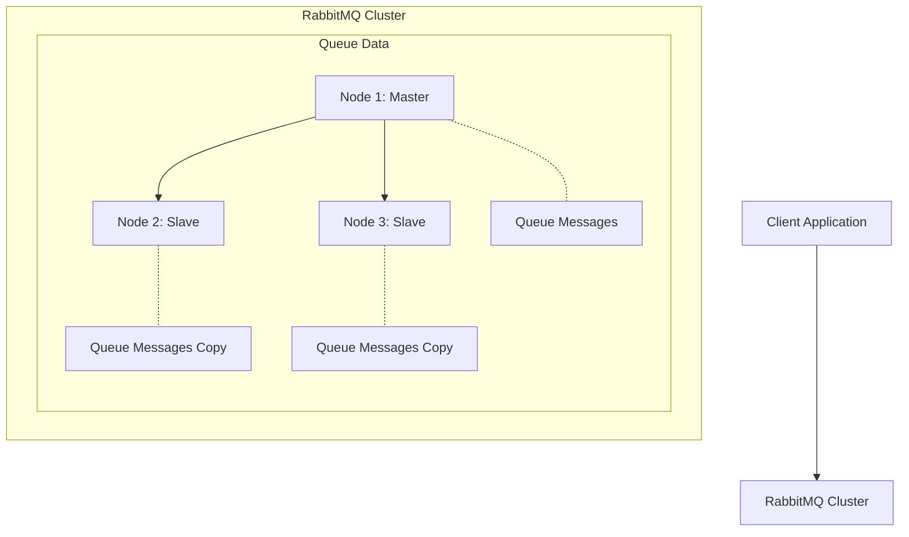

# RabbitMQ Slave Promotion

## Introduction

In a RabbitMQ cluster with high availability configurations, one of the most critical operations is **slave promotion**. This process ensures continuous service availability when a primary node (master) fails by automatically promoting a replica (slave) to take its place. This article explores how RabbitMQ handles this failover mechanism, why it's essential for building resilient messaging systems, and how to configure it properly.

## Understanding Master-Slave Architecture in RabbitMQ

Before diving into slave promotion, let's understand the basic architecture of a highly available RabbitMQ setup.

In RabbitMQ clusters, queues can be **mirrored** across multiple nodes:

- The **master** node processes all operations for a queue
- **Slave** nodes maintain synchronized copies of the queue data
- All queue operations (publishes, consumes) are first processed by the master, then replicated to slaves



## What is Slave Promotion?

**Slave promotion** is the process where a slave node is elevated to master status when the original master node becomes unavailable. This automatic failover ensures that:

1. The queue remains available for operations
2. No messages are lost (if properly configured)
3. Clients can continue publishing and consuming with minimal disruption

## How Slave Promotion Works

When a master node fails (crashes, network partition, etc.), RabbitMQ must select one of the slaves to become the new master. Here's how this process works:

1. **Detection phase**: The cluster detects that the master node is unreachable
2. **Selection phase**: A slave is chosen to be promoted based on synchronization status and promotion strategy
3. **Promotion phase**: The selected slave becomes the new master
4. **Recovery phase**: The cluster resumes normal operations with the new master

### Slave Selection Strategies

RabbitMQ offers several strategies for selecting which slave to promote:

- **`min-masters`**: Promotes the slave on the node hosting the fewest masters (default)
- **`client-local`**: Prefers the slave on the node the client is connected to
- **`random`**: Randomly selects from available slaves

## Configuring Slave Promotion

To configure slave promotion, you'll need to set up mirrored queues with appropriate policies. Here's how to do it:

### Step 1: Create a Policy for Queue Mirroring

You can use the RabbitMQ management UI or command line to set up a policy:

```bash
rabbitmqctl set_policy ha-all "^" '{"ha-mode":"all", "ha-sync-mode":"automatic", "ha-promote-on-failure":"always"}'
```

Let's break down this command:

- `ha-all`: The policy name
- `^`: Pattern matching all queues (you can use specific patterns to target certain queues)
- `ha-mode`: Mirroring mode (can be "all", "exactly", or "nodes")
- `ha-sync-mode`: Controls whether queues automatically synchronize
- `ha-promote-on-failure`: Controls slave promotion behavior

### Step 2: Configure Promotion Settings

The `ha-promote-on-failure` parameter has three possible values:

- `always`: Always promote a slave when the master fails (default)
- `when-synced`: Only promote if the slave is fully synchronized
- `never`: Do not automatically promote; manual intervention required

For production systems, `when-synced` is often preferred to prevent data loss.

## Example: Setting Up a Highly Available RabbitMQ Cluster with Proper Slave Promotion

Let's go through a complete example of setting up a 3-node RabbitMQ cluster with optimized slave promotion.

### 1. First, set up your RabbitMQ cluster:

On all three nodes, ensure the Erlang cookie is identical:

```bash
# On each node, edit the cookie
echo "SAME_COOKIE_VALUE" > /var/lib/rabbitmq/.erlang.cookie
chmod 600 /var/lib/rabbitmq/.erlang.cookie
```

### 2. Start RabbitMQ on all nodes and form a cluster:

```bash
# On node1 (our first node)
rabbitmq-server -detached

# On node2
rabbitmq-server -detached
rabbitmqctl stop_app
rabbitmqctl join_cluster rabbit@node1
rabbitmqctl start_app

# On node3
rabbitmq-server -detached
rabbitmqctl stop_app
rabbitmqctl join_cluster rabbit@node1
rabbitmqctl start_app
```

### 3. Configure high availability policy:

```bash
# On any node
rabbitmqctl set_policy ha-all "^" '{"ha-mode":"all", "ha-sync-mode":"automatic", "ha-sync-batch-size":500, "ha-promote-on-failure":"when-synced", "queue-master-locator":"min-masters"}'
```

This policy:
- Mirrors queues across all nodes
- Automatically synchronizes queues
- Uses a batch size of 500 messages for synchronization (improves performance)
- Only promotes slaves that are fully synchronized
- Uses the min-masters strategy for slave promotion

### 4. Test the failover:

Create a queue and publish some messages, then simulate a node failure by stopping the master node:

```bash
# Find the master node for your queue (using the management UI or CLI)
# Then stop the master node
rabbitmqctl stop_app -n rabbit@master_node
```

RabbitMQ will promote a slave according to your configuration, and the queue will remain available.

## Real-world Considerations

When implementing slave promotion in production systems, consider these factors:

### 1. Data Synchronization

Slaves must be synchronized to avoid message loss during promotion. Use `ha-sync-mode: automatic` for critical queues, but be aware that this can cause performance overhead.

```javascript
// Example Node.js code showing how to check queue synchronization
const amqp = require('amqplib');

async function checkQueueSync() {
  const conn = await amqp.connect('amqp://localhost');
  const channel = await conn.createChannel();
  
  // Get queue information
  const queueInfo = await channel.assertQueue('my-important-queue');
  console.log(queueInfo);
  
  // Management API would provide more details on synchronization status
  
  await channel.close();
  await conn.close();
}

checkQueueSync();
```

### 2. Network Partitions

Network partitions ("split brain") can cause serious issues in RabbitMQ clusters. Configure a proper [partition handling strategy](https://www.rabbitmq.com/partitions.html):

```bash
# Set partition handling mode
rabbitmqctl set_cluster_partition_handling pause_minority
```

### 3. Client Connection Recovery

Clients need to handle reconnection appropriately:

```javascript
// Example showing connection recovery with amqplib in Node.js
const amqp = require('amqplib');
let connection;
let channel;

async function setupRabbitMQ() {
  try {
    // Connect to a list of hosts for failover
    connection = await amqp.connect([
      'amqp://node1:5672',
      'amqp://node2:5672',
      'amqp://node3:5672'
    ]);
    
    // Handle connection close and attempt to reconnect
    connection.on('close', (err) => {
      console.log('Connection closed, reconnecting...', err);
      setTimeout(setupRabbitMQ, 1000);
    });
    
    channel = await connection.createChannel();
    // Setup queues, exchanges, etc.
    
  } catch (error) {
    console.error('Connection failed, retrying...', error);
    setTimeout(setupRabbitMQ, 1000);
  }
}

setupRabbitMQ();
```

## Best Practices for Slave Promotion

1. **Always use odd numbers of nodes** (3, 5, etc.) to avoid split-brain situations
2. **Monitor synchronization status** through the management UI or API
3. **Test failover scenarios** regularly in non-production environments
4. **Configure appropriate resource limits** to ensure slaves can handle the load after promotion
5. **Use `when-synced` promotion** for critical data to prevent message loss
6. **Balance queue masters** across nodes using the `queue-master-locator` policy

## Monitoring Slave Promotion

Monitoring is crucial for highly available RabbitMQ clusters. Set up alerts for:

1. Unsynchronized queues
2. Node failures
3. Successful/failed promotions
4. Message backlogs

You can use the RabbitMQ Management API or tools like Prometheus with the RabbitMQ exporter.

```javascript
// Example of checking queue status via the Management API
const axios = require('axios');

async function checkQueueSyncStatus() {
  try {
    const response = await axios.get('http://localhost:15672/api/queues', {
      auth: {
        username: 'guest',
        password: 'guest'
      }
    });
    
    const queues = response.data;
    for (const queue of queues) {
      if (queue.synchronised === false) {
        console.warn(`Queue ${queue.name} is not synchronized!`);
      }
    }
  } catch (error) {
    console.error('Failed to check queue status', error);
  }
}

// Run this check periodically
setInterval(checkQueueSyncStatus, 60000);
```

## Troubleshooting Slave Promotion Issues

Common issues with slave promotion and their solutions:

| Issue | Possible Cause | Solution |
|-------|---------------|----------|
| Promotion fails | No synchronized slaves | Configure `ha-sync-mode: automatic` |
| Message loss after promotion | Promoted unsynchronized slave | Use `ha-promote-on-failure: when-synced` |
| Slow synchronization | Large queues | Tune `ha-sync-batch-size` or consider fewer mirrors |
| No automatic promotion | Incorrect policy | Check `ha-promote-on-failure` setting |
| Cluster partition | Network issues | Configure proper partition handling |

## Summary

RabbitMQ slave promotion is a critical mechanism that enables high availability in message queuing systems. When properly configured, it provides:

- Automatic recovery from node failures
- Continuous message processing
- Data durability even when nodes go down

Understanding and correctly configuring slave promotion is essential for building resilient messaging applications with RabbitMQ.

## Further Learning

To deepen your understanding of RabbitMQ high availability:

1. Experiment with different promotion strategies
2. Set up a test cluster and simulate various failure scenarios
3. Learn about [quorum queues](https://www.rabbitmq.com/quorum-queues.html), which offer an alternative approach to high availability with stronger consistency guarantees
4. Practice monitoring and handling cluster partitions

## Exercises

1. Set up a 3-node RabbitMQ cluster and configure mirrored queues
2. Test failover by stopping the master node and observe slave promotion
3. Experiment with different values for `ha-sync-mode` and `ha-promote-on-failure`
4. Write a client application that properly handles RabbitMQ node failures
5. Create a monitoring script that alerts when queues are not synchronized