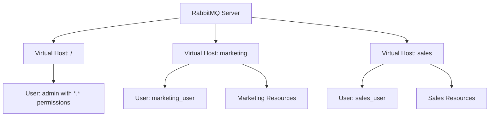

# RabbitMQ Authorization

## Introduction

Authorization is a critical component of RabbitMQ security that determines what operations users can perform once they have been authenticated. While authentication verifies the identity of a client connecting to RabbitMQ, authorization controls what those authenticated users are allowed to do - which exchanges they can publish to, which queues they can consume from, and which virtual hosts they can access.

In this guide, we'll explore RabbitMQ's authorization mechanisms, how to configure permissions, and best practices for securing your messaging infrastructure.

## Authorization Basics

### Understanding Authorization in RabbitMQ

RabbitMQ authorization works by defining permissions that specify what actions a user can perform on specific resources. These permissions are granted at the virtual host level and are divided into three categories:

1. **Configure:** Permissions to create or delete resources like exchanges and queues
2. **Write:** Permissions to publish messages to exchanges
3. **Read:** Permissions to consume messages from queues and get messages from queues

Each permission category uses regular expression patterns to match resource names, giving you fine-grained control over access rights.

### Prerequisites

Before configuring authorization, you should understand:

- Basic RabbitMQ concepts (exchanges, queues, bindings)
- RabbitMQ authentication (users and credentials)
- Regular expressions (used for permission patterns)

## Configuring User Permissions

### Basic Permission Structure

Permissions in RabbitMQ are configured using the `rabbitmqctl` command-line tool or the management UI. The basic structure of a permission includes:

- User name
- Virtual host
- Configure pattern (regex)
- Write pattern (regex)
- Read pattern (regex)

### Setting Permissions with rabbitmqctl

Here's how to set permissions using the command line:

```bash
rabbitmqctl set_permissions [-p <vhost>] <user> <conf> <write> <read>
```

For example, to give a user full access to all resources in the default virtual host:

```bash
rabbitmqctl set_permissions user1 ".*" ".*" ".*"
```

To restrict a user to only resources with names starting with "app1":

```bash
rabbitmqctl set_permissions user2 "^app1\." "^app1\." "^app1\."
```

### Output Example

When you successfully set permissions, you'll see output similar to:

```
Setting permissions for user "user1" in vhost "/"...
```

To view current permissions:

```bash
rabbitmqctl list_permissions [-p <vhost>]
```

Output:

```
Listing permissions for vhost "/"...
user    configure       write   read
user1   .*              .*      .*
user2   ^app1\.         ^app1\. ^app1\.
```

## Permission Patterns Explained

Understanding regex patterns is crucial for effective authorization:

| Pattern | Meaning |
|---------|---------|
| `.*` | Matches any resource name (full access) |
| `^$` | Matches only empty string (no access) |
| `^name$` | Matches exact name "name" |
| `^prefix.*` | Matches anything starting with "prefix" |
| `.*suffix$` | Matches anything ending with "suffix" |

### Examples of Common Permission Patterns

#### Producer-Only Access

For users that should only publish messages:

```bash
rabbitmqctl set_permissions producer_user "^$" ".*" "^$"
```

This grants:
- No configure permissions (can't create/delete resources)
- Full write permissions (can publish to any exchange)
- No read permissions (can't consume from queues)

#### Consumer-Only Access

For users that should only consume messages:

```bash
rabbitmqctl set_permissions consumer_user "^$" "^$" ".*"
```

This grants:
- No configure permissions
- No write permissions
- Full read permissions (can consume from any queue)

## Topic Authorizations

For more granular control, RabbitMQ provides topic-specific authorization:

### Configuring Topic Permissions

Topic permissions allow you to control publishing to topic exchanges based on the routing key:

```bash
rabbitmqctl set_topic_permissions [-p <vhost>] <user> <exchange> <write> <read>
```

Example:

```bash
rabbitmqctl set_topic_permissions user1 "amq.topic" "^sensors\." "^notifications\."
```

This allows user1 to:
- Publish to amq.topic with routing keys starting with "sensors."
- Subscribe to messages with routing keys starting with "notifications."

## Virtual Host-Based Isolation

RabbitMQ uses virtual hosts to provide logical grouping and separation of resources:

### Creating and Assigning Virtual Hosts

```bash
# Create a new virtual host
rabbitmqctl add_vhost marketing_vhost

# Assign permissions within that virtual host
rabbitmqctl set_permissions -p marketing_vhost marketing_user ".*" ".*" ".*"
```

### Visual Representation of Multi-Tenant Setup



## Implementation Examples

### Example 1: Setting Up User Roles

Let's implement a common pattern with different user roles:

```bash
# Create users
rabbitmqctl add_user admin strong_password
rabbitmqctl add_user publisher pub_password
rabbitmqctl add_user consumer cons_password

# Set tags for management UI access
rabbitmqctl set_user_tags admin administrator
rabbitmqctl set_user_tags publisher monitoring
rabbitmqctl set_user_tags consumer monitoring

# Set permissions
rabbitmqctl set_permissions admin ".*" ".*" ".*"
rabbitmqctl set_permissions publisher "^$" ".*" "^$"
rabbitmqctl set_permissions consumer "^$" "^$" ".*"
```

### Example 2: Microservices Authorization

For a microservices architecture where services should only access their own resources:

```bash
# Create users for different services
rabbitmqctl add_user order_service order_password
rabbitmqctl add_user inventory_service inventory_password
rabbitmqctl add_user notification_service notification_password

# Set permissions for order service
rabbitmqctl set_permissions order_service "^order\." "^order\." "^order\.|^inventory\."

# Set permissions for inventory service
rabbitmqctl set_permissions inventory_service "^inventory\." "^inventory\." "^inventory\."

# Set permissions for notification service
rabbitmqctl set_permissions notification_service "^notification\." "^notification\." "^$"
```

This setup ensures:
- Each service can only create and manage its own resources
- Order service can read from inventory queues (for coordination)
- Notification service can only send notifications, not receive

## Implementing Authorization in Code

### Node.js Example with amqplib

Here's how to connect with credentials in a Node.js application:

```javascript
const amqp = require('amqplib');

async function connectWithAuth() {
  try {
    // Connect with credentials
    const connection = await amqp.connect({
      hostname: 'localhost',
      username: 'publisher',
      password: 'pub_password',
      vhost: '/'
    });
    
    const channel = await connection.createChannel();
    
    // Attempt to publish a message
    const exchange = 'my_exchange';
    const routingKey = 'important.message';
    const message = Buffer.from('Hello World!');
    
    channel.publish(exchange, routingKey, message);
    console.log("Message sent successfully");
    
    // Close connection
    setTimeout(() => {
      connection.close();
    }, 500);
  } catch (error) {
    console.error("Error:", error.message);
    // Handle authorization failures
    if (error.message.includes('access refused')) {
      console.error("You don't have permission to perform this action");
    }
  }
}

connectWithAuth();
```

### Python Example with Pika

```python
import pika
import sys

credentials = pika.PlainCredentials('consumer', 'cons_password')
parameters = pika.ConnectionParameters(
    host='localhost',
    virtual_host='/',
    credentials=credentials
)

try:
    connection = pika.BlockingConnection(parameters)
    channel = connection.channel()
    
    # Attempt to consume messages
    method_frame, header_frame, body = channel.basic_get(queue='my_queue')
    
    if method_frame:
        print(f"Message received: {body.decode()}")
        channel.basic_ack(delivery_tag=method_frame.delivery_tag)
    else:
        print("No message available")
        
    connection.close()
except pika.exceptions.ProbableAccessDeniedError as error:
    print(f"Authorization error: {error}")
    print("You don't have permission to perform this action")
except Exception as error:
    print(f"Error: {error}")
```

## Authorization with Management Plugin

The RabbitMQ Management plugin also uses the authorization system:

### Management UI Access Control

User tags determine what actions users can perform in the management UI:

```bash
# Administrator can do everything
rabbitmqctl set_user_tags admin administrator

# Management can view and operate all entities
rabbitmqctl set_user_tags manager management

# Monitoring can only view entities
rabbitmqctl set_user_tags viewer monitoring

# No tags = no management access
rabbitmqctl set_user_tags limited_user
```

## Best Practices for RabbitMQ Authorization

### Principle of Least Privilege

Always grant the minimum permissions needed:

```bash
# Instead of this (too permissive)
rabbitmqctl set_permissions app_user ".*" ".*" ".*"

# Use something like this
rabbitmqctl set_permissions app_user "^app\." "^app\." "^app\."
```

### Regular Permission Audits

Regularly review and audit permissions:

```bash
# List all users
rabbitmqctl list_users

# List permissions for all virtual hosts
rabbitmqctl list_permissions

# List permissions for a specific virtual host
rabbitmqctl list_permissions -p marketing_vhost
```

### Security Checklist

- ✅ Create separate user accounts for each application
- ✅ Use specific permission patterns, not wildcard patterns
- ✅ Regularly audit permissions
- ✅ Remove unused users and revoke unnecessary permissions
- ✅ Use virtual hosts to isolate environments
- ✅ Implement monitoring and alerting for authorization failures

## Troubleshooting Authorization Issues

When facing authorization problems, check the following:

### Common Error Messages

| Error | Possible Cause | Solution |
|-------|---------------|----------|
| `access to exchange 'name' in vhost '/' refused for user` | Insufficient write permissions | Check write pattern with `list_permissions` |
| `access to queue 'name' in vhost '/' refused for user` | Insufficient read permissions | Check read pattern with `list_permissions` |
| `access to resource 'name' in vhost '/' refused for user` | Insufficient configure permissions | Check configure pattern |

### Enabling Verbose Logging

To diagnose authorization issues, increase log verbosity:

```bash
# In rabbitmq.conf
log.connection.level = debug
```

## Summary

RabbitMQ's authorization system provides flexible, fine-grained access control that helps secure your messaging infrastructure. Key points to remember:

- Authorization in RabbitMQ uses regular expression patterns to control access to resources
- Permissions are divided into configure, write, and read categories
- Virtual hosts provide logical separation for multi-tenant environments
- Follow the principle of least privilege when granting permissions
- Regularly audit and review permissions to maintain security

By implementing proper authorization policies, you can ensure that users and applications only have access to the resources they need, reducing the risk of unauthorized access and potential security breaches.

## Further Resources

- [Official RabbitMQ Access Control Documentation](https://www.rabbitmq.com/access-control.html)
- [Regular Expression Tester](https://regex101.com/) - Useful for testing permission patterns
- [RabbitMQ Management HTTP API](https://www.rabbitmq.com/management.html#http-api) - For programmatic permissions management

## Practice Exercises

1. Set up a RabbitMQ environment with three users: an administrator, a producer, and a consumer, each with appropriate permissions.
2. Create two virtual hosts for "development" and "production" environments with separate permissions.
3. Write a script that audits and reports all user permissions across all virtual hosts.
4. Implement a microservices architecture with proper authorization between services.