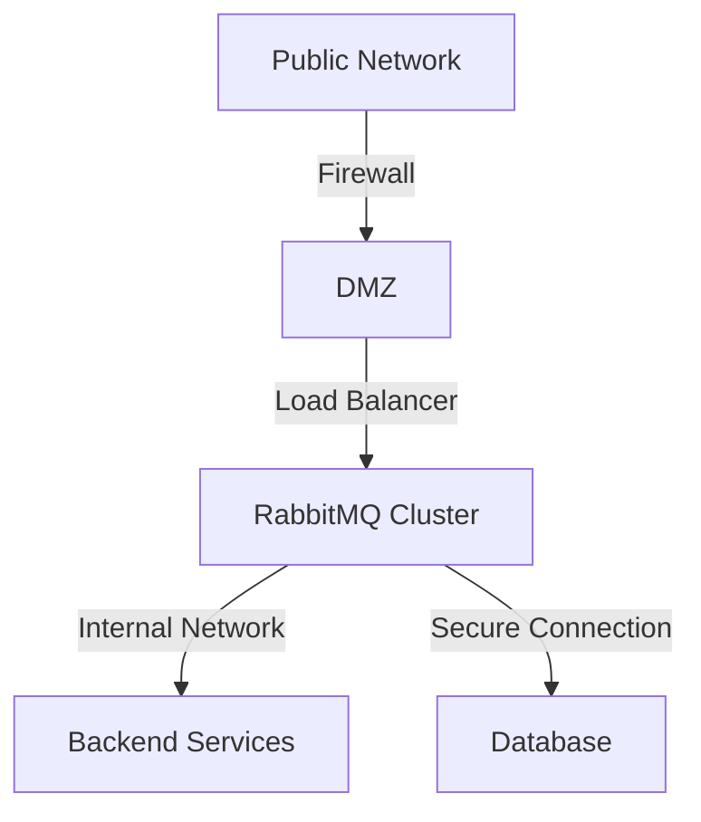

# RabbitMQ Network Security

## Introduction

When deploying RabbitMQ in production environments, securing network communications is crucial to protect sensitive data and prevent unauthorized access. RabbitMQ servers often process business-critical messages that may contain confidential information, making them potential targets for network attacks.

This guide covers essential network security concepts and configurations for RabbitMQ, focusing on how to protect message data in transit and secure connections between clients and brokers.

## Why Network Security Matters for RabbitMQ

In a typical deployment, RabbitMQ communicates with:
- Client applications producing messages
- Consumer applications processing messages
- Management tools and monitoring services
- Other RabbitMQ nodes in a cluster

Without proper security measures, these communications can be vulnerable to:

1. **Eavesdropping**: Attackers intercepting and reading message content
2. **Man-in-the-middle attacks**: Malicious actors intercepting and potentially modifying messages
3. **Identity spoofing**: Unauthorized clients pretending to be legitimate ones
4. **Denial of service**: Overwhelming the system with connection attempts

## Core Network Security Components

### Transport Layer Security (TLS/SSL)

The primary method for securing RabbitMQ network communications is Transport Layer Security (TLS), formerly known as SSL. TLS provides:

- **Encryption** of data in transit
- **Authentication** via certificates
- **Data integrity** protection

Let's look at how to implement TLS with RabbitMQ.

## Configuring TLS for RabbitMQ

### Step 1: Certificate Preparation

Before configuring RabbitMQ, you'll need:
- A Certificate Authority (CA) certificate
- A server certificate
- A private key for the server

For testing purposes, you can generate self-signed certificates using `openssl`:

```bash
# Create a Certificate Authority
openssl req -new -x509 -days 365 -nodes -out ca_certificate.pem -keyout ca_key.pem

# Create server key and certificate signing request
openssl req -new -nodes -out server_request.csr -keyout server_key.pem

# Sign the certificate
openssl x509 -req -in server_request.csr -out server_certificate.pem -CA ca_certificate.pem -CAkey ca_key.pem -CAcreateserial
```

For production environments, use certificates from a trusted Certificate Authority.

### Step 2: Configure RabbitMQ Server

Edit the RabbitMQ configuration file (rabbitmq.conf) to enable TLS:

```properties
listeners.ssl.default = 5671

ssl_options.cacertfile = /path/to/ca_certificate.pem
ssl_options.certfile   = /path/to/server_certificate.pem
ssl_options.keyfile    = /path/to/server_key.pem
ssl_options.verify     = verify_peer
ssl_options.fail_if_no_peer_cert = false
```

This configuration:
1. Sets the TLS listener port to the standard 5671
2. Specifies certificate locations
3. Sets verification mode to verify client certificates when presented

### Step 3: Configure Client Applications

For client applications, you'll need to configure TLS connections. Here's an example using the Java client:

```java
ConnectionFactory factory = new ConnectionFactory();
factory.setHost("rabbitmq.example.com");
factory.setPort(5671);

// Enable TLS
factory.useSslProtocol();

// For mutual TLS (client authentication)
// Requires more detailed setup with keystore and truststore
SSLContext sslContext = SSLContext.getInstance("TLSv1.2");
// ... configure SSL context ...
factory.useSslProtocol(sslContext);

Connection connection = factory.newConnection();
Channel channel = connection.createChannel();
```

For Node.js using amqplib:

```javascript
const amqp = require('amqplib');
const fs = require('fs');

// Read certificates
const ca = fs.readFileSync('/path/to/ca_certificate.pem');
const cert = fs.readFileSync('/path/to/client_certificate.pem');
const key = fs.readFileSync('/path/to/client_key.pem');

// Connect with TLS options
const connect = async () => {
  try {
    const connection = await amqp.connect({
      hostname: 'rabbitmq.example.com',
      port: 5671,
      protocol: 'amqps',
      tls: {
        ca: [ca],
        cert: cert,
        key: key,
        rejectUnauthorized: true
      }
    });
    
    const channel = await connection.createChannel();
    console.log('Connected with TLS!');
    // Use channel...
  } catch (error) {
    console.error('Connection failed', error);
  }
};

connect();
```

### Step 4: Verify TLS Configuration

To verify your TLS setup is working, check the RabbitMQ log files for successful TLS handshakes, or use the `openssl` tool:

```bash
openssl s_client -connect rabbitmq.example.com:5671 -cert client_certificate.pem -key client_key.pem
```

## Firewall Configuration

Proper firewall configuration is essential for RabbitMQ network security.

### Required Ports

Configure your firewall to only allow traffic on the necessary ports:

| Port | Protocol | Description |
| ---- | -------- | ----------- |
| 5671 | TCP | AMQP with TLS |
| 5672 | TCP | AMQP without TLS (should be restricted or disabled in production) |
| 15671 | TCP | Management UI with TLS |
| 15672 | TCP | Management UI without TLS (should be restricted) |
| 25672 | TCP | Inter-node communication (for clusters) |
| 4369 | TCP | epmd (Erlang Port Mapper Daemon) |
| 35197+ | TCP | Used for CLI tools (dynamic range) |

### Example iptables Configuration

```bash
# Allow RabbitMQ secure AMQP
iptables -A INPUT -p tcp --dport 5671 -j ACCEPT

# Allow RabbitMQ Management UI with TLS
iptables -A INPUT -p tcp --dport 15671 -j ACCEPT

# For cluster nodes
iptables -A INPUT -p tcp --dport 25672 -s 192.168.1.0/24 -j ACCEPT
iptables -A INPUT -p tcp --dport 4369 -s 192.168.1.0/24 -j ACCEPT

# Deny other RabbitMQ ports
iptables -A INPUT -p tcp --dport 5672 -j DROP
iptables -A INPUT -p tcp --dport 15672 -j DROP
```

## Network Segmentation

For enhanced security, consider implementing network segmentation:



Best practices include:
1. Place RabbitMQ servers in a separate network segment
2. Use internal DNS names not exposed publicly
3. Implement VLANs to isolate different tiers
4. Consider using VPNs for remote client connections

## Securing Management Interface

The RabbitMQ Management UI provides a convenient way to administer your broker but can be a security risk if not properly secured.

### Enable HTTPS for Management UI

Modify your rabbitmq.conf file:

```properties
management.ssl.port = 15671
management.ssl.cacertfile = /path/to/ca_certificate.pem
management.ssl.certfile = /path/to/server_certificate.pem
management.ssl.keyfile = /path/to/server_key.pem
```

### Restrict Access to Management Interface

```properties
# IP-based restrictions in rabbitmq.conf
management.listener.ip = 127.0.0.1

# Or with environment variables
RABBITMQ_MANAGEMENT_LISTENER_IP=127.0.0.1
```

For more extensive control, use a reverse proxy like Nginx with IP restrictions and additional authentication.

## Practical Example: Secure RabbitMQ Deployment

Let's walk through a complete example of deploying a secure RabbitMQ installation.

### Directory Structure

```
/etc/rabbitmq/
├── rabbitmq.conf
├── enabled_plugins
└── ssl/
    ├── ca_certificate.pem
    ├── server_certificate.pem
    └── server_key.pem
```

### Configuration File (rabbitmq.conf)

```properties
# Network and TLS settings
listeners.tcp = none
listeners.ssl.default = 5671

ssl_options.cacertfile = /etc/rabbitmq/ssl/ca_certificate.pem
ssl_options.certfile   = /etc/rabbitmq/ssl/server_certificate.pem
ssl_options.keyfile    = /etc/rabbitmq/ssl/server_key.pem
ssl_options.verify     = verify_peer
ssl_options.fail_if_no_peer_cert = true
ssl_options.versions.1 = tlsv1.2
ssl_options.versions.2 = tlsv1.3

# Management interface with TLS
management.ssl.port = 15671
management.ssl.cacertfile = /etc/rabbitmq/ssl/ca_certificate.pem
management.ssl.certfile = /etc/rabbitmq/ssl/server_certificate.pem
management.ssl.keyfile = /etc/rabbitmq/ssl/server_key.pem
management.ssl.versions.1 = tlsv1.2
management.ssl.versions.2 = tlsv1.3
management.listener.port = 15671

# IP restrictions for management
management.listener.ip = 10.0.0.0/24

# Disable plaintext management interface
management.tcp.port = 15672
management.tcp.ip = 127.0.0.1
```

### Java Client Application Example

```java
import com.rabbitmq.client.*;
import javax.net.ssl.*;
import java.io.FileInputStream;
import java.security.KeyStore;

public class SecureRabbitMQClient {
    
    private static final String RABBITMQ_HOST = "rabbitmq.example.com";
    private static final int RABBITMQ_PORT = 5671;
    private static final String TRUSTSTORE_PATH = "/path/to/truststore.jks";
    private static final String TRUSTSTORE_PASSWORD = "truststore_password";
    private static final String KEYSTORE_PATH = "/path/to/keystore.jks";
    private static final String KEYSTORE_PASSWORD = "keystore_password";
    
    public static void main(String[] args) throws Exception {
        // Set up the SSLContext
        KeyStore tks = KeyStore.getInstance("JKS");
        tks.load(new FileInputStream(TRUSTSTORE_PATH), TRUSTSTORE_PASSWORD.toCharArray());
        
        TrustManagerFactory tmf = TrustManagerFactory.getInstance("SunX509");
        tmf.init(tks);
        
        KeyStore ks = KeyStore.getInstance("JKS");
        ks.load(new FileInputStream(KEYSTORE_PATH), KEYSTORE_PASSWORD.toCharArray());
        
        KeyManagerFactory kmf = KeyManagerFactory.getInstance("SunX509");
        kmf.init(ks, KEYSTORE_PASSWORD.toCharArray());
        
        SSLContext sslContext = SSLContext.getInstance("TLSv1.2");
        sslContext.init(kmf.getKeyManagers(), tmf.getTrustManagers(), null);
        
        // Set up the connection factory
        ConnectionFactory factory = new ConnectionFactory();
        factory.setHost(RABBITMQ_HOST);
        factory.setPort(RABBITMQ_PORT);
        factory.setUsername("secure_user");
        factory.setPassword("secure_password");
        factory.useSslProtocol(sslContext);
        
        // Create connection and channel
        try (Connection connection = factory.newConnection();
             Channel channel = connection.createChannel()) {
            
            System.out.println("Connected securely to RabbitMQ!");
            
            // Declare queue and publish a message
            String queueName = "secure_queue";
            channel.queueDeclare(queueName, true, false, false, null);
            
            String message = "Secure message sent over TLS";
            channel.basicPublish("", queueName, null, message.getBytes());
            System.out.println("Sent: " + message);
            
            // Set up consumer
            DeliverCallback deliverCallback = (consumerTag, delivery) -> {
                String receivedMessage = new String(delivery.getBody(), "UTF-8");
                System.out.println("Received: " + receivedMessage);
            };
            
            channel.basicConsume(queueName, true, deliverCallback, consumerTag -> {});
            
            // Keep the application running
            Thread.sleep(5000);
        }
    }
}
```

## Network Security Best Practices

### 1. Implement Defense in Depth

Don't rely on a single security measure. Combine:
- TLS for encryption
- Strong authentication
- IP-based restrictions
- Proper firewall configuration
- Regular security audits

### 2. Disable Plaintext Communication

In production, disable non-TLS listeners entirely:

```properties
listeners.tcp = none
listeners.ssl.default = 5671
```

### 3. Keep TLS Configurations Up to Date

Regularly update your TLS configuration to use the latest secure protocols and cipher suites:

```properties
ssl_options.versions.1 = tlsv1.2
ssl_options.versions.2 = tlsv1.3
ssl_options.honor_cipher_order = true
ssl_options.ciphers.1 = ECDHE-ECDSA-AES256-GCM-SHA384
ssl_options.ciphers.2 = ECDHE-RSA-AES256-GCM-SHA384
ssl_options.ciphers.3 = ECDHE-ECDSA-AES128-GCM-SHA256
```

### 4. Implement Certificate Rotation

Establish a process for regular certificate rotation:
- Track certificate expiration dates
- Create new certificates before old ones expire
- Deploy new certificates with minimal disruption
- Revoke old certificates after replacement

### 5. Monitor Network Traffic

Implement monitoring tools to detect:
- Unusual connection patterns
- Failed TLS handshakes
- Unauthorized connection attempts
- Performance issues that might indicate attacks

## Troubleshooting TLS Issues

When working with TLS, you might encounter these common issues:

### Certificate Verification Failures

If clients cannot connect due to certificate verification issues:

1. Check certificate paths in configuration
2. Verify the CA certificate is properly configured
3. Ensure certificates haven't expired
4. Check hostname verification settings

Example debugging with OpenSSL:

```bash
openssl s_client -connect rabbitmq.example.com:5671 -CAfile ca_certificate.pem
```

### Protocol Version Mismatches

If you see handshake failures:

1. Ensure client and server support compatible TLS versions
2. Check cipher suite compatibility
3. Update client libraries if necessary

### Performance Issues

TLS adds processing overhead. If you experience performance degradation:

1. Use session resumption for frequent short-lived connections
2. Consider hardware acceleration for TLS processing
3. Monitor CPU usage during TLS handshakes
4. Optimize cipher choices (balance security and performance)

## Summary

Securing RabbitMQ network communications is essential for protecting your messaging infrastructure. The key components are:

1. **TLS implementation** for encryption and authentication
2. **Proper firewall configuration** to restrict access
3. **Network segmentation** to isolate RabbitMQ servers
4. **Secure management interface** configuration
5. **Regular updates and monitoring** to maintain security

By following these best practices, you can establish a robust security posture for your RabbitMQ deployment and protect your messaging data in transit.

## Additional Resources

- [RabbitMQ TLS Documentation](https://www.rabbitmq.com/ssl.html)
- [OWASP Transport Layer Protection Cheat Sheet](https://cheatsheetseries.owasp.org/cheatsheets/Transport_Layer_Protection_Cheat_Sheet.html)
- [Mozilla SSL Configuration Generator](https://ssl-config.mozilla.org/)

## Exercises

1. Set up a RabbitMQ server with TLS using self-signed certificates
2. Configure a client application to connect using mutual TLS authentication
3. Implement IP-based restrictions for the management interface
4. Create a script to monitor certificate expiration dates
5. Implement certificate rotation without service interruption