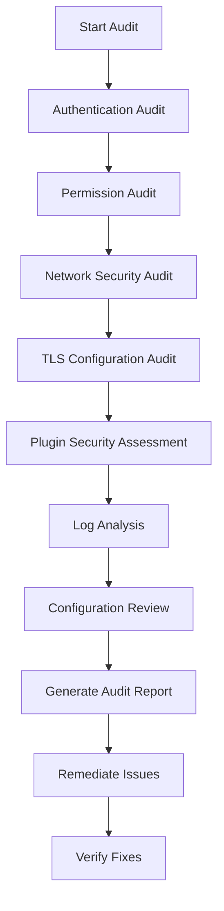

import Tabs from '@theme/Tabs';
import TabItem from '@theme/TabItem';

# RabbitMQ Security Auditing

## Introduction

Security auditing is a critical aspect of maintaining a robust RabbitMQ messaging infrastructure. As RabbitMQ often handles sensitive data and serves as a central communication hub for microservices, ensuring its security is paramount. This guide will walk you through the process of conducting security audits on your RabbitMQ installations to identify potential vulnerabilities and implement appropriate mitigations.

## Why Audit RabbitMQ Security?

Message brokers like RabbitMQ can become prime targets for attackers because:

1. They often contain sensitive business data in transit
2. They are central points in your architecture that can affect multiple systems
3. A compromised message broker could lead to data leaks or service disruptions
4. Default configurations may not be secure for production environments

## Prerequisites

Before diving into security auditing, ensure you have:

- Access to your RabbitMQ server (admin privileges)
- Basic knowledge of RabbitMQ concepts
- Familiarity with command-line tools
- Basic understanding of security principles

## Key Areas to Audit

### 1. Authentication and Authorization

#### Checking User Access

Let's examine how to check the list of users and their permissions:

```bash
# List all users
rabbitmqctl list_users

# Output:
# Listing users ...
# user    tags
# guest   [administrator]
# admin   [administrator]
# app1    []
# app2    []
```

**Security Check:** The `guest` user should only be allowed to connect from localhost, and production systems should use properly configured users with appropriate permissions.

#### Verifying Permissions

```bash
# Check permissions for a specific user
rabbitmqctl list_user_permissions app1

# Output:
# Listing permissions for user "app1" ...
# vhost   configure    write   read
# /       .*           .*      .*
```

**Security Risk:** The configuration above gives `app1` full read/write permissions on all resources. In a secure configuration, you should limit permissions to only what's necessary.

### 2. TLS Configuration Audit

Check if TLS is properly configured:

```bash
# Verify TLS settings in rabbitmq.conf
grep -i ssl /etc/rabbitmq/rabbitmq.conf

# Sample secure output:
# ssl_options.cacertfile = /path/to/ca_certificate.pem
# ssl_options.certfile = /path/to/server_certificate.pem
# ssl_options.keyfile = /path/to/server_key.pem
# ssl_options.verify = verify_peer
# ssl_options.fail_if_no_peer_cert = true
```

**Test TLS Configuration:**

```bash
# Using openssl to test the TLS connection
openssl s_client -connect localhost:5671 -tls1_2

# Look for the certificate information and verify it's correct
```

### 3. Network Security Audit

#### Checking Listening Ports

```bash
# Check what ports RabbitMQ is listening on
sudo netstat -tlnp | grep beam

# Example output:
# tcp   0   0 0.0.0.0:5672    0.0.0.0:*   LISTEN  12345/beam.smp
# tcp   0   0 0.0.0.0:15672   0.0.0.0:*   LISTEN  12345/beam.smp
# tcp   0   0 0.0.0.0:25672   0.0.0.0:*   LISTEN  12345/beam.smp
```

**Security Recommendation:** Use firewall rules to restrict access to these ports from unauthorized networks.

```bash
# Example iptables rules
sudo iptables -A INPUT -p tcp -s trusted_ip_range --dport 5672 -j ACCEPT
sudo iptables -A INPUT -p tcp --dport 5672 -j DROP
```

### 4. Plugin Security Assessment

#### Listing Enabled Plugins

```bash
# List enabled plugins
rabbitmq-plugins list -e

# Example output:
# Listing enabled plugins - validation may take a while...
# [e] rabbitmq_management 3.9.13
# [e] rabbitmq_web_dispatch 3.9.13
# [e] rabbitmq_management_agent 3.9.13
```

**Security Concern:** The management plugin exposes an HTTP API. If enabled, ensure it's properly secured with strong credentials and HTTPS.

## Creating a Comprehensive Audit Checklist

Let's create a diagram of a comprehensive audit workflow:



## Implementing Automated Security Audits

Create a simple shell script to automate basic security checks:

```bash
#!/bin/bash
# rabbitmq-security-audit.sh

echo "RabbitMQ Security Audit"
echo "======================="
echo ""

echo "1. Authentication Audit"
echo "----------------------"
rabbitmqctl list_users
echo ""

echo "2. Checking for the guest account"
if rabbitmqctl list_users | grep -q "guest"; then
  echo "WARNING: guest account exists and should be removed in production"
fi
echo ""

echo "3. Checking TLS Configuration"
if grep -q "ssl_options" /etc/rabbitmq/rabbitmq.conf; then
  echo "TLS is configured"
  grep -i ssl /etc/rabbitmq/rabbitmq.conf
else
  echo "WARNING: TLS does not appear to be configured"
fi
echo ""

echo "4. Checking Network Exposure"
netstat -tlnp | grep beam
echo ""

echo "5. Checking Enabled Plugins"
rabbitmq-plugins list -e
echo ""

echo "Audit Complete"
```

To run this script:

```bash
chmod +x rabbitmq-security-audit.sh
./rabbitmq-security-audit.sh > audit-results.txt
```

## Security Hardening Recommendations

Based on audit findings, implement these security improvements:

### 1. Authentication Hardening

```bash
# Remove the default guest user in production
rabbitmqctl delete_user guest

# Create users with complex passwords
rabbitmqctl add_user app_name complex_password_here
```

### 2. Implement Least Privilege

```bash
# Set specific permissions for each user
rabbitmqctl set_permissions -p / app1 "^app1-.*" "^app1-.*" "^(app1-.*|shared-.*)"
```

### 3. Enable and Configure TLS

Add to your `rabbitmq.conf`:

```
listeners.ssl.default = 5671

ssl_options.cacertfile = /path/to/ca_certificate.pem
ssl_options.certfile = /path/to/server_certificate.pem
ssl_options.keyfile = /path/to/server_key.pem
ssl_options.verify = verify_peer
ssl_options.fail_if_no_peer_cert = true
```

### 4. Restrict Management Plugin Access

Modify the management plugin configuration in `rabbitmq.conf`:

```
management.listener.port = 15672
management.listener.ssl = true
management.listener.ssl_opts.cacertfile = /path/to/ca_certificate.pem
management.listener.ssl_opts.certfile = /path/to/server_certificate.pem
management.listener.ssl_opts.keyfile = /path/to/server_key.pem
```

## Real-World Example: Auditing a Production RabbitMQ Cluster

<Tabs>
  <TabItem value="scenario" label="Scenario">
    You manage a financial services application using RabbitMQ to process transactions. A security audit is required before going to production.
  </TabItem>
  <TabItem value="approach" label="Audit Approach">
    1. Inventory all RabbitMQ nodes
    2. Check all user accounts and permissions
    3. Verify TLS implementation
    4. Check network exposure
    5. Review logging configuration
  </TabItem>
  <TabItem value="findings" label="Common Findings">
    - Default guest account active
    - Users with overly permissive rights
    - Unencrypted communications
    - Management interface exposed to public
    - Insufficient logging
  </TabItem>
</Tabs>

## Advanced Auditing: Logging and Monitoring

Proper logging configuration is crucial for security auditing. Ensure RabbitMQ logging is configured to capture authentication attempts, configuration changes, and connection events.

In `rabbitmq.conf`:

```
log.file = true
log.file.level = info
log.file.rotation.date = $D0
log.file.rotation.size = 10485760
```

Set up log monitoring to alert on suspicious activity:

```bash
# Example using grep to monitor for failed login attempts
grep "authentication failed" /var/log/rabbitmq/rabbit@hostname.log
```

Consider implementing a log aggregation solution (like ELK stack or Graylog) to centralize and analyze RabbitMQ logs.

## Creating a Security Audit Policy

Document your security audit policy that includes:

- Regular audit schedule (e.g., quarterly)
- Responsible roles and escalation paths
- Standard audit procedures
- Remediation timelines
- Documentation requirements

## Summary

RabbitMQ security auditing is an essential practice for maintaining the integrity and confidentiality of your messaging infrastructure. By systematically examining authentication, authorization, network security, TLS configuration, and plugins, you can identify and address security vulnerabilities before they can be exploited.

Remember that security is an ongoing process, not a one-time task. Regular audits, combined with proper monitoring and response procedures, will help ensure your RabbitMQ deployment remains secure as your environment evolves.

## Additional Resources

- [RabbitMQ Security Documentation](https://www.rabbitmq.com/security.html)
- [OWASP Secure Configuration Guide](https://owasp.org/)
- [NIST Cybersecurity Framework](https://www.nist.gov/cyberframework)

## Practice Exercises

1. Perform a security audit on a development RabbitMQ instance
2. Create an automated audit script for your specific environment
3. Develop a security incident response plan for RabbitMQ breaches
4. Set up a monitoring system to alert on suspicious RabbitMQ activity