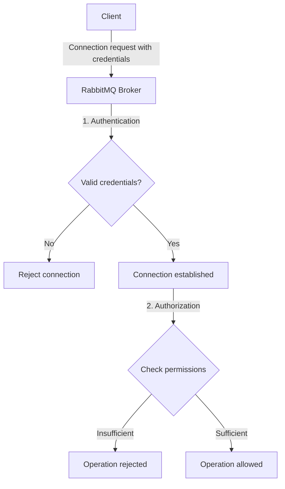

# RabbitMQ Access Control

## Introduction

RabbitMQ is a powerful message broker that enables applications to communicate through messages. As with any system handling potentially sensitive data, securing access to RabbitMQ is critical. This guide explores RabbitMQ's access control mechanisms, helping you understand how to properly secure your messaging infrastructure.

Access control in RabbitMQ consists of two main components:

1. **Authentication** - Verifying the identity of a connecting client (answering "Who are you?")
2. **Authorization** - Determining what operations a client is allowed to perform (answering "What are you allowed to do?")

Let's dive into each of these components and learn how to implement them effectively.

## Authentication in RabbitMQ

Authentication is the process of verifying the identity of clients connecting to RabbitMQ. By default, RabbitMQ uses username and password credentials for authentication.

### Default Authentication

RabbitMQ comes with a default user:

- Username: `guest`
- Password: `guest`

This default user can only connect from localhost for security reasons. For production environments, you should create proper user accounts with strong passwords.

### Creating and Managing Users

You can manage users using the `rabbitmqctl` command-line tool:

```bash
# Create a new user
rabbitmqctl add_user myuser mypassword

# Change a user's password
rabbitmqctl change_password myuser newpassword

# Delete a user
rabbitmqctl delete_user myuser

# List all users
rabbitmqctl list_users
```

Example output when listing users:

```
Listing users ...
user    tags
guest   [administrator]
myuser  []
```

### Authentication Mechanisms

RabbitMQ supports several authentication mechanisms:

1. **Internal Database**: The default method storing usernames and passwords
2. **LDAP**: Integration with corporate directories
3. **SASL**: Simple Authentication and Security Layer
4. **X.509 Certificates**: Client certificate authentication
5. **OAuth 2.0**: Token-based authentication

Let's see how to configure LDAP authentication as an example:

```ini
# In rabbitmq.conf
auth_backends.1 = ldap

# LDAP server settings
auth_ldap.servers.1 = ldap.example.com

# User DN pattern
auth_ldap.user_dn_pattern = cn=${username},ou=People,dc=example,dc=com

# Enable TLS for LDAP connection
auth_ldap.use_ssl = true
```

## Authorization in RabbitMQ

Once a client is authenticated, RabbitMQ needs to determine what operations the client is allowed to perform. This is handled through RabbitMQ's permission system.

### Understanding Permissions

RabbitMQ permissions are defined per virtual host and consist of three permission types:

1. **Configure**: Permission to create and delete resources (exchanges, queues)
2. **Write**: Permission to publish messages
3. **Read**: Permission to consume messages and get messages from queues

Permissions are specified using regular expression patterns that match resource names.

### Setting Permissions

You can set permissions using the `rabbitmqctl` tool:

```bash
# Syntax: rabbitmqctl set_permissions [-p vhost] user configure write read
rabbitmqctl set_permissions -p / myuser "^myuser-.*" "^myuser-.*" "^myuser-.*"
```

This example grants the user "myuser" permissions to configure, write to, and read from any resource whose name starts with "myuser-" in the default virtual host.

Example output:

```
Setting permissions for user "myuser" in vhost "/" ...
```

### User Tags and Management UI Access

RabbitMQ uses tags to assign roles to users. Common tags include:

- `administrator`: Full access to management and all features
- `monitoring`: Access to view all, but cannot change anything
- `management`: Access to management UI with limited privileges
- `policymaker`: Can manage policies and parameters

Set tags using:

```bash
rabbitmqctl set_user_tags myuser monitoring
```

Example showing a user with both management and policymaker tags:

```bash
rabbitmqctl set_user_tags myuser management policymaker
```

Output:

```
Setting tags for user "myuser" to [management,policymaker] ...
```

## Virtual Hosts and Isolation

Virtual hosts (vhosts) in RabbitMQ provide logical separation of resources and can be used as security boundaries.

### Managing Virtual Hosts

```bash
# Create a new virtual host
rabbitmqctl add_vhost marketing_vhost

# Delete a virtual host
rabbitmqctl delete_vhost marketing_vhost

# List virtual hosts
rabbitmqctl list_vhosts
```

### Assigning Permissions to Virtual Hosts

Permissions are scoped to virtual hosts, allowing fine-grained access control:

```bash
# Grant permissions to a user in a specific vhost
rabbitmqctl set_permissions -p marketing_vhost marketing_user ".*" ".*" ".*"
```

This grants the `marketing_user` full permissions in the `marketing_vhost`.

## Access Control Flow

Let's visualize how RabbitMQ's access control works:



## Practical Example: Securing a Production RabbitMQ Setup

Let's walk through setting up a secure RabbitMQ environment for a typical application:

### Step 1: Remove the default guest user

```bash
rabbitmqctl delete_user guest
```

### Step 2: Create an administrator user

```bash
rabbitmqctl add_user admin StrongPassword123!
rabbitmqctl set_user_tags admin administrator
rabbitmqctl set_permissions -p / admin ".*" ".*" ".*"
```

### Step 3: Create application-specific users with limited permissions

```bash
# Create a user for a service that only publishes messages
rabbitmqctl add_user order_service OrderSvcPass123!
rabbitmqctl set_permissions -p / order_service "^order_.*" "^order_.*" "^$"

# Create a user for a service that only consumes messages
rabbitmqctl add_user notification_service NotifSvcPass123!
rabbitmqctl set_permissions -p / notification_service "^$" "^$" "^order_.*"
```

### Step 4: Verify the setup

```bash
rabbitmqctl list_users
rabbitmqctl list_user_permissions order_service
rabbitmqctl list_user_permissions notification_service
```

Output:

```
Listing users ...
user                  tags
admin                 [administrator]
order_service         []
notification_service  []

Listing permissions for user "order_service" ...
vhost   configure   write      read
/       ^order_.*   ^order_.*  ^$

Listing permissions for user "notification_service" ...
vhost   configure   write   read
/       ^$          ^$      ^order_.*
```

## Using SSL/TLS with RabbitMQ

To further secure your RabbitMQ instance, enable SSL/TLS for encrypted connections:

### Step 1: Configure SSL in rabbitmq.conf

```ini
listeners.ssl.default = 5671

ssl_options.cacertfile = /path/to/ca_certificate.pem
ssl_options.certfile   = /path/to/server_certificate.pem
ssl_options.keyfile    = /path/to/server_key.pem
ssl_options.verify     = verify_peer
ssl_options.fail_if_no_peer_cert = true
```

### Step 2: Connect with SSL in your application

```javascript
// Node.js example using amqplib
const amqp = require('amqplib');

async function connectWithSSL() {
  try {
    const connection = await amqp.connect({
      hostname: 'rabbitmq.example.com',
      port: 5671,
      username: 'myuser',
      password: 'mypassword',
      protocol: 'amqps',
      ssl: {
        ca: [fs.readFileSync('/path/to/ca_certificate.pem')],
        cert: fs.readFileSync('/path/to/client_certificate.pem'),
        key: fs.readFileSync('/path/to/client_key.pem'),
        rejectUnauthorized: true
      }
    });
    
    console.log('Connected to RabbitMQ with SSL');
    // Further code...
  } catch (error) {
    console.error('Error connecting:', error);
  }
}
```

## Common Access Control Patterns

### 1. Producer-Only Access

Restrict users to only publishing to specific exchanges:

```bash
rabbitmqctl set_permissions -p / producer_user "^$" "^exchange_name$" "^$"
```

### 2. Consumer-Only Access

Restrict users to only consuming from specific queues:

```bash
rabbitmqctl set_permissions -p / consumer_user "^$" "^$" "^queue_name$"
```

### 3. Topic-Based Authorization

Using topic exchanges with permission patterns to control access to specific message types:

```bash
# Allow publishing only to stocks.nasdaq.* topics
rabbitmqctl set_permissions -p / nasdaq_producer "^$" "^stocks\.nasdaq\.\*$" "^$"

# Allow subscribing only to stocks.nyse.* topics
rabbitmqctl set_permissions -p / nyse_consumer "^$" "^$" "^stocks\.nyse\.\*$"
```

## Best Practices for RabbitMQ Access Control

1. **Use strong, unique passwords** for all RabbitMQ users
2. **Delete the default guest account** in production environments
3. **Apply the principle of least privilege** - grant only the permissions a user needs
4. **Use virtual hosts** to separate environments or applications
5. **Enable SSL/TLS** for all connections
6. **Regularly audit** user accounts and permissions
7. **Use specific resource name prefixes** for different applications to make permission management easier
8. **Consider implementing** an external authentication system like LDAP for larger deployments
9. **Rotate credentials** regularly, especially for privileged accounts
10. **Monitor failed login attempts** for potential security breaches

## Troubleshooting Access Control Issues

### Common Error Messages

1. **Authentication failure**:
   ```
   ACCESS_REFUSED - Login was refused using authentication mechanism PLAIN. For details see the broker logfile.
   ```
   Solution: Check username and password.

2. **Authorization failure**:
   ```
   ACCESS_REFUSED - access to exchange 'my_exchange' in vhost '/' refused for user 'limited_user'
   ```
   Solution: Verify the user has appropriate permissions.

### Debugging Steps

1. Check the RabbitMQ logs (typically in `/var/log/rabbitmq/`):
   ```bash
   tail -f /var/log/rabbitmq/rabbit@hostname.log
   ```

2. Test authentication from the command line:
   ```bash
   rabbitmqctl authenticate_user username password
   ```

3. List user permissions to verify configuration:
   ```bash
   rabbitmqctl list_user_permissions username
   ```

## Summary

RabbitMQ's access control system provides a flexible way to secure your messaging infrastructure through authentication and authorization mechanisms. By properly configuring users, permissions, and virtual hosts, you can ensure that only authorized clients can access your RabbitMQ resources, and that they can only perform operations that they're permitted to perform.

Remember that security is a layered approach - combining RabbitMQ's access control with network-level security, encryption (SSL/TLS), and regular security audits will provide the most comprehensive protection for your messaging system.

## Additional Resources

- [RabbitMQ Access Control Documentation](https://www.rabbitmq.com/access-control.html)
- [RabbitMQ Management Plugin](https://www.rabbitmq.com/management.html)
- [RabbitMQ LDAP Authentication](https://www.rabbitmq.com/ldap.html)
- [RabbitMQ TLS Support](https://www.rabbitmq.com/ssl.html)

## Exercises

1. Set up a RabbitMQ instance with two virtual hosts and appropriate users for different applications.
2. Configure a producer-only user and verify that it cannot consume messages.
3. Implement SSL/TLS for your RabbitMQ connections and test secure communication.
4. Create a permission scheme that allows users to only access queues with specific name patterns.
5. Configure LDAP authentication for RabbitMQ and test connecting with LDAP credentials.