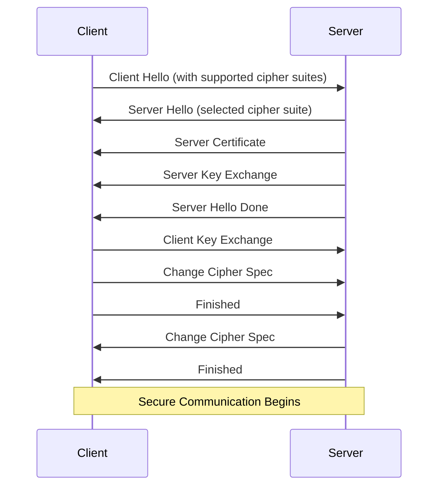
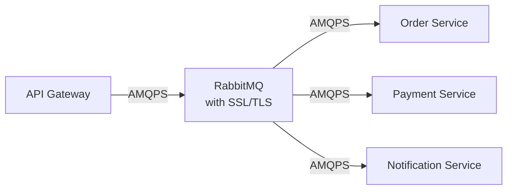

# RabbitMQ SSL/TLS

## Introduction

When deploying RabbitMQ in production environments, securing your message broker is crucial to protect sensitive data. One of the fundamental aspects of RabbitMQ security is encrypting network communications using SSL/TLS (Secure Sockets Layer/Transport Layer Security).

This guide will walk you through the process of securing RabbitMQ with SSL/TLS, explaining the concepts, implementation details, and best practices for beginners.

## What is SSL/TLS?

SSL (Secure Sockets Layer) and its successor TLS (Transport Layer Security) are cryptographic protocols designed to provide secure communication over a computer network. These protocols ensure:

1. **Data encryption** - Messages between client and server are encrypted
2. **Authentication** - Verification of the identity of communicating parties
3. **Data integrity** - Detection of any changes to data during transmission

In the context of RabbitMQ, SSL/TLS encryption protects:
- Client-to-node connections
- Node-to-node connections in a cluster
- Management UI and HTTP API traffic

## Why Use SSL/TLS with RabbitMQ?

Without SSL/TLS, RabbitMQ communications happen in plaintext, which means:
- User credentials can be intercepted
- Message payloads can be read by network sniffers
- Man-in-the-middle attacks become possible

Implementing SSL/TLS provides:
- Encrypted communications
- Identity verification through certificates
- Protection against various network-level attacks

## SSL/TLS Concepts

Before diving into the implementation, let's understand some key concepts:

### Certificates and Certificate Authority (CA)

SSL/TLS relies on a system of trust based on digital certificates:

- **CA (Certificate Authority)** - A trusted entity that issues digital certificates
- **Certificate** - A digital document that contains the public key and identity information
- **Private Key** - Kept secret by the certificate owner, used to decrypt messages

### Certificate Chain

A certificate chain includes:
1. **Root CA Certificate** - Self-signed certificate of a trusted authority
2. **Intermediate Certificates** - Optional certificates that link root CA to end-entity certificates
3. **Server Certificate** - The certificate for your RabbitMQ server

### Handshake Process



## Setting Up SSL/TLS for RabbitMQ

Let's walk through the process of setting up SSL/TLS for RabbitMQ:

### Step 1: Generate Certificates

First, we need to generate the necessary certificates. We'll use OpenSSL for this purpose.

#### Create a Certificate Authority (CA)

```bash
# Create directory for certificates
mkdir -p /path/to/rabbitmq/ssl/ca

# Generate private key for CA
openssl genrsa -out /path/to/rabbitmq/ssl/ca/ca_key.pem 2048

# Generate CA certificate
openssl req -x509 -new -key /path/to/rabbitmq/ssl/ca/ca_key.pem \
    -out /path/to/rabbitmq/ssl/ca/ca_certificate.pem \
    -days 365 \
    -subj "/CN=MyRabbitMQ-CA"
```

#### Create Server Certificate

```bash
# Create directory for server certificates
mkdir -p /path/to/rabbitmq/ssl/server

# Generate server private key
openssl genrsa -out /path/to/rabbitmq/ssl/server/server_key.pem 2048

# Create certificate signing request
openssl req -new -key /path/to/rabbitmq/ssl/server/server_key.pem \
    -out /path/to/rabbitmq/ssl/server/server_request.pem \
    -subj "/CN=rabbitmq.example.com"

# Create server certificate signed by our CA
openssl x509 -req -in /path/to/rabbitmq/ssl/server/server_request.pem \
    -out /path/to/rabbitmq/ssl/server/server_certificate.pem \
    -CA /path/to/rabbitmq/ssl/ca/ca_certificate.pem \
    -CAkey /path/to/rabbitmq/ssl/ca/ca_key.pem \
    -CAcreateserial \
    -days 365
```

#### Create Client Certificate (Optional but Recommended)

```bash
# Create directory for client certificates
mkdir -p /path/to/rabbitmq/ssl/client

# Generate client private key
openssl genrsa -out /path/to/rabbitmq/ssl/client/client_key.pem 2048

# Create certificate signing request
openssl req -new -key /path/to/rabbitmq/ssl/client/client_key.pem \
    -out /path/to/rabbitmq/ssl/client/client_request.pem \
    -subj "/CN=client.example.com"

# Create client certificate signed by our CA
openssl x509 -req -in /path/to/rabbitmq/ssl/client/client_request.pem \
    -out /path/to/rabbitmq/ssl/client/client_certificate.pem \
    -CA /path/to/rabbitmq/ssl/ca/ca_certificate.pem \
    -CAkey /path/to/rabbitmq/ssl/ca/ca_key.pem \
    -CAcreateserial \
    -days 365
```

### Step 2: Configure RabbitMQ for SSL/TLS

Next, we need to update the RabbitMQ configuration to use our certificates. Edit your `rabbitmq.conf` file (or `advanced.config` for older versions):

```ini
# Enable SSL listeners
listeners.ssl.default = 5671

# SSL options
ssl_options.cacertfile = /path/to/rabbitmq/ssl/ca/ca_certificate.pem
ssl_options.certfile = /path/to/rabbitmq/ssl/server/server_certificate.pem
ssl_options.keyfile = /path/to/rabbitmq/ssl/server/server_key.pem
ssl_options.verify = verify_peer
ssl_options.fail_if_no_peer_cert = false

# Management plugin SSL configuration (optional)
management.ssl.port = 15671
management.ssl.cacertfile = /path/to/rabbitmq/ssl/ca/ca_certificate.pem
management.ssl.certfile = /path/to/rabbitmq/ssl/server/server_certificate.pem
management.ssl.keyfile = /path/to/rabbitmq/ssl/server/server_key.pem
```

For older RabbitMQ versions using `advanced.config`:

```erlang
[
  {rabbit, [
    {ssl_listeners, [5671]},
    {ssl_options, [
      {cacertfile, "/path/to/rabbitmq/ssl/ca/ca_certificate.pem"},
      {certfile, "/path/to/rabbitmq/ssl/server/server_certificate.pem"},
      {keyfile, "/path/to/rabbitmq/ssl/server/server_key.pem"},
      {verify, verify_peer},
      {fail_if_no_peer_cert, false}
    ]}
  ]},
  {rabbitmq_management, [
    {ssl_config, [
      {port, 15671},
      {cacertfile, "/path/to/rabbitmq/ssl/ca/ca_certificate.pem"},
      {certfile, "/path/to/rabbitmq/ssl/server/server_certificate.pem"},
      {keyfile, "/path/to/rabbitmq/ssl/server/server_key.pem"}
    ]}
  ]}
].
```

### Step 3: Restart RabbitMQ

After updating the configuration, restart RabbitMQ to apply the changes:

```bash
rabbitmqctl stop_app
rabbitmqctl start_app
```

Or using systemd:

```bash
systemctl restart rabbitmq-server
```

### Step 4: Client Configuration

Now let's see how to connect to RabbitMQ with SSL/TLS from different client libraries:

#### Java (using AMQP client)

```java
import com.rabbitmq.client.*;

ConnectionFactory factory = new ConnectionFactory();
factory.setHost("rabbitmq.example.com");
factory.setPort(5671);

// Enable SSL
factory.useSslProtocol();

// For custom SSL context setup
SSLContext sslContext = SSLContext.getInstance("TLSv1.2");
// Set up key manager, trust manager as needed
sslContext.init(null, trustManagers, null);
factory.setSslContext(sslContext);

// Connect
Connection connection = factory.newConnection();
Channel channel = connection.createChannel();

// Use the channel...
channel.queueDeclare("secure_queue", true, false, false, null);
channel.basicPublish("", "secure_queue", null, "Secure message".getBytes());

// Close connection
channel.close();
connection.close();
```

#### Python (using Pika)

```python
import pika
import ssl

# SSL Context
context = ssl.create_default_context(
    cafile="/path/to/rabbitmq/ssl/ca/ca_certificate.pem"
)
context.load_cert_chain(
    "/path/to/rabbitmq/ssl/client/client_certificate.pem",
    "/path/to/rabbitmq/ssl/client/client_key.pem"
)

# Connection parameters with SSL
ssl_options = pika.SSLOptions(context)
connection_params = pika.ConnectionParameters(
    host='rabbitmq.example.com',
    port=5671,
    ssl_options=ssl_options
)

# Connect
connection = pika.BlockingConnection(connection_params)
channel = connection.channel()

# Use the channel
channel.queue_declare(queue='secure_queue', durable=True)
channel.basic_publish(
    exchange='',
    routing_key='secure_queue',
    body='Secure message'
)

# Close connection
connection.close()
```

#### Node.js (using amqplib)

```javascript
const amqp = require('amqplib');
const fs = require('fs');

async function connectWithSSL() {
  // SSL options
  const opts = {
    cert: fs.readFileSync('/path/to/rabbitmq/ssl/client/client_certificate.pem'),
    key: fs.readFileSync('/path/to/rabbitmq/ssl/client/client_key.pem'),
    ca: [fs.readFileSync('/path/to/rabbitmq/ssl/ca/ca_certificate.pem')],
    rejectUnauthorized: true
  };

  try {
    // Connect
    const connection = await amqp.connect({
      protocol: 'amqps',
      hostname: 'rabbitmq.example.com',
      port: 5671,
      tls: opts
    });

    const channel = await connection.createChannel();
    
    // Use the channel
    await channel.assertQueue('secure_queue', { durable: true });
    channel.sendToQueue('secure_queue', Buffer.from('Secure message'));

    // Close after a short delay
    setTimeout(() => {
      connection.close();
    }, 500);
  } catch (error) {
    console.error('Error:', error);
  }
}

connectWithSSL();
```

## Verification and Troubleshooting

### Verify SSL/TLS Configuration

You can verify your SSL setup with the `openssl` command:

```bash
# Check if the SSL port is accessible
openssl s_client -connect rabbitmq.example.com:5671 -CAfile /path/to/rabbitmq/ssl/ca/ca_certificate.pem
```

A successful connection will show:

```
SSL handshake has read 1234 bytes and written 567 bytes
New, TLSv1.2, Cipher is ECDHE-RSA-AES256-GCM-SHA384
Server public key is 2048 bit
Secure Renegotiation IS supported
[...]
SSL-Session:
    Protocol  : TLSv1.2
    Cipher    : ECDHE-RSA-AES256-GCM-SHA384
    [...]
```

### Troubleshooting Common Issues

1. **Certificate Verification Failures**:
   - Check path to certificates
   - Verify certificates are in the correct format
   - Ensure hostname matches the CN in the certificate

2. **Permission Issues**:
   - Make sure RabbitMQ has read access to certificate files
   - Check file ownership and permissions

3. **Handshake Failures**:
   - Verify TLS version compatibility
   - Check cipher suite compatibility
   - Review RabbitMQ logs for detailed errors (`/var/log/rabbitmq/rabbit@hostname.log`)

## SSL/TLS Best Practices

1. **Use Strong Ciphers**: Configure RabbitMQ to use strong cipher suites:

```ini
ssl_options.ciphers.1 = ECDHE-RSA-AES256-GCM-SHA384
ssl_options.ciphers.2 = ECDHE-RSA-AES128-GCM-SHA256
ssl_options.honor_cipher_order = true
```

2. **Disable Older TLS Versions**: Support only secure TLS versions:

```ini
ssl_options.versions.1 = tlsv1.2
ssl_options.versions.2 = tlsv1.3
```

3. **Certificate Management**:
   - Rotate certificates before they expire
   - Use automation tools to manage certificate lifecycle
   - Maintain secure storage of private keys

4. **Require Client Certificates** (mutually authenticated TLS):

```ini
ssl_options.verify = verify_peer
ssl_options.fail_if_no_peer_cert = true
```

5. **Regular Auditing**:
   - Check SSL/TLS configuration regularly
   - Use tools like SSL Labs or testssl.sh for external scanning

## Real-World Examples

### Microservices Architecture

In a microservices environment, secure communication between services is crucial:



In this setup:
- All connections to RabbitMQ use AMQPS (AMQP over SSL/TLS)
- Each service has its own client certificate
- The API Gateway publishes messages securely to the appropriate queues
- Worker services consume messages with authenticated, encrypted connections

### Multi-Environment Configuration

For organizations with development, staging, and production environments:

1. **Development**:
   - Self-signed certificates
   - Less strict verification settings
   ```ini
   ssl_options.verify = verify_none
   ssl_options.fail_if_no_peer_cert = false
   ```

2. **Staging**:
   - Test CA certificates
   - Matching production settings
   ```ini
   ssl_options.verify = verify_peer
   ssl_options.fail_if_no_peer_cert = true
   ```

3. **Production**:
   - Commercial or internal CA certificates
   - Strict security settings
   ```ini
   ssl_options.verify = verify_peer
   ssl_options.fail_if_no_peer_cert = true
   ssl_options.depth = 2
   ```

## Summary

Securing RabbitMQ with SSL/TLS is an essential practice for protecting your messaging infrastructure. In this guide, we've covered:

- The fundamentals of SSL/TLS and why it's important for RabbitMQ
- Step-by-step instructions for generating certificates and configuring RabbitMQ
- Client-side configurations for different programming languages
- Verification and troubleshooting techniques
- Best practices for secure deployments
- Real-world examples of SSL/TLS in action

By implementing SSL/TLS for your RabbitMQ deployment, you're taking a significant step toward securing your messaging infrastructure against various network-level threats.

## Additional Resources

- [RabbitMQ TLS/SSL Official Documentation](https://www.rabbitmq.com/ssl.html)
- [OpenSSL Documentation](https://www.openssl.org/docs/)
- [OWASP Transport Layer Protection Cheat Sheet](https://cheatsheetseries.owasp.org/cheatsheets/Transport_Layer_Protection_Cheat_Sheet.html)

## Practice Exercises

1. Set up a local RabbitMQ instance with SSL/TLS using self-signed certificates.
2. Create a simple producer-consumer application in your preferred language that connects to RabbitMQ using SSL/TLS.
3. Try configuring mutual TLS (mTLS) with client certificate verification.
4. Experiment with different cipher suites and TLS versions to understand their impact.
5. Set up monitoring for your RabbitMQ SSL/TLS connections to track performance and security metrics.