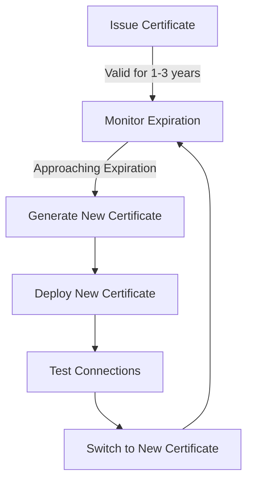

# RabbitMQ Certificates

## Introduction

In today's interconnected world, securing your messaging infrastructure is paramount. RabbitMQ, as a message broker, often handles sensitive data that should be protected during transmission. This is where Transport Layer Security (TLS), formerly known as Secure Sockets Layer (SSL), comes into play. TLS uses certificates to encrypt communications and verify the identity of the server, ensuring that your messages remain confidential and tamper-proof.

This guide will walk you through understanding and implementing TLS certificates in RabbitMQ, providing the foundation you need to secure your messaging infrastructure.

## Understanding TLS/SSL Certificates

Before diving into the RabbitMQ-specific configurations, it's essential to understand what TLS certificates are and how they work.

### What are TLS/SSL Certificates?

TLS certificates are digital documents that serve two main purposes:

1. **Authentication**: Verifying that a server is who it claims to be
2. **Encryption**: Establishing a secure encrypted connection

A TLS certificate typically contains:
- The certificate holder's name (Common Name)
- The certificate's public key
- The digital signature of the Certificate Authority (CA)
- The certificate's validity period
- Additional metadata

### Public Key Infrastructure (PKI)

TLS certificates are part of a Public Key Infrastructure (PKI), which relies on asymmetric cryptography using key pairs:

- **Public Key**: Distributed freely and used to encrypt data
- **Private Key**: Kept secret and used to decrypt data encrypted with the corresponding public key


## Configuring TLS in RabbitMQ

Let's go through the steps to enable TLS in RabbitMQ:

### Step 1: Generate Certificates

First, you'll need to generate a Certificate Authority (CA) and server certificates. For development, you can use OpenSSL:

```bash
# Create a directory for certificates
mkdir -p /path/to/rabbitmq/certificates
cd /path/to/rabbitmq/certificates

# Generate a private CA key
openssl genrsa -out ca-key.pem 2048

# Generate a CA certificate
openssl req -x509 -new -key ca-key.pem -out ca-cert.pem -days 365 -subj "/CN=MyRabbitMQCA"

# Generate a server key
openssl genrsa -out server-key.pem 2048

# Generate a certificate signing request (CSR)
openssl req -new -key server-key.pem -out server-req.pem -subj "/CN=rabbitmq.example.com"

# Sign the server certificate with our CA
openssl x509 -req -in server-req.pem -CA ca-cert.pem -CAkey ca-key.pem -CAcreateserial -out server-cert.pem -days 365
```

### Step 2: Configure RabbitMQ

Update your RabbitMQ configuration to use these certificates. In the `rabbitmq.conf` file:

```plaintext
listeners.ssl.default = 5671

ssl_options.cacertfile = /path/to/rabbitmq/certificates/ca-cert.pem
ssl_options.certfile   = /path/to/rabbitmq/certificates/server-cert.pem
ssl_options.keyfile    = /path/to/rabbitmq/certificates/server-key.pem
ssl_options.verify     = verify_peer
ssl_options.fail_if_no_peer_cert = false
```

This configuration:
- Opens a TLS listener on port 5671
- Specifies the location of the CA certificate, server certificate, and server private key
- Sets verification mode to `verify_peer`, which will verify client certificates if they are presented
- Sets `fail_if_no_peer_cert` to false, meaning client certificates are optional

### Step 3: Restart RabbitMQ

Apply the changes by restarting the RabbitMQ service:

```bash
# For Debian/Ubuntu
sudo systemctl restart rabbitmq-server

# For CentOS/RHEL
sudo service rabbitmq-server restart

# For Windows (as administrator)
rabbitmq-service.bat stop
rabbitmq-service.bat start
```

## Connecting to RabbitMQ with TLS

Now, let's see how to connect to the secured RabbitMQ instance using various programming languages:

### JavaScript (Node.js with amqplib)

```javascript
const amqp = require('amqplib');
const fs = require('fs');

async function connectWithTLS() {
  try {
    // Read the CA certificate
    const ca = fs.readFileSync('/path/to/ca-cert.pem');
    
    // Connect with TLS options
    const connection = await amqp.connect({
      protocol: 'amqps',
      hostname: 'rabbitmq.example.com',
      port: 5671,
      username: 'user',
      password: 'password',
      vhost: '/',
      tls: {
        ca: [ca],
        rejectUnauthorized: true
      }
    });
    
    const channel = await connection.createChannel();
    console.log("Successfully connected with TLS!");
    
    // Use the channel
    // ...
    
    // Close the connection when done
    await channel.close();
    await connection.close();
  } catch (error) {
    console.error("Error connecting:", error);
  }
}

connectWithTLS();
```

### Python (with Pika)

```python
import pika
import ssl

# Create a SSL context
context = ssl.create_default_context(
    cafile="/path/to/ca-cert.pem"
)

# Configure connection parameters with SSL options
ssl_options = pika.SSLOptions(context)
connection_params = pika.ConnectionParameters(
    host='rabbitmq.example.com',
    port=5671,
    virtual_host='/',
    credentials=pika.credentials.PlainCredentials('user', 'password'),
    ssl_options=ssl_options
)

# Connect to RabbitMQ
connection = pika.BlockingConnection(connection_params)
channel = connection.channel()
print("Successfully connected with TLS!")

# Use the channel
# ...

# Close the connection when done
connection.close()
```

### Java (with Spring AMQP)

```java
import org.springframework.amqp.rabbit.connection.CachingConnectionFactory;
import org.springframework.amqp.rabbit.core.RabbitTemplate;

public class TLSRabbitMQExample {
    public static void main(String[] args) {
        // Set system properties for SSL
        System.setProperty("javax.net.ssl.trustStore", "/path/to/truststore.jks");
        System.setProperty("javax.net.ssl.trustStorePassword", "password");
        
        // Configure connection factory
        CachingConnectionFactory connectionFactory = new CachingConnectionFactory();
        connectionFactory.setHost("rabbitmq.example.com");
        connectionFactory.setPort(5671);
        connectionFactory.setUsername("user");
        connectionFactory.setPassword("password");
        connectionFactory.setVirtualHost("/");
        connectionFactory.setUseSSL(true);
        
        // Create RabbitTemplate
        RabbitTemplate rabbitTemplate = new RabbitTemplate(connectionFactory);
        
        // Use the template
        // ...
        
        // Close connection when done
        connectionFactory.destroy();
    }
}
```

## Certificate Verification Modes

RabbitMQ supports different verification modes, which can be configured in the `rabbitmq.conf` file:

1. **verify_none**: No verification of client certificates
2. **verify_peer**: Verifies client certificates if they are presented

For production environments, you might want to require client certificates by setting:

```plaintext
ssl_options.verify     = verify_peer
ssl_options.fail_if_no_peer_cert = true
```

This ensures only authenticated clients can connect to RabbitMQ.

## Client Certificate Authentication

For enhanced security, you can authenticate clients using certificates:

### Step 1: Generate Client Certificates

```bash
# Generate client key
openssl genrsa -out client-key.pem 2048

# Generate client certificate signing request
openssl req -new -key client-key.pem -out client-req.pem -subj "/CN=rabbit-client"

# Sign client certificate with our CA
openssl x509 -req -in client-req.pem -CA ca-cert.pem -CAkey ca-key.pem -CAcreateserial -out client-cert.pem -days 365
```

### Step 2: Configure RabbitMQ for Client Authentication

Update `rabbitmq.conf`:

```plaintext
ssl_options.verify     = verify_peer
ssl_options.fail_if_no_peer_cert = true
```

### Step 3: Update Client Code

For Node.js:

```javascript
const amqp = require('amqplib');
const fs = require('fs');

async function connectWithClientCert() {
  try {
    // Read certificates and key
    const ca = fs.readFileSync('/path/to/ca-cert.pem');
    const cert = fs.readFileSync('/path/to/client-cert.pem');
    const key = fs.readFileSync('/path/to/client-key.pem');
    
    // Connect with TLS options including client certificate
    const connection = await amqp.connect({
      protocol: 'amqps',
      hostname: 'rabbitmq.example.com',
      port: 5671,
      username: 'user',
      password: 'password',
      vhost: '/',
      tls: {
        ca: [ca],
        cert: cert,
        key: key,
        rejectUnauthorized: true
      }
    });
    
    // Rest of the code...
  } catch (error) {
    console.error("Error connecting:", error);
  }
}
```

## Certificate Renewal and Management

TLS certificates have expiration dates, typically 1-3 years after issuance. You should:

1. **Monitor expiration dates** to avoid service disruptions
2. **Implement automated renewal** when possible
3. **Test certificate rotation** to ensure smooth transitions



## Troubleshooting Certificate Issues

Common issues with TLS certificates include:

### 1. Certificate Path Issues

Ensure the paths in your configuration are absolute and the files are readable by the RabbitMQ service user.

### 2. Certificate Verification Failures

If connections are failing with verification errors:

```bash
# Check certificate information
openssl x509 -in server-cert.pem -text -noout

# Verify that a certificate is signed by the CA
openssl verify -CAfile ca-cert.pem server-cert.pem
```

### 3. Hostname Verification

The Common Name (CN) or Subject Alternative Name (SAN) in the server certificate must match the hostname used by clients to connect.

## Security Best Practices

To maximize the security of your RabbitMQ deployment:

1. **Use strong cipher suites** by configuring:
   ```plaintext
   ssl_options.ciphers.1 = ECDHE-ECDSA-AES256-GCM-SHA384
   ssl_options.ciphers.2 = ECDHE-RSA-AES256-GCM-SHA384
   ssl_options.ciphers.3 = ECDHE-ECDSA-AES128-GCM-SHA256
   ```

2. **Implement certificate revocation** using Certificate Revocation Lists (CRLs) or Online Certificate Status Protocol (OCSP)

3. **Regularly rotate certificates** before they expire

4. **Use separate certificates** for different environments (development, staging, production)

5. **Combine TLS with other security measures** like VPNs, firewalls, and proper access controls

## Summary

Using TLS certificates with RabbitMQ is crucial for securing your messaging infrastructure. In this guide, we've covered:

- Understanding the basics of TLS/SSL certificates
- Generating and configuring certificates for RabbitMQ
- Connecting to a TLS-enabled RabbitMQ broker from different languages
- Implementing client certificate authentication
- Managing and troubleshooting certificates
- Following security best practices

By implementing these practices, you can ensure that your RabbitMQ communications remain secure and private, protecting your data in transit.

## Additional Resources

- [Official RabbitMQ TLS Documentation](https://www.rabbitmq.com/ssl.html)
- [OpenSSL Documentation](https://www.openssl.org/docs/)
- [Let's Encrypt](https://letsencrypt.org/) - For free, automated certificates

## Exercises

1. Set up a RabbitMQ instance with TLS and connect to it from a client application.
2. Generate client certificates and configure RabbitMQ to require client certificate authentication.
3. Implement a certificate rotation procedure without service disruption.
4. Configure RabbitMQ to use strong cipher suites and test the connection security with an SSL testing tool.