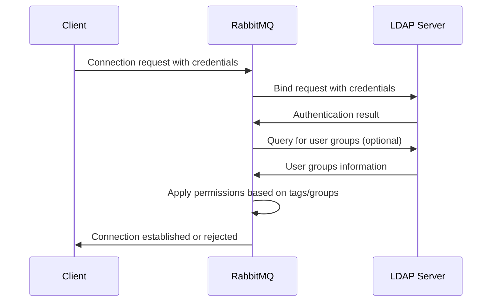

# RabbitMQ LDAP Integration

## Introduction

When managing user access to your RabbitMQ message broker in an enterprise environment, maintaining separate user credentials can quickly become cumbersome. Lightweight Directory Access Protocol (LDAP) offers a solution by allowing RabbitMQ to authenticate users against a centralized directory service such as Microsoft Active Directory or OpenLDAP.

This guide will walk you through the process of integrating RabbitMQ with LDAP, enabling you to:

- Authenticate RabbitMQ users against your existing directory
- Map LDAP groups to RabbitMQ permissions
- Configure connection parameters for optimal performance
- Troubleshoot common LDAP integration issues

## Prerequisites

Before proceeding with LDAP integration, ensure you have:

- A running RabbitMQ server (version 3.8.0 or later)
- Access to an LDAP server (e.g., OpenLDAP, Microsoft Active Directory)
- Basic understanding of LDAP concepts (DN, search bases, filters)
- Administrator access to the RabbitMQ server

## Understanding the Authentication Flow

When configured with LDAP integration, RabbitMQ follows this authentication flow:



## Enabling the LDAP Plugin

The first step is to enable the LDAP authentication plugin that comes bundled with RabbitMQ:

```bash
rabbitmq-plugins enable rabbitmq_auth_backend_ldap
```

This command activates the plugin that provides LDAP authentication capabilities.

## Basic LDAP Configuration

LDAP configuration is done in the RabbitMQ configuration file. For RabbitMQ 3.8 and later, this is typically located at `/etc/rabbitmq/rabbitmq.conf` in Unix-based systems or `%APPDATA%\RabbitMQ\rabbitmq.conf` in Windows.

Here's a basic configuration example:

```properties
# Enable LDAP authentication
auth_backends.1 = ldap

# LDAP server connection settings
auth_ldap.servers.1 = ldap-server.example.com
auth_ldap.port = 389
auth_ldap.user_dn_pattern = cn=${username},ou=People,dc=example,dc=com

# Use TLS for secure connection
auth_ldap.use_ssl = true
```

Let's break down the important configuration parameters:

- `auth_backends.1 = ldap`: This tells RabbitMQ to use LDAP as its authentication backend.
- `auth_ldap.servers.1`: The LDAP server hostname or IP address.
- `auth_ldap.port`: The port on which your LDAP server listens (389 for standard LDAP, 636 for LDAPS).
- `auth_ldap.user_dn_pattern`: The pattern used to construct the Distinguished Name (DN) from the username.

## Verifying the Basic Configuration

After setting up the basic configuration, restart RabbitMQ:

```bash
systemctl restart rabbitmq-server   # For systemd-based systems
# OR
rabbitmqctl stop
rabbitmq-server -detached           # Alternative approach
```

You can test the authentication using the RabbitMQ CLI:

```bash
rabbitmqctl authenticate_user "ldap-user" "password"
```

If successful, the command will output: `Authenticating user "ldap-user" ...`

## Advanced LDAP Configuration

### User Search Configuration

If your LDAP structure is more complex, you might need to search for users rather than using a simple pattern:

```properties
# User search configuration
auth_ldap.user_dn_pattern = none
auth_ldap.user_bind_pattern = ${username}
auth_ldap.user_bind_base_dn = ou=People,dc=example,dc=com
auth_ldap.user_bind_attribute = uid
```

This configuration allows RabbitMQ to search for users within the specified base DN.

### Group-Based Authorization

One of the most powerful features of LDAP integration is the ability to map LDAP groups to RabbitMQ tags and permissions:

```properties
# Group membership configuration
auth_ldap.dn_lookup_attribute = uid
auth_ldap.dn_lookup_base = ou=People,dc=example,dc=com
auth_ldap.group_lookup_base = ou=Groups,dc=example,dc=com

# Map LDAP groups to RabbitMQ tags
auth_ldap.tag_queries.administrator.query = member=${user_dn}
auth_ldap.tag_queries.administrator.base = cn=administrators,ou=Groups,dc=example,dc=com

auth_ldap.tag_queries.management.query = member=${user_dn}
auth_ldap.tag_queries.management.base = cn=management,ou=Groups,dc=example,dc=com
```

This configuration maps:
- Users in the LDAP group `cn=administrators,ou=Groups,dc=example,dc=com` to RabbitMQ's `administrator` tag
- Users in the LDAP group `cn=management,ou=Groups,dc=example,dc=com` to RabbitMQ's `management` tag

### Virtual Host Access Control

You can also control which LDAP users or groups have access to specific RabbitMQ virtual hosts:

```properties
# Virtual host access control
auth_ldap.vhost_access_query.base = ou=vhosts,dc=example,dc=com
auth_ldap.vhost_access_query.query = &(objectClass=rabbitVHost)(cn=${vhost})(memberOf=${user_dn})
```

This configuration checks if a user has access to a specific virtual host based on LDAP attributes.

## Complete Configuration Example

Here's a comprehensive example bringing together all the concepts we've discussed:

```properties
# Authentication backends
auth_backends.1 = ldap
auth_backends.2 = internal

# LDAP server settings
auth_ldap.servers.1 = ldap.example.com
auth_ldap.port = 389
auth_ldap.timeout = 30000
auth_ldap.log = true

# TLS configuration
auth_ldap.use_ssl = true
auth_ldap.ssl_options.verify = verify_peer
auth_ldap.ssl_options.fail_if_no_peer_cert = false
auth_ldap.ssl_options.cacertfile = /path/to/cacert.pem

# User authentication
auth_ldap.user_dn_pattern = cn=${username},ou=Users,dc=example,dc=com

# Group lookups
auth_ldap.dn_lookup_attribute = userPrincipalName
auth_ldap.dn_lookup_base = ou=Users,dc=example,dc=com
auth_ldap.group_lookup_base = ou=Groups,dc=example,dc=com

# Tag queries
auth_ldap.tag_queries.administrator.base = cn=rabbitmq-admins,ou=Groups,dc=example,dc=com
auth_ldap.tag_queries.administrator.query = member=${user_dn}

auth_ldap.tag_queries.management.base = cn=rabbitmq-management,ou=Groups,dc=example,dc=com
auth_ldap.tag_queries.management.query = member=${user_dn}

# Virtual host access control
auth_ldap.vhost_access_query.base = ou=vhosts,dc=example,dc=com
auth_ldap.vhost_access_query.query = &(objectClass=rabbitVHost)(cn=${vhost})(memberOf=${user_dn})

# Resource access control
auth_ldap.resource_access_query.base = ou=resources,dc=example,dc=com
auth_ldap.resource_access_query.query = &(objectClass=rabbitResource)(cn=${resource})(memberOf=${user_dn})
```

## Practical Example: OpenLDAP Integration

Let's walk through a real-world example of integrating RabbitMQ with OpenLDAP:

1. First, ensure your OpenLDAP server is properly configured with users and groups.

2. Create a basic LDIF file to add RabbitMQ-related groups to your LDAP directory:

```ldif
dn: cn=rabbitmq-admins,ou=Groups,dc=example,dc=com
objectClass: groupOfNames
cn: rabbitmq-admins
member: cn=admin,ou=Users,dc=example,dc=com

dn: cn=rabbitmq-developers,ou=Groups,dc=example,dc=com
objectClass: groupOfNames
cn: rabbitmq-developers
member: cn=developer1,ou=Users,dc=example,dc=com
member: cn=developer2,ou=Users,dc=example,dc=com
```

3. Add these entries to your LDAP directory:

```bash
ldapadd -x -D "cn=admin,dc=example,dc=com" -W -f rabbitmq-groups.ldif
```

4. Configure RabbitMQ to use OpenLDAP:

```properties
# OpenLDAP configuration
auth_backends.1 = ldap

auth_ldap.servers.1 = ldap.example.com
auth_ldap.port = 389

auth_ldap.user_dn_pattern = cn=${username},ou=Users,dc=example,dc=com

auth_ldap.tag_queries.administrator.base = cn=rabbitmq-admins,ou=Groups,dc=example,dc=com
auth_ldap.tag_queries.administrator.query = member=${user_dn}

auth_ldap.tag_queries.management.base = cn=rabbitmq-developers,ou=Groups,dc=example,dc=com
auth_ldap.tag_queries.management.query = member=${user_dn}
```

5. Restart RabbitMQ and test the authentication:

```bash
rabbitmqctl authenticate_user "admin" "password"
```

## Troubleshooting LDAP Integration

When troubleshooting LDAP integration issues, consider the following approaches:

### Enable Detailed Logging

Increase log verbosity to see detailed LDAP operations:

```properties
auth_ldap.log = true
log.connection.level = debug
```

### Test LDAP Connectivity

Use `ldapsearch` to verify connectivity from the RabbitMQ server to the LDAP server:

```bash
ldapsearch -x -H ldap://ldap.example.com -b "ou=Users,dc=example,dc=com" -D "cn=admin,dc=example,dc=com" -W
```

### Common LDAP Error Messages

| Error | Possible Cause | Solution |
|-------|----------------|----------|
| `Invalid credentials` | Incorrect username/password or incorrect DN pattern | Verify credentials and check user_dn_pattern |
| `Can't contact LDAP server` | Network connectivity issue or wrong server address | Check network settings and firewall rules |
| `Operations error` | LDAP server configuration issue | Check LDAP server logs |
| `Invalid DN syntax` | Malformed DN in configuration | Verify DN syntax in configuration |

## Security Considerations

When implementing LDAP integration, keep these security best practices in mind:

1. **Use TLS for LDAP connections**: Always enable TLS to encrypt communications between RabbitMQ and the LDAP server.

2. **Implement connection pooling**: For high-traffic environments, configure connection pooling:

```properties
auth_ldap.pool_size = 10
auth_ldap.idle_timeout = 300000
```

3. **Utilize service accounts**: Use a dedicated service account with minimal permissions for RabbitMQ's LDAP binding operations.

4. **Fail-safe configuration**: Configure a fallback authentication method:

```properties
auth_backends.1 = ldap
auth_backends.2 = internal
```

This allows using the internal database if LDAP becomes unavailable.

## Summary

In this guide, we explored how to integrate RabbitMQ with LDAP for authentication and authorization. We covered:

- Basic LDAP configuration for user authentication
- Advanced settings for group-based authorization
- Virtual host access control through LDAP
- A practical example using OpenLDAP
- Troubleshooting techniques for common issues
- Security best practices

By integrating RabbitMQ with your organization's LDAP directory, you can centralize user management, enhance security, and simplify administrative tasks.

## Additional Resources

- [Official RabbitMQ LDAP Documentation](https://www.rabbitmq.com/ldap.html)
- [LDAP Configuration Reference](https://www.rabbitmq.com/access-control.html)
- [RabbitMQ Security Guide](https://www.rabbitmq.com/security.html)

## Exercises

1. Configure RabbitMQ to authenticate against your organization's LDAP server.
2. Create LDAP groups for different RabbitMQ roles (administrators, monitoring, developers).
3. Implement vhost access control based on LDAP group membership.
4. Set up TLS for secure communication between RabbitMQ and your LDAP server.
5. Configure a fallback authentication mechanism for high availability.