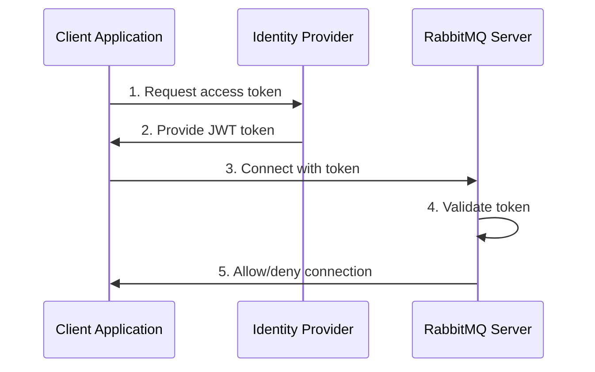
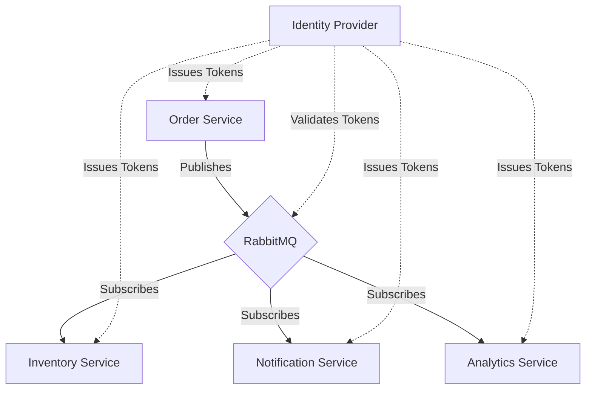

# RabbitMQ OAuth Integration

## Introduction

Message brokers like RabbitMQ serve as critical infrastructure components in distributed systems, managing communication between services. As such, securing these brokers properly is essential. While RabbitMQ traditionally relies on username/password authentication, modern applications often require more sophisticated security measures.

OAuth (Open Authorization) is an industry-standard protocol for authorization that enables third-party applications to obtain limited access to a service. Integrating OAuth with RabbitMQ provides several benefits:

- **Token-based authentication** instead of permanent credentials
- **Centralized access management** through an identity provider
- **Granular permission control** with scopes and claims
- **Enhanced security** with shorter-lived access tokens
- **Simplified integration** with existing OAuth/OIDC systems

In this guide, we'll explore how to integrate OAuth authentication with RabbitMQ, making your messaging infrastructure more secure and easier to manage.

## Prerequisites

Before we begin, you should have:

- A working RabbitMQ server (3.8.0 or higher)
- Basic familiarity with RabbitMQ concepts
- An OAuth provider (like Keycloak, Auth0, or Okta)
- Docker installed (for our example setup)

## Understanding OAuth in RabbitMQ Context

RabbitMQ's OAuth implementation relies on JWT (JSON Web Tokens) for authentication. Let's understand the flow:



In this flow:

1. Your client application authenticates with an Identity Provider
2. The Identity Provider issues a JWT token with appropriate scopes/claims
3. The client uses this token to connect to RabbitMQ
4. RabbitMQ validates the token's signature and checks permissions
5. If valid, RabbitMQ grants access based on token claims

## Setting Up the OAuth Plugin

RabbitMQ requires the `rabbitmq_auth_backend_oauth2` plugin to support OAuth authentication.

### Step 1: Enable the Plugin

```bash
rabbitmq-plugins enable rabbitmq_auth_backend_oauth2
```

### Step 2: Configure RabbitMQ

Edit your `rabbitmq.conf` file to include OAuth configuration:

```
auth_backends.1 = rabbit_auth_backend_oauth2
auth_backends.2 = rabbit_auth_backend_internal

## OAuth 2 server details
auth_oauth2.resource_server_id = rabbitmq
auth_oauth2.additional_scopes_key = permissions
auth_oauth2.default_key = my_key

## JWT signing key
auth_oauth2.key.my_key.jwk_url = http://oauth-server/.well-known/jwks.json
```

This configuration:
- Enables OAuth as the primary authentication method
- Keeps internal authentication as a fallback
- Sets the resource server ID to "rabbitmq"
- Configures where to find the JWT signing keys

## Configuring Your OAuth Provider

For this tutorial, we'll use Keycloak as our OAuth provider. Let's set it up:

### Step 1: Start Keycloak

```bash
docker run -d --name keycloak \
  -p 8080:8080 \
  -e KEYCLOAK_ADMIN=admin \
  -e KEYCLOAK_ADMIN_PASSWORD=admin \
  quay.io/keycloak/keycloak:latest \
  start-dev
```

### Step 2: Create a RabbitMQ Realm

1. Log in to Keycloak admin console at http://localhost:8080
2. Create a new realm called "rabbitmq"
3. Add a client:
   - Client ID: `rabbitmq-client`
   - Client Protocol: `openid-connect`
   - Access Type: `confidential`
   - Service Accounts Enabled: `ON`

### Step 3: Configure Scopes and Client Roles

Create the following client roles for fine-grained permissions:

- `rabbitmq.read:*/*`
- `rabbitmq.write:*/*`
- `rabbitmq.configure:*/*`
- `rabbitmq.tag:administrator`

These roles map directly to RabbitMQ permissions.

### Step 4: Create a Mapper for Client Roles

1. Go to your client's "Mappers" tab
2. Create a new mapper:
   - Name: `rabbitmq-permissions`
   - Mapper Type: `User Client Role`
   - Client ID: `rabbitmq-client`
   - Token Claim Name: `permissions`
   - Claim JSON Type: `String`
   - Add to ID token: `ON`
   - Add to access token: `ON`
   - Add to userinfo: `ON`
   - Multivalued: `ON`

## Client Application Integration

Now let's implement a simple Node.js application that connects to RabbitMQ using OAuth:

```javascript
const amqplib = require('amqplib');
const axios = require('axios');

async function getOAuthToken() {
  const response = await axios.post('http://localhost:8080/realms/rabbitmq/protocol/openid-connect/token', 
    new URLSearchParams({
      'grant_type': 'client_credentials',
      'client_id': 'rabbitmq-client',
      'client_secret': 'your-client-secret'
    }), {
      headers: {
        'Content-Type': 'application/x-www-form-urlencoded'
      }
    });
  
  return response.data.access_token;
}

async function connectWithOAuth() {
  try {
    // Get OAuth token
    const token = await getOAuthToken();
    
    // Connect to RabbitMQ using the token
    const connection = await amqplib.connect('amqp://localhost', {
      credentials: {
        mechanism: 'EXTERNAL',
        response: token
      }
    });
    
    console.log('Connected to RabbitMQ with OAuth!');
    const channel = await connection.createChannel();
    
    // Use the channel...
    await channel.assertQueue('oauth-test-queue');
    await channel.sendToQueue('oauth-test-queue', Buffer.from('Message sent with OAuth'));
    
    console.log('Message sent successfully');
    
    // Close the connection
    setTimeout(() => {
      connection.close();
      console.log('Connection closed');
    }, 1000);
    
  } catch (error) {
    console.error('Error:', error.message);
  }
}

connectWithOAuth();
```

Save this as `rabbitmq-oauth-client.js` and install dependencies:

```bash
npm install amqplib axios
```

Run the example:

```bash
node rabbitmq-oauth-client.js
```

## Advanced Configuration: Scope-Based Authorization

RabbitMQ can map OAuth scopes to specific permissions. Here's how to configure more granular access:

```
# In rabbitmq.conf
auth_oauth2.resource_server_id = rabbitmq
auth_oauth2.scope_prefix = rabbitmq.
auth_oauth2.default_key = key1

# Define JWT scope to permission mapping
auth_oauth2.scope_aliases.configure = configure:
auth_oauth2.scope_aliases.read = read:
auth_oauth2.scope_aliases.write = write:
auth_oauth2.scope_aliases.administrator = tag:administrator
```

With this configuration:
- A token with scope `rabbitmq.read:vhosts/myvhost/queues/myqueue` grants read access to that specific queue
- A token with scope `rabbitmq.write:vhosts/myvhost/exchanges/*` grants write access to all exchanges in the vhost
- A token with scope `rabbitmq.tag:administrator` grants administrator privileges

## Troubleshooting OAuth Integration

When implementing OAuth with RabbitMQ, you might encounter these common issues:

### Invalid Token Format

If you see errors like `invalid_token_structure`, ensure:
- Your token is properly formatted as a JWT
- You're passing it in the correct format in the AMQP connection

### Token Validation Failure

For `token_verification_failure` errors:
- Check that RabbitMQ can reach your OAuth server's JWKS endpoint
- Verify the signing keys match between your OAuth server and RabbitMQ config

### Insufficient Permissions

When you see `access_refused` with OAuth:
- Examine the token's scopes/claims to ensure they map to the required RabbitMQ permissions
- Check the RabbitMQ logs for more detailed information

## Security Best Practices

When implementing OAuth with RabbitMQ:

1. **Use short-lived tokens**: Configure your OAuth provider to issue tokens with appropriate expiration times
2. **Implement token rotation**: Design your application to refresh tokens before they expire
3. **Limit scopes**: Assign the minimum permissions needed for each client application
4. **Secure token storage**: Never store OAuth tokens in client-side code or public repositories
5. **Use HTTPS**: Ensure all communication with your OAuth server uses TLS encryption

## Real-World Example: Microservices Architecture

Let's examine a practical example where OAuth integration with RabbitMQ provides significant benefits:

Imagine a microservices architecture with multiple services needing to communicate:



### Implementation Steps:

1. **Central Identity Provider**: All services authenticate with the same OAuth server
2. **Service-Specific Permissions**:
   - Order Service: Needs write access to order exchanges
   - Inventory Service: Needs read access to order queues, write access to inventory exchanges
   - Notification Service: Needs read-only access to specific notification queues
3. **Token-Based Authentication**: Each service uses its own OAuth credentials and receives tokens with appropriate scopes

### Benefits in this Scenario:

- **Centralized Access Control**: Permissions managed from a single point
- **Easy Service Rotation**: When adding or removing services, only update the OAuth configuration
- **Audit Trail**: OAuth server provides logging of all authentication activities
- **No Shared Secrets**: Each service has its own credentials, limiting the impact of compromises

## Summary

OAuth integration with RabbitMQ provides a modern, secure approach to authentication and authorization for your messaging infrastructure. Key advantages include:

- Centralized identity management
- Token-based authentication
- Fine-grained access control
- Integration with existing identity systems
- Enhanced security posture

By following this guide, you've learned:
- How OAuth authentication works with RabbitMQ
- Steps to configure the RabbitMQ OAuth plugin
- Setting up an OAuth provider (Keycloak)
- Implementing client applications with OAuth authentication
- Best practices for OAuth security

## Additional Resources

- [RabbitMQ OAuth Plugin Documentation](https://github.com/rabbitmq/rabbitmq-auth-backend-oauth2)
- [JWT Authentication Mechanism for AMQP](https://github.com/rabbitmq/rabbitmq-server/tree/master/deps/rabbitmq_auth_mechanism_ssl)
- [Keycloak Documentation](https://www.keycloak.org/documentation)
- [OAuth 2.0 Specification](https://oauth.net/2/)

## Exercises

1. Set up RabbitMQ with OAuth using a different provider (Auth0, Okta, etc.)
2. Implement token refresh logic in a client application
3. Configure vhost-specific permissions using OAuth scopes
4. Create a system with multiple applications having different permission levels
5. Implement logging and monitoring for OAuth authentication attempts