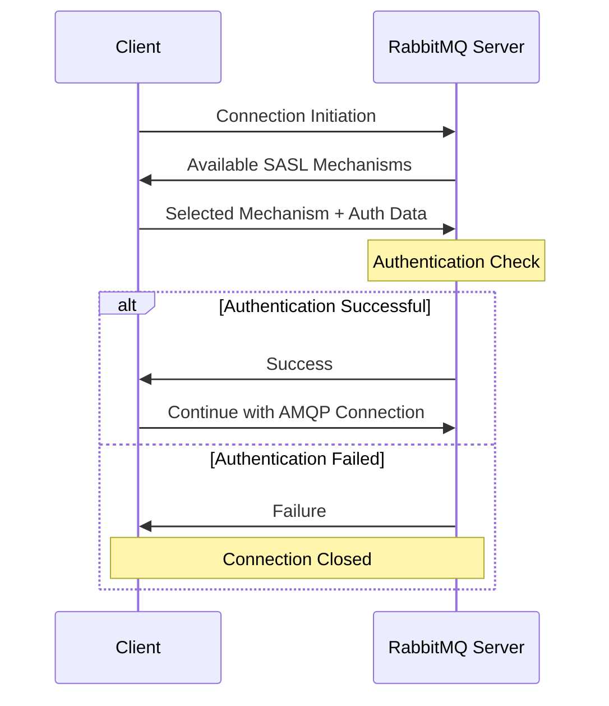

# RabbitMQ SASL

## Introduction

Simple Authentication and Security Layer (SASL) is a framework for authentication and data security in Internet protocols. In the context of RabbitMQ, SASL provides a structured approach to authenticate clients connecting to your message broker. This tutorial explores how SASL works with RabbitMQ, why it's important for secure messaging infrastructure, and how to implement it in your applications.

## What is SASL?

SASL (Simple Authentication and Security Layer) is a framework that separates authentication mechanisms from application protocols, allowing any authentication mechanism supported by SASL to be used in any application protocol that uses SASL.

In RabbitMQ, SASL enables multiple authentication methods beyond the basic username and password approach, providing more flexibility and security options for your messaging infrastructure.

## SASL Authentication Methods in RabbitMQ

RabbitMQ supports several SASL authentication mechanisms:

1. **PLAIN** - Simple username/password authentication (default)
2. **AMQPLAIN** - AMQP-specific plain text authentication
3. **EXTERNAL** - Authentication using SSL/TLS certificates
4. **RABBIT-CR-DEMO** - Challenge-response authentication (for demonstration)

Let's explore each of these mechanisms and learn how to implement them.

## Configuring SASL in RabbitMQ

### PLAIN Authentication (Default)

This is the simplest authentication method and is enabled by default in RabbitMQ.

Here's a basic example of connecting to RabbitMQ using PLAIN authentication:

```javascript
// Node.js example with amqplib
const amqp = require('amqplib');

async function connectWithPlainAuth() {
  try {
    // Connection with PLAIN authentication
    const connection = await amqp.connect({
      protocol: 'amqp',
      hostname: 'localhost',
      port: 5672,
      username: 'guest',
      password: 'guest',
      saslMechanism: 'PLAIN' // explicitly specifying PLAIN
    });
    
    console.log('Connected successfully with PLAIN auth');
    
    // Create a channel
    const channel = await connection.createChannel();
    
    // Close connection after operations
    await connection.close();
  } catch (error) {
    console.error('Error:', error);
  }
}

connectWithPlainAuth();
```

While PLAIN is simple to implement, it transmits credentials in clear text, so it's recommended to use it only with TLS/SSL encryption.

### AMQPLAIN Authentication

AMQPLAIN is an AMQP-specific authentication mechanism similar to PLAIN but formatted according to AMQP-specific rules.

```javascript
// Node.js example with amqplib
const amqp = require('amqplib');

async function connectWithAmqplainAuth() {
  try {
    // Connection with AMQPLAIN authentication
    const connection = await amqp.connect({
      protocol: 'amqp',
      hostname: 'localhost',
      port: 5672,
      username: 'guest',
      password: 'guest',
      saslMechanism: 'AMQPLAIN'
    });
    
    console.log('Connected successfully with AMQPLAIN auth');
    
    // Create a channel
    const channel = await connection.createChannel();
    
    // Close connection after operations
    await connection.close();
  } catch (error) {
    console.error('Error:', error);
  }
}

connectWithAmqplainAuth();
```

### EXTERNAL Authentication with SSL/TLS

The EXTERNAL mechanism allows authentication based on SSL/TLS certificates, providing a higher level of security. This is particularly useful for server-to-server communications.

To use EXTERNAL authentication:

1. First, configure RabbitMQ to use SSL and verify certificates:

```ini
# In rabbitmq.conf
ssl_options.cacertfile = /path/to/ca_certificate.pem
ssl_options.certfile = /path/to/server_certificate.pem
ssl_options.keyfile = /path/to/server_key.pem
ssl_options.verify = verify_peer
ssl_options.fail_if_no_peer_cert = true
```

2. Client connection example:

```python
# Python example with pika
import pika
import ssl

# SSL context
ssl_context = ssl.create_default_context(
    cafile='/path/to/ca_certificate.pem'
)
ssl_context.load_cert_chain(
    certfile='/path/to/client_certificate.pem',
    keyfile='/path/to/client_key.pem'
)

# Connection parameters
ssl_options = pika.SSLOptions(ssl_context)
credentials = pika.credentials.ExternalCredentials()  # EXTERNAL auth

parameters = pika.ConnectionParameters(
    host='localhost',
    port=5671,  # Note: SSL default port is 5671
    credentials=credentials,
    ssl_options=ssl_options
)

# Connect
connection = pika.BlockingConnection(parameters)
channel = connection.channel()
print("Connected using EXTERNAL authentication")

# Close connection
connection.close()
```

## Enabling and Disabling SASL Mechanisms

You can control which SASL mechanisms are available in your RabbitMQ server by modifying the configuration.

In `rabbitmq.conf`:

```ini
# Enable only PLAIN and EXTERNAL mechanisms
auth_mechanisms.1 = PLAIN
auth_mechanisms.2 = EXTERNAL
```

Or in the advanced config format:

```erlang
[
  {rabbit, [
    {auth_mechanisms, ['PLAIN', 'EXTERNAL']}
  ]}
].
```

## SASL Authentication Flow

The SASL authentication process follows this general flow:



## Practical Example: Complete SASL Implementation

Let's walk through a complete example that demonstrates how to:
1. Configure RabbitMQ for SASL authentication
2. Connect using different mechanisms
3. Handle authentication failures

### Step 1: Server Configuration

Create or update your `rabbitmq.conf` file:

```ini
# Enable specific SASL mechanisms
auth_mechanisms.1 = PLAIN
auth_mechanisms.2 = EXTERNAL

# SSL/TLS configuration for EXTERNAL auth
listeners.ssl.default = 5671
ssl_options.cacertfile = /path/to/ca_certificate.pem
ssl_options.certfile = /path/to/server_certificate.pem
ssl_options.keyfile = /path/to/server_key.pem
ssl_options.verify = verify_peer
ssl_options.fail_if_no_peer_cert = true
```

### Step 2: Create a User with Proper Permissions

```bash
# Add a new user
rabbitmqctl add_user app_user secret_password

# Set permissions
rabbitmqctl set_permissions -p / app_user ".*" ".*" ".*"

# Optionally add tags
rabbitmqctl set_user_tags app_user management
```

### Step 3: Client Implementation in Java

Here's a more comprehensive Java example showing SASL authentication:

```java
import com.rabbitmq.client.*;

import javax.net.ssl.*;
import java.io.FileInputStream;
import java.security.KeyStore;
import java.util.HashMap;
import java.util.Map;

public class RabbitMQSaslExample {

    public static void main(String[] args) throws Exception {
        // Example 1: PLAIN Authentication
        connectWithPlainAuth();
        
        // Example 2: SSL with EXTERNAL Authentication
        connectWithExternalAuth();
    }
    
    private static void connectWithPlainAuth() throws Exception {
        ConnectionFactory factory = new ConnectionFactory();
        factory.setHost("localhost");
        factory.setPort(5672);
        factory.setUsername("app_user");
        factory.setPassword("secret_password");
        
        // SASL PLAIN is the default, but you can set it explicitly
        factory.setSaslConfig(DefaultSaslConfig.PLAIN);
        
        try (Connection connection = factory.newConnection();
             Channel channel = connection.createChannel()) {
             
            System.out.println("Connected with PLAIN auth: " + connection.getClientProvidedName());
            
            // Declare a test queue
            channel.queueDeclare("sasl_test_queue", false, false, true, null);
            
            // Publish a test message
            String message = "Hello RabbitMQ with SASL PLAIN";
            channel.basicPublish("", "sasl_test_queue", null, message.getBytes());
            System.out.println("Sent message: " + message);
        }
    }
    
    private static void connectWithExternalAuth() throws Exception {
        try {
            // Load the keystore containing client certificate
            KeyStore keyStore = KeyStore.getInstance("PKCS12");
            keyStore.load(new FileInputStream("/path/to/client_certificate.p12"), "keystore_password".toCharArray());
            
            // Load the truststore containing CA certificates
            KeyStore trustStore = KeyStore.getInstance("JKS");
            trustStore.load(new FileInputStream("/path/to/truststore.jks"), "truststore_password".toCharArray());
            
            // Set up key manager factory
            KeyManagerFactory keyManagerFactory = KeyManagerFactory.getInstance(KeyManagerFactory.getDefaultAlgorithm());
            keyManagerFactory.init(keyStore, "keystore_password".toCharArray());
            
            // Set up trust manager factory
            TrustManagerFactory trustManagerFactory = TrustManagerFactory.getInstance(TrustManagerFactory.getDefaultAlgorithm());
            trustManagerFactory.init(trustStore);
            
            // Set up SSL context
            SSLContext sslContext = SSLContext.getInstance("TLSv1.2");
            sslContext.init(keyManagerFactory.getKeyManagers(), trustManagerFactory.getTrustManagers(), null);
            
            // Configure RabbitMQ connection
            ConnectionFactory factory = new ConnectionFactory();
            factory.setHost("localhost");
            factory.setPort(5671); // SSL port
            
            // Configure SSL
            factory.useSslProtocol(sslContext);
            
            // Use EXTERNAL SASL mechanism
            factory.setSaslConfig(DefaultSaslConfig.EXTERNAL);
            
            // Connect
            try (Connection connection = factory.newConnection();
                 Channel channel = connection.createChannel()) {
                
                System.out.println("Connected with EXTERNAL auth: " + connection.getClientProvidedName());
                
                // Declare a test queue
                channel.queueDeclare("sasl_external_test_queue", false, false, true, null);
                
                // Publish a test message
                String message = "Hello RabbitMQ with SASL EXTERNAL";
                channel.basicPublish("", "sasl_external_test_queue", null, message.getBytes());
                System.out.println("Sent message: " + message);
            }
        } catch (Exception e) {
            System.err.println("Error with EXTERNAL authentication: " + e.getMessage());
            e.printStackTrace();
        }
    }
}
```

### Step 4: Handling Authentication Failures

It's important to properly handle authentication failures in your applications:

```javascript
// Node.js example with error handling
const amqp = require('amqplib');

async function connectWithErrorHandling() {
  try {
    const connection = await amqp.connect({
      protocol: 'amqp',
      hostname: 'localhost',
      port: 5672,
      username: 'wrong_user',
      password: 'wrong_password',
      saslMechanism: 'PLAIN'
    });
    
    console.log('Connected successfully');
    await connection.close();
  } catch (error) {
    if (error.code === 403) {
      console.error('Authentication failed: Invalid credentials');
      // Implement retry logic or alert system
    } else {
      console.error('Connection error:', error.message);
    }
  }
}

connectWithErrorHandling();
```

## Security Considerations

When implementing SASL with RabbitMQ, keep these security best practices in mind:

1. **Always use TLS/SSL** with PLAIN and AMQPLAIN mechanisms to prevent credential sniffing
2. **Rotate credentials** regularly, especially for production systems
3. **Use the principle of least privilege** when assigning permissions to RabbitMQ users
4. **Consider EXTERNAL authentication** with certificates for server-to-server communication
5. **Audit authentication attempts** by enabling appropriate logging
6. **Implement connection throttling** to prevent brute force attacks

## Troubleshooting SASL Authentication

Common issues and their solutions:

### 1. Authentication Failures

**Symptoms:** Connection errors with messages like "ACCESS_REFUSED" or "Login was refused"

**Solutions:**
- Verify username and password are correct
- Check that the user has permissions on the virtual host
- Confirm the SASL mechanism is enabled on the server

### 2. SSL/TLS Certificate Issues

**Symptoms:** Connection errors related to certificate validation

**Solutions:**
- Verify certificate paths are correct
- Check certificate expiration dates
- Ensure the client trusts the server's CA
- Confirm the server is configured to use the correct certificates

### 3. Mechanism Not Supported

**Symptoms:** "Mechanism not supported" errors

**Solutions:**
- Check that the requested mechanism is enabled in the RabbitMQ configuration
- Restart RabbitMQ after configuration changes

## Example: Logging SASL Authentication Events

Enable detailed SASL logging to troubleshoot authentication issues:

```ini
# In rabbitmq.conf
log.connection.level = debug
```

This will log authentication attempts and failures with detailed information.

## Summary

SASL provides a flexible framework for authenticating clients to your RabbitMQ server. In this guide, we've explored:

- Different SASL authentication mechanisms supported by RabbitMQ
- How to configure your RabbitMQ server for various SASL methods
- Client implementation examples in multiple languages
- Security best practices and troubleshooting tips

By implementing SASL properly, you can significantly enhance the security of your messaging infrastructure, ensuring that only authorized clients can connect to your RabbitMQ server.

## Additional Resources

- [RabbitMQ Official Documentation on Authentication](https://www.rabbitmq.com/access-control.html)
- [IETF RFC 4422: Simple Authentication and Security Layer (SASL)](https://tools.ietf.org/html/rfc4422)
- [RabbitMQ TLS Documentation](https://www.rabbitmq.com/ssl.html)

## Exercises

1. Configure a RabbitMQ server to use only the PLAIN and EXTERNAL SASL mechanisms.
2. Implement a client that can fall back to different authentication mechanisms if the preferred one fails.
3. Set up a RabbitMQ cluster with TLS and EXTERNAL authentication using client certificates.
4. Create a logging mechanism that tracks failed authentication attempts and alerts administrators.
5. Implement a credential rotation system for your RabbitMQ users that follows security best practices.