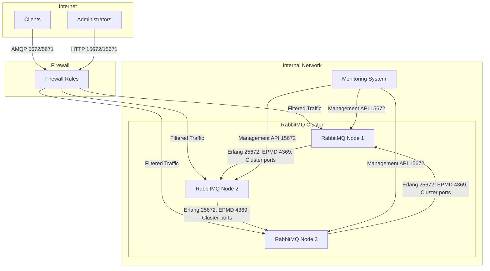

# RabbitMQ Firewall Configuration

## Introduction

Properly configuring firewalls for RabbitMQ installations is a critical aspect of message broker security. Firewalls act as a barrier between your RabbitMQ servers and potential threats, controlling which network traffic is allowed to reach your messaging infrastructure. 

In this guide, we'll explore how to configure firewalls for RabbitMQ environments to enhance security without compromising functionality. This is especially important when RabbitMQ servers are exposed to untrusted networks or when you need to comply with security policies and regulations.

## Understanding RabbitMQ Network Requirements

Before configuring a firewall, it's essential to understand which ports RabbitMQ uses and which connections should be allowed.

### Default Ports Used by RabbitMQ

RabbitMQ requires several ports to be open for different services:

| Port | Protocol | Description |
|------|----------|-------------|
| 5672 | AMQP     | The main protocol used by RabbitMQ for messaging |
| 5671 | AMQP/TLS | Secure AMQP with TLS |
| 15672 | HTTP    | Management UI and HTTP API |
| 15671 | HTTPS   | Secure Management UI and HTTP API |
| 25672 | Erlang  | Used for inter-node and CLI tool communication |
| 4369  | EPMD    | Erlang Port Mapper Daemon for node discovery |
| 35672-35682 | Cluster | Used for cluster communication (dynamic range) |

### Network Traffic Types

When planning your firewall configuration, consider different types of traffic:

1. **Client connections** - Applications connecting to RabbitMQ
2. **Management access** - Admin UI access
3. **Cluster traffic** - Communication between RabbitMQ nodes
4. **Monitoring systems** - Health checks and metrics collection

## Basic Firewall Configuration

Let's start with a basic firewall configuration for a standalone RabbitMQ server:

```bash
# Allow incoming AMQP connections
sudo iptables -A INPUT -p tcp --dport 5672 -j ACCEPT

# Allow Management UI access (restrict to admin IP ranges if possible)
sudo iptables -A INPUT -p tcp --dport 15672 -s 192.168.1.0/24 -j ACCEPT

# Allow SSH for management
sudo iptables -A INPUT -p tcp --dport 22 -j ACCEPT

# Set default policies
sudo iptables -A INPUT -m state --state ESTABLISHED,RELATED -j ACCEPT
sudo iptables -A INPUT -i lo -j ACCEPT
sudo iptables -P INPUT DROP
```

The above example:
- Allows AMQP connections on port 5672
- Restricts management UI access to a specific subnet
- Permits SSH connections for server management
- Allows established connections to continue
- Sets the default policy to drop unlisted traffic

## Clustered RabbitMQ Firewall Configuration

For clustered RabbitMQ environments, more ports need to be opened between nodes:

```bash
# Inter-node communication
# EPMD
sudo iptables -A INPUT -p tcp --dport 4369 -s <cluster-network> -j ACCEPT

# Erlang distribution
sudo iptables -A INPUT -p tcp --dport 25672 -s <cluster-network> -j ACCEPT

# Dynamic cluster ports (may vary based on configuration)
sudo iptables -A INPUT -p tcp --dport 35672:35682 -s <cluster-network> -j ACCEPT
```

Replace `<cluster-network>` with your actual cluster network CIDR notation (e.g., 10.0.0.0/24).

## Visualizing RabbitMQ Firewall Configuration

The following diagram illustrates a typical RabbitMQ deployment with firewall considerations:



## Implementing Firewall Rules on Different Systems

### Linux (iptables)

Here's a more complete iptables script for a RabbitMQ server:

```bash
#!/bin/bash

# Flush existing rules
iptables -F

# Set default chain policies
iptables -P INPUT DROP
iptables -P FORWARD DROP
iptables -P OUTPUT ACCEPT

# Allow loopback and established connections
iptables -A INPUT -i lo -j ACCEPT
iptables -A INPUT -m state --state ESTABLISHED,RELATED -j ACCEPT

# Allow SSH (restrict to your admin network if possible)
iptables -A INPUT -p tcp --dport 22 -j ACCEPT

# RabbitMQ AMQP
iptables -A INPUT -p tcp --dport 5672 -j ACCEPT
# RabbitMQ AMQP/TLS
iptables -A INPUT -p tcp --dport 5671 -j ACCEPT

# RabbitMQ Management UI (restrict to admin networks)
iptables -A INPUT -p tcp --dport 15672 -s 192.168.1.0/24 -j ACCEPT
# RabbitMQ Management UI/TLS
iptables -A INPUT -p tcp --dport 15671 -s 192.168.1.0/24 -j ACCEPT

# Cluster traffic (only needed in a cluster, adjust IPs to your cluster network)
CLUSTER_NETWORK="10.0.0.0/24"
iptables -A INPUT -p tcp --dport 4369 -s $CLUSTER_NETWORK -j ACCEPT
iptables -A INPUT -p tcp --dport 25672 -s $CLUSTER_NETWORK -j ACCEPT
iptables -A INPUT -p tcp --dport 35672:35682 -s $CLUSTER_NETWORK -j ACCEPT

# Save rules
if [ -x "$(which netfilter-persistent)" ]; then
    netfilter-persistent save
elif [ -x "$(which iptables-save)" ]; then
    iptables-save > /etc/iptables/rules.v4
fi

echo "Firewall rules applied and saved."
```

### Windows Firewall

For Windows systems, you can use PowerShell to configure the Windows Firewall:

```powershell
# Allow AMQP traffic
New-NetFirewallRule -DisplayName "RabbitMQ AMQP" -Direction Inbound -Protocol TCP -LocalPort 5672 -Action Allow

# Allow AMQPS (TLS) traffic
New-NetFirewallRule -DisplayName "RabbitMQ AMQPS" -Direction Inbound -Protocol TCP -LocalPort 5671 -Action Allow

# Allow Management Interface (restrict to admin IPs)
New-NetFirewallRule -DisplayName "RabbitMQ Management" -Direction Inbound -Protocol TCP -LocalPort 15672 -RemoteAddress 192.168.1.0/24 -Action Allow

# For clustered setups
New-NetFirewallRule -DisplayName "RabbitMQ EPMD" -Direction Inbound -Protocol TCP -LocalPort 4369 -RemoteAddress 10.0.0.0/24 -Action Allow
New-NetFirewallRule -DisplayName "RabbitMQ Erlang Distribution" -Direction Inbound -Protocol TCP -LocalPort 25672 -RemoteAddress 10.0.0.0/24 -Action Allow
New-NetFirewallRule -DisplayName "RabbitMQ Cluster Ports" -Direction Inbound -Protocol TCP -LocalPort 35672-35682 -RemoteAddress 10.0.0.0/24 -Action Allow
```

## Advanced Firewall Considerations

### TLS Termination

If you're using a load balancer or reverse proxy for TLS termination:

```bash
# Only allow encrypted connections from external networks
sudo iptables -A INPUT -p tcp --dport 5671 -j ACCEPT
sudo iptables -A INPUT -p tcp --dport 15671 -j ACCEPT

# Allow unencrypted connections only from the proxy
sudo iptables -A INPUT -p tcp --dport 5672 -s <proxy-ip> -j ACCEPT
sudo iptables -A INPUT -p tcp --dport 15672 -s <proxy-ip> -j ACCEPT
```

### Rate Limiting

To protect against DoS attacks, you can implement rate limiting:

```bash
# Limit new connections to 10 per second
sudo iptables -A INPUT -p tcp --dport 5672 -m state --state NEW -m limit --limit 10/second --limit-burst 20 -j ACCEPT
```

### Logging Rejected Connections

For security monitoring, log rejected connection attempts:

```bash
# Log and drop rejected packets
sudo iptables -A INPUT -j LOG --log-prefix "IPTABLES DROPPED: " --log-level 4
sudo iptables -A INPUT -j DROP
```

## Practical Example: Secure Production Setup

Let's walk through a complete example for a production environment with three RabbitMQ nodes in a cluster:

1. First, identify all networks that need access:
   - Application servers: 10.1.0.0/24
   - Admin workstations: 10.2.0.0/24
   - RabbitMQ cluster network: 10.0.0.0/24
   - Monitoring system: 10.3.0.0/24

2. Create a firewall configuration script:

```bash
#!/bin/bash

# Define networks
APP_NETWORK="10.1.0.0/24"
ADMIN_NETWORK="10.2.0.0/24"
CLUSTER_NETWORK="10.0.0.0/24"
MONITOR_NETWORK="10.3.0.0/24"

# Flush existing rules
iptables -F

# Set default chain policies
iptables -P INPUT DROP
iptables -P FORWARD DROP
iptables -P OUTPUT ACCEPT

# Allow loopback and established connections
iptables -A INPUT -i lo -j ACCEPT
iptables -A INPUT -m state --state ESTABLISHED,RELATED -j ACCEPT

# Allow SSH from admin network only
iptables -A INPUT -p tcp --dport 22 -s $ADMIN_NETWORK -j ACCEPT

# RabbitMQ AMQP/AMQPS - Allow only from application network
iptables -A INPUT -p tcp --dport 5671 -s $APP_NETWORK -j ACCEPT
iptables -A INPUT -p tcp --dport 5672 -s $APP_NETWORK -j ACCEPT

# RabbitMQ Management UI - Allow only from admin and monitoring networks
iptables -A INPUT -p tcp --dport 15671 -s $ADMIN_NETWORK,$MONITOR_NETWORK -j ACCEPT
iptables -A INPUT -p tcp --dport 15672 -s $ADMIN_NETWORK,$MONITOR_NETWORK -j ACCEPT

# Cluster traffic - Allow only between cluster nodes
iptables -A INPUT -p tcp --dport 4369 -s $CLUSTER_NETWORK -j ACCEPT
iptables -A INPUT -p tcp --dport 25672 -s $CLUSTER_NETWORK -j ACCEPT
iptables -A INPUT -p tcp --dport 35672:35682 -s $CLUSTER_NETWORK -j ACCEPT

# ICMP (ping) from admin and monitoring networks
iptables -A INPUT -p icmp --icmp-type echo-request -s $ADMIN_NETWORK,$MONITOR_NETWORK -j ACCEPT

# Log and drop everything else
iptables -A INPUT -j LOG --log-prefix "IPTABLES DROPPED: " --log-level 4
iptables -A INPUT -j DROP

# Save the rules
if [ -x "$(which netfilter-persistent)" ]; then
    netfilter-persistent save
elif [ -x "$(which iptables-save)" ]; then
    iptables-save > /etc/iptables/rules.v4
fi

echo "Production firewall rules applied and saved."
```

3. Apply this script to each node in your RabbitMQ cluster

## Testing Your Firewall Configuration

After implementing firewall rules, it's crucial to test that:

1. Legitimate connections work:

```bash
# Test AMQP connectivity
rabbitmq-diagnostics check_port_connectivity -p 5672

# Test management UI
curl -i http://localhost:15672/api/overview

# Test cluster connectivity (from another node)
rabbitmq-diagnostics cluster_status
```

2. Unauthorized connections are blocked:

```bash
# Should fail if run from unauthorized host
telnet rabbitmq-server 15672
```

## Common Issues and Troubleshooting

### Cluster Formation Problems

If nodes can't discover each other or form a cluster, check that:

- EPMD port 4369 is open between nodes
- Erlang distribution port 25672 is accessible
- Dynamic cluster ports (35672-35682) are not blocked

### Management UI Inaccessible

If you can't access the management UI:

- Verify port 15672 is open for your admin network
- Check if the management plugin is enabled: `rabbitmq-plugins enable rabbitmq_management`
- Look for firewall logs showing blocked connections

### Client Connection Issues

If clients can't connect:

```bash
# Check firewall logs for blocked connection attempts
sudo grep "IPTABLES DROPPED" /var/log/syslog

# Verify the RabbitMQ ports are listening
sudo netstat -tulpn | grep -E '5672|15672|4369|25672'
```

## Summary

Properly configuring firewalls for RabbitMQ is essential for securing your messaging infrastructure while ensuring it remains functional. Key points to remember:

- Open only necessary ports for each type of traffic
- Restrict access based on source networks (principle of least privilege)
- Allow cluster communication only on the internal network
- Consider TLS encryption for all external communication
- Implement logging to detect unauthorized access attempts
- Test thoroughly after implementing changes

By following these guidelines, you'll significantly enhance the security posture of your RabbitMQ deployment while maintaining its operational capabilities.

## Additional Resources

- [RabbitMQ Networking Guide](https://www.rabbitmq.com/networking.html)
- [RabbitMQ Security Guide](https://www.rabbitmq.com/security.html)
- [Linux iptables Documentation](https://netfilter.org/documentation/)

## Exercises

1. **Basic Firewall Setup**: Configure a basic firewall for a standalone RabbitMQ server allowing AMQP and management access only from your local network.

2. **Cluster Configuration**: Set up firewall rules for a three-node RabbitMQ cluster, ensuring nodes can communicate while restricting external access.

3. **Security Audit**: Review your existing RabbitMQ firewall rules and identify potential vulnerabilities or unnecessary open ports.

4. **High Availability Setup**: Configure a firewall for a RabbitMQ setup behind a load balancer with proper health check allowances.