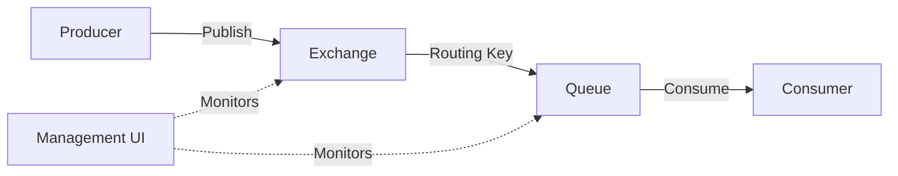

# RabbitMQ Management UI

## Introduction

The RabbitMQ Management UI is a browser-based tool that provides a graphical interface for monitoring and managing your RabbitMQ messaging broker. As a beginner working with RabbitMQ, this UI will be one of your most valuable tools for understanding what's happening inside your message broker, troubleshooting issues, and performing administrative tasks without having to use command-line tools.

In this guide, we'll explore the RabbitMQ Management UI in detail, from accessing it to using its various features for monitoring and managing your RabbitMQ installation.

## Enabling the Management UI

The Management UI is provided by a plugin that comes bundled with RabbitMQ but needs to be enabled. Let's start by making sure it's enabled in your RabbitMQ installation.

### Enabling via Command Line

To enable the management plugin, run the following command:

```bash
rabbitmq-plugins enable rabbitmq_management
```

After enabling the plugin, you should restart RabbitMQ to ensure the changes take effect:

```bash
# On Linux/macOS
sudo service rabbitmq-server restart

# On Windows
rabbitmq-service.bat stop
rabbitmq-service.bat start
```

## Accessing the Management UI

Once the management plugin is enabled, you can access the Management UI through your web browser.

- **URL**: `http://your-server-hostname:15672/`
- **Default credentials**:
  - Username: `guest`
  - Password: `guest`

:::note
The default `guest` user can only connect from localhost for security reasons. If you're connecting from a different machine, you'll need to create a new user with appropriate permissions.
:::

## Creating Administrative Users

For production environments, you should create dedicated users with appropriate permissions:

```bash
# Create admin user
rabbitmqctl add_user admin strong_password
rabbitmqctl set_user_tags admin administrator
rabbitmqctl set_permissions -p / admin ".*" ".*" ".*"
```

This creates a user named "admin" with administrator privileges and full permissions on the default virtual host (`/`).

## Navigating the Management UI

Once logged in, you'll see the Overview page with several tabs at the top. Let's explore each section:

### Overview

The Overview page provides a high-level summary of your RabbitMQ server:

- **Nodes**: Shows the status of all nodes in your RabbitMQ cluster
- **Message Rates**: Displays graphs showing message rates (publish, deliver, acknowledge)
- **Global Counts**: Shows the total number of connections, channels, exchanges, queues, and consumers

This is an excellent place to get a quick health check of your system.

### Connections

The Connections tab shows all client connections to your RabbitMQ server. For each connection, you can see:

- Client IP address and port
- Username used to authenticate
- Virtual host being accessed
- Time since the connection was established
- Data rates (bytes in/out)
- Connection state

You can also terminate problematic connections by clicking the "Close Connection" button.

### Channels

Channels are lightweight connections that share a single TCP connection. The Channels tab provides information about:

- The connection each channel belongs to
- Prefetch count (how many unacknowledged messages a consumer can have)
- Number of consumers using the channel
- Message statistics (publish, confirm, deliver, acknowledge)

Monitoring channels helps you understand how clients are interacting with RabbitMQ.

### Exchanges

Exchanges are the routing components that receive messages from producers and route them to queues. The Exchanges tab lets you:

- View all exchanges in a virtual host
- See exchange types (direct, fanout, topic, headers)
- Check binding counts
- Create new exchanges
- Delete exchanges
- Publish test messages

Here's how to publish a test message through the UI:

1. Click on an exchange name
2. Scroll down to "Publish message"
3. Enter routing key and message payload
4. Click "Publish message"

### Queues

The Queues tab is one of the most important sections, showing all queues in your virtual host with:

- Name and type (classic or quorum)
- Message counts (ready, unacknowledged)
- Message rates (incoming, delivering)
- Consumer counts
- Memory usage

You can perform several actions on queues:
- Purge (remove all messages)
- Delete
- Add consumers
- Get messages (for inspection)

### Admin

The Admin tab provides administrative functions:
- User management
- Virtual host management
- Feature flags
- Policies and limits
- Cluster management

## Monitoring with the Management UI

The Management UI provides several tools for monitoring your RabbitMQ installation:

### Message Rates and Queue Depths

On both the Overview page and individual queue pages, you'll find graphs showing:
- Publish rates
- Delivery rates
- Queue depths (number of messages)

These graphs are crucial for identifying bottlenecks and ensuring your system is processing messages at an expected rate.

### Example: Identifying a Slow Consumer

Let's say you notice that a queue is accumulating messages rapidly. This could indicate a slow consumer. You can investigate by:

1. Go to the Queues tab
2. Find the queue with high message count
3. Click on the queue name
4. Check the "Consumer" section to see if there are any consumers
5. Look at the "Message rates" graph to compare publish vs. deliver rates

If you see messages being published faster than they're being delivered, you may need to scale up your consumers or optimize their processing.

## Managing Virtual Hosts

Virtual hosts (vhosts) provide logical grouping and separation of resources. To create a new virtual host:

1. Go to the Admin tab
2. Click on "Virtual Hosts"
3. Enter a name for the new virtual host (e.g., "development")
4. Click "Add virtual host"

After creating a virtual host, you'll need to grant permissions to users:

1. Go to the Admin tab
2. Click on "Users"
3. Click on the username
4. Scroll down to "Permissions"
5. Select the virtual host
6. Set read, write, and configure permissions (e.g., ".*" for all)
7. Click "Set Permission"

## Creating and Managing Queues

To create a new queue through the Management UI:

1. Go to the Queues tab
2. Click "Add a new queue"
3. Enter queue name
4. Select virtual host
5. Configure queue properties:
   - Durability: "Durable" means the queue survives server restarts
   - Auto-delete: If enabled, the queue is deleted when all consumers disconnect
   - Arguments: Special parameters like message TTL

Example queue settings for a durable work queue:
- Name: `task_queue`
- Durability: Durable
- Auto-delete: No
- Arguments: `x-message-ttl` = 86400000 (1 day in milliseconds)

## Creating Bindings

Bindings connect exchanges to queues based on routing keys. To create a binding:

1. Go to the Exchanges tab
2. Click on the source exchange
3. Scroll down to "Add binding from this exchange"
4. Select "To queue"
5. Enter the queue name
6. Enter the routing key
7. Click "Bind"

## Practical Example: Monitoring Message Flow

Let's create a simple diagram to visualize message flow through RabbitMQ:



Using the Management UI, you can track:
1. How many messages are being published to the exchange
2. How many messages are waiting in the queue
3. How quickly consumers are processing messages

## Example: Troubleshooting Using the Management UI

Let's walk through a common troubleshooting scenario:

**Scenario**: Messages are being published but not consumed.

**Troubleshooting steps**:

1. Check the queue in the Management UI:
   - Is the message count increasing?
   - Are there any consumers?

2. If there are no consumers:
   - Check the Connections tab to verify consumer applications are connected
   - Review application logs for connection issues

3. If there are consumers but messages aren't moving:
   - Check consumer prefetch settings
   - Look for acknowledgment issues
   - Verify the consumer has proper permissions

4. Using the "Get messages" feature:
   - Go to the queue page
   - Click "Get messages"
   - Set count to a small number (e.g., 5)
   - Check "Requeue" if you don't want to remove messages
   - Click "Get Message(s)"

This allows you to inspect actual message content, which can help identify formatting or data issues.

## Managing Users and Permissions

For a robust RabbitMQ setup, it's important to create appropriate user roles:

1. **Monitoring users**: Only need read access
2. **Application users**: Need specific read/write permissions
3. **Administrative users**: Need full access

To create a monitoring-only user:

1. Go to Admin > Users
2. Add user (e.g., "monitor")
3. Set tag to "monitoring"
4. Grant read-only permissions: configure="^$", write="^$", read=".*"

The permission patterns are regular expressions that match resource names:
- `.*` means "all resources"
- `^$` means "no resources"

## Performance Monitoring

The Management UI provides several performance metrics:

### Memory Usage

On the Overview page, you can monitor memory usage of your RabbitMQ nodes. High memory usage might indicate:
- Too many connections
- Large queues with persistent messages
- Message payload too large

### CPU Usage

High CPU usage might indicate:
- Too many routing operations
- Complex routing logic
- Too many connections/channels

### Disk Space

For queued messages marked as persistent, RabbitMQ writes them to disk. Monitor disk space to avoid running out of storage.

## Summary

The RabbitMQ Management UI is an essential tool for monitoring and managing your RabbitMQ server. It provides:

- Real-time visibility into message flows
- Queue management capabilities
- User and permission administration
- Performance monitoring
- Troubleshooting tools

As you grow more comfortable with RabbitMQ, the Management UI will become your go-to tool for ensuring your messaging system is running smoothly.

## Additional Resources

- [Official RabbitMQ Management Plugin Documentation](https://www.rabbitmq.com/management.html)
- [RabbitMQ REST API](https://www.rabbitmq.com/management.html#http-api) - For programmatic access to the same information

## Exercises

1. Enable the Management UI plugin and create a new administrative user.
2. Create a new virtual host called "practice" and grant your user permissions to it.
3. Create an exchange and queue in the "practice" virtual host, then bind them together.
4. Use the Management UI to publish a test message to your exchange and verify it appears in your queue.
5. Monitor the queue statistics as you consume messages with a simple consumer application.