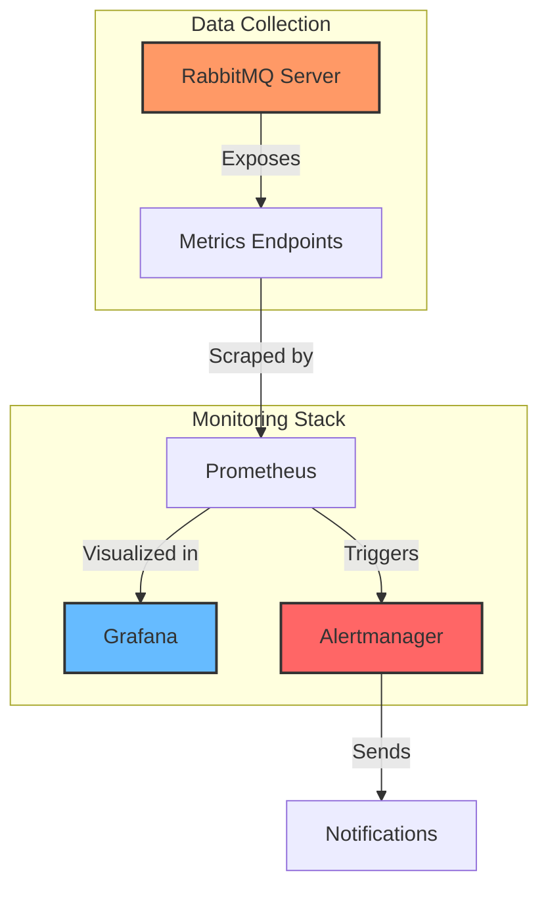

# RabbitMQ Metrics

## Introduction

RabbitMQ is a popular open-source message broker that helps applications communicate with each other through messaging. As your messaging system grows, understanding and monitoring the right metrics becomes crucial for ensuring system health, performance, and reliability.

In this guide, we'll explore the essential metrics you should monitor in your RabbitMQ deployment, how to interpret them, and which tools you can use to collect these metrics.

## Why Monitor RabbitMQ?

Before diving into specific metrics, let's understand why monitoring is important:

- **Prevent outages**: Detect potential issues before they cause service disruptions
- **Performance optimization**: Identify bottlenecks and optimize your configuration
- **Capacity planning**: Track growth trends to plan infrastructure expansions
- **Troubleshooting**: Have historical data to diagnose issues when they occur

## Core RabbitMQ Metrics Categories

RabbitMQ metrics can be grouped into several categories:

<div className="metrics-categories">
  <ul>
    <li>Node metrics</li>
    <li>Queue metrics</li>
    <li>Channel and connection metrics</li>
    <li>Exchange metrics</li>
    <li>Cluster-wide metrics</li>
  </ul>
</div>

Let's explore each category in detail.

## Node Metrics

Node metrics provide insights into the health and resource utilization of your RabbitMQ server instances.

### Memory Usage

RabbitMQ is memory-intensive, and memory issues are common causes of problems.

```bash
# Get memory usage via management API
curl -s -u guest:guest http://localhost:15672/api/nodes | jq '.[0].mem_used'
```

Key memory metrics to watch:

- **Memory used**: Total memory used by the RabbitMQ node
- **Memory alarm**: Binary status indicating if a memory alarm is in effect
- **Memory limit**: The configured memory threshold that triggers alarms
- **Memory high watermark**: Percentage of system memory that, when reached, will trigger flow control

When a node reaches its memory high watermark (default is 40% of system memory), it will block publishers until memory usage drops below the threshold.

### File Descriptors and Socket Descriptors

RabbitMQ needs file descriptors for many operations, including maintaining connections.

```bash
# Get file descriptor usage
curl -s -u guest:guest http://localhost:15672/api/nodes | jq '.[0].fd_used'
curl -s -u guest:guest http://localhost:15672/api/nodes | jq '.[0].fd_total'
```

Metrics to monitor:

- **File descriptors used**: Current number of file descriptors in use
- **File descriptor limit**: Maximum allowed file descriptors
- **Socket descriptors used**: Current number of socket connections
- **Socket descriptor limit**: Maximum allowed socket connections

If you hit the file descriptor limit, RabbitMQ will stop accepting new connections.

### Disk Space

RabbitMQ uses disk space for message persistence, queue indices, and the mnesia database.

```bash
# Get disk space information
curl -s -u guest:guest http://localhost:15672/api/nodes | jq '.[0].disk_free'
```

Relevant metrics:

- **Free disk space**: Available disk space on the node
- **Disk alarm**: Binary status indicating if a disk alarm is in effect
- **Disk free limit**: The threshold that triggers disk alarms

Similar to memory alarms, disk alarms block publishers until the situation improves.

### Erlang Processes

RabbitMQ runs on the Erlang VM, which uses lightweight processes.

```bash
# Get Erlang process usage
curl -s -u guest:guest http://localhost:15672/api/nodes | jq '.[0].proc_used'
curl -s -u guest:guest http://localhost:15672/api/nodes | jq '.[0].proc_total'
```

Pay attention to:

- **Processes used**: Current number of Erlang processes
- **Process limit**: Maximum allowed Erlang processes

## Queue Metrics

Queues are the core of RabbitMQ's functionality, and their metrics are essential to monitor.

### Queue Depth

The number of messages in a queue is its depth.

```bash
# Get message count for a specific queue
curl -s -u guest:guest http://localhost:15672/api/queues/%2F/my_queue | jq '.messages'
```

Key metrics:

- **Messages**: Total number of messages in the queue
- **Ready messages**: Messages ready to be delivered
- **Unacknowledged messages**: Messages delivered but not yet acknowledged

A growing queue depth may indicate that consumers aren't keeping up with producers.

### Message Rates

Message rates show the throughput of your queues.

```bash
# Get message rates for a queue
curl -s -u guest:guest http://localhost:15672/api/queues/%2F/my_queue | jq '.message_stats'
```

Important rate metrics:

- **Publish rate**: Messages published per second
- **Delivery rate**: Messages delivered to consumers per second
- **Acknowledgment rate**: Messages acknowledged per second
- **Redelivery rate**: Messages redelivered after failed delivery

### Queue Age and State

Monitoring how long messages stay in queues is critical for time-sensitive applications.


Key metrics:

- **First message age**: Age of the oldest message in the queue
- **Queue state**: Whether the queue is running, idle, or in an alarmed state

## Channel and Connection Metrics

Channels and connections represent the communication pathways between your applications and RabbitMQ.

### Connection Metrics

```bash
# Get total connections
curl -s -u guest:guest http://localhost:15672/api/overview | jq '.object_totals.connections'
```

Important connection metrics:

- **Connection count**: Total number of open connections
- **Connection creation/closure rate**: Rate at which connections are being created and closed
- **Connection churn**: High rates of connection creation and closure

### Channel Metrics

Channels are lightweight connections that share a single TCP connection.

```bash
# Get total channels
curl -s -u guest:guest http://localhost:15672/api/overview | jq '.object_totals.channels'
```

Key channel metrics:

- **Channel count**: Total number of open channels
- **Channels per connection**: Average number of channels per connection
- **Channel creation/closure rate**: Rate of channel creation and closure

## Exchange Metrics

Exchanges route messages to queues based on routing rules.

```bash
# Get exchange message stats
curl -s -u guest:guest http://localhost:15672/api/exchanges/%2F/my_exchange | jq '.message_stats'
```

Important exchange metrics:

- **Publish rate**: Rate of messages published to the exchange
- **Publish returns**: Rate of messages that couldn't be routed to any queue
- **Publish confirms**: Rate of confirms sent to publishers

## Practical Example: Setting Up Basic Monitoring

Let's create a simple monitoring setup using the RabbitMQ Management plugin and Prometheus.

### Step 1: Enable the Management Plugin

If not already enabled:

```bash
rabbitmq-plugins enable rabbitmq_management
```

### Step 2: Install the Prometheus Plugin

```bash
rabbitmq-plugins enable rabbitmq_prometheus
```

### Step 3: Configure Prometheus to Scrape RabbitMQ Metrics

Create a `prometheus.yml` configuration file:

```yaml
global:
  scrape_interval: 15s

scrape_configs:
  - job_name: 'rabbitmq'
    static_configs:
      - targets: ['localhost:15692']
```

### Step 4: Start Prometheus

```bash
prometheus --config.file=prometheus.yml
```

### Step 5: Create a Simple Dashboard

Using Grafana, you can create a dashboard with the most important metrics. Here's an example of a basic query to monitor queue depths:

```
rabbitmq_queue_messages{queue="my_queue"}
```

## Alerting on Critical Metrics

Here are some recommended thresholds for setting up alerts:

| Metric | Warning Threshold | Critical Threshold |
|--------|-------------------|-------------------|
| Memory usage | 70% of limit | 85% of limit |
| Disk free | 2GB | 1GB |
| File descriptors | 85% of limit | 95% of limit |
| Queue depth | Depends on application | Depends on application |
| Queue growth rate | Sustained positive growth | Rapid growth |
| Connection count | 80% of planned capacity | 90% of planned capacity |

## Real-world Application: E-commerce Order Processing

Let's consider a practical example of monitoring an e-commerce order processing system:

```javascript
// Publisher: Creating a new order
const amqp = require('amqplib');

async function publishOrder() {
  const connection = await amqp.connect('amqp://localhost');
  const channel = await connection.createChannel();
  
  const queue = 'orders';
  const order = {
    id: Math.floor(Math.random() * 10000),
    customer: 'John Doe',
    items: ['Product A', 'Product B'],
    total: 59.99
  };
  
  await channel.assertQueue(queue, { durable: true });
  channel.sendToQueue(queue, Buffer.from(JSON.stringify(order)), {
    persistent: true
  });
  
  console.log(`Order ${order.id} sent to processing queue`);
  
  setTimeout(() => {
    connection.close();
  }, 500);
}

publishOrder();
```

```javascript
// Consumer: Processing orders
const amqp = require('amqplib');

async function processOrders() {
  const connection = await amqp.connect('amqp://localhost');
  const channel = await connection.createChannel();
  
  const queue = 'orders';
  
  await channel.assertQueue(queue, { durable: true });
  channel.prefetch(1);
  
  console.log('Waiting for orders...');
  
  channel.consume(queue, (msg) => {
    const order = JSON.parse(msg.content.toString());
    
    console.log(`Processing order ${order.id}`);
    
    // Simulate processing time
    setTimeout(() => {
      console.log(`Order ${order.id} processed successfully`);
      channel.ack(msg);
    }, 2000);
  });
}

processOrders();
```

In this e-commerce system, you would want to monitor:

1. **Queue depth of the orders queue**: A growing backlog could mean orders aren't being processed fast enough
2. **Message processing rate**: How many orders are being processed per second
3. **Message age**: How long orders wait before processing
4. **Consumer utilization**: Whether consumers are actively processing messages

## Visualizing RabbitMQ Metrics Flow

Here's a diagram showing how metrics flow in a typical RabbitMQ monitoring setup:



## Summary

Monitoring RabbitMQ metrics is essential for maintaining a healthy messaging system. The key takeaways are:

- **Monitor node-level metrics** to ensure your RabbitMQ servers have sufficient resources
- **Track queue metrics** to identify bottlenecks in message processing
- **Watch connection and channel metrics** to understand client behavior
- **Set up alerts** for critical thresholds to be notified of potential issues
- **Visualize metrics** to spot trends and patterns

By keeping an eye on these metrics, you'll be able to maintain a reliable messaging infrastructure and address issues before they affect your applications.

## Additional Resources

- [RabbitMQ Monitoring Documentation](https://www.rabbitmq.com/monitoring.html)
- [Prometheus and Grafana Documentation](https://prometheus.io/docs/visualization/grafana/)
- [RabbitMQ Management HTTP API](https://www.rabbitmq.com/management.html#http-api)

## Exercises

1. Set up RabbitMQ with the management and Prometheus plugins enabled
2. Create a simple producer and consumer application
3. Configure Prometheus to scrape RabbitMQ metrics
4. Build a Grafana dashboard showing queue depth, message rates, and resource usage
5. Simulate a high load scenario and observe how the metrics change
6. Configure alerts for memory usage and queue depth thresholds