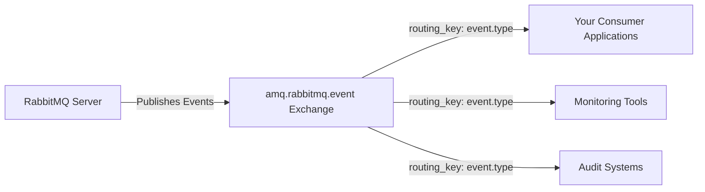
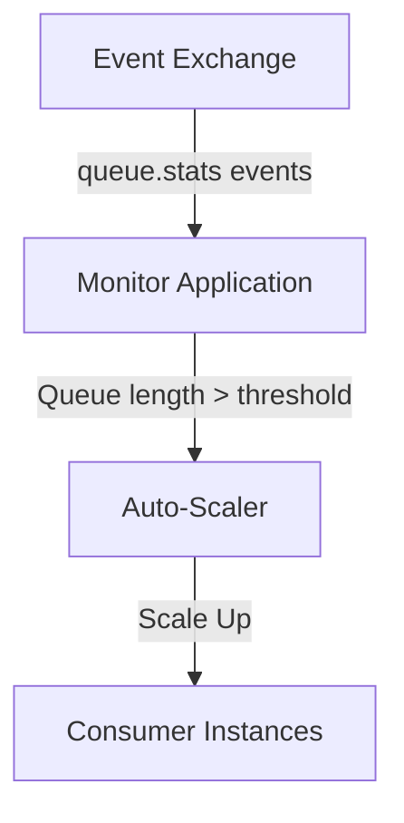

# RabbitMQ Event Exchange

## Introduction

When managing a RabbitMQ messaging system, knowing what's happening inside your broker is crucial. The **RabbitMQ Event Exchange** is a powerful plugin that gives you visibility into the internal events of your RabbitMQ server by publishing them as messages to an exchange. This allows you to monitor, audit, and respond to various activities happening within your message broker in real-time.

Think of it as a notification system that keeps you informed about what's happening in your RabbitMQ environment. Instead of continuously polling the management API for status updates, you can set up event-driven monitoring by subscribing to specific events that matter to your application.

## Enabling the Event Exchange Plugin

The Event Exchange plugin comes bundled with RabbitMQ but is not enabled by default. Let's start by enabling it:

```bash
# Enable the plugin
rabbitmq-plugins enable rabbitmq_event_exchange
```

Once enabled, RabbitMQ will create a topic exchange named `amq.rabbitmq.event` automatically. All internal events will be published to this exchange with specific routing keys.

## How It Works

The Event Exchange mechanism works as follows:



1. RabbitMQ generates internal events (queue created, connection established, etc.)
2. These events are published to the `amq.rabbitmq.event` topic exchange
3. The routing key follows the pattern: `event.type`
4. Applications can bind queues to this exchange with specific routing patterns to receive only events they're interested in

## Key Event Types

RabbitMQ publishes various types of events. Here are some of the most important ones:

| Event Category | Example Events | Routing Key Pattern |
|----------------|----------------|---------------------|
| Connection | Created, Closed | `connection.*` |
| Channel | Created, Closed | `channel.*` |
| Exchange | Created, Deleted | `exchange.*` |
| Queue | Created, Deleted, Binding Updated | `queue.*` |
| Consumer | Added, Removed | `consumer.*` |
| Policy | Set, Cleared | `policy.*` |
| User | Added, Deleted, Authentication Failure | `user.*` |
| Alarm | Resource Limits Reached | `alarm.*` |

## Creating an Event Listener

Let's create a simple Node.js application that listens for RabbitMQ events:

```javascript
const amqp = require('amqplib');

async function listenForEvents() {
  try {
    // Connect to RabbitMQ
    const connection = await amqp.connect('amqp://localhost');
    const channel = await connection.createChannel();
    
    // Create a temporary queue
    const { queue } = await channel.assertQueue('', { exclusive: true });
    
    console.log(`Waiting for RabbitMQ events. To exit press CTRL+C`);
    
    // Bind to specific events (queue creation events in this example)
    await channel.bindQueue(queue, 'amq.rabbitmq.event', 'queue.#');
    
    // Consume events
    channel.consume(queue, (msg) => {
      if (msg !== null) {
        const event = JSON.parse(msg.content.toString());
        const routingKey = msg.fields.routingKey;
        
        console.log(`Event: ${routingKey}`);
        console.log(`Details: ${JSON.stringify(event, null, 2)}`);
        console.log('-----------------------------------');
        
        channel.ack(msg);
      }
    });
  } catch (error) {
    console.error(`Error: ${error.message}`);
  }
}

listenForEvents();
```

When you run this application and then create/delete a queue in your RabbitMQ server, you'll see events like this:

```bash
Event: queue.created
Details: {
  "type": "queue.created",
  "props": {
    "name": "my_new_queue",
    "durable": true,
    "auto_delete": false,
    "exclusive": false,
    "arguments": {}
  },
  "timestamp": 1647528731
}
-----------------------------------
```

## Practical Applications

Let's explore some practical applications of the RabbitMQ Event Exchange:

### 1. Centralized Monitoring System

By binding to all events (`#` routing key), you can create a centralized monitoring dashboard that tracks all activities in your RabbitMQ cluster:

```javascript
// Bind to all events
await channel.bindQueue(queue, 'amq.rabbitmq.event', '#');
```

### 2. Security Auditing

To monitor authentication failures and permission changes:

```javascript
// Bind to user-related events
await channel.bindQueue(queue, 'amq.rabbitmq.event', 'user.#');
```

### 3. Queue Lifecycle Management

You might want to know when queues are created or deleted to maintain an up-to-date inventory:

```javascript
// Bind to queue creation and deletion events
await channel.bindQueue(queue, 'amq.rabbitmq.event', 'queue.created');
await channel.bindQueue(queue, 'amq.rabbitmq.event', 'queue.deleted');
```

### 4. Resource Alarm Detection

To be notified when your RabbitMQ server is running out of resources:

```javascript
// Bind to alarm events
await channel.bindQueue(queue, 'amq.rabbitmq.event', 'alarm.#');
```

### 5. Auto-Scaling Applications

In a cloud environment, you might want to scale your consumers based on queue length:



## Building a Complete Monitoring Solution

Let's build a more complete monitoring solution that sends notifications when important events occur:

```javascript
const amqp = require('amqplib');
const nodemailer = require('nodemailer');

// Simple email setup (replace with your actual details)
const transporter = nodemailer.createTransport({
  service: 'gmail',
  auth: {
    user: 'your-email@gmail.com',
    pass: 'your-password'
  }
});

async function monitorCriticalEvents() {
  try {
    const connection = await amqp.connect('amqp://localhost');
    const channel = await connection.createChannel();
    
    const { queue } = await channel.assertQueue('rabbitmq_critical_events', { 
      durable: true 
    });
    
    // Bind to critical events
    await channel.bindQueue(queue, 'amq.rabbitmq.event', 'alarm.#');
    await channel.bindQueue(queue, 'amq.rabbitmq.event', 'user.authentication.failure');
    await channel.bindQueue(queue, 'amq.rabbitmq.event', 'queue.deleted');
    
    console.log('Monitoring critical RabbitMQ events...');
    
    channel.consume(queue, async (msg) => {
      if (msg !== null) {
        const event = JSON.parse(msg.content.toString());
        const routingKey = msg.fields.routingKey;
        
        console.log(`Critical event detected: ${routingKey}`);
        
        // Send notification
        await sendNotification(routingKey, event);
        
        channel.ack(msg);
      }
    });
  } catch (error) {
    console.error(`Error: ${error.message}`);
  }
}

async function sendNotification(eventType, eventDetails) {
  const mailOptions = {
    from: 'your-email@gmail.com',
    to: 'admin@your-company.com',
    subject: `RabbitMQ Alert: ${eventType}`,
    text: `
      Critical RabbitMQ event detected!
      Event Type: ${eventType}
      Timestamp: ${new Date(eventDetails.timestamp * 1000).toISOString()}
      Details: ${JSON.stringify(eventDetails, null, 2)}
    `
  };
  
  try {
    await transporter.sendMail(mailOptions);
    console.log('Notification sent successfully');
  } catch (error) {
    console.error(`Failed to send notification: ${error.message}`);
  }
}

monitorCriticalEvents();
```

## Event Message Format

Events published to the Event Exchange have a consistent format:

```javascript
{
  // Type of the event (same as the routing key)
  "type": "queue.created",
  
  // Properties specific to the event type
  "props": {
    // Event-specific properties...
  },
  
  // Unix timestamp when the event occurred
  "timestamp": 1647528731
}
```

## Performance Considerations

While the Event Exchange provides valuable monitoring capabilities, there are some performance considerations to keep in mind:

1. **Message Volume**: On busy systems, a large number of events will be generated
2. **Selective Binding**: Bind only to events you need to process
3. **Resource Usage**: Processing all events may require significant resources
4. **Persistence**: Consider whether you need durable queues for your event listeners

## Summary

The RabbitMQ Event Exchange is a powerful tool for monitoring the internal workings of your message broker. It enables you to:

- Receive real-time notifications about what's happening inside RabbitMQ
- Build event-driven monitoring solutions
- React to changes in your messaging infrastructure
- Audit security-related events
- Track resource usage and performance metrics

By leveraging this plugin, you can gain deep visibility into your RabbitMQ environment and respond proactively to changes and issues.

## Additional Resources and Exercises

### Resources
- [RabbitMQ Event Exchange Official Documentation](https://www.rabbitmq.com/event-exchange.html)
- [RabbitMQ Management HTTP API](https://www.rabbitmq.com/management.html)

### Exercises

1. **Basic Event Listener**: Create a simple application that listens for and logs all RabbitMQ events for 5 minutes. Review the logs to understand what types of events occur in your environment.

2. **Slack Notifications**: Extend the monitoring example to send critical events to a Slack channel using webhooks.

3. **Event Dashboard**: Build a simple web dashboard that displays recent events from your RabbitMQ server in real-time using WebSockets.

4. **Event Statistics**: Create an application that collects event statistics (frequency of different event types, peak times, etc.) and generates a daily report.

5. **Dead Letter Queue Monitor**: Build a specialized monitor that watches for messages being sent to dead letter queues and triggers alerts when the rate exceeds a threshold.