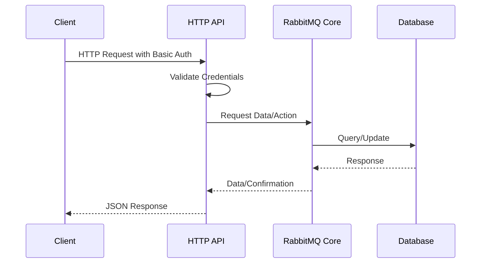

# RabbitMQ HTTP API

## Introduction

The RabbitMQ HTTP API provides a way to monitor and manage your RabbitMQ server without using the command-line tools. This API allows you to retrieve information about your RabbitMQ installation, including queues, exchanges, bindings, vhosts, users, and more. You can also make configuration changes through this API, making it a powerful tool for automation and monitoring.

This guide will introduce you to the RabbitMQ HTTP API and demonstrate how to use it to perform common monitoring and management tasks.

## Prerequisites

Before you start using the RabbitMQ HTTP API, you need:

- A running RabbitMQ server (version 3.x or higher)
- Access credentials for the RabbitMQ management interface
- Basic knowledge of HTTP requests
- A tool to make HTTP requests (like curl, Postman, or any programming language with HTTP client capabilities)

## API Basics

### Endpoint Structure

The RabbitMQ HTTP API is available at the following base URL:

```
http://server-name:15672/api/
```

Where `server-name` is the hostname or IP address of your RabbitMQ server. By default, the management interface runs on port 15672.

### Authentication

The API uses HTTP Basic Authentication. You need to provide the username and password of a RabbitMQ user with appropriate permissions.

### Response Format

The API returns data in JSON format, making it easy to parse and process in most programming languages.

## Common API Endpoints

Here's a list of commonly used API endpoints:

| Endpoint | Description |
|----------|-------------|
| `/api/overview` | Get an overview of the RabbitMQ server |
| `/api/nodes` | List all RabbitMQ nodes in the cluster |
| `/api/queues` | List all queues |
| `/api/exchanges` | List all exchanges |
| `/api/bindings` | List all bindings |
| `/api/vhosts` | List all virtual hosts |
| `/api/users` | List all users |

## Basic Monitoring Examples

Let's start with some basic monitoring tasks using the HTTP API.

### Getting Server Overview

To get an overview of your RabbitMQ server:

```bash
curl -i -u guest:guest http://localhost:15672/api/overview
```

Sample output:

```json
{
  "management_version": "3.8.9",
  "rates_mode": "basic",
  "sample_retention_policies": {
    "global": [
      600,
      3600,
      28800,
      86400
    ],
    "basic": [
      600,
      3600
    ],
    "detailed": [
      600
    ]
  },
  "exchange_types": [
    {
      "name": "direct",
      "description": "AMQP direct exchange, direct binding"
    },
    {
      "name": "fanout",
      "description": "AMQP fanout exchange, fanout binding"
    },
    {
      "name": "headers",
      "description": "AMQP headers exchange, headers binding"
    },
    {
      "name": "topic",
      "description": "AMQP topic exchange, topic binding"
    }
  ],
  "message_stats": {
    "publish": 100,
    "publish_details": {
      "rate": 0.5
    },
    "deliver_get": 100,
    "deliver_get_details": {
      "rate": 0.5
    }
  },
  "object_totals": {
    "connections": 2,
    "channels": 4,
    "exchanges": 7,
    "queues": 3,
    "consumers": 2
  }
}
```

### Listing Queues

To list all queues:

```bash
curl -i -u guest:guest http://localhost:15672/api/queues
```

For queues in a specific virtual host:

```bash
curl -i -u guest:guest http://localhost:15672/api/queues/%2F
```

Note: `%2F` is the URL-encoded form of `/`, which is the default virtual host in RabbitMQ.

Sample output:

```json
[
  {
    "name": "my_queue",
    "vhost": "/",
    "durable": true,
    "auto_delete": false,
    "exclusive": false,
    "arguments": {},
    "node": "rabbit@hostname",
    "state": "running",
    "messages": 42,
    "messages_ready": 42,
    "messages_unacknowledged": 0,
    "consumers": 1,
    "consumer_utilisation": 1.0
  }
]
```

### Monitoring Queue Details

To get detailed information about a specific queue:

```bash
curl -i -u guest:guest http://localhost:15672/api/queues/%2F/my_queue
```

This provides detailed statistics about the queue, including message rates, consumer information, and more.

## Management Examples

The HTTP API is not just for monitoring; you can also use it to manage your RabbitMQ server.

### Creating a Queue

To create a new queue:

```bash
curl -i -u guest:guest -H "content-type:application/json" \
     -X PUT http://localhost:15672/api/queues/%2F/new_queue \
     -d '{"auto_delete":false,"durable":true,"arguments":{}}'
```

### Publishing a Message

To publish a message to an exchange:

```bash
curl -i -u guest:guest -H "content-type:application/json" \
     -X POST http://localhost:15672/api/exchanges/%2F/amq.default/publish \
     -d '{"properties":{},"routing_key":"my_queue","payload":"Hello World!","payload_encoding":"string"}'
```

Sample response:

```json
{
  "routed": true
}
```

### Getting Messages from a Queue

To get messages from a queue (for testing purposes):

```bash
curl -i -u guest:guest -H "content-type:application/json" \
     -X POST http://localhost:15672/api/queues/%2F/my_queue/get \
     -d '{"count":5,"requeue":true,"encoding":"auto","truncate":50000}'
```

Sample response:

```json
[
  {
    "payload": "Hello World!",
    "payload_bytes": 12,
    "payload_encoding": "string",
    "message_count": 41,
    "properties": {},
    "redelivered": false,
    "routing_key": "my_queue"
  }
]
```

## Monitoring with the HTTP API in Practice

Let's explore some practical examples of how to use the RabbitMQ HTTP API for monitoring in real-world scenarios.

### Building a Simple Monitoring Script

Here's a Python script that checks the number of messages in a queue and alerts if it exceeds a threshold:

```python
import requests
import json
import smtplib
from email.message import EmailMessage

# RabbitMQ connection details
rabbitmq_host = "localhost"
rabbitmq_port = 15672
rabbitmq_user = "guest"
rabbitmq_pass = "guest"
queue_name = "my_queue"
vhost = "%2F"

# Alert threshold
max_messages = 1000

# Email settings
smtp_server = "smtp.example.com"
smtp_port = 587
smtp_user = "alerts@example.com"
smtp_pass = "password"
alert_recipients = ["admin@example.com"]

def check_queue():
    url = f"http://{rabbitmq_host}:{rabbitmq_port}/api/queues/{vhost}/{queue_name}"
    response = requests.get(url, auth=(rabbitmq_user, rabbitmq_pass))
    
    if response.status_code == 200:
        queue_data = response.json()
        message_count = queue_data["messages"]
        
        print(f"Queue {queue_name} has {message_count} messages")
        
        if message_count > max_messages:
            send_alert(queue_name, message_count)
    else:
        print(f"Failed to get queue information: {response.status_code}")

def send_alert(queue_name, message_count):
    msg = EmailMessage()
    msg.set_content(f"Queue {queue_name} has {message_count} messages, which exceeds the threshold of {max_messages}.")
    msg["Subject"] = f"RabbitMQ Alert: Queue {queue_name} is backing up"
    msg["From"] = smtp_user
    msg["To"] = ", ".join(alert_recipients)
    
    with smtplib.SMTP(smtp_server, smtp_port) as server:
        server.starttls()
        server.login(smtp_user, smtp_pass)
        server.send_message(msg)
    
    print(f"Alert sent to {', '.join(alert_recipients)}")

if __name__ == "__main__":
    check_queue()
```

This script can be scheduled to run at regular intervals using cron or a similar scheduler.

### Monitoring Multiple Queues

Here's a more complex example that monitors multiple queues and reports their status:

```python
import requests
import json
from tabulate import tabulate
from datetime import datetime

# RabbitMQ connection details
rabbitmq_host = "localhost"
rabbitmq_port = 15672
rabbitmq_user = "guest"
rabbitmq_pass = "guest"
vhost = "%2F"

# Queues to monitor
queues_to_monitor = ["orders", "notifications", "emails", "logging"]

def get_queue_stats():
    stats = []
    
    for queue_name in queues_to_monitor:
        url = f"http://{rabbitmq_host}:{rabbitmq_port}/api/queues/{vhost}/{queue_name}"
        response = requests.get(url, auth=(rabbitmq_user, rabbitmq_pass))
        
        if response.status_code == 200:
            queue_data = response.json()
            stats.append({
                "name": queue_name,
                "messages": queue_data["messages"],
                "messages_ready": queue_data["messages_ready"],
                "messages_unacknowledged": queue_data["messages_unacknowledged"],
                "consumers": queue_data["consumers"],
                "state": queue_data["state"]
            })
        else:
            stats.append({
                "name": queue_name,
                "messages": "ERROR",
                "messages_ready": "ERROR",
                "messages_unacknowledged": "ERROR",
                "consumers": "ERROR",
                "state": "ERROR"
            })
    
    return stats

def print_stats(stats):
    table_data = []
    for queue in stats:
        table_data.append([
            queue["name"],
            queue["messages"],
            queue["messages_ready"],
            queue["messages_unacknowledged"],
            queue["consumers"],
            queue["state"]
        ])
    
    headers = ["Queue", "Messages", "Ready", "Unacked", "Consumers", "State"]
    print(f"
RabbitMQ Queue Statistics at {datetime.now().strftime('%Y-%m-%d %H:%M:%S')}")
    print(tabulate(table_data, headers=headers, tablefmt="grid"))

if __name__ == "__main__":
    stats = get_queue_stats()
    print_stats(stats)
```

## Flow Diagrams for API Interactions

Here's a diagram showing the flow of a typical RabbitMQ HTTP API request:



## Error Handling

When using the RabbitMQ HTTP API, you may encounter various error responses. Here are some common HTTP status codes and their meanings:

- 200 OK: The request was successful
- 201 Created: Resource created successfully
- 204 No Content: The request was successful but there's no content to return
- 400 Bad Request: Invalid request
- 401 Unauthorized: Authentication failed
- 403 Forbidden: The user doesn't have permission
- 404 Not Found: The requested resource doesn't exist
- 405 Method Not Allowed: The HTTP method is not allowed for this endpoint
- 406 Not Acceptable: The requested content type cannot be produced
- 415 Unsupported Media Type: The content type of the request is not supported
- 500 Internal Server Error: Something went wrong on the server

Always check the status code and response body to handle errors appropriately.

## Advanced API Usage

### Monitoring Cluster Health

To get information about all nodes in a RabbitMQ cluster:

```bash
curl -i -u guest:guest http://localhost:15672/api/nodes
```

Sample output:

```json
[
  {
    "name": "rabbit@node1",
    "type": "disc",
    "running": true,
    "uptime": 7382065,
    "mem_used": 75634672,
    "mem_limit": 838356992,
    "mem_alarm": false,
    "disk_free": 35467984896,
    "disk_free_limit": 50000000,
    "disk_free_alarm": false,
    "proc_used": 267,
    "proc_total": 1048576,
    "fd_used": 33,
    "fd_total": 1024
  }
]
```

### Creating Regular API Reports

You can set up automated reporting by periodically querying the API and storing the results. For example, you could create a daily report of queue activity:

```python
import requests
import json
import csv
from datetime import datetime

# RabbitMQ connection details
rabbitmq_host = "localhost"
rabbitmq_port = 15672
rabbitmq_user = "guest"
rabbitmq_pass = "guest"

def generate_daily_report():
    # Get all queues
    url = f"http://{rabbitmq_host}:{rabbitmq_port}/api/queues"
    response = requests.get(url, auth=(rabbitmq_user, rabbitmq_pass))
    
    if response.status_code == 200:
        queues = response.json()
        
        # Create a CSV file
        date_str = datetime.now().strftime("%Y-%m-%d")
        filename = f"rabbitmq_report_{date_str}.csv"
        
        with open(filename, 'w', newline='') as csvfile:
            writer = csv.writer(csvfile)
            
            # Write header
            writer.writerow([
                "Queue Name", "Virtual Host", "State", "Messages",
                "Messages Ready", "Messages Unacknowledged", "Consumers"
            ])
            
            # Write data for each queue
            for queue in queues:
                writer.writerow([
                    queue["name"],
                    queue["vhost"],
                    queue["state"],
                    queue["messages"],
                    queue["messages_ready"],
                    queue["messages_unacknowledged"],
                    queue["consumers"]
                ])
        
        print(f"Report generated: {filename}")
    else:
        print(f"Failed to get queue information: {response.status_code}")

if __name__ == "__main__":
    generate_daily_report()
```

## Security Considerations

When using the RabbitMQ HTTP API, keep these security considerations in mind:

1. **Use HTTPS**: Always use HTTPS in production environments to encrypt API traffic.

2. **Strong Passwords**: Use strong, unique passwords for RabbitMQ users.

3. **Limited Permissions**: Create specific users for API access with only the necessary permissions.

4. **Firewall Rules**: Restrict access to the management interface port (15672) to trusted IP addresses.

5. **API Rate Limiting**: Consider implementing rate limiting for API requests to prevent abuse.

To configure HTTPS for the RabbitMQ management interface, see the RabbitMQ documentation on SSL support.

## Summary

The RabbitMQ HTTP API is a powerful tool for monitoring and managing your RabbitMQ server. In this guide, we've covered:

- Basic API endpoints and how to access them
- Monitoring queue statistics and server overview
- Managing queues and messages through the API
- Building practical monitoring scripts
- Security considerations

With this knowledge, you can now build your own monitoring and management tools for RabbitMQ using the HTTP API.

## Additional Resources

- [Official RabbitMQ HTTP API Documentation](https://www.rabbitmq.com/management.html#http-api)
- [RabbitMQ Management Plugin Guide](https://www.rabbitmq.com/management.html)
- [RabbitMQ Monitoring Guide](https://www.rabbitmq.com/monitoring.html)

## Exercises

1. Write a script that monitors a specific queue and generates an alert when the number of consumers drops to zero.

2. Create a web dashboard that displays real-time statistics for all queues using the HTTP API.

3. Write a script that periodically checks the message rate for all queues and identifies potential bottlenecks.

4. Implement a routine to automatically purge queues that exceed a certain message count threshold after a specific time period.

5. Create a script that monitors the disk space on all nodes in a RabbitMQ cluster and sends alerts when it falls below a threshold.