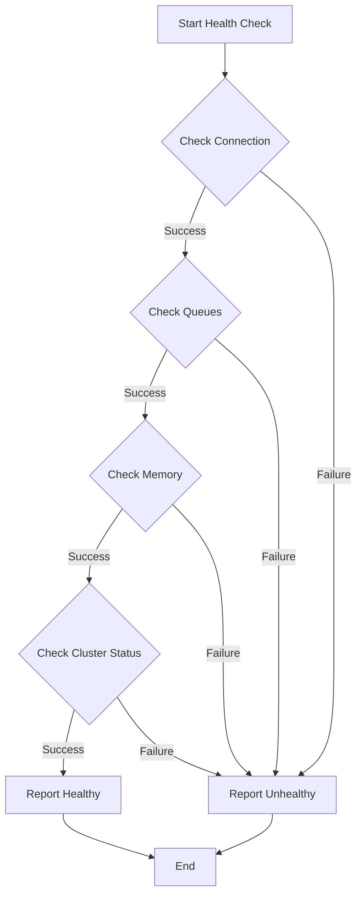

# RabbitMQ Health Checks

## Introduction

Health checks are essential monitoring components that help you maintain the reliability of your RabbitMQ messaging system. They provide automated ways to verify that your RabbitMQ instances are functioning correctly and can help detect issues before they impact your applications.

In this guide, we'll explore what health checks are, why they're important for RabbitMQ, and how to implement them in your environment. By the end, you'll have a solid understanding of how to keep your messaging infrastructure healthy and responsive.

## What Are Health Checks?

Health checks are automated tests that verify the operational status of a system or service. For RabbitMQ, health checks assess various aspects of the broker's functionality, from basic connectivity to more advanced metrics like queue depth and cluster status.

A health check typically:

1. Connects to the system
2. Performs one or more verification tests
3. Returns a status (healthy/unhealthy)
4. Optionally provides diagnostic information

## Why RabbitMQ Needs Health Checks

RabbitMQ is often a critical component in distributed systems - when it fails, multiple services can be affected. Some reasons why health checks are particularly important for RabbitMQ:

- **Detect failures early**: Identify issues before they cascade through your system
- **Enable automated recovery**: Trigger automated failover or restart processes
- **Support load balancers**: Allow load balancers to route traffic to healthy nodes
- **Improve monitoring**: Complement metrics with binary health status
- **Enhance deployment safety**: Verify successful deployments and updates

## Basic Health Check Types

### 1. Connection Health Check

The most basic health check is verifying that your application can establish a connection to RabbitMQ.

```javascript
// Basic connection health check in Node.js
const amqp = require('amqplib');

async function checkConnection() {
  try {
    // Attempt to connect to RabbitMQ
    const connection = await amqp.connect('amqp://localhost');
    console.log('✅ Connection successful');
    await connection.close();
    return true;
  } catch (error) {
    console.error('❌ Connection failed:', error.message);
    return false;
  }
}

// Usage
checkConnection()
  .then(isHealthy => console.log(`Health check result: ${isHealthy}`))
  .catch(err => console.error('Health check error:', err));
```

Output:
```
✅ Connection successful
Health check result: true
```

### 2. Queue Existence Check

This check verifies that specific queues exist and are accessible.

```python
# Queue existence check in Python
import pika

def check_queue_exists(queue_name):
    try:
        # Connect to RabbitMQ
        connection = pika.BlockingConnection(
            pika.ConnectionParameters('localhost')
        )
        channel = connection.channel()
        
        # Check if queue exists (passive=True means don't create it)
        try:
            channel.queue_declare(queue=queue_name, passive=True)
            print(f"✅ Queue '{queue_name}' exists")
            result = True
        except pika.exceptions.ChannelClosedByBroker:
            print(f"❌ Queue '{queue_name}' does not exist")
            result = False
            
        connection.close()
        return result
    except Exception as e:
        print(f"❌ Check failed: {str(e)}")
        return False

# Usage
health_status = check_queue_exists("important_tasks")
print(f"Queue health check result: {health_status}")
```

Output when queue exists:
```
✅ Queue 'important_tasks' exists
Queue health check result: True
```

Output when queue doesn't exist:
```
❌ Queue 'important_tasks' does not exist
Queue health check result: False
```

## Advanced Health Checks

### 1. Management API Health Check

RabbitMQ's Management API provides a wealth of information for more comprehensive health checks.

```python
# Management API health check in Python
import requests
import base64

def check_rabbitmq_health():
    # Management API endpoint
    url = "http://localhost:15672/api/healthchecks/node"
    
    # Basic authentication
    credentials = base64.b64encode(b"guest:guest").decode("utf-8")
    headers = {"Authorization": f"Basic {credentials}"}
    
    try:
        response = requests.get(url, headers=headers)
        
        if response.status_code == 200:
            health_data = response.json()
            status = health_data.get("status") == "ok"
            
            print(f"Health check response: {health_data}")
            return status
        else:
            print(f"❌ API request failed: Status {response.status_code}")
            return False
    except Exception as e:
        print(f"❌ Health check exception: {str(e)}")
        return False

# Usage
is_healthy = check_rabbitmq_health()
print(f"Management API health check result: {is_healthy}")
```

Example output:
```
Health check response: {'status': 'ok', 'reason': ''}
Management API health check result: True
```

### 2. Cluster Status Check

For RabbitMQ clusters, check that all nodes are running and communicating properly.

```javascript
// Cluster health check in Node.js
const axios = require('axios');

async function checkClusterHealth() {
  try {
    // Set up auth for Management API
    const auth = {
      username: 'guest',
      password: 'guest'
    };
    
    // Get cluster nodes status
    const response = await axios.get('http://localhost:15672/api/nodes', { auth });
    
    // Check if all nodes are running
    const nodes = response.data;
    const allNodesRunning = nodes.every(node => node.running === true);
    
    if (allNodesRunning) {
      console.log(`✅ All ${nodes.length} cluster nodes are running`);
    } else {
      const downNodes = nodes.filter(node => !node.running).map(node => node.name);
      console.log(`❌ Some nodes are down: ${downNodes.join(', ')}`);
    }
    
    return allNodesRunning;
  } catch (error) {
    console.error('❌ Cluster check failed:', error.message);
    return false;
  }
}

// Usage
checkClusterHealth()
  .then(isHealthy => console.log(`Cluster health: ${isHealthy ? 'Good' : 'Bad'}`));
```

Example output for healthy cluster:
```
✅ All 3 cluster nodes are running
Cluster health: Good
```

## Implementing Health Checks in Different Environments

### HTTP Health Check Endpoint

Creating an HTTP endpoint for health checks makes it easier to integrate with monitoring systems and container orchestrators.

```javascript
// Express.js HTTP health check endpoint
const express = require('express');
const amqp = require('amqplib');
const app = express();

// Simple connection health check
async function checkRabbitMQConnection() {
  try {
    const connection = await amqp.connect('amqp://localhost');
    await connection.close();
    return true;
  } catch (error) {
    console.error('RabbitMQ connection check failed:', error.message);
    return false;
  }
}

// Health check endpoint
app.get('/health', async (req, res) => {
  const isRabbitHealthy = await checkRabbitMQConnection();
  
  if (isRabbitHealthy) {
    res.status(200).json({ status: 'healthy', service: 'rabbitmq' });
  } else {
    res.status(503).json({ status: 'unhealthy', service: 'rabbitmq' });
  }
});

// Start server
const PORT = 3000;
app.listen(PORT, () => {
  console.log(`Health check server running on port ${PORT}`);
});
```

### Docker Health Check

Docker containers can include health checks to automatically monitor RabbitMQ's status.

```dockerfile
FROM rabbitmq:3.9-management

# Install necessary tools
RUN apt-get update && apt-get install -y curl

# Define the health check
HEALTHCHECK --interval=30s --timeout=10s --start-period=40s --retries=3 \
  CMD curl -f http://localhost:15672/api/healthchecks/node || exit 1
```

### Kubernetes Liveness Probe

In Kubernetes, you can use liveness probes to check if RabbitMQ is healthy.

```yaml
apiVersion: apps/v1
kind: Deployment
metadata:
  name: rabbitmq
spec:
  template:
    spec:
      containers:
      - name: rabbitmq
        image: rabbitmq:3.9-management
        ports:
        - containerPort: 5672
        - containerPort: 15672
        livenessProbe:
          httpGet:
            path: /api/healthchecks/node
            port: 15672
            httpHeaders:
            - name: Authorization
              value: Basic Z3Vlc3Q6Z3Vlc3Q=  # guest:guest in base64
          initialDelaySeconds: 60
          periodSeconds: 30
          timeoutSeconds: 10
          failureThreshold: 3
```

## Common Health Check Metrics

Beyond basic connectivity, consider these metrics for comprehensive health checks:

### 1. Queue Depth

Monitor queue depth to ensure messages are being processed.

```python
import requests
import base64

def check_queue_depth(queue_name, warning_threshold=1000, critical_threshold=5000):
    # Management API endpoint for queue info
    url = f"http://localhost:15672/api/queues/%2F/{queue_name}"
    
    # Basic authentication
    credentials = base64.b64encode(b"guest:guest").decode("utf-8")
    headers = {"Authorization": f"Basic {credentials}"}
    
    try:
        response = requests.get(url, headers=headers)
        
        if response.status_code == 200:
            queue_data = response.json()
            messages = queue_data.get("messages", 0)
            
            if messages >= critical_threshold:
                status = "CRITICAL"
            elif messages >= warning_threshold:
                status = "WARNING"
            else:
                status = "OK"
                
            print(f"Queue '{queue_name}' depth: {messages} messages - Status: {status}")
            return {
                "status": status,
                "messages": messages
            }
        else:
            print(f"❌ Queue check failed: Status {response.status_code}")
            return {"status": "UNKNOWN", "messages": None}
    except Exception as e:
        print(f"❌ Queue check exception: {str(e)}")
        return {"status": "UNKNOWN", "messages": None}

# Usage
result = check_queue_depth("important_tasks", warning_threshold=100, critical_threshold=500)
print(f"Health check result: {result['status']}")
```

### 2. Memory Usage

Check RabbitMQ's memory usage to prevent performance degradation.

```javascript
const axios = require('axios');

async function checkMemoryUsage(warningThresholdMB = 1024, criticalThresholdMB = 1536) {
  try {
    // Set up auth for Management API
    const auth = {
      username: 'guest',
      password: 'guest'
    };
    
    // Get overview data
    const response = await axios.get('http://localhost:15672/api/nodes', { auth });
    
    // Check memory usage of each node
    const nodes = response.data;
    const results = nodes.map(node => {
      // Convert bytes to MB for readability
      const memoryUsedMB = Math.round(node.mem_used / 1024 / 1024);
      
      let status = "OK";
      if (memoryUsedMB >= criticalThresholdMB) {
        status = "CRITICAL";
      } else if (memoryUsedMB >= warningThresholdMB) {
        status = "WARNING";
      }
      
      return {
        node: node.name,
        memoryUsed: `${memoryUsedMB} MB`,
        status
      };
    });
    
    console.log("Memory usage check results:", results);
    return results;
  } catch (error) {
    console.error('❌ Memory check failed:', error.message);
    return [{ status: "UNKNOWN" }];
  }
}

// Usage
checkMemoryUsage();
```

## Automating Health Checks with Monitoring Tools

### Using Prometheus and Grafana

The RabbitMQ Prometheus plugin exposes metrics that can be used for health checks.

```yaml
# prometheus.yml configuration
scrape_configs:
  - job_name: 'rabbitmq'
    scrape_interval: 15s
    metrics_path: /metrics
    static_configs:
      - targets: ['rabbitmq:15692']

# Alerting rule example
groups:
- name: rabbitmq
  rules:
  - alert: RabbitMQDown
    expr: rabbitmq_up == 0
    for: 1m
    labels:
      severity: critical
    annotations:
      summary: "RabbitMQ node is down"
      description: "RabbitMQ node has been down for more than 1 minute."
```

## Visualizing Health Check Flow

A typical health check flow can be visualized as follows:



## Best Practices for RabbitMQ Health Checks

1. **Layer your checks**: Start with basic connectivity checks and progress to more complex metrics
2. **Set appropriate thresholds**: Define warning and critical thresholds based on your specific workload
3. **Implement timeouts**: Ensure health checks don't hang indefinitely 
4. **Use dedicated users**: Create a separate RabbitMQ user with limited permissions for health checks
5. **Check all nodes in a cluster**: Don't rely on checking just one node when using a cluster
6. **Avoid false positives**: Consider implementing debouncing for intermittent issues
7. **Include health checks in CI/CD**: Verify that RabbitMQ is healthy after deployments

## Example: Complete Health Check Script

Below is a comprehensive health check script that combines multiple checks:

```python
#!/usr/bin/env python3
import requests
import base64
import sys
import time

def rabbitmq_health_check(host="localhost", port=15672, username="guest", password="guest"):
    # Base URL for API requests
    base_url = f"http://{host}:{port}/api"
    
    # Basic authentication
    credentials = base64.b64encode(f"{username}:{password}".encode()).decode("utf-8")
    headers = {"Authorization": f"Basic {credentials}"}
    
    health_status = {
        "overall": "unknown",
        "checks": {}
    }
    
    # Check 1: Basic connectivity
    try:
        overview_url = f"{base_url}/overview"
        response = requests.get(overview_url, headers=headers, timeout=5)
        
        if response.status_code == 200:
            health_status["checks"]["connectivity"] = "ok"
        else:
            health_status["checks"]["connectivity"] = "failed"
            health_status["overall"] = "unhealthy"
            return health_status
    except Exception as e:
        health_status["checks"]["connectivity"] = f"error: {str(e)}"
        health_status["overall"] = "unhealthy"
        return health_status
    
    # Check 2: Node health
    try:
        nodes_url = f"{base_url}/nodes"
        response = requests.get(nodes_url, headers=headers, timeout=5)
        
        if response.status_code == 200:
            nodes = response.json()
            all_nodes_running = all(node.get("running", False) for node in nodes)
            
            if all_nodes_running:
                health_status["checks"]["nodes"] = "ok"
            else:
                health_status["checks"]["nodes"] = "some nodes not running"
                health_status["overall"] = "unhealthy"
        else:
            health_status["checks"]["nodes"] = f"failed with status {response.status_code}"
            health_status["overall"] = "unhealthy"
    except Exception as e:
        health_status["checks"]["nodes"] = f"error: {str(e)}"
        health_status["overall"] = "unhealthy"
    
    # Check 3: Memory usage
    try:
        # Already have nodes data from previous check
        high_memory_usage = False
        memory_details = []
        
        for node in nodes:
            mem_used_mb = node.get("mem_used", 0) / (1024 * 1024)
            mem_limit_mb = node.get("mem_limit", 0) / (1024 * 1024)
            mem_alarm = node.get("mem_alarm", False)
            
            memory_details.append({
                "node": node.get("name"),
                "usage_mb": round(mem_used_mb, 2),
                "limit_mb": round(mem_limit_mb, 2),
                "alarm": mem_alarm
            })
            
            if mem_alarm:
                high_memory_usage = True
        
        if high_memory_usage:
            health_status["checks"]["memory"] = "memory alarm triggered"
            health_status["overall"] = "unhealthy"
        else:
            health_status["checks"]["memory"] = "ok"
            health_status["checks"]["memory_details"] = memory_details
    except Exception as e:
        health_status["checks"]["memory"] = f"error: {str(e)}"
    
    # Check 4: Important queues
    important_queues = ["orders", "notifications", "user_events"]  # Replace with your critical queues
    try:
        queue_issues = []
        
        for queue in important_queues:
            queue_url = f"{base_url}/queues/%2F/{queue}"
            try:
                response = requests.get(queue_url, headers=headers, timeout=5)
                
                if response.status_code == 200:
                    queue_data = response.json()
                    # Check if queue has consumers
                    if queue_data.get("consumers", 0) == 0:
                        queue_issues.append(f"Queue '{queue}' has no consumers")
                    
                    # Check if queue is growing too large
                    if queue_data.get("messages", 0) > 10000:  # Threshold for "too many" messages
                        queue_issues.append(f"Queue '{queue}' has {queue_data.get('messages')} messages")
                else:
                    queue_issues.append(f"Queue '{queue}' check failed with status {response.status_code}")
            except Exception as e:
                queue_issues.append(f"Queue '{queue}' check error: {str(e)}")
        
        if queue_issues:
            health_status["checks"]["queues"] = "issues found"
            health_status["checks"]["queue_issues"] = queue_issues
            health_status["overall"] = "unhealthy"
        else:
            health_status["checks"]["queues"] = "ok"
    except Exception as e:
        health_status["checks"]["queues"] = f"error: {str(e)}"
    
    # If we've made it this far without setting overall to unhealthy, we're good
    if health_status["overall"] == "unknown":
        health_status["overall"] = "healthy"
    
    return health_status

if __name__ == "__main__":
    # Run the health check
    start_time = time.time()
    result = rabbitmq_health_check()
    duration = time.time() - start_time
    
    # Add execution info
    result["execution_time"] = f"{duration:.2f} seconds"
    result["timestamp"] = time.strftime("%Y-%m-%d %H:%M:%S")
    
    # Print result
    import json
    print(json.dumps(result, indent=2))
    
    # Exit with appropriate status code
    if result["overall"] == "healthy":
        sys.exit(0)
    else:
        sys.exit(1)
```

Example output:
```json
{
  "overall": "healthy",
  "checks": {
    "connectivity": "ok",
    "nodes": "ok",
    "memory": "ok",
    "memory_details": [
      {
        "node": "rabbit@node1",
        "usage_mb": 105.76,
        "limit_mb": 1024.0,
        "alarm": false
      }
    ],
    "queues": "ok"
  },
  "execution_time": "0.45 seconds",
  "timestamp": "2023-08-03 15:42:17"
}
```

## Summary

Implementing health checks for your RabbitMQ instances is a crucial part of maintaining a reliable messaging system. By monitoring connectivity, queue status, memory usage, and cluster health, you can detect and address issues before they impact your applications.

Key takeaways:
- Start with simple connectivity checks and expand to more complex metrics
- Integrate health checks with monitoring systems and container orchestrators
- Set appropriate thresholds based on your specific workload
- Implement automatic recovery actions when possible
- Layer different types of checks for comprehensive monitoring

## Additional Resources

- [RabbitMQ Monitoring Documentation](https://www.rabbitmq.com/monitoring.html)
- [RabbitMQ Management HTTP API](https://www.rabbitmq.com/management.html#http-api)
- [Prometheus and RabbitMQ](https://www.rabbitmq.com/prometheus.html)

## Exercises

1. Create a simple health check script that verifies RabbitMQ connection and reports the status
2. Implement a Docker health check for a RabbitMQ container
3. Set up alerting in Prometheus for RabbitMQ health issues
4. Create a dashboard in Grafana to visualize RabbitMQ health metrics
5. Implement a circuit breaker pattern that uses health check results to prevent application errors