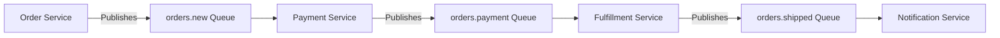

# RabbitMQ Prometheus Integration

## Introduction

Monitoring is a critical aspect of maintaining healthy, production-ready applications. When working with message brokers like RabbitMQ, proper monitoring ensures you can detect issues before they impact your users. In this guide, we'll explore how to integrate RabbitMQ with Prometheus - a powerful open-source monitoring and alerting system.

Prometheus works by collecting metrics from configured targets at specified intervals, storing the data, and allowing you to query and visualize it. The RabbitMQ-Prometheus integration provides valuable insights into queue depths, message rates, resource usage, and more.

## Prerequisites

Before we begin, make sure you have:

- A working RabbitMQ installation (3.8.0 or later)
- Basic understanding of RabbitMQ concepts
- Prometheus installed and running
- Access to modify RabbitMQ configuration

## Understanding the RabbitMQ Prometheus Plugin

Since version 3.8.0, RabbitMQ includes a built-in Prometheus plugin that exposes metrics in the format expected by Prometheus. This plugin makes collecting RabbitMQ metrics straightforward compared to older monitoring methods.

The plugin exposes a metrics endpoint that Prometheus can scrape, providing data on:
- Queue metrics (length, consumer count, message rates)
- Node metrics (memory usage, disk space, Erlang processes)
- Connection and channel statistics
- Exchange and binding information

## Enabling the Prometheus Plugin

Let's start by enabling the RabbitMQ Prometheus plugin:

```bash
rabbitmq-plugins enable rabbitmq_prometheus
```

This command enables the plugin which will expose metrics at `http://localhost:15692/metrics`. The endpoint serves data in Prometheus format, ready to be scraped.

To verify the plugin is working correctly, access this URL in your browser or use `curl`:

```bash
curl http://localhost:15692/metrics
```

You should see output similar to:

```
# TYPE rabbitmq_identity_info gauge
rabbitmq_identity_info{rabbitmq_cluster="rabbit@localhost",rabbitmq_version="3.9.13"} 1
# TYPE rabbitmq_build_info gauge
rabbitmq_build_info{rabbitmq_version="3.9.13"} 1
# HELP rabbitmq_connections Number of connections
# TYPE rabbitmq_connections gauge
rabbitmq_connections 1
...
```

## Configuring Prometheus to Scrape RabbitMQ

Now that our RabbitMQ instance exposes metrics, let's configure Prometheus to collect them. Edit your `prometheus.yml` file to add RabbitMQ as a scrape target:

```yaml
scrape_configs:
  - job_name: 'rabbitmq'
    static_configs:
      - targets: ['localhost:15692']
```

After saving the file, restart Prometheus or send a SIGHUP signal to reload the configuration:

```bash
kill -HUP $(pgrep prometheus)
```

## Understanding Key RabbitMQ Metrics

RabbitMQ exposes hundreds of metrics, but let's focus on some of the most important ones:

### Queue Metrics

- **rabbitmq_queue_messages**: Total messages in queue
- **rabbitmq_queue_messages_ready**: Messages ready for delivery
- **rabbitmq_queue_messages_unacknowledged**: Messages delivered but not yet acknowledged

### Node Metrics

- **rabbitmq_process_resident_memory_bytes**: Memory used by the Erlang processes
- **rabbitmq_disk_free_bytes**: Free disk space
- **rabbitmq_io_read_bytes_total**: Total bytes read from disk
- **rabbitmq_io_write_bytes_total**: Total bytes written to disk

### Connection Metrics

- **rabbitmq_connections**: Number of connections
- **rabbitmq_connection_created**: Connection creation events
- **rabbitmq_connection_closed**: Connection closure events

## Example: Querying RabbitMQ Metrics in Prometheus

Let's look at some practical examples of Prometheus queries for monitoring RabbitMQ:

### Query 1: Messages in Queues

To monitor the number of messages in all queues:

```
sum(rabbitmq_queue_messages)
```

To monitor messages in a specific queue:

```
rabbitmq_queue_messages{queue="my_important_queue"}
```

### Query 2: Message Rate

To calculate the rate of messages being published:

```
rate(rabbitmq_channel_messages_published_total[5m])
```

### Query 3: Memory Usage

To monitor memory usage:

```
rabbitmq_process_resident_memory_bytes / (1024 * 1024)
```

## Setting Up Grafana Dashboards

While Prometheus provides querying capabilities, Grafana offers better visualization. Here's how to set up a basic Grafana dashboard for RabbitMQ:

1. Add Prometheus as a data source in Grafana
2. Create a new dashboard
3. Add panels for key metrics

For example, to create a panel showing queue depth:

1. Add a new panel
2. Use the query: `sum by (queue) (rabbitmq_queue_messages)`
3. Select a graph visualization
4. Set appropriate thresholds and alerts

## Practical Example: Monitoring Message Processing System

Let's set up monitoring for a real-world scenario: an order processing system with several components communicating via RabbitMQ.

### System Architecture



### Critical Metrics to Monitor

For this system, we'll focus on these key metrics:

1. Queue depths to detect processing bottlenecks

```
rabbitmq_queue_messages{queue=~"orders.*"}
```

2. Consumer count to ensure services are running

```
rabbitmq_queue_consumers{queue=~"orders.*"}
```

3. Message processing rate to understand system throughput

```
rate(rabbitmq_queue_messages_delivered_total{queue=~"orders.*"}[5m])
```

### Setting Up Alerts

Let's create a Prometheus alert for queue backlog:

```yaml
groups:
- name: rabbitmq-alerts
  rules:
  - alert: QueueBacklog
    expr: rabbitmq_queue_messages{queue="orders.new"} > 100
    for: 5m
    labels:
      severity: warning
    annotations:
      summary: "Order queue backlog"
      description: "Orders queue has more than 100 messages for 5 minutes."
```

## Best Practices for RabbitMQ Monitoring

1. **Monitor Both RabbitMQ and Consumers**: Issues can occur on either side.

2. **Set Appropriate Thresholds**: Base alert thresholds on normal operating patterns.

3. **Track Trends, Not Just Values**: Rate of change can indicate problems before absolute values.

4. **Implement Dashboard Hierarchies**: Start with overview dashboards, then drill down into specifics.

5. **Combine Metrics with Logs**: For a complete picture, correlate metrics with log events.

## Troubleshooting Common Issues

### High Queue Depth

If your monitoring shows increasing queue depth:

1. Check if consumers are running
2. Verify consumer throughput is sufficient 
3. Consider scaling up consumers

```yaml
# Prometheus query to help identify slow consumers
sum(rate(rabbitmq_queue_messages_delivered_total{queue="orders.new"}[5m])) < 
sum(rate(rabbitmq_queue_messages_published_total{queue="orders.new"}[5m]))
```

### Memory Usage Problems

If memory usage is climbing:

1. Check for large messages
2. Look at queue growth
3. Review consumer acknowledgment patterns

```yaml
# Memory usage per queue
rabbitmq_queue_memory{vhost="/"} / (1024 * 1024)
```

## Summary

In this guide, we've covered:

- Setting up the RabbitMQ Prometheus plugin
- Configuring Prometheus to scrape RabbitMQ metrics
- Understanding key metrics to monitor
- Creating practical queries and alerts
- Implementing real-world monitoring for a message processing system
- Best practices for effective monitoring

With these tools and techniques, you can ensure your RabbitMQ-based systems remain healthy and performant. Monitoring is not a one-time setup but an ongoing practice that evolves with your system.

## Additional Resources

- [RabbitMQ Prometheus Plugin Documentation](https://www.rabbitmq.com/prometheus.html)
- [Prometheus Documentation](https://prometheus.io/docs/introduction/overview/)
- [Grafana Documentation](https://grafana.com/docs/)

## Exercises

1. Set up the RabbitMQ Prometheus integration on your local development environment.
2. Create a Grafana dashboard showing queue depth, publish and consume rates for a queue.
3. Implement an alert for when a queue has no consumers.
4. Write a Prometheus query to identify the queue with the highest message age.
5. Design a monitoring strategy for a microservice system using RabbitMQ for communication.