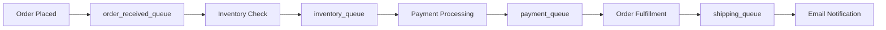

# RabbitMQ Grafana Dashboards

## Introduction

Monitoring is a critical aspect of maintaining a healthy RabbitMQ deployment. While RabbitMQ provides a management UI for basic monitoring, for production environments, you'll need more comprehensive visualization and alerting capabilities. Grafana is an open-source analytics and monitoring platform that pairs excellently with RabbitMQ, allowing you to create customized dashboards for real-time monitoring of your message broker's performance.

In this guide, we'll learn how to set up Grafana dashboards for RabbitMQ, understand key metrics to monitor, and create effective visualizations that help you maintain a healthy messaging system.

## Prerequisites

Before you begin, ensure you have:

- A running RabbitMQ instance
- Prometheus set up and configured to scrape metrics from RabbitMQ
- Grafana installed on your system

If you haven't set up the metrics collection yet, please refer to our previous guide on "Setting Up RabbitMQ Prometheus Integration" for detailed instructions.

## Setting Up Grafana for RabbitMQ Monitoring

### Step 1: Add Prometheus as a Data Source

First, we need to connect Grafana to our Prometheus instance:

1. Log in to your Grafana instance
2. Navigate to Configuration > Data Sources
3. Click "Add data source"
4. Select "Prometheus"
5. Set the URL to your Prometheus server (e.g., `http://localhost:9090`)
6. Click "Save & Test" to verify the connection

### Step 2: Import the RabbitMQ Dashboard

Grafana has a community-driven dashboard marketplace. We can import a pre-built RabbitMQ dashboard:

1. Navigate to Dashboards > Import
2. Enter the dashboard ID `10991` (RabbitMQ-Overview)
3. Select your Prometheus data source
4. Click "Import"

You now have a basic RabbitMQ monitoring dashboard!

## Key RabbitMQ Metrics to Monitor

Let's understand the essential metrics you should track in your Grafana dashboards:

### 1. System Health Metrics

- **Memory usage**: Track both absolute values and percentages relative to the high watermark
- **Disk space**: Monitor free disk space to prevent disk alarms
- **File descriptors**: Ensure RabbitMQ isn't running out of file handles
- **Socket descriptors**: Watch for connection limitations

### 2. Queue Metrics

- **Queue depth**: The number of messages waiting in queues
- **Queue growth rate**: How quickly messages are accumulating
- **Consumer utilization**: Percentage of time consumers are active processing messages

### 3. Message Rate Metrics

- **Publish rate**: Messages published per second
- **Delivery rate**: Messages delivered to consumers per second
- **Acknowledgment rate**: Messages acknowledged by consumers per second
- **Message age**: How long messages stay in queues before delivery

### 4. Exchange Metrics

- **Exchange publish rates**: Rate of messages published to each exchange
- **Exchange to queue binding rates**: Rate of message flow between exchanges and queues

### 5. Connection and Channel Metrics

- **Connection count**: Number of active connections
- **Channel count**: Number of active channels
- **Connection churn**: Rate of new connections/disconnections

## Creating a Custom RabbitMQ Dashboard

While imported dashboards are useful, you might want to create a custom dashboard tailored to your specific needs.

### Step 1: Create a New Dashboard

1. Navigate to Dashboards > New Dashboard
2. Click "Add new panel"

### Step 2: Configure Queue Depth Panel

Let's create a panel to monitor queue depths:

1. In the query editor, select your Prometheus data source
2. Enter the following PromQL query:

```
rabbitmq_queue_messages{queue=~"$queue"}
```

3. Configure the visualization settings (typically a time-series graph)
4. Add a title like "Queue Depth"
5. Set appropriate thresholds and alerts
6. Click "Save" to add the panel to your dashboard

### Step 3: Add Message Rate Panel

Now, let's add a panel to monitor message rates:

1. Add another panel
2. Enter this PromQL query:

```
rate(rabbitmq_channel_messages_published_total{queue=~"$queue"}[1m])
```

3. Choose a graph visualization
4. Title it "Message Publish Rate"
5. Save the panel

### Step 4: Add Variables for Dynamic Filtering

To make your dashboard more flexible:

1. Navigate to Dashboard Settings > Variables
2. Click "Add variable"
3. Set Name to "queue"
4. Set Type to "Query"
5. Enter the following Prometheus query:

```
label_values(rabbitmq_queue_messages, queue)
```

6. Enable "Multi-value" and "Include All option"
7. Save the variable

Now you can filter your dashboard by specific queues or view metrics for all queues.

## Practical Example: Monitoring a Message Processing Pipeline

Let's look at a real-world example of monitoring a message processing pipeline using Grafana and RabbitMQ.

Consider an e-commerce application that processes orders through several queues:



For this pipeline, we would create a dashboard with:

1. **Queue Health Overview Panel**: Shows all queues with their current depths
2. **Processing Rate Panel**: Displays messages processed per second for each stage
3. **Bottleneck Detection Panel**: Highlights queues where messages are accumulating
4. **End-to-End Latency Panel**: Measures time from order placement to fulfillment

### Example PromQL Queries for the Pipeline

For the Queue Health Overview:

```
rabbitmq_queue_messages{queue=~"order_received_queue|inventory_queue|payment_queue|shipping_queue"}
```

For Bottleneck Detection:

```
sum(increase(rabbitmq_queue_messages_published_total{queue=~"order_received_queue|inventory_queue|payment_queue|shipping_queue"}[5m])) by (queue) 
- 
sum(increase(rabbitmq_queue_messages_delivered_total{queue=~"order_received_queue|inventory_queue|payment_queue|shipping_queue"}[5m])) by (queue)
```

## Setting Up Alerts in Grafana

Monitoring is most effective when paired with alerting. Let's set up an alert for when queue depth exceeds a threshold:

1. Edit your Queue Depth panel
2. Navigate to the Alert tab
3. Click "Create Alert"
4. Set the rule condition to:
   - "WHEN avg() OF query(A, 5m, now) IS ABOVE 1000"
5. Set notification settings to your preferred channel (email, Slack, etc.)
6. Save the alert rule

Now you'll be notified when any queue exceeds 1,000 messages.

## Best Practices for RabbitMQ Dashboards

1. **Focus on actionable metrics**: Don't overwhelm your dashboard with too many metrics
2. **Set appropriate thresholds**: Understand your baseline performance first
3. **Group related metrics**: Organize panels logically (system health, queues, messages, etc.)
4. **Include context**: Add text panels explaining what metrics mean and what actions to take
5. **Use variables**: Make dashboards dynamic and reusable across different environments
6. **Review regularly**: Update dashboards as your system architecture evolves

## Troubleshooting Common Issues

When metrics indicate problems, here are some common RabbitMQ issues and their dashboard patterns:

1. **High queue depth with low consumer count**: Consider scaling up consumers
2. **High message age**: Check for slow consumers or processing issues
3. **Memory usage approaching high watermark**: Review message persistence settings or add memory
4. **Publish rate exceeding consume rate**: Look for consumer bottlenecks or scale consumption
5. **High connection churn**: Investigate client application issues that may be causing reconnections

## Summary

Grafana dashboards are a powerful tool for monitoring RabbitMQ instances. In this guide, we've learned how to:

- Set up Grafana with Prometheus as a data source for RabbitMQ
- Import pre-built dashboards and create custom ones
- Monitor key metrics for queues, messages, connections, and system health
- Create practical dashboards for real-world messaging pipelines
- Configure alerts to proactively address issues
- Follow best practices for effective RabbitMQ monitoring

By implementing effective monitoring with Grafana, you can ensure the reliability and performance of your RabbitMQ message broker, preventing issues before they impact your applications.

## Additional Resources

- Explore the [Grafana dashboard repository](https://grafana.com/grafana/dashboards/) for more RabbitMQ dashboard templates
- Check the [RabbitMQ Prometheus documentation](https://www.rabbitmq.com/prometheus.html) for additional metrics
- Learn more about [PromQL](https://prometheus.io/docs/prometheus/latest/querying/basics/) to create advanced queries

## Exercises

1. Set up a basic RabbitMQ Grafana dashboard with queue depth and message rate panels
2. Create a dashboard variable that allows filtering by virtual host
3. Configure an alert that notifies you when no messages are being consumed from a critical queue for more than 5 minutes
4. Design a dashboard that helps you visualize the end-to-end flow of messages through your system
5. Create a panel that shows the ratio of messages published to messages delivered, helping identify potential bottlenecks