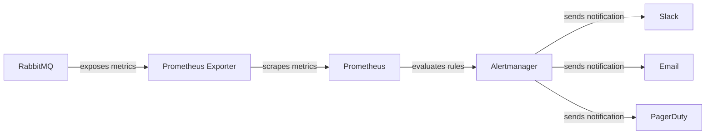

# RabbitMQ Alert Setup

## Introduction

Monitoring your RabbitMQ instances is only half the battle - you also need to be notified when something goes wrong. Setting up alerts for your RabbitMQ deployment helps you proactively identify and address issues before they impact your applications or users. This guide will walk you through the process of configuring various types of alerts for your RabbitMQ instances, helping you maintain system reliability and performance.

## Why RabbitMQ Alerts Matter

RabbitMQ is often a critical component in distributed systems, acting as a message broker between various services. When issues arise with RabbitMQ, they can quickly cascade throughout your entire system. Properly configured alerts allow you to:

- Detect problems early before they become critical
- Reduce system downtime
- Maintain message delivery reliability
- Optimize resource usage
- Plan capacity based on usage patterns

## Key RabbitMQ Metrics to Monitor

Before setting up alerts, it's important to understand which metrics are most critical to monitor:

| Metric Category | Key Metrics | Why It Matters |
|----------------|-------------|----------------|
| Node Health | CPU usage, memory usage, disk space | Ensures RabbitMQ has adequate resources |
| Queue Metrics | Queue depth, queue growth rate | Identifies bottlenecks in message processing |
| Message Rates | Publish rate, consumer rate, ack rate | Shows overall system throughput |
| Connection Status | Number of connections, channels | Helps identify connection issues |
| Cluster Health | Nodes running, network partitions | Ensures cluster stability |

## Setting Up Basic RabbitMQ Alerts

Let's start by setting up some basic alerts using the RabbitMQ Management Plugin and a monitoring tool like Prometheus with Alertmanager.

### 1. Enable the RabbitMQ Management Plugin

If you haven't already, ensure the RabbitMQ Management Plugin is enabled:

```bash
rabbitmq-plugins enable rabbitmq_management
```

### 2. Install Prometheus and Node Exporter

First, install Prometheus and the Node Exporter:

```bash
# Download Prometheus
wget https://github.com/prometheus/prometheus/releases/download/v2.40.0/prometheus-2.40.0.linux-amd64.tar.gz
tar xvfz prometheus-*.tar.gz
cd prometheus-*

# Download Node Exporter
wget https://github.com/prometheus/node_exporter/releases/download/v1.4.0/node_exporter-1.4.0.linux-amd64.tar.gz
tar xvfz node_exporter-*.tar.gz
```

### 3. Install RabbitMQ Prometheus Plugin

Enable the RabbitMQ Prometheus integration:

```bash
rabbitmq-plugins enable rabbitmq_prometheus
```

### 4. Configure Prometheus

Create a `prometheus.yml` configuration file:

```yaml
global:
  scrape_interval: 15s

scrape_configs:
  - job_name: 'rabbitmq'
    static_configs:
      - targets: ['localhost:15692']

  - job_name: 'node'
    static_configs:
      - targets: ['localhost:9100']
```

### 5. Setup Alertmanager

Create an Alertmanager configuration file `alertmanager.yml`:

```yaml
global:
  resolve_timeout: 5m
  slack_api_url: 'https://hooks.slack.com/services/YOUR_SLACK_WEBHOOK_URL'

route:
  group_by: ['alertname']
  group_wait: 30s
  group_interval: 5m
  repeat_interval: 1h
  receiver: 'slack-notifications'

receivers:
- name: 'slack-notifications'
  slack_configs:
  - channel: '#rabbitmq-alerts'
    send_resolved: true
```

## Defining Alert Rules

Now, let's define some alert rules for Prometheus. Create a file called `rabbitmq_alerts.yml`:

```yaml
groups:
- name: RabbitMQ
  rules:
  - alert: RabbitMQNodeDown
    expr: rabbitmq_up == 0
    for: 1m
    labels:
      severity: critical
    annotations:
      summary: "RabbitMQ node down"
      description: "RabbitMQ node has been down for more than 1 minute."

  - alert: RabbitMQHighMemoryUsage
    expr: rabbitmq_node_mem_used / rabbitmq_node_mem_limit > 0.8
    for: 5m
    labels:
      severity: warning
    annotations:
      summary: "RabbitMQ high memory usage"
      description: "RabbitMQ memory usage is over 80% for more than 5 minutes."

  - alert: RabbitMQTooManyUnacknowledgedMessages
    expr: sum(rabbitmq_queue_messages_unacknowledged) > 1000
    for: 10m
    labels:
      severity: warning
    annotations:
      summary: "Too many unacknowledged messages"
      description: "There are more than 1000 unacknowledged messages for more than 10 minutes."
```

In the Prometheus configuration, reference this alert file:

```yaml
# Add to prometheus.yml
rule_files:
  - 'rabbitmq_alerts.yml'

alerting:
  alertmanagers:
  - static_configs:
    - targets:
      - localhost:9093
```

## Alert Flow Architecture

Here's a diagram showing how the alerts flow through the system:



## Practical Example: Setting Up Queue Depth Alerts

Let's walk through a practical example of setting up alerts for queue depth, which is one of the most important metrics to monitor.

### 1. Define Queue-Specific Alert Rules

Add these rules to your `rabbitmq_alerts.yml` file:

```yaml
- alert: RabbitMQQueueGrowing
  expr: sum by(queue) (increase(rabbitmq_queue_messages_total[1h])) > 1000
  for: 15m
  labels:
    severity: warning
  annotations:
    summary: "Queue {{ $labels.queue }} is growing"
    description: "Queue {{ $labels.queue }} has grown by more than 1000 messages in the last hour and continues to grow."

- alert: RabbitMQQueueNotBeingConsumed
  expr: rabbitmq_queue_consumers == 0 and rabbitmq_queue_messages > 0
  for: 10m
  labels:
    severity: warning
  annotations:
    summary: "Queue {{ $labels.queue }} has no consumers"
    description: "Queue {{ $labels.queue }} has messages but no consumers for more than 10 minutes."
```

### 2. Create a Simple Python Script to Test Queue Growth

To test our alerts, let's create a script that publishes many messages to a queue:

```python
#!/usr/bin/env python
import pika
import time

# Connect to RabbitMQ
connection = pika.BlockingConnection(
    pika.ConnectionParameters('localhost')
)
channel = connection.channel()

# Declare a queue
queue_name = "test_queue"
channel.queue_declare(queue=queue_name, durable=True)

# Publish 2000 messages
for i in range(2000):
    message = f"Test message {i}"
    channel.basic_publish(
        exchange='',
        routing_key=queue_name,
        body=message,
        properties=pika.BasicProperties(
            delivery_mode=2,  # make message persistent
        )
    )
    if i % 100 == 0:
        print(f"Published {i} messages")
    time.sleep(0.01)  # Small delay to avoid overwhelming the system

print("Done publishing messages")
connection.close()
```

Save this as `publish_test_messages.py` and run it to generate test data.

## Advanced Alert Configurations

### Dead Letter Queue Monitoring

Dead letter queues (DLQs) are special queues where messages that can't be processed are sent. Monitoring these is crucial:

```yaml
- alert: RabbitMQDeadLetterQueueGrowing
  expr: sum by(queue) (rate(rabbitmq_queue_messages_published_total{queue=~".*dlq.*|.*dead.*"}[5m])) > 0
  for: 5m
  labels:
    severity: warning
  annotations:
    summary: "Dead letter queue {{ $labels.queue }} is receiving messages"
    description: "Messages are being published to dead letter queue {{ $labels.queue }}."
```

### Shovel and Federation Monitoring

If you're using RabbitMQ Shovel or Federation plugins to move messages between brokers, you should monitor their status:

```yaml
- alert: RabbitMQShovelDown
  expr: rabbitmq_shovel_state != 1
  for: 5m
  labels:
    severity: warning
  annotations:
    summary: "RabbitMQ shovel {{ $labels.shovel }} is down"
    description: "RabbitMQ shovel {{ $labels.shovel }} on node {{ $labels.node }} is not running."
```

## Integrating with Different Notification Systems

### Email Notifications

To configure email notifications with Alertmanager, add this to your `alertmanager.yml`:

```yaml
receivers:
- name: 'email-notifications'
  email_configs:
  - to: 'team@example.com'
    from: 'alertmanager@example.com'
    smarthost: 'smtp.example.com:587'
    auth_username: 'alertmanager'
    auth_password: 'password'
```

### PagerDuty Integration

For PagerDuty integration, add:

```yaml
receivers:
- name: 'pagerduty-notifications'
  pagerduty_configs:
  - service_key: 'your_pagerduty_service_key'
```

## Implementing Alert Remediation Scripts

You can take automation a step further by creating remediation scripts that take action when certain alerts fire. Here's an example of a simple script that could restart a RabbitMQ service if it goes down:

```python
#!/usr/bin/env python
import requests
import subprocess
import sys
import json

# Script to restart RabbitMQ when an alert is received
# This would be triggered by a webhook from Alertmanager

def restart_rabbitmq():
    """Restart the RabbitMQ service"""
    try:
        subprocess.run(["systemctl", "restart", "rabbitmq-server"], check=True)
        print("RabbitMQ service restarted successfully")
        return True
    except subprocess.CalledProcessError as e:
        print(f"Failed to restart RabbitMQ: {e}")
        return False

# Main webhook handler (this would be part of a web service)
def handle_alert(alert_data):
    # Parse the alert data
    alert = json.loads(alert_data)
    
    # Check if this is a RabbitMQ node down alert
    if alert.get("alertname") == "RabbitMQNodeDown":
        print("Received RabbitMQ node down alert, attempting to restart service")
        restart_rabbitmq()
    else:
        print(f"Alert {alert.get('alertname')} does not require automatic remediation")

# For testing
if __name__ == "__main__":
    # Example alert data
    test_alert = '{"alertname":"RabbitMQNodeDown","severity":"critical"}'
    handle_alert(test_alert)
```

## Best Practices for RabbitMQ Alerting

1. **Avoid Alert Fatigue**: Too many alerts can lead to alert fatigue. Focus on actionable alerts.
2. **Set Appropriate Thresholds**: Adjust thresholds based on your system's normal behavior.
3. **Use Alert Priority Levels**: Not all alerts are equally important. Use severity levels wisely.
4. **Document Alert Responses**: Create runbooks for each alert type.
5. **Test Your Alerts**: Regularly test your alerts to ensure they're functioning correctly.
6. **Implement Escalation Policies**: Define clear escalation paths for unresolved alerts.

## Troubleshooting Common Alert Issues

### False Positives

If you're getting too many false positives:
- Adjust your thresholds to better match your environment
- Increase the `for` duration to ensure the condition persists before alerting
- Add more specific label matchers to target only the relevant queues or nodes

### Missing Alerts

If you're not receiving alerts when you should:
- Check that Prometheus is scraping metrics correctly
- Verify that Alertmanager is running and connected
- Test your notification channels directly
- Check network connectivity between components

## Summary

Setting up effective alerts for RabbitMQ is essential for maintaining a reliable messaging system. By monitoring key metrics and configuring appropriate alerts, you can identify and address issues before they impact your system's performance or availability.

Remember these key points:
- Focus on monitoring queue depths, message rates, and node health
- Configure alerting thresholds appropriate for your environment
- Integrate with your team's preferred notification channels
- Create runbooks for addressing common issues
- Regularly review and refine your alert configurations

## Additional Resources

- [Prometheus documentation](https://prometheus.io/docs/introduction/overview/)
- [RabbitMQ monitoring guide](https://www.rabbitmq.com/monitoring.html)
- [Alertmanager documentation](https://prometheus.io/docs/alerting/latest/alertmanager/)

## Exercises

1. Set up a test RabbitMQ environment and configure the basic alerts described in this guide
2. Create a custom alert for a specific queue in your system
3. Implement a simple webhook receiver for alert notifications
4. Design an alert escalation policy for your team
5. Create a runbook for addressing common RabbitMQ issues