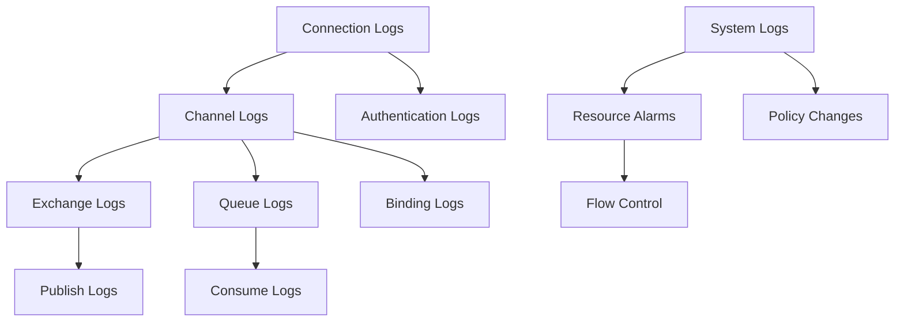

# RabbitMQ Log Analysis

## Introduction

Logs are your window into understanding what's happening inside your RabbitMQ system. Just like detective work, analyzing logs helps you uncover performance bottlenecks, troubleshoot errors, and ensure your messaging system is operating correctly.

In this guide, we'll explore how to access, interpret, and analyze RabbitMQ logs to maintain a healthy messaging infrastructure. Whether you're trying to solve a specific problem or establishing proactive monitoring practices, mastering log analysis is an essential skill for any RabbitMQ administrator.

## Understanding RabbitMQ Logging Basics

RabbitMQ writes information about its operations to log files. These logs capture everything from routine operations to critical errors, providing valuable insights into system behavior.

### Log Locations

The location of RabbitMQ log files depends on your installation method and operating system:

- **Debian/Ubuntu**: `/var/log/rabbitmq/`
- **RPM-based systems** (CentOS, RHEL): `/var/log/rabbitmq/`
- **Windows**: `%APPDATA%\RabbitMQ\log\`
- **Generic UNIX**: `$RABBITMQ_HOME/var/log/rabbitmq/`
- **Docker**: Logs are typically streamed to standard output

The main log files you'll interact with include:

- `rabbit@[hostname].log` - General RabbitMQ server logs
- `rabbit@[hostname]-sasl.log` - System Application Support Library logs (errors, crashes)

### Log Format

RabbitMQ logs typically follow this format:

```
[timestamp] [log_level] [connection_info] [message]
```

For example:

```
2023-06-15 10:23:45.123 [info] <0.684.0> connection <0.684.0> (172.18.0.1:52484 -> 172.18.0.2:5672): user 'admin' authenticated and granted access to vhost '/'
```

Let's break down each component:

- **Timestamp**: When the event occurred
- **Log Level**: Severity of the entry (debug, info, warning, error)
- **Connection Info**: Process IDs and connection identifiers
- **Message**: The actual log message detailing what happened

## Configuring RabbitMQ Logging

Before diving into analysis, it's important to configure logging appropriately for your needs.

### Setting Log Levels

RabbitMQ supports multiple log levels:

- **debug**: Detailed information for debugging
- **info**: General operational information
- **warning**: Potential issues that aren't critical
- **error**: Errors that should be investigated
- **critical**: Severe issues requiring immediate attention

You can configure log levels in `rabbitmq.conf`:

```
log.file.level = info
```

For more granular control, you can set different log levels for specific categories:

```
log.connection.level = info
log.channel.level = warning
```

### Log Rotation

To prevent logs from consuming too much disk space, enable log rotation:

```
log.file.rotation.count = 5
log.file.rotation.size = 10485760
```

This configuration keeps 5 rotated files with a maximum size of 10MB each.

## Accessing and Viewing Logs

### Command Line Tools

The most straightforward way to view logs is through command-line tools:

```bash
# View the last 100 lines of the log
tail -n 100 /var/log/rabbitmq/rabbit@hostname.log

# Follow the log in real-time
tail -f /var/log/rabbitmq/rabbit@hostname.log

# Search for error messages
grep "error" /var/log/rabbitmq/rabbit@hostname.log
```

### Management UI

RabbitMQ's Management UI also provides access to logs. Navigate to the "Logs" tab to view recent entries:

1. Login to the Management UI (default: http://localhost:15672)
2. Click on "Admin" in the top navigation
3. Select "Logs" from the dropdown menu

The UI offers filtering options to help focus on specific types of entries.

## Common Log Patterns and Their Meaning

Let's examine some common log patterns and what they tell us:

### Connection Logs

```
2023-06-15 10:23:45.123 [info] <0.684.0> connection <0.684.0> (172.18.0.1:52484 -> 172.18.0.2:5672): user 'admin' authenticated and granted access to vhost '/'
```

This indicates a successful connection from IP 172.18.0.1 to the RabbitMQ server, authenticating as 'admin' and accessing the default virtual host.

### Channel Logs

```
2023-06-15 10:25:12.456 [info] <0.691.0> channel created
```

A new channel was created in the connection process.

### Queue Logs

```
2023-06-15 10:26:34.789 [info] <0.691.0> queue 'orders_queue' declared
```

A queue named 'orders_queue' was declared.

### Error and Warning Logs

```
2023-06-15 11:15:22.345 [error] <0.789.0> connection <0.789.0>: closing: {socket_closed_unexpectedly,{gen_tcp,recv,0}}
```

This indicates an unexpected socket closure, which could point to network issues or client disconnections.

```
2023-06-15 11:30:45.678 [warning] <0.800.0> memory resource limit alarm set on node rabbit@hostname
```

This warning indicates that RabbitMQ is approaching its configured memory limit, which could lead to performance issues.

## Practical Log Analysis Examples

Let's walk through some common scenarios and how to investigate them through logs.

### Example 1: Troubleshooting Connection Issues

**Scenario**: Client applications are frequently disconnecting

**Analysis Steps**:

1. Search for connection-related errors:

```bash
grep "connection" /var/log/rabbitmq/rabbit@hostname.log | grep "error\|closed"
```

2. Look for patterns in timestamps to correlate with other system events

3. Check for authentication failures:

```bash
grep "auth" /var/log/rabbitmq/rabbit@hostname.log
```

**Example Output**:

```
2023-06-15 14:23:11.123 [error] <0.891.0> connection <0.891.0> (172.18.0.5:42123 -> 172.18.0.2:5672): user 'client_app' failed to authenticate
2023-06-15 14:30:22.456 [error] <0.892.0> connection <0.892.0>: closing: {socket_closed_unexpectedly,{gen_tcp,recv,0}}
2023-06-15 14:35:33.789 [error] <0.893.0> connection <0.893.0>: closing: {connection_closed_abruptly,{error,closed}}
```

**Interpretation**: The first line shows an authentication failure, which could indicate incorrect credentials. The subsequent lines show connections closing unexpectedly, which might point to network instability or client application issues.

### Example 2: Identifying Performance Bottlenecks

**Scenario**: Messages are processing slowly

**Analysis Steps**:

1. Check for resource alarms:

```bash
grep "alarm" /var/log/rabbitmq/rabbit@hostname.log
```

2. Examine consumer acknowledgment patterns:

```bash
grep "basic.ack\|basic.nack" /var/log/rabbitmq/rabbit@hostname.log
```

3. Look for flow control activations:

```bash
grep "flow" /var/log/rabbitmq/rabbit@hostname.log
```

**Example Output**:

```
2023-06-15 09:45:12.123 [warning] <0.800.0> memory resource limit alarm set on node rabbit@hostname
2023-06-15 09:45:15.456 [info] <0.702.0> applying flow control to connection <0.702.0>
2023-06-15 10:15:22.789 [info] <0.800.0> memory resource limit alarm cleared on node rabbit@hostname
```

**Interpretation**: This sequence indicates that RabbitMQ activated memory alarms due to high memory usage, applied flow control to slow down producers, and eventually cleared the alarm when memory usage normalized.

### Example 3: Monitoring Queue Health

**Scenario**: Monitoring queue operations for a critical system

**Analysis Steps**:

1. Track queue declarations and deletions:

```bash
grep "queue.*declared\|queue.*deleted" /var/log/rabbitmq/rabbit@hostname.log
```

2. Monitor for queue policy changes:

```bash
grep "policy" /var/log/rabbitmq/rabbit@hostname.log
```

**Example Output**:

```
2023-06-15 08:15:11.123 [info] <0.691.0> queue 'payment_processing' declared
2023-06-15 08:30:22.456 [info] <0.700.0> policy 'ha-payment' for pattern 'payment.*' in vhost '/' defined
2023-06-15 12:45:33.789 [warning] <0.850.0> queue 'payment_processing' in vhost '/': depth exceeds max-length
```

**Interpretation**: The queue was declared, then a high-availability policy was applied. Later, a warning shows that the queue exceeded its configured maximum length, which could indicate a consumer problem or unexpected message volume.

## Building a Log Analysis Pipeline

For production environments, you'll want more sophisticated log analysis than manual grep commands. Let's build a basic log analysis pipeline:

### Step 1: Centralize Logs

Use a log aggregation tool like the ELK Stack (Elasticsearch, Logstash, Kibana) or Graylog to collect logs from multiple RabbitMQ nodes.

Here's a simple Logstash configuration for RabbitMQ logs:

```
input {
  file {
    path => "/var/log/rabbitmq/rabbit@*.log"
    type => "rabbitmq"
  }
}

filter {
  if [type] == "rabbitmq" {
    grok {
      match => { "message" => "%{TIMESTAMP_ISO8601:timestamp} \[%{LOGLEVEL:log_level}\] %{GREEDYDATA:log_message}" }
    }
    
    date {
      match => [ "timestamp", "yyyy-MM-dd HH:mm:ss.SSS" ]
      target => "@timestamp"
    }
  }
}

output {
  elasticsearch {
    hosts => ["localhost:9200"]
    index => "rabbitmq-logs-%{+YYYY.MM.dd}"
  }
}
```

### Step 2: Visualize and Dashboard

With logs in Elasticsearch, create Kibana dashboards to monitor:

- Connection errors over time
- Authentication failures
- Resource alarm occurrences
- Queue operations

### Step 3: Set Up Alerts

Configure alerts for critical conditions:

- Persistent connection failures
- Resource alarms
- Authentication failures
- Unexpected queue deletions

Here's an example of a monitoring check to alert on memory alarms:

```bash
#!/bin/bash
# Script to check for memory alarms in RabbitMQ logs

if grep -q "memory resource limit alarm set" /var/log/rabbitmq/rabbit@hostname.log; then
  echo "CRITICAL: Memory alarm detected in RabbitMQ"
  exit 2
else
  echo "OK: No memory alarms detected"
  exit 0
fi
```

## Visualizing Log Patterns

Log patterns can be easier to understand when visualized. Here's a simple diagram showing the relationship between different types of log entries:



## Advanced Log Analysis Techniques

### Correlating Logs with Metrics

For the most comprehensive monitoring, correlate log events with metrics:

1. **High Memory Usage + Memory Alarms**: Indicates memory pressure
2. **Connection Failures + High CPU**: May show overloaded broker
3. **Queue Length Increases + Slow Consumer Logs**: Points to consumer issues

### Pattern Recognition

Look for these common patterns:

1. **Cyclical Connection Errors**: Could indicate client reconnection loops
2. **Repeated Authentication Failures**: Potential security issues
3. **Queue Declarations Without Consumers**: May lead to queue buildup

### Using Regular Expressions for Advanced Filtering

Here's an example of extracting specific connection information:

```bash
grep -P "connection .* \((?<client_ip>\d+\.\d+\.\d+\.\d+):(?<client_port>\d+) -> (?<server_ip>\d+\.\d+\.\d+\.\d+):(?<server_port>\d+)\)" /var/log/rabbitmq/rabbit@hostname.log
```

## Summary

RabbitMQ log analysis is an essential skill for maintaining a healthy messaging system. By understanding log formats, common patterns, and establishing proper monitoring, you can:

- Quickly identify and resolve issues
- Monitor system health proactively
- Track usage patterns and plan capacity
- Ensure security compliance

Remember that effective log analysis is both reactive (troubleshooting issues) and proactive (monitoring for potential problems). Combine log analysis with metrics monitoring for the most comprehensive view of your RabbitMQ environment.

## Further Resources and Exercises

### Resources

- [Official RabbitMQ Logging Documentation](https://www.rabbitmq.com/logging.html)
- [ELK Stack Documentation](https://www.elastic.co/guide/index.html)
- [Graylog for Log Management](https://www.graylog.org/resources)

### Exercises

1. **Log Pattern Recognition**: Review a sample RabbitMQ log file and identify all unique message types.

2. **Error Investigation**: Given a log snippet with connection errors, determine the root cause.

3. **Dashboard Creation**: Build a Kibana dashboard to visualize RabbitMQ connection patterns.

4. **Alert Configuration**: Configure alerts for critical RabbitMQ events using the log monitoring tool of your choice.

5. **Log Rotation Setup**: Configure proper log rotation for a RabbitMQ cluster to ensure logs don't fill disk space.

By mastering these techniques, you'll be well-equipped to maintain a reliable, high-performing RabbitMQ messaging system.