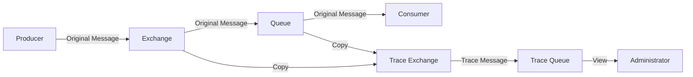

# RabbitMQ Tracing

## Introduction

When working with message-based systems, understanding the flow of messages through your broker is essential for debugging issues and monitoring application behavior. RabbitMQ Tracing is a powerful feature that allows you to capture and inspect messages as they travel through exchanges and queues in your RabbitMQ setup.

In this guide, we'll explore how RabbitMQ Tracing works, how to enable it, and how to use it effectively to troubleshoot messaging problems in your applications.

## What is RabbitMQ Tracing?

RabbitMQ Tracing is a feature that lets you capture copies of messages passing through your RabbitMQ broker. These copies are then published to special "trace exchanges," which you can configure to route the trace messages to queues for inspection.

Tracing in RabbitMQ works at the virtual host level and can be enabled for both incoming (published) and outgoing (delivered) messages.



## Enabling RabbitMQ Tracing

### Prerequisites

RabbitMQ Tracing is provided through the `rabbitmq_tracing` plugin, which is included with RabbitMQ but is not enabled by default. You'll need to enable this plugin before you can use tracing.

```bash
rabbitmq-plugins enable rabbitmq_tracing
```

### Using the Management UI

The easiest way to configure tracing is through the RabbitMQ Management UI:

1. Log in to the RabbitMQ Management UI (typically at http://localhost:15672)
2. Navigate to the "Admin" tab
3. Select "Tracing" from the sub-menu
4. Click "Add a new trace"
5. Configure your trace with:
   - Name: A descriptive name for your trace
   - Format: Select either "Text" or "JSON"
   - Pattern: You can use routing patterns to filter which messages are traced
   - Max payload bytes: Limit the size of traced message payloads

### Using the Command Line

You can also enable tracing using the `rabbitmqctl` command-line tool:

```bash
rabbitmqctl trace_on
```

To disable tracing:

```bash
rabbitmqctl trace_off
```

For more specific tracing needs, you can use the HTTP API to create custom traces:

```bash
curl -i -u guest:guest -H "content-type:application/json" \
    -XPUT http://localhost:15672/api/traces/%2f/my-trace \
    -d '{"pattern":"#", "name":"my-trace", "format":"text", "max_payload_bytes":10000}'
```

## Understanding Trace Exchanges and Queues

When you enable tracing, RabbitMQ creates two special exchanges:

1. `amq.rabbitmq.trace` - A topic exchange for collecting trace messages
2. `publish.exchange` - For messages that were published
3. `deliver.queue` - For messages that were delivered to a queue

The routing keys for trace messages follow these patterns:

- `publish.exchange_name` - For published messages
- `deliver.queue_name` - For delivered messages

Messages published to these exchanges include:
- The original message content
- Headers with metadata about the original message
- Information about when and how the message was processed

## Practical Example: Debugging Message Flow

Let's walk through a common scenario where RabbitMQ Tracing can help debug an issue where messages appear to be published but never reach consumers.

### Step 1: Set up a basic messaging application

First, let's create a simple Python application with a producer and consumer:

```python
# producer.py
import pika

connection = pika.BlockingConnection(pika.ConnectionParameters('localhost'))
channel = connection.channel()

channel.exchange_declare(exchange='orders', exchange_type='topic')

# Publish a test message
message = '{"id": 12345, "customer": "John Doe", "amount": 99.99}'
channel.basic_publish(
    exchange='orders',
    routing_key='orders.new',
    body=message
)

print(f"[x] Sent: {message}")
connection.close()
```

```python
# consumer.py
import pika

connection = pika.BlockingConnection(pika.ConnectionParameters('localhost'))
channel = connection.channel()

channel.exchange_declare(exchange='orders', exchange_type='topic')
result = channel.queue_declare(queue='', exclusive=True)
queue_name = result.method.queue

# Bind to the exchange with incorrect routing key
channel.queue_bind(
    exchange='orders',
    queue=queue_name,
    routing_key='orders.created'  # Note: This doesn't match the producer's 'orders.new'
)

print('[*] Waiting for messages. To exit press CTRL+C')

def callback(ch, method, properties, body):
    print(f"[x] Received {body}")

channel.basic_consume(
    queue=queue_name, 
    on_message_callback=callback,
    auto_ack=True
)

channel.start_consuming()
```

### Step 2: Enable tracing

Enable tracing through the management UI or command line:

```bash
rabbitmqctl trace_on
```

### Step 3: Set up a trace log consumer

Create a script to consume and display the traced messages:

```python
# trace_consumer.py
import pika

connection = pika.BlockingConnection(pika.ConnectionParameters('localhost'))
channel = connection.channel()

# Bind to the trace exchange
channel.exchange_declare(exchange='amq.rabbitmq.trace', exchange_type='topic', durable=True)
result = channel.queue_declare(queue='', exclusive=True)
queue_name = result.method.queue

# Capture all traced messages
channel.queue_bind(
    exchange='amq.rabbitmq.trace',
    queue=queue_name,
    routing_key='#'
)

print('[*] Waiting for trace messages. To exit press CTRL+C')

def callback(ch, method, properties, body):
    print(f"
[x] Trace: {method.routing_key}")
    print(f"Headers: {properties.headers}")
    print(f"Body: {body}")

channel.basic_consume(
    queue=queue_name, 
    on_message_callback=callback,
    auto_ack=True
)

channel.start_consuming()
```

### Step 4: Run the application and analyze results

1. Start the trace consumer
2. Start the regular consumer
3. Run the producer

Analyzing the trace output, you might see something like:

```
[x] Trace: publish.orders
Headers: {'exchange_name': 'orders', 'routing_keys': ['orders.new'], 'properties': {...}}
Body: b'{"id": 12345, "customer": "John Doe", "amount": 99.99}'

# Notice no 'deliver' message appears
```

This shows the message was published to the exchange but was never delivered to any queue. By checking the routing key in the trace (`orders.new`) and comparing it with what our consumer is binding to (`orders.created`), we can identify the mismatch.

The fix would be to update either the producer or consumer to use matching routing keys.

## Tracing Performance Considerations

While RabbitMQ Tracing is a powerful debugging tool, it comes with some performance implications:

1. **Additional Resource Usage**: Tracing duplicates messages, which increases memory and network bandwidth usage.

2. **Performance Impact**: Enabling tracing, especially in high-volume systems, can impact overall broker performance.

3. **Storage Requirements**: If you're logging trace messages to disk, be mindful of the space required, especially in busy systems.

Best practices for using tracing in production:

- Use tracing selectively, focusing on specific exchanges or queues when possible
- Set short time limits for tracing sessions in production
- Use the `max_payload_bytes` parameter to limit the size of traced messages
- Consider using RabbitMQ's Firehose feature for more permanent monitoring with less overhead

## Advanced Tracing Techniques

### Filtering Trace Messages

You can use routing key patterns to filter which messages are traced:

```bash
curl -i -u guest:guest -H "content-type:application/json" \
    -XPUT http://localhost:15672/api/traces/%2f/orders-trace \
    -d '{"pattern":"publish.orders", "name":"orders-trace", "format":"text"}'
```

This will only trace messages published to the "orders" exchange.

### Formatting Options

RabbitMQ Tracing supports two main formats:

1. **Text**: A human-readable format for easy debugging
2. **JSON**: A structured format better suited for automated processing

Example JSON output:

```json
{
  "timestamp": 1615312568,
  "type": "publish",
  "exchange": "orders",
  "queue": null,
  "routing_keys": ["orders.new"],
  "properties": {
    "content_type": "application/json",
    "headers": {}
  },
  "payload": "{\"id\": 12345, \"customer\": \"John Doe\", \"amount\": 99.99}"
}
```

## Alternatives to RabbitMQ Tracing

For more comprehensive monitoring, consider these alternatives:

1. **RabbitMQ Firehose**: A feature that allows you to tap into all messages published on a specific RabbitMQ node with less overhead than tracing.

2. **Shovel Plugin**: Can be used to move messages between brokers, useful for centralizing logs.

3. **Application-Level Tracing**: Implementing tracing at the application level using frameworks like OpenTelemetry.

## Summary

RabbitMQ Tracing is an invaluable tool for understanding message flow and troubleshooting issues in your messaging system:

- It provides visibility into message publishing and delivery
- It helps identify routing and configuration issues
- It's easy to enable and disable as needed
- It should be used carefully in production environments due to performance impacts

By mastering RabbitMQ Tracing, you'll be better equipped to diagnose and resolve messaging issues, ensuring your applications communicate reliably and efficiently.

## Additional Resources

- [RabbitMQ Tracing Plugin Documentation](https://www.rabbitmq.com/firehose.html)
- [RabbitMQ Management HTTP API Documentation](https://www.rabbitmq.com/management.html#http-api)
- [Monitoring RabbitMQ Guide](https://www.rabbitmq.com/monitoring.html)

## Exercises

1. Enable tracing on your RabbitMQ instance and observe messages flowing through a simple producer/consumer application.

2. Create a script that consumes from a trace queue and logs the messages to a file for later analysis.

3. Use tracing to debug a scenario where messages are being published with one routing key but consumed with another.

4. Experiment with different trace formats (text vs. JSON) and determine which is more useful for your specific use case.

5. Create a trace that only captures messages for a specific exchange and compare the performance impact with tracing all messages.