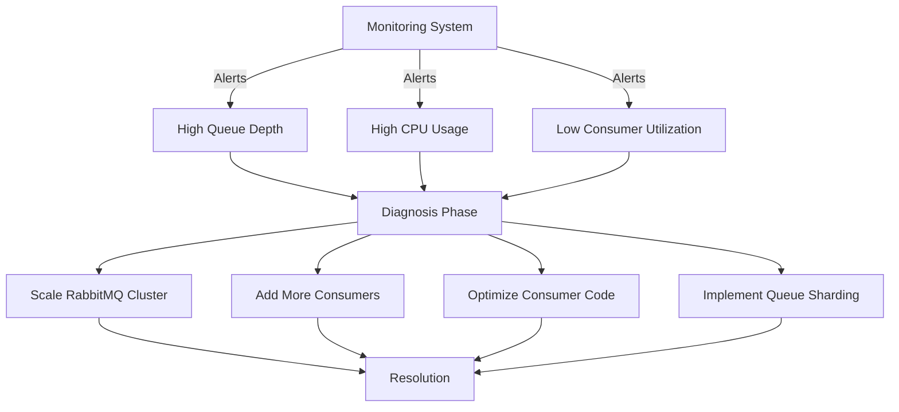

# RabbitMQ Performance Monitoring

## Introduction

Ensuring your RabbitMQ message broker performs optimally is critical for application reliability and scalability. Performance monitoring helps you identify bottlenecks, plan capacity, and troubleshoot issues before they impact your users. This guide will walk you through the essential aspects of RabbitMQ performance monitoring, from basic metrics to advanced tooling and best practices.

## Why Monitor RabbitMQ Performance?

RabbitMQ operates as a central communication hub in distributed systems. Poor performance can lead to:

- Message delivery delays
- Application timeouts
- Data loss
- System-wide cascading failures
- Degraded user experience

Proactive monitoring helps maintain system health and prevent these issues.

## Key Performance Metrics

### Queue Metrics

Queue metrics tell you how messages are flowing through your system:

- **Queue Length**: The number of messages waiting in a queue
- **Queue Growth Rate**: How quickly a queue is accumulating messages
- **Consumer Utilization**: Percentage of time consumers are actively processing messages (ideally near 100%)
- **Message Rates**: Publishing and delivery rates per queue or exchange

```bash
# Example command to check queue metrics
rabbitmqctl list_queues name messages_ready messages_unacknowledged message_stats.publish_details.rate message_stats.deliver_details.rate

# Example output
Timeout: 60.0 seconds ...
Listing queues for vhost / ...
name	messages_ready	messages_unacknowledged	message_stats.publish_details.rate	message_stats.deliver_details.rate
orders_queue	25	12	145.2	142.6
notifications_queue	3	2	15.8	15.7
logging_queue	1254	0	320.5	200.3
```

### Node Resource Metrics

System resources affect RabbitMQ's ability to handle message traffic:

- **Memory Usage**: RabbitMQ's memory consumption versus available memory
- **Disk Space**: Free space on the node's disk
- **File Descriptors**: Open file handles (can limit connection count)
- **CPU Utilization**: Processor usage per node
- **Socket Descriptors**: Network socket usage for connections

```bash
# Example command to check node resource usage
rabbitmqctl status

# Partial example output
...
Memory:
  Total memory used: 1.2 GB
  Calculation strategy: rss
  Memory high watermark setting: 0.4 relative (2.0 GB)
  Memory limit alarm: false
...
File Descriptors:
  Total: 3274
  Limit: 65536
  Used: 5%
...
```

### Channel and Connection Metrics

These metrics help identify client-related issues:

- **Connection Count**: Number of active connections
- **Channel Count**: Number of active channels
- **Connection Creation/Closure Rate**: How frequently connections are established/closed
- **Network Traffic**: Bytes sent/received per connection

```bash
# Example command to list connections
rabbitmqctl list_connections name user state channels recv_oct send_oct

# Example output
Timeout: 60.0 seconds ...
Listing connections ...
name	user	state	channels	recv_oct	send_oct
127.0.0.1:52471 -> 127.0.0.1:5672	admin	running	3	1502843	89354
127.0.0.1:52472 -> 127.0.0.1:5672	service_user	running	5	4835284	294543
```

### Exchange and Binding Metrics

- **Exchange Binding Count**: Number of bindings per exchange
- **Routing Effectiveness**: Percentage of messages that match a binding

### Cluster-wide Metrics

For multi-node setups:

- **Queue Synchronization Status**: Are replicated queues in sync?
- **Inter-node Communication**: Network traffic between nodes
- **Disk and Network Partition Status**: Detection of split-brain scenarios

## Monitoring Tools

### Built-in RabbitMQ Tools

#### Management UI

The RabbitMQ Management Plugin provides a web interface for monitoring:

```bash
# Enable the management plugin if not already enabled
rabbitmq-plugins enable rabbitmq_management

# Access the web UI at http://your-server:15672
```

From the Management UI, you can:
- View real-time queue depths and message rates
- Monitor node resource usage
- Track connections and channels
- Generate performance graphs

#### Command Line Tools

RabbitMQ comes with CLI tools for quick checks:

```bash
# Check queue status
rabbitmqctl list_queues

# Check node health
rabbitmqctl status

# Monitor message rates
rabbitmqctl list_queues name messages_ready message_stats.publish_details.rate message_stats.deliver_details.rate
```

#### Management API

The HTTP API allows you to build custom monitoring solutions:

```javascript
// Example Node.js code to fetch queue info via the Management API
const https = require('https');
const options = {
  hostname: 'rabbitmq-server.example.com',
  port: 15672,
  path: '/api/queues/%2F/my_queue',
  method: 'GET',
  auth: 'admin:password'
};

const req = https.request(options, (res) => {
  let data = '';
  res.on('data', (chunk) => {
    data += chunk;
  });
  res.on('end', () => {
    const queueInfo = JSON.parse(data);
    console.log(`Queue name: ${queueInfo.name}`);
    console.log(`Messages ready: ${queueInfo.messages_ready}`);
    console.log(`Messages rate: ${queueInfo.message_stats?.publish_details?.rate || 0}/s`);
  });
});

req.on('error', (error) => {
  console.error('Error fetching queue data:', error);
});

req.end();
```

### Third-Party Monitoring Tools

#### Prometheus and Grafana

A powerful combination for visualizing RabbitMQ metrics:

1. Install the RabbitMQ Prometheus plugin:

```bash
rabbitmq-plugins enable rabbitmq_prometheus
```

2. Configure Prometheus to scrape metrics from RabbitMQ (prometheus.yml):

```yaml
scrape_configs:
  - job_name: 'rabbitmq'
    scrape_interval: 15s
    metrics_path: /metrics
    static_configs:
      - targets: ['rabbitmq:15692']
```

3. Create Grafana dashboards to visualize the metrics

#### Datadog, New Relic, Dynatrace

These APM tools offer pre-built RabbitMQ integrations for comprehensive monitoring.

## Setting Up Alerts

Alerts help identify issues before they become critical:

### Critical Alerts

These require immediate attention:

- Queue length exceeding thresholds (varies by application)
- Memory high watermark reached
- Disk space critical
- Node down in cluster

### Warning Alerts

These indicate potential future issues:

- Steadily increasing queue length
- High message publishing rate without matching consumer rate
- Memory usage trending upward
- Consumer utilization below 80%

### Example Alert Configuration (Prometheus AlertManager)

```yaml
groups:
- name: rabbitmq-alerts
  rules:
  - alert: RabbitMQHighMemory
    expr: rabbitmq_process_resident_memory_bytes / rabbitmq_resident_memory_limit_bytes > 0.8
    for: 5m
    labels:
      severity: warning
    annotations:
      summary: "RabbitMQ high memory usage"
      description: "RabbitMQ node {{ $labels.node }} is using more than 80% of its memory limit"

  - alert: RabbitMQQueueGrowing
    expr: increase(rabbitmq_queue_messages_ready_total[10m]) > 1000
    for: 15m
    labels:
      severity: warning
    annotations:
      summary: "RabbitMQ queue growing"
      description: "Queue {{ $labels.queue }} on vhost {{ $labels.vhost }} has grown by more than 1000 messages in the last 10 minutes"
```

## Performance Tuning Based on Monitoring Data

Use monitoring data to tune RabbitMQ:

### Queue-Level Optimizations

If you observe slow message processing:

1. **Increase Consumer Count**: Add more consumers to process messages faster

```javascript
// Example Node.js code to add more consumers
const amqp = require('amqplib');

async function addConsumers(count) {
  const connection = await amqp.connect('amqp://localhost');
  
  for (let i = 0; i < count; i++) {
    const channel = await connection.createChannel();
    await channel.prefetch(10);  // Process 10 messages at a time
    await channel.consume('task_queue', async (msg) => {
      // Process message
      await processMessage(msg.content);
      channel.ack(msg);
    });
    console.log(`Consumer ${i+1} started`);
  }
}

addConsumers(5); // Start 5 additional consumers
```

2. **Prefetch Count**: Tune the number of messages each consumer processes at once

3. **Message TTL**: Set time-to-live for messages that lose value over time

```javascript
// Example: Setting TTL when declaring a queue
channel.assertQueue('notifications', {
  arguments: {
    'x-message-ttl': 60000  // Messages expire after 60 seconds
  }
});
```

### Node-Level Optimizations

If resource constraints are detected:

1. **Memory Tuning**: Adjust the memory high watermark

```bash
# Set memory high watermark to 0.6 (60% of system RAM)
rabbitmqctl set_vm_memory_high_watermark 0.6
```

2. **Disk Space**: Configure disk free space limit

```bash
# Set disk free limit to 10GB
rabbitmqctl set_disk_free_limit 10GB
```

3. **Connection Limits**: Set maximum connection count

```bash
# Set connection limit in rabbitmq.conf
# Example rabbitmq.conf entry
listeners.tcp.default = 5672
tcp_listen_options.backlog = 4096
tcp_listen_options.nodelay = true
```

## Real-World Performance Monitoring Example

Let's consider an e-commerce application:

1. **Scenario**: During Black Friday sale, the order processing system experiences delays

2. **Monitoring Check**:
   - Queue metrics show order_processing queue growing rapidly
   - Consumer utilization is at 40%
   - CPU usage on RabbitMQ nodes is at 90%

3. **Diagnosis**:
   - Order volume exceeds processing capacity
   - Consumers are inefficient
   - RabbitMQ nodes are CPU-bound

4. **Solution**:
   - Scale out by adding more RabbitMQ nodes to the cluster
   - Increase consumer count
   - Optimize consumer code
   - Implement queue sharding for better load distribution



## Best Practices for Ongoing Performance Monitoring

1. **Establish Baselines**: Document normal performance patterns

2. **Track Trends**: Monitor metrics over time, not just current values

3. **Correlate Events**: Connect application deployments with RabbitMQ performance changes

4. **Regular Load Testing**: Simulate high traffic to identify bottlenecks

5. **Documentation**: Keep records of performance incidents and solutions

6. **Automated Recovery**: Configure automatic responses to common issues

## Summary

Effective RabbitMQ performance monitoring requires:

- Tracking the right metrics across queues, nodes, connections, and exchanges
- Using appropriate tools like the Management UI, CLI, Prometheus, and Grafana
- Setting up alerts for critical thresholds
- Implementing performance tuning based on monitoring data
- Following best practices for ongoing monitoring

By implementing comprehensive performance monitoring, you'll ensure your RabbitMQ infrastructure remains reliable and responsive, even under heavy load.

## Additional Resources

- [RabbitMQ Monitoring Documentation](https://www.rabbitmq.com/monitoring.html)
- [RabbitMQ Prometheus Plugin](https://www.rabbitmq.com/prometheus.html)
- [RabbitMQ Management HTTP API](https://rawcdn.githack.com/rabbitmq/rabbitmq-server/v3.11.0/deps/rabbitmq_management/priv/www/api/index.html)

## Exercises

1. Set up the RabbitMQ Management plugin and explore the UI
2. Configure Prometheus and Grafana to monitor RabbitMQ metrics
3. Write a script that uses the Management API to alert you when a queue exceeds 1000 messages
4. Create a load test that publishes messages faster than consumers can process them, and observe the monitoring metrics
5. Design an alert system for your specific application needs based on the metrics discussed