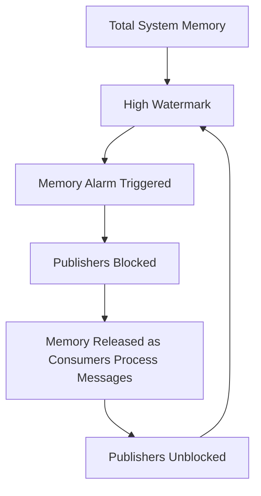

# RabbitMQ Resource Usage

## Introduction

RabbitMQ is a powerful and popular message broker that serves as the backbone for many distributed systems. Like any critical infrastructure component, monitoring its resource usage is essential for maintaining performance, planning capacity, and preventing outages. In this guide, we'll explore how RabbitMQ consumes various system resources, what metrics to track, and how to optimize resource usage for smooth operation.

## Resource Usage Overview

RabbitMQ's performance and stability depend on several key system resources:

1. **Memory** - Used for message storage, connections, queues, and internal operations
2. **Disk Space** - Required for message persistence and transaction logs
3. **CPU** - Consumed during message routing, encryption, and other processing operations
4. **Network** - Bandwidth utilized for message transmission and cluster communication
5. **File Descriptors** - Used for connections, sockets, and file operations

Let's examine each of these resources in detail and learn how to monitor and optimize them.

## Memory Usage

Memory is one of the most critical resources for RabbitMQ. The broker uses memory for:

- Storing messages in queues
- Maintaining connection state
- Managing exchange-to-queue bindings
- Internal metadata and data structures

### Memory Watermarks

RabbitMQ implements a memory watermark system to prevent the broker from consuming too much memory:



By default, the high watermark is set to 40% of the system's RAM. When RabbitMQ reaches this limit:

1. It triggers an internal alarm
2. Blocks publisher connections (stops accepting new messages)
3. Logs warnings about the high memory situation
4. Continues to deliver messages to consumers
5. Unblocks publishers once memory drops below the watermark

### Monitoring Memory Usage

You can check the current memory usage with the `rabbitmqctl` command:

```bash
rabbitmqctl status | grep memory
```

Output example:

```
{memory,
     [{total,159744000},
      {connection_readers,83968},
      {connection_writers,26864},
      {connection_channels,58792},
      {connection_other,312272},
      {queue_procs,1312560},
      {queue_slave_procs,0},
      {plugins,3084944},
      {other_proc,19027120},
      {metrics,260064},
      {mgmt_db,266560},
      {mnesia,79704},
      {other,134230152}]}
```

For a more detailed view, use the management UI or HTTP API:

```bash
curl -u guest:guest http://localhost:15672/api/nodes
```

### Adjusting Memory Watermarks

You can configure memory watermarks in your `rabbitmq.conf` file:

```
# Set high watermark to 30% of available RAM
vm_memory_high_watermark.relative = 0.3

# Or set an absolute value in bytes (e.g., 1GB)
# vm_memory_high_watermark.absolute = 1073741824
```

## Disk Space Usage

RabbitMQ uses disk space for:

- Persisting messages marked as durable
- Writing transaction logs
- Storing node metadata in Mnesia database

### Disk Space Monitoring

Check disk space usage with:

```bash
rabbitmqctl status | grep disk_free
```

Example output:

```
{disk_free_limit,50000000},
{disk_free,78461952000},
```

### Disk Alarms

Similar to memory watermarks, RabbitMQ has disk space alarms:

1. When free disk space falls below the configured limit (default 50MB)
2. Publishers are blocked from sending new messages
3. Once disk space is freed up, publishers are unblocked

### Adjusting Disk Space Limits

Configure disk limits in `rabbitmq.conf`:

```
# Set the disk free limit to 2GB
disk_free_limit.absolute = 2GB

# Or relative to RAM (e.g., free disk should be at least 1.5x RAM)
# disk_free_limit.relative = 1.5
```

## CPU Usage

While RabbitMQ is generally more memory and I/O bound than CPU-bound, high CPU usage can indicate:

- Too many concurrent connections
- Complex routing logic
- Message conversion overhead
- SSL/TLS encryption overhead

### Monitoring CPU Usage

You can monitor CPU usage through the management UI or with system tools:

```bash
# Linux
top -p $(pgrep -d',' beam.smp)

# Or for specific RabbitMQ stats
rabbitmqctl status | grep proc
```

## Network Usage

Network is crucial for RabbitMQ, especially in distributed deployments. Monitoring should focus on:

- Throughput (messages/second)
- Bandwidth consumption
- Connection count
- Channel count

### Network Monitoring Commands

```bash
# Check connection count
rabbitmqctl list_connections

# Check detailed network stats
rabbitmqctl status | grep -A 10 network
```

## File Descriptors

RabbitMQ uses file descriptors for each connection and various internal operations. Running out of file descriptors will cause connection failures.

### Monitoring File Descriptors

```bash
rabbitmqctl status | grep file_descriptors
```

Example output:

```
{file_descriptors,
     [{total_limit,32768},
      {total_used,89},
      {sockets_limit,29491},
      {sockets_used,87}]},
```

### Adjusting File Descriptor Limits

For Linux systems, update limits in `/etc/security/limits.conf`:

```
rabbitmq soft nofile 65536
rabbitmq hard nofile 65536
```

Then update your `rabbitmq.conf`:

```
fs.file-max = 65536
```

## Practical Monitoring Example

Let's set up a basic monitoring script that checks RabbitMQ resource usage and sends alerts if thresholds are exceeded:

```python
#!/usr/bin/env python
import json
import subprocess
import smtplib
from email.message import EmailMessage

# Configuration
RABBITMQ_HOST = "localhost"
MEMORY_THRESHOLD = 0.7  # 70% of high watermark
DISK_THRESHOLD = 10000000000  # 10GB
ALERT_EMAIL = "admin@example.com"

def get_rabbitmq_status():
    cmd = f"rabbitmqctl status --formatter json"
    result = subprocess.run(cmd, shell=True, capture_output=True, text=True)
    return json.loads(result.stdout)

def send_alert(subject, body):
    msg = EmailMessage()
    msg['Subject'] = subject
    msg['From'] = "rabbitmq-monitor@example.com"
    msg['To'] = ALERT_EMAIL
    msg.set_content(body)
    
    s = smtplib.SMTP('localhost')
    s.send_message(msg)
    s.quit()

def check_resources():
    status = get_rabbitmq_status()
    
    # Check memory
    mem_used = status['memory']['total']
    mem_limit = status['memory_limit']
    mem_percent = mem_used / mem_limit
    
    # Check disk
    disk_free = status['disk_free']
    disk_limit = status['disk_free_limit']
    
    # Check file descriptors
    fd_used = status['file_descriptors']['total_used']
    fd_limit = status['file_descriptors']['total_limit']
    fd_percent = fd_used / fd_limit
    
    # Alert if thresholds exceeded
    if mem_percent > MEMORY_THRESHOLD:
        send_alert(
            "RabbitMQ Memory Alert",
            f"Memory usage is at {mem_percent:.1%} of limit ({mem_used}/{mem_limit} bytes)"
        )
    
    if disk_free < DISK_THRESHOLD:
        send_alert(
            "RabbitMQ Disk Space Alert",
            f"Free disk space is low: {disk_free} bytes (limit: {disk_limit} bytes)"
        )
    
    if fd_percent > 0.8:  # 80% of file descriptor limit
        send_alert(
            "RabbitMQ File Descriptor Alert",
            f"File descriptor usage is at {fd_percent:.1%} ({fd_used}/{fd_limit})"
        )

if __name__ == "__main__":
    check_resources()
```

This script can be scheduled to run regularly using cron:

```bash
# Run every 5 minutes
*/5 * * * * /path/to/rabbitmq_monitor.py
```

## Resource Usage Best Practices

To maintain optimal RabbitMQ performance:

1. **Regular Monitoring**: Set up automated monitoring with alerting
2. **Proper Sizing**: Size your RabbitMQ servers based on expected workload
3. **Queue Management**: Don't let queues grow unbounded; implement TTL (Time-To-Live) policies
4. **Connection Pooling**: Use connection pools in clients rather than creating/destroying connections frequently
5. **Lazy Queues**: For queues with many messages, enable lazy queues to reduce memory usage:

```bash
rabbitmqctl set_policy lazy-queues "^large-queue\." '{"queue-mode":"lazy"}' --apply-to queues
```

6. **Message Size Control**: Keep message sizes reasonable (ideally under 1MB)
7. **Clustering Considerations**: Be aware that clustering increases resource usage due to replication

## Implementing Resource Policies

Here's how to set up a policy for message TTL to prevent unbounded queue growth:

```bash
rabbitmqctl set_policy TTL ".*" '{"message-ttl":86400000}' --apply-to queues
```

This sets a 24-hour TTL for all messages across all queues.

## Resource Usage Visualization

For better understanding, consider setting up Prometheus and Grafana to visualize RabbitMQ metrics over time:


To enable the Prometheus plugin:

```bash
rabbitmq-plugins enable rabbitmq_prometheus
```

Then configure Prometheus to scrape metrics from `http://rabbitmq-host:15692/metrics`.

## Summary

Effective monitoring of RabbitMQ resource usage is crucial for maintaining a healthy messaging system. Key takeaways include:

- Monitor memory, disk, CPU, network, and file descriptors
- Set appropriate limits and watermarks
- Implement automated monitoring and alerting
- Follow best practices for queue management and message handling
- Use visualization tools for trend analysis

By keeping a close eye on RabbitMQ's resource consumption, you can prevent outages, plan capacity effectively, and ensure your messaging infrastructure scales to meet your application's needs.

## Additional Resources

- [RabbitMQ Official Documentation on Monitoring](https://www.rabbitmq.com/monitoring.html)
- [RabbitMQ Management HTTP API](https://www.rabbitmq.com/management.html#http-api)
- [Prometheus RabbitMQ Exporter](https://github.com/rabbitmq/rabbitmq-prometheus)

## Exercises

1. Set up RabbitMQ with custom memory and disk watermarks, then use benchmarking tools to test when alarms trigger.
2. Create a monitoring dashboard using Prometheus and Grafana to visualize RabbitMQ resource usage.
3. Write a script that automatically scales RabbitMQ resources based on current usage patterns.
4. Implement a policy for lazy queues and measure the impact on memory usage with large message volumes.