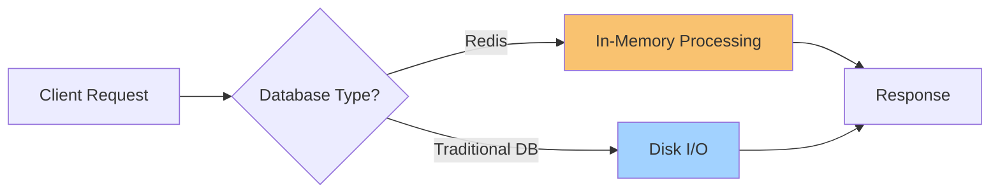

# Redis Introduction

## What is Redis?

<div style={{
    "width": "20%",
    "margin": "0 auto",
    "text-align": "center"
}}>
    
</div>

Redis (Remote Dictionary Server) is an open-source, in-memory data structure store that can be used as a database, cache, message broker, and streaming engine. Unlike traditional databases that store data on disk, Redis keeps its dataset in memory, making it extremely fast and efficient for certain use cases.

Think of Redis as a high-performance key-value store—like a giant dictionary or hash map—that lives entirely in RAM. This design choice allows Redis to achieve remarkable speed, often processing hundreds of thousands of operations per second.

## Key Features of Redis

Redis offers several advantages that make it popular among developers:

- **Speed**: By operating in-memory, Redis achieves sub-millisecond response times
- **Versatility**: Supports various data structures like strings, hashes, lists, sets, and more
- **Persistence**: Can save data to disk periodically or log operations for durability
- **Replication**: Supports master-slave replication for high availability
- **Clustering**: Can be set up in a distributed architecture
- **Lua scripting**: Allows execution of custom scripts
- **Transactions**: Provides basic transaction support
- **Pub/Sub**: Implements the publish/subscribe messaging paradigm

## When to Use Redis

Redis excels in scenarios where speed is critical:

- **Caching**: Store frequently accessed data to reduce database load
- **Session management**: Store user session data for web applications
- **Real-time analytics**: Count and track events as they happen
- **Leaderboards/Counting**: Implement sorted sets for rankings
- **Queues**: Process tasks in order using lists
- **Real-time communication**: Enable chat or messaging with Pub/Sub

## Redis vs. Traditional Databases



Redis is not intended to replace traditional databases in all scenarios. Consider these differences:

| Feature | Redis | Traditional RDBMS |
|---------|-------|-------------------|
| Data storage | In-memory (with optional persistence) | Disk-based |
| Query language | Simple commands | SQL or similar |
| Data structure support | Rich built-in structures | Tabular with relational capabilities |
| Transaction support | Basic | ACID compliance |
| Memory requirements | Higher (data in RAM) | Lower (uses disk) |
| Speed | Very fast (microseconds) | Moderate to fast (milliseconds) |

## Getting Started with Redis

### Installation

Redis is available for most operating systems. Here are the basic installation commands:

**Ubuntu/Debian:**

```bash
sudo apt update
sudo apt install redis-server
```

**macOS (using Homebrew):**

```bash
brew install redis
```

**Windows:**

Windows users can use the Windows Subsystem for Linux (WSL) or download Redis for Windows from the Microsoft archive.

### Starting Redis

Once installed, you can start Redis with:

```bash
# Start the Redis server
redis-server

# Connect to Redis using the CLI client
redis-cli
```

## Basic Redis Operations

Let's explore some fundamental Redis commands:

### Setting and Getting Values

```bash
# Set a simple key-value pair
> SET user:1 "John Doe"
OK

# Retrieve the value
> GET user:1
"John Doe"
```

### Working with Expiration

```bash
# Set a key with expiration (10 seconds)
> SET session:123 "active" EX 10
OK

# Check time-to-live (TTL) in seconds
> TTL session:123
(integer) 8

# After 10 seconds...
> GET session:123
(nil)
```

### Multiple Data Types

Redis supports various data structures beyond simple strings:

#### Lists

```bash
# Add items to a list
> LPUSH notifications "New message from Alice"
(integer) 1
> LPUSH notifications "Payment received"
(integer) 2

# Retrieve items
> LRANGE notifications 0 -1
1) "Payment received"
2) "New message from Alice"
```

#### Sets

```bash
# Add members to a set
> SADD tags "redis" "database" "nosql"
(integer) 3

# Check if a value exists in the set
> SISMEMBER tags "redis"
(integer) 1

# Get all members
> SMEMBERS tags
1) "nosql"
2) "database"
3) "redis"
```

#### Hashes (for storing objects)

```bash
# Store user profile as a hash
> HSET user:2 name "Jane Smith" email "jane@example.com" age 28
(integer) 3

# Get specific field
> HGET user:2 name
"Jane Smith"

# Get all fields and values
> HGETALL user:2
1) "name"
2) "Jane Smith"
3) "email"
4) "jane@example.com"
5) "age"
6) "28"
```

## Practical Example: Building a Simple Cache

Let's implement a basic caching mechanism that might be used in a web application:

```javascript
// Example using Node.js with redis client

const redis = require('redis');
const client = redis.createClient();

async function getProductDetails(productId) {
  // Try to get cached data first
  const cachedData = await client.get(`product:${productId}`);
  
  if (cachedData) {
    console.log('Cache hit!');
    return JSON.parse(cachedData);
  }
  
  console.log('Cache miss, fetching from database...');
  
  // Simulating database query
  const product = await queryDatabaseForProduct(productId);
  
  // Store in cache for next time (expire after 1 hour)
  await client.set(`product:${productId}`, JSON.stringify(product), {
    EX: 3600
  });
  
  return product;
}

// Simulated database function
async function queryDatabaseForProduct(id) {
  // This would normally be a database query
  return {
    id: id,
    name: 'Sample Product',
    price: 29.99,
    description: 'This is a sample product'
  };
}
```

## Practical Example: Rate Limiting API Requests

Here's how you might implement a simple rate limiter using Redis:

```python
# Example using Python with redis library

import redis
import time

r = redis.Redis()

def is_rate_limited(user_id, limit=10, period=60):
    """
    Check if user has exceeded rate limit
    - user_id: identifier for the user
    - limit: maximum requests allowed 
    - period: time window in seconds
    """
    key = f"rate:limit:{user_id}"
    current = r.get(key)
    
    if current is None:
        # First request, set counter to 1
        r.set(key, 1, ex=period)
        return False
    
    if int(current) >= limit:
        # Rate limit exceeded
        return True
        
    # Increment counter and continue
    r.incr(key)
    return False

# Example usage
user = "user123"

for i in range(15):
    if is_rate_limited(user):
        print(f"Request {i+1}: Rate limit exceeded!")
    else:
        print(f"Request {i+1}: Processing request...")
    
    # Simulate request spacing
    time.sleep(0.5)

# Output:
# Request 1: Processing request...
# ...
# Request 10: Processing request...
# Request 11: Rate limit exceeded!
# ...
```

## Real-World Use Cases

### E-commerce Product Catalog

Redis can store product information that needs to be accessed frequently:

```bash
# Store product details
> HSET product:1001 name "Wireless Headphones" price 59.99 category "Electronics" stock 42

# Get stock level for inventory management
> HGET product:1001 stock
"42"

# Update stock after purchase
> HINCRBY product:1001 stock -1
(integer) 41
```

### Social Media Like Counter

```bash
# Increment likes on a post
> INCR post:5678:likes
(integer) 1

# Multiple users liking
> INCR post:5678:likes
(integer) 2
> INCR post:5678:likes
(integer) 3

# Get total likes
> GET post:5678:likes
"3"
```

## Redis Pub/Sub for Real-Time Messaging

Redis provides a Publish/Subscribe (Pub/Sub) feature that enables real-time communication:

```bash
# In one terminal (subscriber)
> SUBSCRIBE new_orders
Reading messages... (press Ctrl-C to quit)
1) "subscribe"
2) "new_orders"
3) (integer) 1

# In another terminal (publisher)
> PUBLISH new_orders "Order #12345 received for processing"
(integer) 1

# Subscriber terminal receives:
1) "message"
2) "new_orders"
3) "Order #12345 received for processing"
```

## Redis Persistence Options

While Redis is an in-memory database, it offers several persistence options:

1. **RDB (Redis Database)**: Point-in-time snapshots at specified intervals
2. **AOF (Append Only File)**: Logs every write operation
3. **Hybrid Mode**: Combines both approaches

Configuration example in `redis.conf`:

```
# Save a snapshot every 60 seconds if at least 1000 keys changed
save 60 1000

# Enable AOF
appendonly yes
appendfsync everysec
```

## Best Practices

When working with Redis:

- **Use appropriate data structures** for your use case
- **Set expiration times** for temporary data
- **Monitor memory usage** to prevent out-of-memory errors
- **Consider sharding** for larger datasets
- **Implement proper error handling** for connection issues
- **Use pipelining** to reduce network overhead when sending multiple commands
- **Consider Redis Modules** for specialized functionality

## Summary

Redis is a powerful, versatile in-memory data store that excels at high-speed operations. Its support for various data structures and additional features like pub/sub and Lua scripting make it suitable for a wide range of applications beyond simple caching.

Key takeaways:
- Redis stores data primarily in memory, making it extremely fast
- It supports various data structures beyond simple key-value pairs
- Common use cases include caching, session management, and real-time features
- While Redis is fast, it requires careful memory management
- Redis can persist data to disk for durability

## Further Learning

To deepen your Redis knowledge:

1. Explore more complex data structures like sorted sets and HyperLogLog
2. Learn about Redis transactions and Lua scripting
3. Study Redis clustering for scaling
4. Investigate Redis modules such as RediSearch, RedisJSON, and RedisTimeSeries

## Practice Exercises

1. Create a simple leaderboard using Redis sorted sets
2. Implement a basic message queue using Redis lists
3. Build a rate limiter for API requests
4. Design a session store that automatically expires inactive sessions
5. Create a simple cache with Redis that falls back to a database when keys are missing