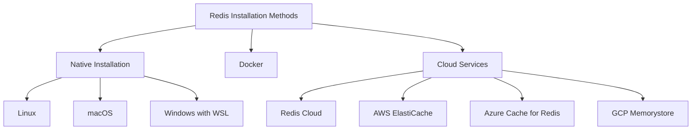

# Redis Installation

## Introduction

Redis (Remote Dictionary Server) is an open-source, in-memory data structure store that can be used as a database, cache, message broker, and streaming engine. Before you can start using Redis in your applications, you need to install and configure it on your system.

This guide will walk you through the process of installing Redis on various operating systems, verifying your installation, and performing basic configuration. By the end of this tutorial, you'll have a working Redis instance ready for development.

## Prerequisites

Before installing Redis, ensure you have:

- Basic knowledge of using command line interfaces
- Administrative privileges on your system (or sudo access for Linux/macOS)
- For Windows users: Windows 10 or later with WSL (Windows Subsystem for Linux) or Docker

## Installation Methods

There are several ways to install Redis:



Let's explore each of these methods in detail.

## Installing Redis on Linux

Redis is primarily designed for Linux systems and provides the most straightforward installation experience on this platform.

### Ubuntu/Debian

```bash
# Update your package lists
sudo apt update

# Install Redis
sudo apt install redis-server

# Start Redis service
sudo systemctl start redis-server

# Enable Redis to start on boot
sudo systemctl enable redis-server
```

### CentOS/RHEL

```bash
# Install EPEL repository
sudo yum install epel-release

# Install Redis
sudo yum install redis

# Start Redis service
sudo systemctl start redis

# Enable Redis to start on boot
sudo systemctl enable redis
```

### Compiling from Source (All Linux Distributions)

For the latest version or custom configurations, you can compile Redis from source:

```bash
# Install build tools
sudo apt update
sudo apt install build-essential tcl

# Download and extract Redis
wget https://download.redis.io/releases/redis-7.2.3.tar.gz
tar xzf redis-7.2.3.tar.gz
cd redis-7.2.3

# Compile Redis
make

# Test the build (optional)
make test

# Install Redis
sudo make install
```

## Installing Redis on macOS

### Using Homebrew

The simplest way to install Redis on macOS is using Homebrew:

```bash
# Install Homebrew if you haven't already
/bin/bash -c "$(curl -fsSL https://raw.githubusercontent.com/Homebrew/install/HEAD/install.sh)"

# Install Redis
brew install redis

# Start Redis server
brew services start redis
```

### Compiling from Source

You can also compile Redis from source on macOS, similar to the Linux instructions above.

## Installing Redis on Windows

Redis doesn't officially support Windows natively. However, there are several ways to run Redis on Windows:

### Using Windows Subsystem for Linux (WSL)

1. Enable WSL on your Windows system:
   
   ```powershell
   # Run in PowerShell as Administrator
   dism.exe /online /enable-feature /featurename:Microsoft-Windows-Subsystem-Linux /all /norestart
   ```

2. Install a Linux distribution from the Microsoft Store (e.g., Ubuntu)

3. Follow the Linux installation instructions above within your WSL environment

### Using Docker

Docker provides a platform-independent way to run Redis:

```powershell
# Pull the Redis image
docker pull redis

# Run Redis container
docker run --name my-redis -p 6379:6379 -d redis

# To test connection
docker exec -it my-redis redis-cli
```

## Using Redis Cloud Services

For production environments, managed Redis services can be a great option:

- **Redis Cloud**: Official managed service by Redis Labs
- **AWS ElastiCache for Redis**: Managed Redis by Amazon Web Services
- **Azure Cache for Redis**: Microsoft's Redis service
- **Google Cloud Memorystore**: Google's managed Redis service

These services handle infrastructure, scaling, and maintenance for you.

## Verifying Your Installation

After installing Redis, you should verify that it's working correctly:

```bash
# Connect to Redis
redis-cli

# Test with a simple command (you should see "PONG" as the response)
127.0.0.1:6379> PING
PONG

# Set and get a test value
127.0.0.1:6379> SET test "Hello Redis"
OK
127.0.0.1:6379> GET test
"Hello Redis"

# Exit the Redis CLI
127.0.0.1:6379> EXIT
```

## Basic Configuration

Redis uses a configuration file (`redis.conf`) to control its behavior. The location of this file depends on your installation method:

- Linux package managers: `/etc/redis/redis.conf`
- Compiled from source: In the Redis source directory
- Homebrew: `/usr/local/etc/redis.conf`

Here are some important configuration parameters you might want to modify:

```bash
# Open the configuration file with your preferred text editor
sudo nano /etc/redis/redis.conf

# Common configuration changes:
# 1. Bind Redis to listen on all interfaces (caution: security implications)
# Change from: bind 127.0.0.1
# To: bind 0.0.0.0

# 2. Set a password for authentication
# Uncomment and set: requirepass yourpassword

# 3. Change the default port
# Change: port 6379
# To: port your_preferred_port

# 4. Configure memory limit
# Set: maxmemory 256mb
# And eviction policy: maxmemory-policy allkeys-lru

# After making changes, restart Redis
sudo systemctl restart redis-server
```

## Redis as a Service

To ensure Redis runs automatically on system startup:

### Linux (systemd)

```bash
sudo systemctl enable redis-server
sudo systemctl start redis-server
```

### macOS (Homebrew)

```bash
brew services start redis
```

### Docker

```bash
docker update --restart=always my-redis
```

## Troubleshooting Common Installation Issues

### Redis Won't Start

Check the logs for error messages:

```bash
# For systemd-based systems
sudo journalctl -u redis-server

# For non-systemd systems
cat /var/log/redis/redis-server.log
```

### Connection Refused

If you can't connect to Redis:

1. Verify Redis is running: `ps aux | grep redis`
2. Check if it's listening on the expected port: `netstat -nlt | grep 6379`
3. Check firewall settings: `sudo ufw status` (Ubuntu)
4. Verify the binding address in redis.conf

### Memory Allocation Issues

Redis might fail to start if it can't allocate enough memory:

1. Check system memory: `free -m`
2. Adjust maxmemory setting in redis.conf
3. On Linux, ensure `vm.overcommit_memory=1` is set in `/etc/sysctl.conf`

## Practical Example: Setting Up a Development Environment

Here's a complete example of setting up a Redis environment for a Node.js application:

1. Install Redis using the appropriate method for your OS (examples above)

2. Create a test application:

```bash
# Create project directory
mkdir redis-test
cd redis-test

# Initialize Node.js project
npm init -y

# Install Redis client
npm install redis
```

3. Create a test script (`app.js`):

```javascript
const redis = require('redis');

// Create client and connect
const client = redis.createClient({
  url: 'redis://localhost:6379'
});

client.on('error', (err) => {
  console.error('Redis error:', err);
});

async function testRedis() {
  try {
    // Connect to Redis
    await client.connect();
    console.log('Connected to Redis!');
    
    // Set a key
    await client.set('greeting', 'Hello from Redis!');
    console.log('Key set successfully');
    
    // Get the key
    const value = await client.get('greeting');
    console.log('Retrieved value:', value);
    
    // Clean up
    await client.disconnect();
    console.log('Disconnected from Redis');
  } catch (error) {
    console.error('Something went wrong:', error);
  }
}

// Run the test
testRedis();
```

4. Run the application:

```bash
node app.js
```

You should see output similar to:

```
Connected to Redis!
Key set successfully
Retrieved value: Hello from Redis!
Disconnected from Redis
```

## Summary

In this tutorial, you've learned:

- Different methods for installing Redis on various operating systems
- How to verify your Redis installation
- Basic configuration options for Redis
- Running Redis as a service
- Troubleshooting common installation issues
- Setting up a basic development environment with Redis

Redis is now installed and ready to use in your applications. You can start exploring its powerful data structures and commands to build high-performance applications.

## Additional Resources

- [Official Redis Documentation](https://redis.io/documentation)
- [Redis Command Reference](https://redis.io/commands)
- [Redis University](https://university.redis.com/) - Free online courses
- [Redis GitHub Repository](https://github.com/redis/redis)

## Exercises

1. Install Redis using a different method than what you used in this tutorial.
2. Configure Redis to use a non-default port and test the connection.
3. Set up password authentication for your Redis instance.
4. Create a simple script in your preferred programming language to connect to Redis.
5. Configure Redis to persist data to disk using RDB or AOF persistence.