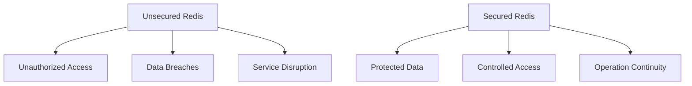

# Redis Security

## Introduction

Redis is an open-source, in-memory data structure store used as a database, cache, message broker, and streaming engine. While Redis is known for its blazing speed and versatility, securing your Redis deployment is crucial to protect sensitive data. This guide covers essential Redis security concepts and practices to help you build secure applications.

## Why Redis Security Matters

Redis was originally designed for trusted environments where all clients could be trusted. However, as Redis has become widely adopted in various deployment scenarios, including cloud environments, security has become increasingly important.



## Authentication

### Password Protection

The most basic form of Redis security is password authentication. Redis allows you to set a password (referred to as an "authentication token") in the configuration file.

```bash
# In redis.conf
requirepass YourStrongPassword
```

When connecting to a Redis instance with authentication enabled:

```javascript
// Node.js example with Redis client
const redis = require('redis');
const client = redis.createClient({
  host: '127.0.0.1',
  port: 6379,
  password: 'YourStrongPassword'
});

client.on('connect', () => {
  console.log('Connected to Redis');
});

client.on('error', (err) => {
  console.error('Redis connection error:', err);
});
```

If you attempt to run commands without authentication, Redis will respond with an error:

```
127.0.0.1:6379> SET mykey "Hello"
(error) NOAUTH Authentication required.
127.0.0.1:6379> AUTH YourStrongPassword
OK
127.0.0.1:6379> SET mykey "Hello"
OK
```

### ACL (Access Control Lists)

Starting from Redis 6.0, ACL (Access Control Lists) provides a more fine-grained access control system. This allows you to create users with different permissions.

```bash
# Create a user in redis.conf
user alice on >alice123 ~* +@all -@dangerous
```

This creates a user "alice" with password "alice123" who can access all keys (~*) and use all commands (+@all) except dangerous ones (-@dangerous).

You can also manage ACLs at runtime:

```
127.0.0.1:6379> ACL SETUSER bob on >bob123 ~customer:* +get +set +del
OK
127.0.0.1:6379> ACL LIST
1) "user default on nopass ~* +@all"
2) "user alice on #5e884898da28047151d0e56f8dc6292773603d0d6aabbdd62a11ef721d1542d8 ~* +@all -@dangerous"
3) "user bob on #6b3a55e0261b0304143f805a24924d0c1c44524821305f31d9277843b8a10f4e ~customer:* +get +set +del"
```

## Network Security

### Binding Interfaces

By default, Redis binds to all available network interfaces (0.0.0.0). For security, it's better to bind Redis only to the interfaces it needs to listen on.

```bash
# In redis.conf - Only listen on localhost
bind 127.0.0.1
```

### Protected Mode

Redis has a "protected mode" that prevents connections from external clients when Redis is bound to all interfaces but no authentication is configured:

```bash
# In redis.conf
protected-mode yes
```

### Port Configuration

You can change the default port (6379) to make it less obvious that you're running Redis:

```bash
# In redis.conf
port 6380
```

## Encryption

### Transport Encryption (TLS)

Redis supports TLS (Transport Layer Security) encryption since version 6.0, protecting data in transit.

```bash
# In redis.conf
tls-port 6380
tls-cert-file /path/to/redis.crt
tls-key-file /path/to/redis.key
tls-ca-cert-file /path/to/ca.crt
```

Connecting to a TLS-enabled Redis server:

```javascript
// Node.js example with Redis client and TLS
const redis = require('redis');
const fs = require('fs');

const client = redis.createClient({
  host: '127.0.0.1',
  port: 6380,
  password: 'YourStrongPassword',
  tls: {
    key: fs.readFileSync('/path/to/client.key'),
    cert: fs.readFileSync('/path/to/client.crt'),
    ca: fs.readFileSync('/path/to/ca.crt')
  }
});
```

### Data Encryption

Redis does not currently provide built-in data encryption at rest. For sensitive data, consider:

1. Encrypting data at the application level before storing it in Redis
2. Using disk encryption on the server hosting Redis
3. Using encrypted Redis services provided by cloud providers

## Limiting Exposure

### Disabling Dangerous Commands

Some Redis commands can be dangerous in production environments. You can disable them:

```bash
# In redis.conf
rename-command FLUSHALL ""
rename-command FLUSHDB ""
rename-command CONFIG ""
rename-command SHUTDOWN ""
```

Or rename them to something harder to guess:

```bash
# In redis.conf
rename-command CONFIG "b840fc02d524045429941cc15f59e41cb7be6c52"
```

### Disable Specific Features

Disable features you don't need:

```bash
# In redis.conf
daemonize no
notify-keyspace-events ""
```

## Rate Limiting and Connection Control

Redis provides configurations to limit connection attempts and control resources:

```bash
# In redis.conf
maxclients 100
timeout 60
```

## Real-World Security Example

Let's set up a secure Redis instance for a web application:

```bash
# Comprehensive redis.conf security settings
bind 127.0.0.1
port 6379
requirepass "H@St4ongP4ssw0rdH3re!"
protected-mode yes
maxclients 100
timeout 30
tcp-keepalive 60
rename-command FLUSHALL ""
rename-command FLUSHDB ""
rename-command CONFIG "ConfigCmd_8e7a4b3c"

# Add a user for the web application
user webapp on >W3bAppP@ss! ~webapp:* +@read +@write -@admin
```

In the application code:

```javascript
// Node.js with Express and Redis
const express = require('express');
const redis = require('redis');
const app = express();

// Create secure Redis connection
const client = redis.createClient({
  host: '127.0.0.1',
  port: 6379,
  username: 'webapp',
  password: 'W3bAppP@ss!'
});

// Connect and handle errors
client.on('error', (err) => {
  console.error('Redis Error:', err);
});

app.get('/api/user/:id', async (req, res) => {
  try {
    // Use Redis to get user data
    const userData = await client.get(`webapp:user:${req.params.id}`);
    if (!userData) {
      return res.status(404).json({ error: 'User not found' });
    }
    return res.json(JSON.parse(userData));
  } catch (error) {
    console.error('Error fetching user:', error);
    return res.status(500).json({ error: 'Internal server error' });
  }
});

app.listen(3000, () => {
  console.log('Server running on port 3000');
});
```

## Security Best Practices

1. **Use Strong Authentication**: Always set a strong password or use ACLs with strong passwords.
2. **Network Isolation**: Run Redis in a private network or VPC.
3. **Firewall Protection**: Configure firewall rules to limit access to Redis ports.
4. **Regular Updates**: Keep Redis updated to the latest stable version to benefit from security patches.
5. **Monitor and Audit**: Set up monitoring and auditing for Redis instances.
6. **Principle of Least Privilege**: Grant users only the permissions they need.
7. **Backup Encryption**: Ensure Redis backups (RDB/AOF files) are encrypted.
8. **Disable Direct Internet Access**: Never expose Redis directly to the internet.

## Security Testing

Regularly test your Redis security setup:

```bash
# Attempt to connect without authentication
redis-cli -h your-redis-host
> SET test "value"
(error) NOAUTH Authentication required.

# Test with the wrong password
redis-cli -h your-redis-host -a wrongpassword
> SET test "value"
(error) WRONGPASS invalid username-password pair or user is disabled.

# Test with correct authentication
redis-cli -h your-redis-host -a correctpassword
> SET test "value"
OK
```

## Summary

Redis security is essential for protecting your data and maintaining service integrity. Key aspects include:

- Authentication with strong passwords or ACLs
- Network security through proper binding and firewalls
- Encryption for data in transit
- Disabling or renaming dangerous commands
- Implementing rate limiting and connection controls
- Following best practices for deployment

By implementing these security measures, you can ensure your Redis deployments remain secure while still benefiting from Redis's performance advantages.

## Additional Resources

- [Redis Security Documentation](https://redis.io/topics/security)
- [Redis ACL Documentation](https://redis.io/topics/acl)
- [Redis TLS Support](https://redis.io/topics/encryption)
- [Redis Command Reference](https://redis.io/commands)

## Practice Exercises

1. Set up a Redis instance with password authentication and test connecting to it.
2. Create two different Redis users with different permission levels using ACLs.
3. Configure a Redis instance with TLS encryption and test secure connections.
4. Implement a script to audit your Redis security configuration against best practices.
5. Design a secure Redis deployment architecture for a multi-tier web application.