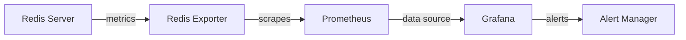

# Redis Monitoring

## Introduction

Monitoring is a critical aspect of maintaining any production database system, and Redis is no exception. As your applications grow and Redis becomes an essential part of your infrastructure, understanding how to properly monitor its health, performance, and behavior becomes increasingly important.

In this guide, we'll explore various approaches to monitoring Redis instances, from built-in commands to external tools, helping you ensure your Redis deployments remain performant and reliable.

## Why Monitor Redis?

Before diving into the "how," let's understand the "why":

- **Performance optimization**: Identify bottlenecks and areas for improvement
- **Early issue detection**: Catch problems before they impact your users
- **Capacity planning**: Understand resource usage patterns to plan for growth
- **Security monitoring**: Detect unusual access patterns or potential breaches
- **Troubleshooting**: Gather data needed to resolve issues when they occur

## Basic Redis Monitoring Commands

Redis provides several built-in commands that offer insights into its operation.

### INFO Command

The `INFO` command is your first line of defense for Redis monitoring. It provides a wealth of information about the Redis server.

```bash
redis-cli INFO
```

The output is divided into sections:

```
# Server
redis_version:7.0.5
redis_git_sha1:00000000
redis_git_dirty:0
redis_build_id:e1d1d8e5ea3ae8a2
redis_mode:standalone
# Clients
connected_clients:1
# Memory
used_memory:1015304
used_memory_human:991.51K
used_memory_rss:8531968
used_memory_rss_human:8.14M
# Stats
total_connections_received:2
total_commands_processed:3
# Replication
role:master
# CPU
used_cpu_sys:0.07
used_cpu_user:0.08
# Persistence
rdb_last_save_time:1623151980
```

You can request specific sections by adding an argument:

```bash
redis-cli INFO memory
```

### MONITOR Command

The `MONITOR` command lets you see all commands processed by the Redis server in real-time:

```bash
redis-cli MONITOR
```

Output example:

```
1623152010.939478 [0 127.0.0.1:50617] "PING"
1623152015.336743 [0 127.0.0.1:50617] "SET" "user:1000" "John Doe"
1623152020.123456 [0 127.0.0.1:50617] "GET" "user:1000"
```

:::caution
`MONITOR` can impact performance on busy servers. Use it sparingly and for short periods.
:::

### CLIENT LIST Command

To see all connected clients:

```bash
redis-cli CLIENT LIST
```

Output:

```
id=3 addr=127.0.0.1:50617 fd=8 name= age=897 idle=0 flags=N db=0 sub=0 psub=0 multi=-1 qbuf=26 qbuf-free=32742 obl=0 oll=0 omem=0 events=r cmd=client
```

### Memory Analysis with MEMORY Commands

Redis 4.0+ includes memory analysis commands:

```bash
# Get overall memory stats
redis-cli MEMORY STATS

# Find what keys use the most memory
redis-cli MEMORY USAGE mykey
```

## Key Performance Metrics to Monitor

When setting up Redis monitoring, focus on these key metrics:

### 1. Memory Usage

```bash
redis-cli INFO memory
```

Important values:
- `used_memory_human`: Total memory used by Redis
- `used_memory_peak_human`: Peak memory usage
- `mem_fragmentation_ratio`: Ratio between `used_memory_rss` and `used_memory`

### 2. Command Execution

```bash
redis-cli INFO stats
```

Key metrics:
- `total_commands_processed`: Total number of commands processed
- `instantaneous_ops_per_sec`: Operations per second

### 3. Connection Count

```bash
redis-cli INFO clients
```

Watch:
- `connected_clients`: Number of client connections
- `blocked_clients`: Number of clients blocked by commands like BLPOP

### 4. Hit Rate

```bash
redis-cli INFO stats
```

Calculate:
- Hit rate = `keyspace_hits` / (`keyspace_hits` + `keyspace_misses`)

A low hit rate might indicate cache inefficiency.

### 5. Eviction and Expiration

```bash
redis-cli INFO stats
```

Monitor:
- `evicted_keys`: Keys removed due to maxmemory policy
- `expired_keys`: Keys expired naturally

### 6. Network

```bash
redis-cli INFO stats
```

Check:
- `total_net_input_bytes`: Total bytes read from network
- `total_net_output_bytes`: Total bytes written to network

## Using Redis Monitoring Tools

While built-in commands provide valuable insights, dedicated monitoring tools offer more comprehensive solutions.

### Redis-CLI

Besides running commands, redis-cli offers a monitoring mode:

```bash
redis-cli --stat
```

This gives you a live view of basic stats:

```
------- data ------ --------------------- load -------------------- - child -
keys       mem      clients blocked requests            connections
506        7.25M    100     0       12218 (+0)         111
506        7.25M    100     0       12219 (+1)         111
```

### Redis Sentinel

For Redis clusters, Redis Sentinel provides monitoring and automatic failover:

```bash
redis-cli -p 26379 SENTINEL masters
```

### Grafana + Prometheus

A popular external monitoring setup combines Prometheus for data collection and Grafana for visualization:



Example Prometheus configuration for Redis:

```yaml
scrape_configs:
  - job_name: redis
    static_configs:
    - targets: ['redis-exporter:9121']
```

### Redis Enterprise

For production environments, Redis Enterprise provides comprehensive monitoring dashboards.

## Building a Monitoring Strategy

Follow these steps to create an effective Redis monitoring strategy:

1. **Define Key Metrics**: Identify what to monitor based on your application needs
2. **Set Baselines**: Establish normal performance levels
3. **Configure Alerts**: Set up alerts for abnormal conditions
4. **Regular Review**: Periodically review metrics to spot trends
5. **Document Procedures**: Create runbooks for common issues

### Example Alert Thresholds

| Metric | Warning Threshold | Critical Threshold |
|--------|-------------------|-------------------|
| Memory Usage | 80% | 90% |
| Hit Rate | < 80% | < 50% |
| Command Latency | > 1ms | > 10ms |
| Connection Count | > 80% capacity | > 90% capacity |

## Practical Example: Setting Up Basic Monitoring

Let's walk through setting up basic Redis monitoring using Redis commands and a simple shell script.

Create a file named `monitor-redis.sh`:

```bash
#!/bin/bash

# Redis server details
REDIS_HOST="localhost"
REDIS_PORT="6379"
REDIS_PASSWORD=""  # Add password if needed

# Function to get Redis INFO
get_redis_info() {
  if [ -z "$REDIS_PASSWORD" ]; then
    redis-cli -h $REDIS_HOST -p $REDIS_PORT INFO
  else
    redis-cli -h $REDIS_HOST -p $REDIS_PORT -a $REDIS_PASSWORD INFO
  fi
}

# Extract memory usage
MEMORY_INFO=$(get_redis_info | grep used_memory_human | cut -d ":" -f2 | tr -d '\r')
echo "Memory Usage: $MEMORY_INFO"

# Extract operations per second
OPS=$(get_redis_info | grep instantaneous_ops_per_sec | cut -d ":" -f2 | tr -d '\r')
echo "Operations Per Second: $OPS"

# Extract connected clients
CLIENTS=$(get_redis_info | grep connected_clients | cut -d ":" -f2 | tr -d '\r')
echo "Connected Clients: $CLIENTS"

# Calculate hit rate
HITS=$(get_redis_info | grep keyspace_hits | cut -d ":" -f2 | tr -d '\r')
MISSES=$(get_redis_info | grep keyspace_misses | cut -d ":" -f2 | tr -d '\r')
if [ "$HITS" -eq "0" ] && [ "$MISSES" -eq "0" ]; then
  HIT_RATE="N/A"
else
  HIT_RATE=$(echo "scale=2; $HITS * 100 / ($HITS + $MISSES)" | bc)
  HIT_RATE="$HIT_RATE%"
fi
echo "Cache Hit Rate: $HIT_RATE"
```

Make it executable and run it:

```bash
chmod +x monitor-redis.sh
./monitor-redis.sh
```

Output:

```
Memory Usage: 1.25M
Operations Per Second: 42
Connected Clients: 5
Cache Hit Rate: 93.45%
```

You can schedule this script to run periodically using cron.

## Troubleshooting Common Issues

Here's how to use monitoring data to diagnose common Redis problems:

### High Memory Usage

If memory usage is consistently high:

```bash
# Find biggest keys
redis-cli --bigkeys

# Check memory statistics
redis-cli MEMORY STATS

# Analyze key distribution
redis-cli --scan --pattern 'user:*' | wc -l
```

### Slow Commands

If you notice performance issues:

```bash
# Enable slow log
redis-cli CONFIG SET slowlog-log-slower-than 10000  # 10ms threshold

# View slow commands
redis-cli SLOWLOG GET 10
```

### Connection Leaks

If connection count grows unexpectedly:

```bash
# Check clients
redis-cli CLIENT LIST | wc -l

# Get client connection details
redis-cli CLIENT LIST
```

## Summary

Effective Redis monitoring is essential for maintaining performant, reliable database operations. By combining Redis's built-in tools with external monitoring solutions, you can gain comprehensive visibility into your Redis instances.

Remember these key points:

- Use `INFO` for basic metrics and health checks
- Focus on memory, performance, connections, and hit rates
- Set up alerting for abnormal conditions
- Choose monitoring tools that fit your infrastructure needs
- Regularly review and refine your monitoring strategy

## Exercises

1. Set up a simple Redis monitoring script that collects key metrics and logs them.
2. Configure Prometheus and Grafana to monitor a Redis instance.
3. Create alerts for when memory usage exceeds 80% or when the hit rate drops below 70%.
4. Use the `SLOWLOG` feature to identify and optimize slow Redis commands in your application.
5. Design a monitoring dashboard that would be helpful for your specific Redis use case.

## Further Resources

- [Redis Documentation - Monitoring](https://redis.io/topics/monitoring)
- [Redis Exporter for Prometheus](https://github.com/oliver006/redis_exporter)
- [Redis Labs - Redis Enterprise Monitoring](https://docs.redislabs.com/latest/rs/administering/monitoring/)
- [Datadog's Guide to Redis Monitoring](https://www.datadoghq.com/blog/how-to-monitor-redis-performance-metrics/)
- [Redis in Action](http://www.manning.com/carlson/) - Contains chapters on Redis monitoring and performance