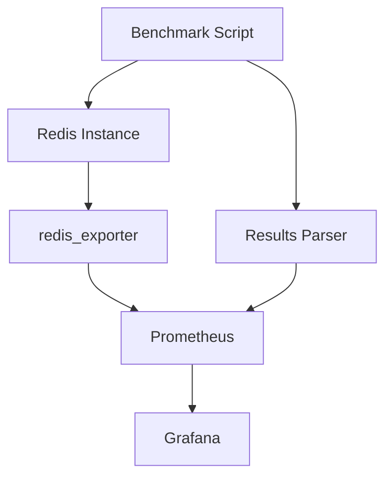

# Redis Benchmarking

## Introduction

Performance is a key aspect of any database system, and Redis is known for its exceptional speed. However, to ensure your Redis deployment meets your application's needs, it's essential to measure its performance under various conditions. This is where benchmarking comes in.

Redis benchmarking is the process of systematically measuring your Redis server's performance characteristics such as throughput (operations per second), latency (response time), and memory usage under different workloads. This allows you to:

- Establish performance baselines
- Identify bottlenecks
- Compare different configuration settings
- Plan for scaling and capacity requirements
- Validate performance improvements after optimization

In this guide, we'll explore how to benchmark Redis using built-in tools and understand the results to optimize your Redis deployments.

## Redis Benchmark Tool

Redis comes with a built-in benchmarking utility called `redis-benchmark`. This tool simulates multiple clients executing commands concurrently and measures the server's performance.

### Basic Usage

Running a basic benchmark is as simple as:

```bash
redis-benchmark -h localhost -p 6379
```

This command will run a series of tests with different Redis commands, using the default settings:
- 50 parallel clients
- 100,000 total requests
- 3 bytes of data per request

The output looks something like this:

```
====== PING_INLINE ======
  100000 requests completed in 1.25 seconds
  50 parallel clients
  3 bytes payload
  keep alive: 1
  host configuration "save": 3600 1 300 100 60 10000
  host configuration "appendonly": no
  multi-thread: no

Percentile latencies:
  50.000% 0.215 milliseconds
  99.000% 0.735 milliseconds
  99.900% 1.407 milliseconds

12.28% <= 0.103 milliseconds
99.89% <= 1.407 milliseconds
100.00% <= 1.407 milliseconds
80000.00 requests per second
```

### Customizing Your Benchmark

`redis-benchmark` offers several options to customize your testing:

#### Changing Number of Clients and Requests

```bash
redis-benchmark -h localhost -p 6379 -c 100 -n 200000
```

This runs the benchmark with 100 parallel clients and 200,000 total requests.

#### Testing Specific Commands

To benchmark only specific Redis commands:

```bash
redis-benchmark -t set,get,incr
```

This tests only SET, GET, and INCR commands.

#### Changing Key Space and Value Size

To test with larger values or different key patterns:

```bash
redis-benchmark -r 100000 -n 100000 -d 1024
```

This uses a key space of 100,000 keys, runs 100,000 requests, and uses values of 1024 bytes.

## Understanding Benchmark Results

The benchmark results include several important metrics:

### Throughput

Throughput is measured in requests per second (RPS). Higher values indicate better performance. In the example above, the server handled 80,000 PING commands per second.

### Latency

Latency measures how long it takes for the server to respond:

- **50th percentile (median)**: 50% of requests were faster than this value
- **99th percentile**: 99% of requests were faster than this value
- **99.9th percentile**: Represents the "worst-case" response time for normal operations

Lower latency values indicate better performance.

## Real-World Benchmarking Example

Let's walk through a real-world benchmarking scenario to see how Redis performs under different conditions.

### Scenario: Caching Service for a Web Application

Imagine we're building a caching layer for a web application. We want to measure Redis performance with:

1. String operations (GET/SET) for page fragments
2. Hash operations (HGET/HSET) for user profiles
3. List operations (LPUSH/LPOP) for activity feeds

### Step 1: Benchmark String Operations

```bash
redis-benchmark -t set,get -d 2048 -r 100000 -n 1000000
```

This simulates caching 2KB page fragments with 100,000 unique keys and 1,000,000 operations.

### Step 2: Benchmark Hash Operations

```bash
redis-benchmark -t hset,hget -d 256 -r 50000 -n 500000
```

This simulates storing and retrieving 256-byte fields in hashes representing user profiles.

### Step 3: Benchmark List Operations

```bash
redis-benchmark -t lpush,lpop -d 128 -r 10000 -n 200000
```

This simulates adding and retrieving 128-byte items in lists representing activity feeds.

### Analyzing the Results

After running these benchmarks, we might find that:

- String operations achieve ~80,000 ops/sec
- Hash operations achieve ~65,000 ops/sec
- List operations achieve ~70,000 ops/sec

We can then use this information to:
- Determine if Redis meets our performance requirements
- Identify which operations need optimization
- Calculate how many Redis instances we might need for our expected load

## Benchmarking Redis Cluster

For Redis Cluster setups, you can use the `-c` flag to enable cluster mode:

```bash
redis-benchmark -h cluster-node-1 -p 6379 --cluster-mode -c 50 -n 100000
```

This distributes the benchmark across all nodes in your cluster.

## Common Benchmarking Pitfalls

To ensure accurate benchmarking results:

1. **Run benchmarks on a dedicated machine**: External processes can affect results
2. **Match your production environment**: Use similar hardware and network conditions
3. **Consider network latency**: Benchmark from the same network as your application
4. **Warm up Redis**: Initial results may be affected by cache warming
5. **Run tests multiple times**: Single runs can be affected by random fluctuations

## Optimizing Redis Performance

Based on benchmark results, you can optimize Redis by:

### Adjusting Configuration Parameters

```
maxmemory 2gb
maxmemory-policy allkeys-lru
appendonly no
```

### Using Pipelining in Your Application

Pipelining allows you to send multiple commands at once without waiting for responses:

```javascript
// Without pipelining
redis.set("key1", "value1");
redis.set("key2", "value2");

// With pipelining
redis.pipeline()
  .set("key1", "value1")
  .set("key2", "value2")
  .exec();
```

You can benchmark pipelining with:

```bash
redis-benchmark -t set -P 10
```

This sends commands in batches of 10, which can significantly increase throughput.

## Memory Usage Benchmarking

Memory usage is another critical aspect to benchmark. The `INFO memory` command provides memory statistics:

```
redis-cli INFO memory
```

Results include:

```
# Memory
used_memory:1032216
used_memory_human:1007.05K
used_memory_rss:7962624
used_memory_rss_human:7.59M
...
```

To measure memory usage over time as you add data:

```bash
for i in {1..10}; do
  redis-cli SET "key$i" $(openssl rand -base64 1000)
  redis-cli INFO memory | grep used_memory_human
  sleep 1
done
```

## Redis Modules and Benchmarking

If you're using Redis modules like RediSearch, RedisJSON, or RedisTimeSeries, use specialized benchmarking tools for those modules:

```bash
redis-benchmark -r 100000 -n 200000 -x modulecommand param1 param2
```

## Visualizing Redis Benchmarking Results

For better analysis, you can visualize your benchmarking results using tools like Grafana and Prometheus. Here's a simple workflow diagram:



## Summary

Redis benchmarking is an essential practice for ensuring optimal performance of your Redis deployments. By using the built-in `redis-benchmark` tool with properly configured parameters, you can:

- Establish performance baselines for your Redis instances
- Identify potential bottlenecks before they affect production
- Compare different Redis configurations to find optimal settings
- Make informed decisions about scaling and resource allocation

Remember that benchmarking should simulate your actual workload as closely as possible for the most meaningful results.

## Exercises

1. Run a basic benchmark on your local Redis instance and note the throughput for GET and SET operations.
2. Modify the benchmark to use values that are similar in size to your application data.
3. Experiment with different numbers of parallel clients (10, 50, 100, 200) and observe how it affects performance.
4. Try running the same benchmark with Redis persistence enabled (AOF) and disabled, and compare the results.
5. Create a simple script that runs benchmarks periodically and logs the results to track performance over time.

## Additional Resources

- [Redis Official Documentation on Benchmarking](https://redis.io/topics/benchmarks)
- [Redis Configuration Best Practices](https://redis.io/topics/latency)
- [Redis Memory Optimization](https://redis.io/topics/memory-optimization)