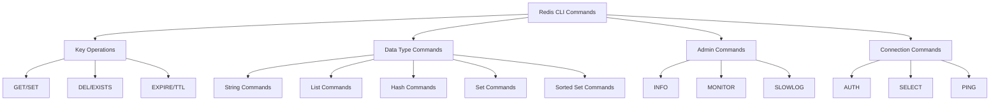

# Redis CLI

## Introduction

The Redis Command Line Interface (CLI) is a powerful tool that allows you to interact directly with a Redis database through your terminal. Redis CLI provides a simple yet effective way to execute Redis commands, manage data, and monitor the performance of your Redis server. This tutorial will guide you through the basics of using Redis CLI, from installation to executing advanced commands.

## What is Redis CLI?

Redis CLI is the official command-line client for Redis. It provides a direct interface to execute Redis commands without needing any additional libraries or frameworks. Whether you're testing Redis features, debugging issues, or performing administrative tasks, Redis CLI is an essential tool in your Redis toolkit.

## Installation

Before using Redis CLI, you need to have Redis installed on your system. The CLI tool comes bundled with Redis installation.

### On Linux/macOS

```bash
# Ubuntu/Debian
sudo apt-get update
sudo apt-get install redis-server

# macOS using Homebrew
brew install redis
```

### On Windows

Windows users can use the Windows Subsystem for Linux (WSL) or download Redis from the [official Redis website](https://redis.io/download).

## Connecting to Redis Server

Once Redis is installed, you can start using the CLI tool to connect to your Redis server.

### Basic Connection

To connect to a local Redis server running on the default port (6379):

```bash
redis-cli
```

You should see a prompt like this:

```
127.0.0.1:6379>
```

This indicates you're connected to a Redis server at the address 127.0.0.1 (localhost) on port 6379.

### Connecting to a Remote Server

To connect to a Redis server on a different host or port:

```bash
redis-cli -h HOST -p PORT
```

Example:

```bash
redis-cli -h redis.example.com -p 6380
```

### Authenticating with Password

If your Redis server requires authentication:

```bash
redis-cli -a YOUR_PASSWORD
```

Or for better security (to avoid having the password in your command history):

```bash
redis-cli
127.0.0.1:6379> AUTH YOUR_PASSWORD
OK
```

## Basic Redis Commands

Let's explore some fundamental Redis commands using the CLI.

### Checking Connectivity

```bash
127.0.0.1:6379> PING
PONG
```

The server responds with "PONG" if the connection is active.

### Key-Value Operations

Redis is primarily a key-value store. Here's how to set and get values:

```bash
# Set a key
127.0.0.1:6379> SET username john
OK

# Get the value of a key
127.0.0.1:6379> GET username
"john"

# Check if a key exists
127.0.0.1:6379> EXISTS username
(integer) 1

# Delete a key
127.0.0.1:6379> DEL username
(integer) 1
```

### Working with Multiple Data Types

Redis supports various data types. Here are examples of using different data types:

#### Strings

```bash
127.0.0.1:6379> SET message "Hello, Redis!"
OK
127.0.0.1:6379> GET message
"Hello, Redis!"
```

#### Lists

```bash
# Add elements to a list
127.0.0.1:6379> LPUSH fruits apple banana orange
(integer) 3

# View list elements
127.0.0.1:6379> LRANGE fruits 0 -1
1) "orange"
2) "banana"
3) "apple"
```

#### Sets

```bash
# Add elements to a set
127.0.0.1:6379> SADD colors red blue green
(integer) 3

# View set members
127.0.0.1:6379> SMEMBERS colors
1) "blue"
2) "red"
3) "green"
```

#### Hashes

```bash
# Create and populate a hash
127.0.0.1:6379> HSET user:1 name "John Doe" email "john@example.com" age 30
(integer) 3

# Get a specific field from the hash
127.0.0.1:6379> HGET user:1 name
"John Doe"

# Get all fields and values in the hash
127.0.0.1:6379> HGETALL user:1
1) "name"
2) "John Doe"
3) "email"
4) "john@example.com"
5) "age"
6) "30"
```

#### Sorted Sets

```bash
# Add elements with scores to a sorted set
127.0.0.1:6379> ZADD leaderboard 100 "player1" 85 "player2" 95 "player3"
(integer) 3

# Get elements sorted by score
127.0.0.1:6379> ZRANGE leaderboard 0 -1 WITHSCORES
1) "player2"
2) "85"
3) "player3"
4) "95"
5) "player1"
6) "100"
```

## Advanced CLI Features

Redis CLI offers several advanced features to enhance your productivity.

### Command Help

Get help for any Redis command:

```bash
127.0.0.1:6379> HELP SET

  SET key value [EX seconds|PX milliseconds|EXAT timestamp|PXAT milliseconds-timestamp|KEEPTTL] [NX|XX] [GET]
  summary: Set the string value of a key
  since: 1.0.0
  group: string
```

### Running Commands in Batch Mode

Execute commands without entering interactive mode:

```bash
redis-cli SET greeting "Hello World"
```

Or run multiple commands:

```bash
redis-cli -h localhost -p 6379 PING SET name "Redis" GET name
```

### Command Line Options

Redis CLI provides many command line options to customize its behavior:

```bash
# Run a single command and format the output as CSV
redis-cli --csv HGETALL user:1

# Monitor all commands processed by the Redis server
redis-cli monitor

# Get statistics about the Redis server
redis-cli info
```

### Using Redis CLI as a Data Input Tool

You can use Redis CLI to import data from a file:

```bash
cat commands.txt | redis-cli
```

Where `commands.txt` contains Redis commands, one per line.

## Redis CLI in Practice: Real-World Examples

Let's explore some practical examples of using Redis CLI.

### Example 1: Session Management

```bash
# Create a session with 30-minute expiration
127.0.0.1:6379> SET session:1234 "{\"user_id\": 42, \"login_time\": \"2023-01-15T14:30:00Z\"}" EX 1800
OK

# Check session expiration time
127.0.0.1:6379> TTL session:1234
(integer) 1793
```

### Example 2: Simple Caching

```bash
# Cache API response with 5-minute expiration
127.0.0.1:6379> SET cache:weather:nyc "{\"temp\": 72, \"conditions\": \"sunny\"}" EX 300
OK

# Retrieve cached data
127.0.0.1:6379> GET cache:weather:nyc
"{\"temp\": 72, \"conditions\": \"sunny\"}"
```

### Example 3: Basic Analytics

```bash
# Increment page view counter
127.0.0.1:6379> INCR pageviews:homepage
(integer) 1

# Increment again
127.0.0.1:6379> INCR pageviews:homepage
(integer) 2

# Track unique visitors using sets
127.0.0.1:6379> SADD visitors:today "user:123" "user:456" "user:789"
(integer) 3

# Count unique visitors
127.0.0.1:6379> SCARD visitors:today
(integer) 3
```

### Example 4: Pub/Sub Messaging

Redis CLI can be used to implement a basic publish/subscribe system:

In one terminal window (subscriber):

```bash
127.0.0.1:6379> SUBSCRIBE notifications
Reading messages... (press Ctrl-C to quit)
1) "subscribe"
2) "notifications"
3) (integer) 1
```

In another terminal window (publisher):

```bash
127.0.0.1:6379> PUBLISH notifications "Hello from Redis!"
(integer) 1
```

The subscriber would see:

```
1) "message"
2) "notifications"
3) "Hello from Redis!"
```

## Redis CLI Command Pipeline

Redis CLI allows you to visualize command flow using the `--pipe` option:

```bash
echo -e "SET key1 value1
SET key2 value2
GET key1
GET key2" | redis-cli --pipe
```

## Interactive Mode Features

Redis CLI's interactive mode offers several useful features:

### Command History

Press the up and down arrows to navigate through previously executed commands.

### Tab Completion

Redis CLI supports tab completion for commands. Type the first few letters of a command and press Tab to autocomplete.

### Multi-line Commands

For complex commands, you can split them across multiple lines using backslashes:

```bash
127.0.0.1:6379> MSET \
> key1 "value1" \
> key2 "value2" \
> key3 "value3"
OK
```

## Redis CLI Scripting with Lua

Redis CLI supports Lua scripting, which allows for more complex operations:

```bash
127.0.0.1:6379> EVAL "return redis.call('SET', KEYS[1], ARGV[1])" 1 mykey "Hello from Lua!"
OK
127.0.0.1:6379> GET mykey
"Hello from Lua!"
```

## Command Reference Visual

Here's a visual representation of Redis CLI command categories:



## Debugging with Redis CLI

Redis CLI is an excellent tool for debugging Redis applications:

```bash
# Monitor all commands processed by Redis
redis-cli MONITOR

# View slow commands
redis-cli SLOWLOG GET 10

# Check server information and statistics
redis-cli INFO

# View client connections
redis-cli CLIENT LIST
```

## Summary

The Redis Command Line Interface is a versatile and powerful tool for interacting with Redis databases. Throughout this tutorial, we've covered the basics of connecting to Redis servers, executing various commands for different data types, and exploring advanced features like Lua scripting and batch processing.

Redis CLI is not just a development tool but also essential for production monitoring, debugging, and administration. By mastering Redis CLI, you'll be better equipped to work with Redis databases efficiently and effectively.

## Further Learning

To continue your Redis CLI learning journey:

- Practice with the examples provided in this tutorial
- Explore [Redis documentation](https://redis.io/docs) for more commands
- Try implementing a small project that uses Redis as a caching layer or message broker
- Experiment with Redis modules and their specific commands

### Practice Exercises

1. Create a simple key-value database for a user profile
2. Implement a basic leaderboard using sorted sets
3. Build a message queue system using lists
4. Create a session management system with appropriate expiration times

By mastering Redis CLI, you'll have a solid foundation for building applications that leverage the power and speed of Redis.