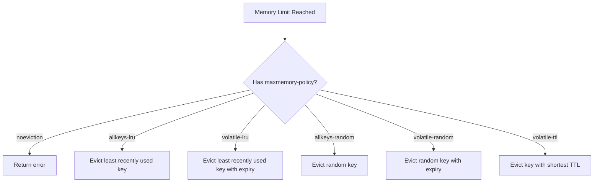

# Redis Configuration

Redis is a powerful in-memory data structure store that can be used as a database, cache, message broker, and more. Proper configuration is crucial for optimizing performance, ensuring data persistence, and maintaining security.

## Introduction to Redis Configuration

When working with Redis, understanding how to configure it properly is essential for getting the most out of this versatile tool. Redis configuration allows you to control:

- Memory usage and policies
- Network settings
- Persistence options
- Security parameters
- Performance tuning options

In this tutorial, we'll explore the most important Redis configuration options and how to implement them effectively.

## The Redis Configuration File

Redis is configured using a text file typically named `redis.conf`. When Redis starts, it reads this configuration file to determine how it should behave.

### Locating the Configuration File

The default location of the Redis configuration file depends on your installation method:

- For Linux/Unix installations: `/etc/redis/redis.conf` or `/etc/redis.conf`
- For macOS Homebrew installations: `/usr/local/etc/redis.conf`
- For Windows: The directory where Redis is installed

You can specify a different configuration file when starting Redis:

```bash
redis-server /path/to/your/redis.conf
```

### Structure of redis.conf

The Redis configuration file is organized into sections with comments (beginning with `#`) explaining each option. Each configuration directive follows this format:

```
directive value
```

For example:

```
port 6379
```

This sets Redis to listen on port 6379.

## Essential Configuration Options

Let's explore some of the most important configuration options you'll want to understand and potentially modify.

### Network Configuration

#### Binding to Interfaces

By default, Redis listens on all available network interfaces. For security reasons, you might want to restrict this:

```
bind 127.0.0.1
```

This makes Redis only accept connections from the local machine. To bind Redis to multiple interfaces:

```
bind 127.0.0.1 192.168.1.100
```

#### Port Configuration

The default Redis port is 6379, but you can change it:

```
port 6380
```

#### Connection Limits

You can limit the maximum number of client connections:

```
maxclients 10000
```

### Memory Management

Memory management is critical since Redis is an in-memory database.

#### Maximum Memory

Set the maximum amount of memory Redis can use:

```
maxmemory 100mb
```

You can use bytes, kilobytes (kb), megabytes (mb), or gigabytes (gb).

#### Memory Eviction Policies

When Redis reaches the `maxmemory` limit, it needs to know what to do. The `maxmemory-policy` directive controls this behavior:

```
maxmemory-policy noeviction
```

Available policies include:

- `noeviction`: Return errors when memory limit is reached
- `allkeys-lru`: Remove less recently used keys
- `volatile-lru`: Remove less recently used keys with an expiration set
- `allkeys-random`: Remove random keys
- `volatile-random`: Remove random keys with an expiration set
- `volatile-ttl`: Remove keys with the shortest time-to-live

Let's visualize how these policies work:



### Persistence Configuration

Redis offers different persistence options to save data to disk.

#### RDB (Redis Database) Persistence

RDB creates point-in-time snapshots of your dataset at specified intervals:

```
save 900 1       # Save if at least 1 key changed in 900 seconds (15 minutes)
save 300 10      # Save if at least 10 keys changed in 300 seconds (5 minutes)
save 60 10000    # Save if at least 10000 keys changed in 60 seconds
```

To disable RDB persistence, comment out all save directives:

```
# save 900 1
# save 300 10
# save 60 10000
```

#### AOF (Append Only File) Persistence

AOF logs every write operation received by the server:

```
appendonly yes                  # Enable AOF
appendfilename "appendonly.aof" # Name of the AOF file
```

You can configure how often Redis syncs the AOF to disk:

```
# appendfsync always   # Sync after every operation (safest, slowest)
appendfsync everysec   # Sync once per second (good compromise)
# appendfsync no       # Let OS handle syncing (fastest, least safe)
```

## Security Configuration

### Authentication

Set a password to require authentication:

```
requirepass your_strong_password
```

To connect with authentication:

```bash
redis-cli -a your_strong_password
```

Or after connecting:

```
redis-cli> AUTH your_strong_password
```

### Disable Dangerous Commands

You can rename or disable potentially dangerous commands in production:

```
rename-command FLUSHALL ""           # Disable FLUSHALL
rename-command FLUSHDB ""            # Disable FLUSHDB
rename-command CONFIG my_secure_cfg  # Rename CONFIG
```

## Performance Tuning

### Slow Log

Redis can log queries that take longer than a specified amount of time:

```
slowlog-log-slower-than 10000  # Log queries taking more than 10,000 microseconds (10ms)
slowlog-max-len 128            # Keep the last 128 slow queries
```

To view the slow log:

```
redis-cli> SLOWLOG GET
```

### Latency Monitoring

Enable latency monitoring:

```
latency-monitor-threshold 100  # Monitor events taking more than 100ms
```

## Practical Example: Configuring Redis as a Cache

Let's put together a configuration optimized for using Redis as a caching server:

```
# Network
bind 127.0.0.1
port 6379
maxclients 1000

# Memory
maxmemory 1gb
maxmemory-policy allkeys-lru

# Persistence - minimal for a cache
save ""  # Disable RDB snapshots
appendonly no  # Disable AOF

# Basic security
requirepass your_cache_password

# Performance
tcp-keepalive 300
```

This configuration:
1. Only allows local connections
2. Sets a 1GB memory limit
3. Uses LRU eviction to remove old keys when memory is full
4. Disables persistence (since we're using Redis as a cache)
5. Sets a password for basic security
6. Keeps connections alive for better performance

## Working with Configuration at Runtime

Redis allows you to view and modify many configuration parameters without restarting the server.

### Viewing Configuration

```
redis-cli> CONFIG GET *              # Get all configurations
redis-cli> CONFIG GET maxmemory      # Get specific configuration
```

### Modifying Configuration

```
redis-cli> CONFIG SET maxmemory 2gb  # Change configuration at runtime
redis-cli> CONFIG REWRITE            # Save changes to config file
```

## Implementing Configuration in Code

Let's see how to set configuration options in various programming languages:

### Node.js (using node-redis)

```javascript
const redis = require('redis');

const client = redis.createClient({
  host: '127.0.0.1',
  port: 6379,
  password: 'your_strong_password',
  db: 0
});

client.on('error', (err) => {
  console.log('Redis Error: ' + err);
});

client.connect();
```

### Python (using redis-py)

```python
import redis

r = redis.Redis(
    host='localhost',
    port=6379,
    password='your_strong_password',
    db=0,
    decode_responses=True
)

# Test the connection
print(r.ping())  # Should return True
```

### Java (using Jedis)

```java
import redis.clients.jedis.Jedis;
import redis.clients.jedis.JedisPool;
import redis.clients.jedis.JedisPoolConfig;

JedisPoolConfig poolConfig = new JedisPoolConfig();
poolConfig.setMaxTotal(100);
poolConfig.setMaxIdle(20);
poolConfig.setMinIdle(10);

JedisPool jedisPool = new JedisPool(
    poolConfig, 
    "localhost", 
    6379, 
    2000, 
    "your_strong_password"
);

try (Jedis jedis = jedisPool.getResource()) {
    // Test the connection
    System.out.println(jedis.ping());  // Should return "PONG"
}
```

## Best Practices

1. **Start with defaults**: Use Redis defaults as your starting point and modify only what you need.

2. **Set memory limits**: Always set `maxmemory` to prevent Redis from consuming all available memory.

3. **Choose the right eviction policy**: For caches, `allkeys-lru` is usually best. For other use cases, select accordingly.

4. **Configure persistence according to your needs**:
   - Both RDB and AOF for critical data
   - Just RDB for less critical data
   - No persistence for pure caching

5. **Secure your Redis instance**:
   - Always set a strong password
   - Bind to specific interfaces only
   - Use a firewall to restrict access

6. **Monitor performance**:
   - Enable the slow log
   - Use INFO commands to check memory usage and performance metrics

## Summary

Redis configuration is a powerful way to tailor Redis to your specific needs. By understanding the key configuration options—network settings, memory management, persistence, security, and performance tuning—you can optimize Redis for your particular use case.

Remember that while some configuration options can be changed at runtime, others require a restart. Always test your configuration changes in a non-production environment first.

## Additional Resources

- [Redis Configuration Documentation](https://redis.io/topics/config)
- [Redis Persistence Documentation](https://redis.io/topics/persistence)
- [Redis Security](https://redis.io/topics/security)

## Exercises

1. Configure Redis with a 256MB memory limit and an LRU eviction policy.
2. Set up Redis with both RDB and AOF persistence for maximum durability.
3. Create a secure Redis configuration that only allows connections from localhost and requires authentication.
4. Configure Redis as a cache with appropriate persistence and eviction settings.
5. Use the CONFIG command at runtime to modify Redis settings and observe the effects.