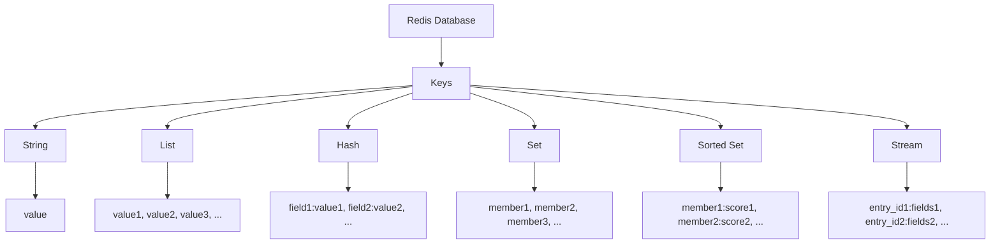

# Redis Data Model

## Introduction

Redis is not your typical database. While traditional relational databases organize data in tables with rows and columns, Redis takes a fundamentally different approach with its in-memory data structure store. Understanding Redis's data model is essential for leveraging its full potential in your applications.

At its core, Redis maps keys to different types of values. This key-value paradigm is simple yet incredibly powerful, offering flexibility that makes Redis suitable for a wide range of use cases from caching to message brokering, real-time analytics, and more.

In this guide, we'll explore Redis's unique data model, its core data structures, and how to interact with them effectively.

## Redis Key-Value Basics

Redis operates on a simple principle: every piece of data is stored as a key-value pair. However, unlike simpler key-value stores, Redis values can be complex data structures.

### Keys in Redis

Keys in Redis are binary-safe strings, which means you can use any binary sequence as a key, from a simple string like `"user:1000"` to the content of a JPEG file.

Some key characteristics and best practices:

- Keys are often structured using colons (`:`) as separators, e.g., `"object-type:id"` like `"user:1000"` or `"product:electronics:laptop:macbook-pro"`
- It's recommended to keep keys relatively short but descriptive
- Very long keys can negatively impact performance
- Keys should follow a consistent naming scheme within your application

Let's try creating a simple key-value pair in Redis:

```
> SET greeting "Hello, Redis!"
OK
> GET greeting
"Hello, Redis!"
```

## Redis Data Types

What makes Redis special is the variety of data structures it supports as values. Let's explore each one:

### 1. Strings

Strings are the most basic data type in Redis. They can store text, serialized objects, numbers, or even binary data like images. Strings in Redis can be up to 512MB in size.

**Examples:**

```
> SET user:name "John Doe"
OK
> GET user:name
"John Doe"

// Strings can be used for counters
> SET counter 10
OK
> INCR counter
(integer) 11
> INCRBY counter 5
(integer) 16
```

### 2. Lists

Redis Lists are linked lists of string values, allowing you to add elements to the head or tail of the list. They're ideal for implementing stacks, queues, or maintaining collections in insertion order.

**Examples:**

```
> LPUSH tasks "Send email"
(integer) 1
> LPUSH tasks "Write code"
(integer) 2
> LPUSH tasks "Debug issue"
(integer) 3
> LRANGE tasks 0 -1
1) "Debug issue"
2) "Write code"
3) "Send email"

// Add to the right side
> RPUSH queue "First in line"
(integer) 1
> RPUSH queue "Second in line"
(integer) 2
> LPOP queue
"First in line"
```

### 3. Sets

Redis Sets are unordered collections of unique strings. They're perfect for storing unique elements and performing set operations like unions, intersections, and differences.

**Examples:**

```
> SADD fruits "apple"
(integer) 1
> SADD fruits "orange" "banana"
(integer) 2
> SMEMBERS fruits
1) "apple"
2) "orange"
3) "banana"
> SISMEMBER fruits "apple"
(integer) 1
> SISMEMBER fruits "grape"
(integer) 0
```

### 4. Sorted Sets

Sorted Sets are similar to Sets but each element has an associated score. Elements are ordered based on this score, enabling efficient range queries and maintaining ordered collections.

**Examples:**

```
> ZADD leaderboard 100 "player1"
(integer) 1
> ZADD leaderboard 75 "player2"
(integer) 1
> ZADD leaderboard 150 "player3"
(integer) 1
> ZRANGE leaderboard 0 -1 WITHSCORES
1) "player2"
2) "75"
3) "player1"
4) "100"
5) "player3"
6) "150"
```

### 5. Hashes

Redis Hashes are maps between string fields and string values. They're perfect for representing objects with multiple fields without having to serialize/deserialize them.

**Examples:**

```
> HSET user:1000 name "John Doe" email "john@example.com" age 30
(integer) 3
> HGET user:1000 name
"John Doe"
> HGETALL user:1000
1) "name"
2) "John Doe"
3) "email"
4) "john@example.com"
5) "age"
6) "30"
```

### 6. Bit Arrays (Bitmaps)

While not a distinct data type, Redis allows bit operations on strings, treating them as arrays of bits. This is useful for highly efficient storage of boolean information.

**Examples:**

```
> SETBIT active_users 123 1
(integer) 0
> GETBIT active_users 123
(integer) 1
> BITCOUNT active_users
(integer) 1
```

### 7. HyperLogLogs

HyperLogLogs are probabilistic data structures used to count unique elements (cardinality of a set) with minimal memory usage.

**Examples:**

```
> PFADD visitors "user1" "user2" "user3"
(integer) 1
> PFADD visitors "user4" "user3"
(integer) 1
> PFCOUNT visitors
(integer) 4
```

### 8. Streams

Streams are append-only collections that work similarly to a log data structure, introduced in Redis 5.0. They're ideal for event sourcing, messaging, and time-series applications.

**Examples:**

```
> XADD mystream * sensor-id 1234 temperature 19.8
"1609459200000-0"
> XADD mystream * sensor-id 1234 temperature 20.1
"1609459200001-0"
> XRANGE mystream - +
1) 1) "1609459200000-0"
   2) 1) "sensor-id"
      2) "1234"
      3) "temperature"
      4) "19.8"
2) 1) "1609459200001-0"
   2) 1) "sensor-id"
      2) "1234"
      3) "temperature"
      4) "20.1"
```

## Key Patterns and Data Organization

Understanding how to organize your data in Redis is crucial for building efficient applications. Here are some common patterns:

### Simple Key-Value

The most basic usage pattern:

```
SET user:1000:name "John Doe"
SET user:1000:email "john@example.com"
```

### Nested Data with Hashes

More efficient for object representation:

```
HSET user:1000 name "John Doe" email "john@example.com" age 30
```

### Relationships with Sets

You can represent many-to-many relationships:

```
SADD user:1000:skills "python" "javascript" "redis"
SADD skill:python:users 1000 1001 1002
```

## Data Model Visualization

Here's a visualization of how different Redis data structures organize data:



## Real-World Applications

Let's explore some real-world applications of Redis data structures:

### 1. Session Store with Hashes

```
// Store a user session
HSET session:abc123 user_id 1000 login_time 1624532039 expires 1624618439

// Get session data
HGETALL session:abc123

// Set expiration for the session
EXPIRE session:abc123 86400
```

### 2. Leaderboard with Sorted Sets

```
// Add scores for users
ZADD leaderboard 5000 "user:1000"
ZADD leaderboard 7500 "user:1001"
ZADD leaderboard 10000 "user:1002"

// Get top 3 players
ZREVRANGE leaderboard 0 2 WITHSCORES

// Get rank of a specific player
ZREVRANK leaderboard "user:1001"
```

### 3. News Feed with Lists

```
// Post to a user's feed
LPUSH feed:user:1000 "post:10001" "post:10002" "post:10003"

// Get recent posts (pagination)
LRANGE feed:user:1000 0 9

// Trim feed to maintain only the most recent 100 posts
LTRIM feed:user:1000 0 99
```

### 4. Rate Limiting with Sorted Sets

```
// Record an API request
ZADD requests:user:1000 1624532039 request-id-1

// Count requests in the last minute
ZCOUNT requests:user:1000 1624531979 1624532039

// Remove old requests (sliding window)
ZREMRANGEBYSCORE requests:user:1000 0 1624531979
```

### 5. Real-time Analytics with HyperLogLogs

```
// Track unique daily visitors
PFADD visitors:2023-06-24 "user1" "user2" "user3"

// Get unique visitor count
PFCOUNT visitors:2023-06-24

// Merge multiple days for weekly statistics
PFMERGE visitors:week27 visitors:2023-06-24 visitors:2023-06-25
```

## Data Persistence

Redis is an in-memory database, but it provides several persistence options to ensure data durability:

1. **RDB (Redis Database)**: Point-in-time snapshots at specified intervals
2. **AOF (Append Only File)**: Logs every write operation
3. **Hybrid approach**: Combines both RDB and AOF

Each approach has trade-offs in terms of performance, durability, and recovery time.

## Memory Management

Since Redis stores data in memory, understanding memory usage is crucial:

- Redis uses the `maxmemory` configuration to limit memory usage
- When the limit is reached, Redis can evict keys based on different policies:
  - `volatile-lru`: Evict keys with expiration set using LRU
  - `allkeys-lru`: Evict any key using LRU
  - `volatile-ttl`: Evict keys with expiration set, favoring shorter TTL
  - `noeviction`: Return errors when memory limit reached

```
// Set memory limit and policy in redis.conf
maxmemory 100mb
maxmemory-policy volatile-lru
```

## Summary

Redis's data model is both simple and powerful. By understanding the various data structures and how to use them effectively, you can:

- Build high-performance applications with minimal complexity
- Reduce the amount of code needed to implement common patterns
- Take advantage of atomic operations for thread-safe data manipulation
- Design solutions that scale horizontally across multiple Redis instances

Remember that the right data structure choice depends on your specific use case. Redis's flexibility allows you to choose the most efficient structure for your needs, often combining multiple structures to create sophisticated solutions.

## Exercises

1. Create a simple Twitter-like following system using Sets to track followers and followees.
2. Implement a shopping cart using Hashes where each cart item is a field.
3. Build a simple message queue using Lists with producer and consumer operations.
4. Design a real-time analytics system for page views using HyperLogLogs and Sorted Sets.
5. Create a basic chat application using Redis Streams.

## Additional Resources

- The official [Redis documentation](https://redis.io/docs/)
- Redis University's [free online courses](https://university.redis.com/)
- Redis command reference at [redis.io/commands](https://redis.io/commands/)
- Redis data types tutorial at [redis.io/topics/data-types](https://redis.io/topics/data-types/)
- "Redis in Action" book for in-depth practical examples